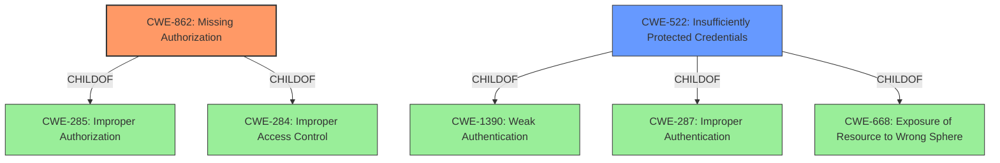

# Analysis for CVE-2020-2117

# Summary
| CWE ID | CWE Name | Confidence | CWE Abstraction Level | CWE Vulnerability Mapping Label | CWE-Vulnerability Mapping Notes |
|---|---|---|---|---|---|
| CWE-862 | Missing Authorization | 1 | Class | Allowed-with-Review | Primary CWE |
| CWE-522 | Insufficiently Protected Credentials | 0.5 | Class | Allowed-with-Review | Secondary Candidate |

## Evidence and Confidence

*   **Confidence Score:** 0.75
*   **Evidence Strength:** HIGH

## Relationship Analysis
The primary relationship influencing the selection is the ChildOf relationship. CWE-862 (Missing Authorization) is a child of CWE-285 (Improper Authorization) and CWE-284 (Improper Access Control). The chain relationship is not as relevant here, but it's important to note that missing authorization can lead to other vulnerabilities. The abstraction level played a crucial role; while CWE-285 is a higher-level class, CWE-862 is a more specific class that aligns better with the **missing permission check**.

## Vulnerability Chain
The vulnerability chain starts with the **missing permission check** (CWE-862), which allows attackers with `Overall/Read` permission to connect to an attacker-specified URL using attacker-specified credentials IDs, leading to the capture of credentials stored in Jenkins.

## Summary of Analysis
The initial analysis strongly suggested CWE-862 (Missing Authorization) as the primary weakness, based on the **rootcause** being a **missing permission check**. The CVE Reference Links Content Summary explicitly mentions the plugin lacks proper access control, aligning perfectly with CWE-862. While other CWEs like CWE-522 (Insufficiently Protected Credentials) were considered due to the impact of capturing credentials, the root cause is the **missing authorization**. The relationship analysis further solidified this decision, as CWE-862 is a specific type of improper access control. The final decision is primarily based on the evidence that the product **does not perform an authorization check**.

Relevant CWE Information:

# Enhanced Context (25 CWEs)
The following CWEs were identified as potentially relevant to this vulnerability:

## CWE-941: Incorrectly Specified Destination in a Communication Channel
**Abstraction Level**: Base
**Similarity Score**: 0.79
**Source**: dense

**Description**:
The product creates a communication channel to initiate an outgoing request to an actor, but it does not correctly specify the intended destination for that actor.

**Mapping Guidance**:
- Usage: Allowed
- Rationale: This CWE entry is at the Base level of abstraction, which is a preferred level of abstraction for mapping to the root causes of vulnerabilities.

## CWE-668: Exposure of Resource to Wrong Sphere
**Abstraction Level**: Class
**Similarity Score**: 0.78
**Source**: dense

**Description**:
The product exposes a resource to the wrong control sphere, providing unintended actors with inappropriate access to the resource.

**Mapping Guidance**:
- Usage: Discouraged
- Rationale: CWE-668 is high-level and is often misused as a catch-all when lower-level CWE IDs might be applicable. It is sometimes used for low-information vulnerability reports [REF-1287]. It is a level-1 Class (i.e., a child of a Pillar). It is not useful for trend analysis.

## CWE-74: Improper Neutralization of Special Elements in Output Used by a Downstream Component ('Injection')
**Abstraction Level**: Class
**Similarity Score**: 0.77
**Source**: dense

**Description**:
The product constructs all or part of a command, data structure, or record using externally-influenced input from an upstream component, but it does not neutralize or incorrectly neutralizes special elements that could modify how it is parsed or interpreted when it is sent to a downstream component.

**Mapping Guidance**:
- Usage: Discouraged
- Rationale: CWE-74 is high-level and often misused when lower-level weaknesses are more appropriate.

## CWE-807: Reliance on Untrusted Inputs in a Security Decision
**Abstraction Level**: Base
**Similarity Score**: 0.77
**Source**: dense

**Description**:
The product uses a protection mechanism that relies on the existence or values of an input, but the input can be modified by an untrusted actor in a way that bypasses the protection mechanism.

**Mapping Guidance**:
- Usage: Allowed
- Rationale: This CWE entry is at the Base level of abstraction, which is a preferred level of abstraction for mapping to the root causes of vulnerabilities.

## CWE-799: Improper Control of Interaction Frequency
**Abstraction Level**: Class
**Similarity Score**: 0.77
**Source**: dense

**Description**:
The product does not properly limit the number or frequency of interactions that it has with an actor, such as the number of incoming requests.

**Mapping Guidance**:
- Usage: Allowed-with-Review
- Rationale: This CWE entry is a Class and might have Base-level children that would be more appropriate

## CWE-41: Improper Resolution of Path Equivalence
**Abstraction Level**: Base
**Similarity Score**: 0.76
**Source**: dense

**Description**:
The product is vulnerable to file system contents disclosure through path equivalence. Path equivalence involves the use of special characters in file and directory names. The associated manipulations are intended to generate multiple names for the same object.

**Mapping Guidance**:
- Usage: Allowed
- Rationale: This CWE entry is at the Base level of abstraction, which is a preferred level of abstraction for mapping to the root causes of vulnerabilities.

## CWE-754: Improper Check for Unusual or Exceptional Conditions
**Abstraction Level**: Class
**Similarity Score**: 0.76
**Source**: dense

**Description**:
The product does not check or incorrectly checks for unusual or exceptional conditions that are not expected to occur frequently during day to day operation of the product.

**Mapping Guidance**:
- Usage: Allowed-with-Review
- Rationale: This CWE entry is a Class and might have Base-level children that would be more appropriate

## CWE-280: Improper Handling of Insufficient Permissions or Privileges 
**Abstraction Level**: Base
**Similarity Score**: 0.76
**Source**: dense

**Description**:
The product does not handle or incorrectly handles when it has insufficient privileges to access resources or functionality as specified by their permissions. This may cause it to follow unexpected code paths that may leave the product in an invalid state.

**Mapping Guidance**:
- Usage: Allowed
- Rationale: This CWE entry is at the Base level of abstraction, which is a preferred level of abstraction for mapping to the root causes of vulnerabilities.

## CWE-1390: Weak Authentication
**Abstraction Level**: Class
**Similarity Score**: 0.76
**Source**: dense

**Description**:
The product uses an authentication mechanism to restrict access to specific users or identities, but the mechanism does not sufficiently prove that the claimed identity is correct.

**Mapping Guidance**:
- Usage: Allowed-with-Review
- Rationale: This CWE entry is a Class and might have Base-level children that would be more appropriate

## CWE-1391: Use of Weak Credentials
**Abstraction Level**: Class
**Similarity Score**: 0.76
**Source**: dense

**Description**:
The product uses weak credentials (such as a default key or hard-coded password) that can be calculated, derived, reused, or guessed by an attacker.

**Mapping Guidance**:
- Usage: Allowed-with-Review
- Rationale: This CWE entry is a Class and might have Base-level children that would be more appropriate

## CWE-863: Incorrect Authorization
**Abstraction Level**: Class
**Similarity Score**: 4823.53
**Source**: sparse

**Description**:

# Enhanced Query for CVE-2020-2117

## Vulnerability Description
A **missing permission check** in Jenkins Pipeline GitHub Notify Step Plugin 1.0.4 and earlier allows attackers with Overall/Read permission to connect to an attacker-specified URL using attacker-specified credentials IDs obtained through another method, capturing credentials stored in Jenkins.

### Vulnerability Description Key Phrases
- **rootcause:** **missing permission check**
- **impact:** connect to an attacker-specified URL using attacker-specified credentials IDs
- **attacker:** attackers with Overall/Read permission
- **product:** Jenkins Pipeline GitHub Notify Step Plugin
- **version:** 1.0.4 and earlier

## CVE Reference Links Content Summary
Based on the provided information, here's an analysis of CVE-2020-2117:

**CVE-2020-2117: Missing permission check in Pipeline GitHub Notify Step Plugin**

*   **Root Cause:** The Pipeline GitHub Notify Step Plugin (versions 1.0.4 and earlier) does not perform permission checks on a method that implements form validation. This allows unauthorized users to access a functionality intended for administrative purposes.

*   **Weakness:** The plugin lacks proper access control, allowing users with `Overall/Read` permissions to call the form validation method, which should require a higher privilege level.

*   **Impact:**
    *   Attackers can connect to an attacker-specified URL by using attacker-specified credential IDs.
    *   This can lead to the capture of credentials stored in Jenkins.

*  **Attack Vector:** A user with Overall/Read access can trigger the vulnerable method to connect to an arbitrary URL by using arbitrary credentials IDs.

*   **Required Attacker Capabilities/Position:**
    *   The attacker needs to have `Overall/Read` access to the Jenkins instance.
    *   The attacker also needs to obtain valid credential IDs through another vulnerability (CVE-2020-2118).

**Additional Notes:**

*   This vulnerability is part of a set of issues identified as `SECURITY-812 (1)`, which includes both CVE-2020-2116 (CSRF) and CVE-2020-2117 (missing permission check).
*   The fix for this issue is included in version 1.0.5 of the Pipeline GitHub Notify Step Plugin.
*   The form validation method should require POST requests and Item/Configure permission, which is implemented in the fixed version.

## Retriever Results

### Top Combined Results

| Rank | CWE ID | Name | Abstraction | Usage  | Retrievers | Individual Scores |
|------|--------|------|-------------|-------|------------|-------------------|
| 1 | 862 | Missing Authorization | Class | Allowed-with-Review | sparse | 0.435 |
| 2 | 863 | Incorrect Authorization | Class | Allowed-with-Review | sparse | 0.279 |
| 3 | 522 | Insufficiently Protected Credentials | Class | Allowed-with-Review | sparse | 0.275 |
| 4 | 256 | Plaintext Storage of a Password | Base | Allowed | sparse | 0.268 |
| 5 | 549 | Missing Password Field Masking | Base | Allowed | sparse | 0.252 |
| 6 | 306 | Missing Authentication for Critical Function | Base | Allowed | dense | 0.477 |
| 7 | 276 | Incorrect Default Permissions | Base | Allowed | graph | 0.002 |
| 8 | 838 | Inappropriate Encoding for Output Context | Base | Allowed | sparse | 0.248 |
| 9 | 285 | Improper Authorization | Class | Discouraged | sparse | 0.235 |
| 10 | 941 | Incorrectly Specified Destination in a Communication Channel | Base | Allowed | sparse | 0.232 |

# Complete CWE Specifications

## CWE-862: Missing Authorization
**Abstraction:** Class
**Status:** Incomplete

### Description
The product does not perform an authorization check when an actor attempts to access a resource or perform an action.

### Extended Description
Not provided

### Alternative Terms
AuthZ: "AuthZ" is typically used as an abbreviation of "authorization" within the web application security community. It is distinct from "AuthN" (or, sometimes, "AuthC") which is an abbreviation of "authentication." The use of "Auth" as an abbreviation is discouraged, since it could be used for either authentication or authorization.

### Relationships
ChildOf -> CWE-285
ChildOf -> CWE-284

### Mapping Guidance
**Usage:** Allowed-with-Review
**Rationale:** This CWE entry is a Class and might have Base-level children that would be more appropriate
**Comments:** Examine children of this entry to see if there is a better fit
**Reasons:**
- Abstraction

### Additional Notes
**[Terminology]** Assuming a user with a given identity, authorization is the process of determining whether that user can access a given resource, based on the user's privileges and any permissions or other access-control specifications that apply to the resource.

### Observed Examples
- **CVE-2022-24730:** Go-based continuous deployment product does not check that a user has certain privileges to update or create an app, allowing adversaries to read sensitive repository information
- **CVE-2009-3168:** Web application does not restrict access to admin scripts, allowing authenticated users to reset administrative passwords.
- **CVE-2009-3597:** Web application stores database file under the web root with insufficient access control (CWE-219), allowing direct request.

## CWE-863: Incorrect Authorization
**Abstraction:** Class
**Status:** Incomplete

### Description
The product performs an authorization check when an actor attempts to access a resource or perform an action, but it does not correctly perform the check.

### Extended Description
Not provided

### Alternative Terms
AuthZ: "AuthZ" is typically used as an abbreviation of "authorization" within the web application security community. It is distinct from "AuthN" (or, sometimes, "AuthC") which is an abbreviation of "authentication." The use of "Auth" as an abbreviation is discouraged, since it could be used for either authentication or authorization.

### Relationships
ChildOf -> CWE-285
ChildOf -> CWE-284

### Mapping Guidance
**Usage:** Allowed-with-Review
**Rationale:** This CWE entry is a Class and might have Base-level children that would be more appropriate
**Comments:** Examine children of this entry to see if there is a better fit
**Reasons:**
- Abstraction

### Additional Notes
**[Terminology]** 

Assuming a user with a given identity, authorization is the process of determining whether that user can access a given resource, based on the user's privileges and any permissions or other access-control specifications that apply to the resource.

### Observed Examples
- **CVE-2021-39155:** Chain: A microservice integration and management platform compares the hostname in the HTTP Host header in a case-sensitive way (CWE-178, CWE-1289), allowing bypass of the authorization policy (CWE-863) using a hostname with mixed case or other variations.
- **CVE-2019-15900:** Chain: sscanf() call is used to check if a username and group exists, but the return value of sscanf() call is not checked (CWE-252), causing an uninitialized variable to be checked (CWE-457), returning success to allow authorization bypass for executing a privileged (CWE-863).
- **CVE-2009-2213:** Gateway uses default "Allow" configuration for its authorization settings.

## CWE-522: Insufficiently Protected Credentials
**Abstraction:** Class
**Status:** Incomplete

### Description
The product transmits or stores authentication credentials, but it uses an insecure method that is susceptible to unauthorized interception and/or retrieval.

### Extended Description
Not provided

### Alternative Terms
None

### Relationships
ChildOf -> CWE-1390
ChildOf -> CWE-287
ChildOf -> CWE-668

### Mapping Guidance
**Usage:** Allowed-with-Review
**Rationale:** This CWE entry is a Class and might have Base-level children that would be more appropriate
**Comments:** Examine children of this entry to see if there is a better fit
**Reasons:**
- Abstraction

### Observed Examples
- **CVE-2022-30018:** A messaging platform serializes all elements of User/Group objects, making private information available to adversaries
- **CVE-2022-29959:** Initialization file contains credentials that can be decoded using a "simple string transformation"
- **CVE-2022-35411:** Python-based RPC framework enables pickle functionality by default, allowing clients to unpickle untrusted data.

## CWE-256: Plaintext Storage of a Password
**Abstraction:** Base
**Status:** Incomplete

### Description
Storing a password in plaintext may result in a system compromise.

### Extended Description
Password management issues occur when a password is stored in plaintext in an application's properties, configuration file, or memory. Storing a plaintext password in a configuration file allows anyone who can read the file access to the password-protected resource. In some contexts, even storage of a plaintext password in memory is considered a security risk if the password is not cleared immediately after it is used.

### Alternative Terms
None

### Relationships
ChildOf -> CWE-522

### Mapping Guidance
**Usage:** Allowed
**Rationale:** This CWE entry is at the Base level of abstraction, which is a preferred level of abstraction for mapping to the root causes of vulnerabilities.
**Comments:** Carefully read both the name and description to ensure that this mapping is an appropriate fit. Do not try to 'force' a mapping to a lower-level Base/Variant simply to comply with this preferred level of abstraction.
**Reasons:**
- Acceptable-Use

### Observed Examples
- **CVE-2022-30275:** Remote Terminal Unit (RTU) uses a driver that relies on a password stored in plaintext.

## CWE-549: Missing Password Field Masking
**Abstraction:** Base
**Status:** Draft

### Description
The product does not mask passwords during entry, increasing the potential for attackers to observe and capture passwords.

### Extended Description
Not provided

### Alternative Terms
None

### Relationships
ChildOf -> CWE-522

### Mapping Guidance
**Usage:** Allowed
**Rationale:** This CWE entry is at the Base level of abstraction, which is a preferred level of abstraction for mapping to the root causes of vulnerabilities.
**Comments:** Carefully read both the name and description to ensure that this mapping is an appropriate fit. Do not try to 'force' a mapping to a lower-level Base/Variant simply to comply with this preferred level of abstraction.
**Reasons:**
- Acceptable-Use

## CWE-306: Missing Authentication for Critical Function
**Abstraction:** Base
**Status:** Draft

### Description
The product does not perform any authentication for functionality that requires a provable user identity or consumes a significant amount of resources.

### Extended Description
Not provided

### Alternative Terms
None

### Relationships
ChildOf -> CWE-287
ChildOf -> CWE-287

### Mapping Guidance
**Usage:** Allowed
**Rationale:** This CWE entry is at the Base level of abstraction, which is a preferred level of abstraction for mapping to the root causes of vulnerabilities.
**Comments:** Carefully read both the name and description to ensure that this mapping is an appropriate fit. Do not try to 'force' a mapping to a lower-level Base/Variant simply to comply with this preferred level of abstraction.
**Reasons:**
- Acceptable-Use

### Observed Examples
- **CVE-2022-31260:** Chain: a digital asset management program has an undisclosed backdoor in the legacy version of a PHP script (CWE-912) that could allow an unauthenticated user to export metadata (CWE-306)
- **CVE-2022-29951:** TCP-based protocol in Programmable Logic Controller (PLC) has no authentication.
- **CVE-2022-29952:** Condition Monitor firmware uses a protocol that does not require authentication.

## CWE-276: Incorrect Default Permissions
**Abstraction:** Base
**Status:** Draft

### Description
During installation, installed file permissions are set to allow anyone to modify those files.

### Extended Description
Not provided

### Alternative Terms
None

### Relationships
ChildOf -> CWE-732
ChildOf -> CWE-732

### Mapping Guidance
**Usage:** Allowed
**Rationale:** This CWE entry is at the Base level of abstraction, which is a preferred level of abstraction for mapping to the root causes of vulnerabilities.
**Comments:** Carefully read both the name and description to ensure that this mapping is an appropriate fit. Do not try to 'force' a mapping to a lower-level Base/Variant simply to comply with this preferred level of abstraction.
**Reasons:**
- Acceptable-Use

### Observed Examples
- **CVE-2005-1941:** Executables installed world-writable.
- **CVE-2002-1713:** Home directories installed world-readable.
- **CVE-2001-1550:** World-writable log files allow information loss; world-readable file has cleartext passwords.

## CWE-838: Inappropriate Encoding for Output Context
**Abstraction:** Base
**Status:** Incomplete

### Description
The product uses or specifies an encoding when generating output to a downstream component, but the specified encoding is not the same as the encoding that is expected by the downstream component.

### Extended Description

This weakness can cause the downstream component to use a decoding method that produces different data than what the product intended to send. When the wrong encoding is used - even if closely related - the downstream component could decode the data incorrectly. This can have security consequences when the provided boundaries between control and data are inadvertently broken, because the resulting data could introduce control characters or special elements that were not sent by the product. The resulting data could then be used to bypass protection mechanisms such as input validation, and enable injection attacks.

While using output encoding is essential for ensuring that communications between components are accurate, the use of the wrong encoding - even if closely related - could cause the downstream component to misinterpret the output.

For example, HTML entity encoding is used for elements in the HTML body of a web page. However, a programmer might use entity encoding when generating output for that is used within an attribute of an HTML tag, which could contain functional Javascript that is not affected by the HTML encoding.

While web applications have received the most attention for this problem, this weakness could potentially apply to any type of product that uses a communications stream that could support multiple encodings.

### Alternative Terms
None

### Relationships
ChildOf -> CWE-116
ChildOf -> CWE-116

### Mapping Guidance
**Usage:** Allowed
**Rationale:** This CWE entry is at the Base level of abstraction, which is a preferred level of abstraction for mapping to the root causes of vulnerabilities.
**Comments:** Carefully read both the name and description to ensure that this mapping is an appropriate fit. Do not try to 'force' a mapping to a lower-level Base/Variant simply to comply with this preferred level of abstraction.
**Reasons:**
- Acceptable-Use

### Observed Examples
- **CVE-2009-2814:** Server does not properly handle requests that do not contain UTF-8 data; browser assumes UTF-8, allowing XSS.

## CWE-285: Improper Authorization
**Abstraction:** Class
**Status:** Draft

### Description
The product does not perform or incorrectly performs an authorization check when an actor attempts to access a resource or perform an action.

### Extended Description

Assuming a user with a given identity, authorization is the process of determining whether that user can access a given resource, based on the user's privileges and any permissions or other access-control specifications that apply to the resource.

When access control checks are not applied consistently - or not at all - users are able to access data or perform actions that they should not be allowed to perform. This can lead to a wide range of problems, including information exposures, denial of service, and arbitrary code execution.

### Alternative Terms
AuthZ: "AuthZ" is typically used as an abbreviation of "authorization" within the web application security community. It is distinct from "AuthN" (or, sometimes, "AuthC") which is an abbreviation of "authentication." The use of "Auth" as an abbreviation is discouraged, since it could be used for either authentication or authorization.

### Relationships
ChildOf -> CWE-284
ChildOf -> CWE-284

### Mapping Guidance
**Usage:** Discouraged
**Rationale:** CWE-285 is high-level and lower-level CWEs can frequently be used instead. It is a level-1 Class (i.e., a child of a Pillar).
**Comments:** Look at CWE-285's children and consider mapping to CWEs such as CWE-862: Missing Authorization, CWE-863: Incorrect Authorization, CWE-732: Incorrect Permission Assignment for Critical Resource, or others.
**Reasons:**
- Abstraction
**Suggested Alternatives:**
- CWE-862: Missing Authorization
- CWE-863: Incorrect Authorization
- CWE-732: Incorrect Permission Assignment for Critical Resource

### Observed Examples
- **CVE-2022-24730:** Go-based continuous deployment product does not check that a user has certain privileges to update or create an app, allowing adversaries to read sensitive repository information
- **CVE-2009-3168:** Web application does not restrict access to admin scripts, allowing authenticated users to reset administrative passwords.
- **CVE-2009-2960:** Web application does not restrict access to admin scripts, allowing authenticated users to modify passwords of other users.

## CWE-941: Incorrectly Specified Destination in a Communication Channel
**Abstraction:** Base
**Status:** Incomplete

### Description
The product creates a communication channel to initiate an outgoing request to an actor, but it does not correctly specify the intended destination for that actor.

### Extended Description

Attackers at the destination may be able to spoof trusted servers to steal data or cause a denial of service.

There are at least two distinct weaknesses that can cause the product to communicate with an unintended destination:

  - If the product allows an attacker to control which destination is specified, then the attacker can cause it to connect to an untrusted or malicious destination. For example, because UDP is a connectionless protocol, UDP packets can be spoofed by specifying a false source address in the packet; when the server receives the packet and sends a reply, it will specify a destination by using the source of the incoming packet - i.e., the false source. The server can then be tricked into sending traffic to the wrong host, which is effective for hiding the real source of an attack and for conducting a distributed denial of service (DDoS). As another example, server-side request forgery (SSRF) and XML External Entity (XXE) can be used to trick a server into making outgoing requests to hosts that cannot be directly accessed by the attacker due to firewall restrictions.

  - If the product incorrectly specifies the destination, then an attacker who can control this destination might be able to spoof trusted servers. While the most common occurrence is likely due to misconfiguration by an administrator, this can be resultant from other weaknesses. For example, the product might incorrectly parse an e-mail or IP address and send sensitive data to an unintended destination. As another example, an Android application may use a "sticky broadcast" to communicate with a receiver for a particular application, but since sticky broadcasts can be processed by *any* receiver, this can allow a malicious application to access restricted data that was only intended for a different application.

### Alternative Terms
None

### Relationships
ChildOf -> CWE-923
CanPrecede -> CWE-406

### Mapping Guidance
**Usage:** Allowed
**Rationale:** This CWE entry is at the Base level of abstraction, which is a preferred level of abstraction for mapping to the root causes of vulnerabilities.
**Comments:** Carefully read both the name and description to ensure that this mapping is an appropriate fit. Do not try to 'force' a mapping to a lower-level Base/Variant simply to comply with this preferred level of abstraction.
**Reasons:**
- Acceptable-Use

### Observed Examples
- **CVE-2013-5211:** composite: NTP feature generates large responses (high amplification factor) with spoofed UDP source addresses.
- **CVE-1999-0513:** Classic "Smurf" attack, using spoofed ICMP packets to broadcast addresses.
- **CVE-1999-1379:** DNS query with spoofed source address causes more traffic to be returned to spoofed address than was sent by the attacker.

