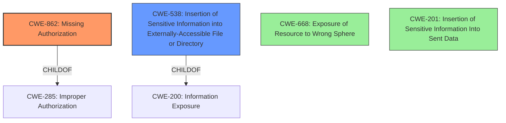

# Analysis for CVE-2020-2118

# Summary
| CWE ID | CWE Name | Confidence | CWE Abstraction Level | CWE Vulnerability Mapping Label | CWE-Vulnerability Mapping Notes |
|---|---|---|---|---|---|
| CWE-862 | Missing Authorization | 1.0 | Class | Allowed-with-Review | Primary CWE |
| CWE-538 | Insertion of Sensitive Information into Externally-Accessible File or Directory | 0.7 | Base | Allowed | Secondary Candidate |
| CWE-668 | Exposure of Resource to Wrong Sphere | 0.5 | Class | Discouraged | Secondary Candidate |
| CWE-201 | Insertion of Sensitive Information Into Sent Data | 0.5 | Base | Allowed | Secondary Candidate |

## Evidence and Confidence

*   **Confidence Score:** 0.9
*   **Evidence Strength:** HIGH

## Relationship Analysis
The primary relationship that impacted the decision was the parent-child relationship between CWE-285 (Improper Authorization) and CWE-862 (Missing Authorization). Since the description specifically mentions a **missing permission check**, CWE-862 is more appropriate than its parent. The relationship between CWE-200 (Information Exposure) and CWE-538 (Insertion of Sensitive Information into Externally-Accessible File or Directory) was also considered.

## Vulnerability Chain
The vulnerability chain starts with the **missing permission check** (CWE-862), which leads to the exposure of credential IDs. This can be seen as an instance of information exposure. This leads to a potential impact where these exposed credential IDs can be used in conjunction with other vulnerabilities to capture the actual credentials themselves.

## Summary of Analysis
The initial analysis focused on identifying the root cause of the vulnerability, which is the **missing permission check**. The vulnerability description, particularly the key phrases and CVE reference, explicitly states this.

The selection of CWE-862 is based on the following evidence:

*   **Vulnerability Description Key Phrases:** "**missing permission check**"
*   **CVE Reference Links Content Summary:** "The plugin does not implement adequate permission checks when listing available credential IDs."

This directly aligns with the description of CWE-862: "The product does not perform an authorization check when an actor attempts to access a resource or perform an action."

CWE-862 is at the Class level of abstraction. While it is generally preferred to map to Base or Variant levels, in this case, there isn't a more specific CWE that accurately captures the nature of the **missing authorization**. The vulnerability doesn't involve incorrect authorization (CWE-863), but rather the complete absence of an authorization check.

Other CWEs Considered:

*   CWE-538: Considered as a secondary weakness, as the exposure of credential IDs is a form of sensitive information being placed in an accessible location. However, the primary issue is the **missing authorization check** that leads to this exposure.
*   CWE-668: Exposure of Resource to Wrong Sphere was considered since the credential IDs are being exposed to users with Overall/Read access, which is the wrong sphere. However, this CWE is discouraged and a more specific CWE, CWE-862, is more appropriate.
*   CWE-201: Insertion of Sensitive Information Into Sent Data was considered. The exposure of credential IDs can be seen as insertion of sensitive information. However, the more direct cause is still the **missing authorization**.

The final decision is to map the vulnerability to CWE-862 as the primary weakness, with CWE-538, CWE-668, and CWE-201 as secondary candidates. CWE-862 directly addresses the **missing permission check**, which is the root cause.

Relevant CWE Information:

# Enhanced Context (25 CWEs)
The following CWEs were identified as potentially relevant to this vulnerability:

## CWE-538: Insertion of Sensitive Information into Externally-Accessible File or Directory
**Abstraction Level**: Base
**Similarity Score**: 0.76
**Source**: dense

**Description**:
The product places sensitive information into files or directories that are accessible to actors who are allowed to have access to the files, but not to the sensitive information.

**Mapping Guidance**:
- Usage: Allowed
- Rationale: This CWE entry is at the Base level of abstraction, which is a preferred level of abstraction for mapping to the root causes of vulnerabilities.

## CWE-862: Missing Authorization
**Abstraction:** Class
**Status:** Incomplete

### Description
The product does not perform an authorization check when an actor attempts to access a resource or perform an action.

### Extended Description
Not provided

### Alternative Terms
AuthZ: "AuthZ" is typically used as an abbreviation of "authorization" within the web application security community. It is distinct from "AuthN" (or, sometimes, "AuthC") which is an abbreviation of "authentication." The use of "Auth" as an abbreviation is discouraged, since it could be used for either authentication or authorization.

### Relationships
ChildOf -> CWE-285
ChildOf -> CWE-284

### Mapping Guidance
**Usage:** Allowed-with-Review
**Rationale:** This CWE entry is a Class and might have Base-level children that would be more appropriate
**Comments:** Examine children of this entry to see if there is a better fit
**Reasons:**
- Abstraction

# Enhanced Query for CVE-2020-2118

## Vulnerability Description
A **missing permission check** in Jenkins Pipeline GitHub Notify Step Plugin 1.0.4 and earlier in form-related methods allowed users with Overall/Read access to enumerate credentials ID of credentials stored in Jenkins.

### Vulnerability Description Key Phrases
- **rootcause:** **missing permission check**
- **impact:** enumerate credentials ID of credentials
- **vector:** form-related methods
- **attacker:** users with Overall/Read access
- **product:** Jenkins Pipeline GitHub Notify Step Plugin
- **version:** 1.0.4 and earlier

## CVE Reference Links Content Summary
Based on the provided information, here's an analysis of CVE-2020-2118:

**CVE-2020-2118**

*   **Vulnerability:**  The Pipeline GitHub Notify Step Plugin 1.0.4 and earlier provides a list of applicable credential IDs without proper permission checks.
*   **Root Cause:** The plugin does not implement adequate permission checks when listing available credential IDs.
*   **Weaknesses:** Missing authorization check, allowing unauthorized access to sensitive information
*   **Impact:** An attacker with Overall/Read permission can enumerate valid credential IDs. These IDs could then be used in other attacks to capture the actual credentials using another vulnerability (e.g., CVE-2020-2116/2117).
*   **Attack Vector:** Network access to a Jenkins instance.
*   **Attacker Capabilities:** An attacker needs Overall/Read access to the Jenkins instance. They do not need to be able to configure jobs, but require access to the UI.

**Summary**

The vulnerability lies in the fact that the Pipeline GitHub Notify Step Plugin allows any user with Overall/Read permissions to obtain a list of credential IDs without requiring the permissions to configure jobs. This information can then be leveraged in conjunction with other vulnerabilities in order to capture the credentials themselves. This vulnerability has a medium severity because although the attacker cannot directly obtain credentials, the credential IDs can be combined with other vulnerabilities to escalate the attack.

**Additional Information**
The provided text also includes a wealth of information regarding other vulnerabilities that were disclosed at the same time.

## Retriever Results

### Top Combined Results

| Rank | CWE ID | Name | Abstraction | Usage  | Retrievers | Individual Scores |
|------|--------|------|-------------|-------|------------|-------------------|
| 1 | 862 | Missing Authorization | Class | Allowed-with-Review | sparse | 0.363 |
| 2 | 256 | Plaintext Storage of a Password | Base | Allowed | sparse | 0.254 |
| 3 | 863 | Incorrect Authorization | Class | Allowed-with-Review | sparse | 0.253 |
| 4 | 522 | Insufficiently Protected Credentials | Class | Allowed-with-Review | sparse | 0.247 |
| 5 | 549 | Missing Password Field Masking | Base | Allowed | sparse | 0.235 |
| 6 | 278 | Insecure Preserved Inherited Permissions | Variant | Allowed | dense | 0.436 |
| 7 | 942 | Permissive Cross-domain Policy with Untrusted Domains | Variant | Allowed | graph | 0.002 |
| 8 | 538 | Insertion of Sensitive Information into Externally-Accessible File or Directory | Base | Allowed | sparse | 0.218 |
| 9 | 285 | Improper Authorization | Class | Discouraged | sparse | 0.209 |
| 10 | 260 | Password in Configuration File | Base | Allowed | sparse | 0.208 |

# Complete CWE Specifications

## CWE-862: Missing Authorization
**Abstraction:** Class
**Status:** Incomplete

### Description
The product does not perform an authorization check when an actor attempts to access a resource or perform an action.

### Extended Description
Not provided

### Alternative Terms
AuthZ: "AuthZ" is typically used as an abbreviation of "authorization" within the web application security community. It is distinct from "AuthN" (or, sometimes, "AuthC") which is an abbreviation of "authentication." The use of "Auth" as an abbreviation is discouraged, since it could be used for either authentication or authorization.

### Relationships
ChildOf -> CWE-285
ChildOf -> CWE-284

### Mapping Guidance
**Usage:** Allowed-with-Review
**Rationale:** This CWE entry is a Class and might have Base-level children that would be more appropriate
**Comments:** Examine children of this entry to see if there is a better fit
**Reasons:**
- Abstraction

### Additional Notes
**[Terminology]** Assuming a user with a given identity, authorization is the process of determining whether that user can access a given resource, based on the user's privileges and any permissions or other access-control specifications that apply to the resource.

### Observed Examples
- **CVE-2022-24730:** Go-based continuous deployment product does not check that a user has certain privileges to update or create an app, allowing adversaries to read sensitive repository information
- **CVE-2009-3168:** Web application does not restrict access to admin scripts, allowing authenticated users to reset administrative passwords.
- **CVE-2009-3597:** Web application stores database file under the web root with insufficient access control (CWE-219), allowing direct request.

## CWE-256: Plaintext Storage of a Password
**Abstraction:** Base
**Status:** Incomplete

### Description
Storing a password in plaintext may result in a system compromise.

### Extended Description
Password management issues occur when a password is stored in plaintext in an application's properties, configuration file, or memory. Storing a plaintext password in a configuration file allows anyone who can read the file access to the password-protected resource. In some contexts, even storage of a plaintext password in memory is considered a security risk if the password is not cleared immediately after it is used.

### Alternative Terms
None

### Relationships
ChildOf -> CWE-522

### Mapping Guidance
**Usage:** Allowed
**Rationale:** This CWE entry is at the Base level of abstraction, which is a preferred level of abstraction for mapping to the root causes of vulnerabilities.
**Comments:** Carefully read both the name and description to ensure that this mapping is an appropriate fit. Do not try to 'force' a mapping to a lower-level Base/Variant simply to comply with this preferred level of abstraction.
**Reasons:**
- Acceptable-Use

### Observed Examples
- **CVE-2022-30275:** Remote Terminal Unit (RTU) uses a driver that relies on a password stored in plaintext.

## CWE-863: Incorrect Authorization
**Abstraction:** Class
**Status:** Incomplete

### Description
The product performs an authorization check when an actor attempts to access a resource or perform an action, but it does not correctly perform the check.

### Extended Description
Not provided

### Alternative Terms
AuthZ: "AuthZ" is typically used as an abbreviation of "authorization" within the web application security community. It is distinct from "AuthN" (or, sometimes, "AuthC") which is an abbreviation of "authentication." The use of "Auth" as an abbreviation is discouraged, since it could be used for either authentication or authorization.

### Relationships
ChildOf -> CWE-285
ChildOf -> CWE-284

### Mapping Guidance
**Usage:** Allowed-with-Review
**Rationale:** This CWE entry is a Class and might have Base-level children that would be more appropriate
**Comments:** Examine children of this entry to see if there is a better fit
**Reasons:**
- Abstraction

### Additional Notes
**[Terminology]** 

Assuming a user with a given identity, authorization is the process of determining whether that user can access a given resource, based on the user's privileges and any permissions or other access-control specifications that apply to the resource.

### Observed Examples
- **CVE-2021-39155:** Chain: A microservice integration and management platform compares the hostname in the HTTP Host header in a case-sensitive way (CWE-178, CWE-1289), allowing bypass of the authorization policy (CWE-863) using a hostname with mixed case or other variations.
- **CVE-2019-15900:** Chain: sscanf() call is used to check if a username and group exists, but the return value of sscanf() call is not checked (CWE-252), causing an uninitialized variable to be checked (CWE-457), returning success to allow authorization bypass for executing a privileged (CWE-863).
- **CVE-2009-2213:** Gateway uses default "Allow" configuration for its authorization settings.

## CWE-522: Insufficiently Protected Credentials
**Abstraction:** Class
**Status:** Incomplete

### Description
The product transmits or stores authentication credentials, but it uses an insecure method that is susceptible to unauthorized interception and/or retrieval.

### Extended Description
Not provided

### Alternative Terms
None

### Relationships
ChildOf -> CWE-1390
ChildOf -> CWE-287
ChildOf -> CWE-668

### Mapping Guidance
**Usage:** Allowed-with-Review
**Rationale:** This CWE entry is a Class and might have Base-level children that would be more appropriate
**Comments:** Examine children of this entry to see if there is a better fit
**Reasons:**
- Abstraction

### Observed Examples
- **CVE-2022-30018:** A messaging platform serializes all elements of User/Group objects, making private information available to adversaries
- **CVE-2022-29959:** Initialization file contains credentials that can be decoded using a "simple string transformation"
- **CVE-2022-35411:** Python-based RPC framework enables pickle functionality by default, allowing clients to unpickle untrusted data.

## CWE-549: Missing Password Field Masking
**Abstraction:** Base
**Status:** Draft

### Description
The product does not mask passwords during entry, increasing the potential for attackers to observe and capture passwords.

### Extended Description
Not provided

### Alternative Terms
None

### Relationships
ChildOf -> CWE-522

### Mapping Guidance
**Usage:** Allowed
**Rationale:** This CWE entry is at the Base level of abstraction, which is a preferred level of abstraction for mapping to the root causes of vulnerabilities.
**Comments:** Carefully read both the name and description to ensure that this mapping is an appropriate fit. Do not try to 'force' a mapping to a lower-level Base/Variant simply to comply with this preferred level of abstraction.
**Reasons:**
- Acceptable-Use

## CWE-278: Insecure Preserved Inherited Permissions
**Abstraction:** Variant
**Status:** Incomplete

### Description
A product inherits a set of insecure permissions for an object, e.g. when copying from an archive file, without user awareness or involvement.

### Extended Description
Not provided

### Alternative Terms
None

### Relationships
ChildOf -> CWE-732

### Mapping Guidance
**Usage:** Allowed
**Rationale:** This CWE entry is at the Variant level of abstraction, which is a preferred level of abstraction for mapping to the root causes of vulnerabilities.
**Comments:** Carefully read both the name and description to ensure that this mapping is an appropriate fit. Do not try to 'force' a mapping to a lower-level Base/Variant simply to comply with this preferred level of abstraction.
**Reasons:**
- Acceptable-Use

### Observed Examples
- **CVE-2005-1724:** Does not obey specified permissions when exporting.

## CWE-942: Permissive Cross-domain Policy with Untrusted Domains
**Abstraction:** Variant
**Status:** Incomplete

### Description
The product uses a cross-domain policy file that includes domains that should not be trusted.

### Extended Description

A cross-domain policy file ("crossdomain.xml" in Flash and "clientaccesspolicy.xml" in Silverlight) defines a list of domains from which a server is allowed to make cross-domain requests. When making a cross-domain request, the Flash or Silverlight client will first look for the policy file on the target server. If it is found, and the domain hosting the application is explicitly allowed to make requests, the request is made.

Therefore, if a cross-domain policy file includes domains that should not be trusted, such as when using wildcards, then the application could be attacked by these untrusted domains.

An overly permissive policy file allows many of the same attacks seen in Cross-Site Scripting (CWE-79). Once the user has executed a malicious Flash or Silverlight application, they are vulnerable to a variety of attacks. The attacker could transfer private information, such as cookies that may include session information, from the victim's machine to the attacker. The attacker could send malicious requests to a web site on behalf of the victim, which could be especially dangerous to the site if the victim has administrator privileges to manage that site.

In many cases, the attack can be launched without the victim even being aware of it.

### Alternative Terms
None

### Relationships
ChildOf -> CWE-863
ChildOf -> CWE-923
ChildOf -> CWE-183
CanPrecede -> CWE-668

### Mapping Guidance
**Usage:** Allowed
**Rationale:** This CWE entry is at the Variant level of abstraction, which is a preferred level of abstraction for mapping to the root causes of vulnerabilities.
**Comments:** Carefully read both the name and description to ensure that this mapping is an appropriate fit. Do not try to 'force' a mapping to a lower-level Base/Variant simply to comply with this preferred level of abstraction.
**Reasons:**
- Acceptable-Use

### Observed Examples
- **CVE-2012-2292:** Product has a Silverlight cross-domain policy that does not restrict access to another application, which allows remote attackers to bypass the Same Origin Policy.
- **CVE-2014-2049:** The default Flash Cross Domain policies in a product allows remote attackers to access user files.
- **CVE-2007-6243:** Chain: Adobe Flash Player does not sufficiently restrict the interpretation and usage of cross-domain policy files, which makes it easier for remote attackers to conduct cross-domain and cross-site scripting (XSS) attacks.

## CWE-538: Insertion of Sensitive Information into Externally-Accessible File or Directory
**Abstraction:** Base
**Status:** Draft

### Description
The product places sensitive information into files or directories that are accessible to actors who are allowed to have access to the files, but not to the sensitive information.

### Extended Description
Not provided

### Alternative Terms
None

### Relationships
ChildOf -> CWE-200

### Mapping Guidance
**Usage:** Allowed
**Rationale:** This CWE entry is at the Base level of abstraction, which is a preferred level of abstraction for mapping to the root causes of vulnerabilities.
**Comments:** Carefully read both the name and description to ensure that this mapping is an appropriate fit. Do not try to 'force' a mapping to a lower-level Base/Variant simply to comply with this preferred level of abstraction.
**Reasons:**
- Acceptable-Use

### Additional Notes
**[Maintenance]** Depending on usage, this could be a weakness or a category. Further study of all its children is needed, and the entire sub-tree may need to be clarified. The current organization is based primarily on the exposure of sensitive information as a consequence, instead of as a primary weakness.

**[Maintenance]** There is a close relationship with CWE-552, which is more focused on weaknesses. As a result, it may be more appropriate to convert CWE-538 to a category.

### Observed Examples
- **CVE-2018-1999036:** SSH password for private key stored in build log

## CWE-285: Improper Authorization
**Abstraction:** Class
**Status:** Draft

### Description
The product does not perform or incorrectly performs an authorization check when an actor attempts to access a resource or perform an action.

### Extended Description

Assuming a user with a given identity, authorization is the process of determining whether that user can access a given resource, based on the user's privileges and any permissions or other access-control specifications that apply to the resource.

When access control checks are not applied consistently - or not at all - users are able to access data or perform actions that they should not be allowed to perform. This can lead to a wide range of problems, including information exposures, denial of service, and arbitrary code execution.

### Alternative Terms
AuthZ: "AuthZ" is typically used as an abbreviation of "authorization" within the web application security community. It is distinct from "AuthN" (or, sometimes, "AuthC") which is an abbreviation of "authentication." The use of "Auth" as an abbreviation is discouraged, since it could be used for either authentication or authorization.

### Relationships
ChildOf -> CWE-284
ChildOf -> CWE-284

### Mapping Guidance
**Usage:** Discouraged
**Rationale:** CWE-285 is high-level and lower-level CWEs can frequently be used instead. It is a level-1 Class (i.e., a child of a Pillar).
**Comments:** Look at CWE-285's children and consider mapping to CWEs such as CWE-862: Missing Authorization, CWE-863: Incorrect Authorization, CWE-732: Incorrect Permission Assignment for Critical Resource, or others.
**Reasons:**
- Abstraction
**Suggested Alternatives:**
- CWE-862: Missing Authorization
- CWE-863: Incorrect Authorization
- CWE-732: Incorrect Permission Assignment for Critical Resource

### Observed Examples
- **CVE-2022-24730:** Go-based continuous deployment product does not check that a user has certain privileges to update or create an app, allowing adversaries to read sensitive repository information
- **CVE-2009-3168:** Web application does not restrict access to admin scripts, allowing authenticated users to reset administrative passwords.
- **CVE-2009-2960:** Web application does not restrict access to admin scripts, allowing authenticated users to modify passwords of other users.

## CWE-260: Password in Configuration File
**Abstraction:** Base
**Status:** Incomplete

### Description
The product stores a password in a configuration file that might be accessible to actors who do not know the password.

### Extended Description
This can result in compromise of the system for which the password is used. An attacker could gain access to this file and learn the stored password or worse yet, change the password to one of their choosing.

### Alternative Terms
None

### Relationships
ChildOf -> CWE-522

### Mapping Guidance
**Usage:** Allowed
**Rationale:** This CWE entry is at the Base level of abstraction, which is a preferred level of abstraction for mapping to the root causes of vulnerabilities.
**Comments:** Carefully read both the name and description to ensure that this mapping is an appropriate fit. Do not try to 'force' a mapping to a lower-level Base/Variant simply to comply with this preferred level of abstraction.
**Reasons:**
- Acceptable-Use

### Observed Examples
- **CVE-2022-38665:** A continuous delivery pipeline management tool stores an unencypted password in a configuration file.

