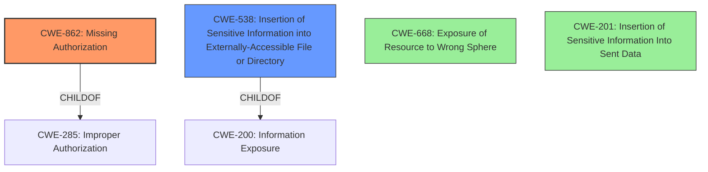

# Analysis Report for CVE-2020-2118

# Vulnerability Analysis Report: CVE-2020-2118

## Description


## Analysis (with Relationship Data)

# Summary
| CWE ID | CWE Name | Confidence | CWE Abstraction Level | CWE Vulnerability Mapping Label | CWE-Vulnerability Mapping Notes |
|---|---|---|---|---|---|
| CWE-862 | Missing Authorization | 1.0 | Class | Allowed-with-Review | Primary CWE |
| CWE-538 | Insertion of Sensitive Information into Externally-Accessible File or Directory | 0.7 | Base | Allowed | Secondary Candidate |
| CWE-668 | Exposure of Resource to Wrong Sphere | 0.5 | Class | Discouraged | Secondary Candidate |
| CWE-201 | Insertion of Sensitive Information Into Sent Data | 0.5 | Base | Allowed | Secondary Candidate |

## Evidence and Confidence

*   **Confidence Score:** 0.9
*   **Evidence Strength:** HIGH

## Relationship Analysis
The primary relationship that impacted the decision was the parent-child relationship between CWE-285 (Improper Authorization) and CWE-862 (Missing Authorization). Since the description specifically mentions a **missing permission check**, CWE-862 is more appropriate than its parent. The relationship between CWE-200 (Information Exposure) and CWE-538 (Insertion of Sensitive Information into Externally-Accessible File or Directory) was also considered.



## Vulnerability Chain
The vulnerability chain starts with the **missing permission check** (CWE-862), which leads to the exposure of credential IDs. This can be seen as an instance of information exposure. This leads to a potential impact where these exposed credential IDs can be used in conjunction with other vulnerabilities to capture the actual credentials themselves.

## Summary of Analysis
The initial analysis focused on identifying the root cause of the vulnerability, which is the **missing permission check**. The vulnerability description, particularly the key phrases and CVE reference, explicitly states this.

The selection of CWE-862 is based on the following evidence:

*   **Vulnerability Description Key Phrases:** "**missing permission check**"
*   **CVE Reference Links Content Summary:** "The plugin does not implement adequate permission checks when listing available credential IDs."

This directly aligns with the description of CWE-862: "The product does not perform an authorization check when an actor attempts to access a resource or perform an action."

CWE-862 is at the Class level of abstraction. While it is generally preferred to map to Base or Variant levels, in this case, there isn't a more specific CWE that accurately captures the nature of the **missing authorization**. The vulnerability doesn't involve incorrect authorization (CWE-863), but rather the complete absence of an authorization check.

Other CWEs Considered:

*   CWE-538: Considered as a secondary weakness, as the exposure of credential IDs is a form of sensitive information being placed in an accessible location. However, the primary issue is the **missing authorization check** that leads to this exposure.
*   CWE-668: Exposure of Resource to Wrong Sphere was considered since the credential IDs are being exposed to users with Overall/Read access, which is the wrong sphere. However, this CWE is discouraged and a more specific CWE, CWE-862, is more appropriate.
*   CWE-201: Insertion of Sensitive Information Into Sent Data was considered. The exposure of credential IDs can be seen as insertion of sensitive information. However, the more direct cause is still the **missing authorization**.

The final decision is to map the vulnerability to CWE-862 as the primary weakness, with CWE-538, CWE-668, and CWE-201 as secondary candidates. CWE-862 directly addresses the **missing permission check**, which is the root cause.

Relevant CWE Information:

# Enhanced Context (25 CWEs)
The following CWEs were identified as potentially relevant to this vulnerability:

## CWE-538: Insertion of Sensitive Information into Externally-Accessible File or Directory
**Abstraction Level**: Base
**Similarity Score**: 0.76
**Source**: dense

**Description**:
The product places sensitive information into files or directories that are accessible to actors who are allowed to have access to the files, but not to the sensitive information.

**Mapping Guidance**:
- Usage: Allowed
- Rationale: This CWE entry is at the Base level of abstraction, which is a preferred level of abstraction for mapping to the root causes of vulnerabilities.

## CWE-862: Missing Authorization
**Abstraction:** Class
**Status:** Incomplete

### Description
The product does not perform an authorization check when an actor attempts to access a resource or perform an action.

### Extended Description
Not provided

### Alternative Terms
AuthZ: "AuthZ" is typically used as an abbreviation of "authorization" within the web application security community. It is distinct from "AuthN" (or, sometimes, "AuthC") which is an abbreviation of "authentication." The use of "Auth" as an abbreviation is discouraged, since it could be used for either authentication or authorization.

### Relationships
ChildOf -> CWE-285
ChildOf -> CWE-284

### Mapping Guidance
**Usage:** Allowed-with-Review
**Rationale:** This CWE entry is a Class and might have Base-level children that would be more appropriate
**Comments:** Examine children of this entry to see if there is a better fit
**Reasons:**
- Abstraction


## CWE Relationship Analysis

Current CWEs represent these abstraction levels: .


### Vulnerability Chain Analysis

**Chain starting from CWE-862:**
- 862 (Missing Authorization) - ROOT


**Chain starting from CWE-284:**
- 284 (Improper Access Control) - ROOT


### CWE Relationship Diagram

```mermaid
graph TD
    classDef primary fill:#f96,stroke:#333,stroke-width:2px
    classDef secondary fill:#69f,stroke:#333
    classDef tertiary fill:#9e9,stroke:#333
```


*Report generated on 2025-04-01 18:26:46*
