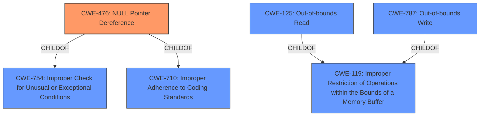

# Enhanced Analysis for CVE-2020-21535

# Summary
| CWE ID | CWE Name | Confidence | CWE Abstraction Level | CWE Vulnerability Mapping Label | CWE-Vulnerability Mapping Notes |
|---|---|---|---|---|---|
| CWE-476 | NULL Pointer Dereference | 0.8 | Base | Allowed | Primary CWE |
| CWE-125 | Out-of-bounds Read | 0.6 | Base | Allowed | Secondary Candidate |
| CWE-787 | Out-of-bounds Write | 0.6 | Base | Allowed | Secondary Candidate |

## Evidence and Confidence

*   **Confidence Score:** 0.8
*   **Evidence Strength:** MEDIUM

## Relationship Analysis
The primary CWE selected is CWE-476, NULL Pointer Dereference. This is a base-level CWE. Other candidates considered were CWE-125 (Out-of-bounds Read) and CWE-787 (Out-of-bounds Write), which are also base-level CWEs and children of CWE-119 (Improper Restriction of Operations within the Bounds of a Memory Buffer). The relationship analysis suggests that the vulnerability could stem from dereferencing an invalid memory location, potentially leading to a crash or unexpected behavior. The advisory mentions **NULL pointer dereferences** as a possible root cause, making CWE-476 the most likely candidate.



## Vulnerability Chain
The vulnerability chain starts with a potential coding error within the `gencgm_start` function, leading to a **NULL pointer dereference** which then results in a segmentation fault, a type of denial-of-service.
  - Root Cause: Coding error in `gencgm_start` may lead to **NULL pointer dereference**.
  - Weakness: CWE-476 (NULL Pointer Dereference).
  - Impact: Segmentation fault (Denial of Service).

## Summary of Analysis
The initial analysis focused on the segmentation fault in the `gencgm_start` function. The CVE Reference Links Content Summary suggests the vulnerability is related to "buffer overflows, out-of-bounds reads, and **NULL pointer dereferences**". Given the segmentation fault, **NULL pointer dereference** (CWE-476) is a strong possibility. The retriever results also list CWE-476 as a potential match.

CWE-125 and CWE-787 are also possible given the CVE Reference Links Content Summary mentions "buffer overflows, out-of-bounds reads, and **NULL pointer dereferences**" as the root causes of vulnerabilities in `fig2dev`.

I am basing my assessment primarily on the provided evidence, especially the CVE Reference Links Content Summary and the vulnerability description. The graph relationships show how CWE-476, CWE-125, and CWE-787 relate to CWE-119, indicating memory-related issues. The selected CWEs (CWE-476) are at the optimal level of specificity (Base).

Relevant CWE Information:

# Enhanced Context (25 CWEs)
The following CWEs were identified as potentially relevant to this vulnerability:

## CWE-1421: Exposure of Sensitive Information in Shared Microarchitectural Structures during Transient Execution
**Abstraction Level**: Base
**Similarity Score**: 0.81
**Source**: dense

**Description**:

			A processor event may allow transient operations to access
			architecturally restricted data (for example, in another address
			space) in a shared microarchitectural structure (for example, a CPU
			cache), potentially exposing the data over a covert channel.
		  

**Mapping Guidance**:
- Usage: Allowed
- Rationale: This CWE entry is at the Base level of abstraction, which is a preferred level of abstraction for mapping to the root causes of vulnerabilities


## CWE-667: Improper Locking
**Abstraction Level**: Class
**Similarity Score**: 0.79
**Source**: dense

**Description**:
The product does not properly acquire or release a lock on a resource, leading to unexpected resource state changes and behaviors.

**Mapping Guidance**:
- Usage: Allowed-with-Review
- Rationale: This CWE entry is a Class and might have Base-level children that would be more appropriate


## CWE-226: Sensitive Information in Resource Not Removed Before Reuse
**Abstraction Level**: Base
**Similarity Score**: 0.78
**Source**: dense

**Description**:
The product releases a resource such as memory or a file so that it can be made available for reuse, but it does not clear or "zeroize" the information contained in the resource before the product performs a critical state transition or makes the resource available for reuse by other entities.

**Mapping Guidance**:
- Usage: Allowed
- Rationale: This CWE entry is at the Base level of abstraction, which is a preferred level of abstraction for mapping to the root causes of vulnerabilities.


## CWE-131: Incorrect Calculation of Buffer Size
**Abstraction Level**: Base
**Similarity Score**: 0.78
**Source**: dense

**Description**:
The product does not correctly calculate the size to be used when allocating a buffer, which could lead to a buffer overflow.

**Mapping Guidance**:
- Usage: Allowed
- Rationale: This CWE entry is at the Base level of abstraction, which is a preferred level of abstraction for mapping to the root causes of vulnerabilities.


## CWE-404: Improper Resource Shutdown or Release
**Abstraction Level**: Class
**Similarity Score**: 0.78
**Source**: dense

**Description**:
The product does not release or incorrectly releases a resource before it is made available for re-use.

**Mapping Guidance**:
- Usage: Allowed-with-Review
- Rationale: This CWE entry is a Class and might have Base-level children that would be more appropriate


## CWE-119: Improper Restriction of Operations within the Bounds of a Memory Buffer
**Abstraction Level**: Class
**Similarity Score**: 0.78
**Source**: dense

**Description**:
The product performs operations on a memory buffer, but it reads from or writes to a memory location outside the buffer's intended boundary. This may result in read or write operations on unexpected memory locations that could be linked to other variables, data structures, or internal program data.

**Mapping Guidance**:
- Usage: Discouraged
- Rationale: CWE-119 is commonly misused in low-information vulnerability reports when lower-level CWEs could be used instead, or when more details about the vulnerability are available.


## CWE-125: Out-of-bounds Read
**Abstraction Level**: Base
**Similarity Score**: 0.78
**Source**: dense

**Description**:
The product reads data past the end, or before the beginning, of the intended buffer.

**Mapping Guidance**:
- Usage: Allowed
- Rationale: This CWE entry is at the Base level of abstraction, which is a preferred level of abstraction for mapping to the root causes of vulnerabilities.


## CWE-1342: Information Exposure through Microarchitectural State after Transient Execution
**Abstraction Level**: Base
**Similarity Score**: 0.78
**Source**: dense

**Description**:
The processor does not properly clear microarchitectural state after incorrect microcode assists or speculative execution, resulting in transient execution.

**Mapping Guidance**:
- Usage: Allowed
- Rationale: This CWE entry is at the Base level of abstraction, which is a preferred level of abstraction for mapping to the root causes of vulnerabilities.


## CWE-191: Integer Underflow (Wrap or Wraparound)
**Abstraction Level**: Base
**Similarity Score**: 0.78
**Source**: dense

**Description**:
The product subtracts one value from another, such that the result is less than the minimum allowable integer value, which produces a value that is not equal to the correct result.

**Mapping Guidance**:
- Usage: Allowed
- Rationale: This CWE entry is at the Base level of abstraction, which is a preferred level of abstraction for mapping to the root causes of vulnerabilities.


## CWE-908: Use of Uninitialized Resource
**Abstraction Level**:


## CWE Relationship Analysis

Current CWEs represent these abstraction levels: .


### Vulnerability Chain Analysis

**Chain starting from CWE-476:**
- 476 (NULL Pointer Dereference) - ROOT


**Chain starting from CWE-754:**
- 754 (Improper Check for Unusual or Exceptional Conditions) - ROOT


### CWE Relationship Diagram

```mermaid
graph TD
    classDef primary fill:#f96,stroke:#333,stroke-width:2px
    classDef secondary fill:#69f,stroke:#333
    classDef tertiary fill:#9e9,stroke:#333
```