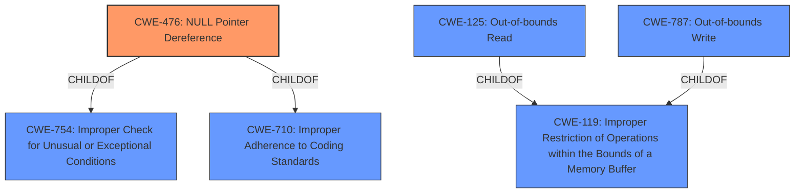

# Analysis for CVE-2020-21535

# Summary
| CWE ID | CWE Name | Confidence | CWE Abstraction Level | CWE Vulnerability Mapping Label | CWE-Vulnerability Mapping Notes |
|---|---|---|---|---|---|
| CWE-476 | NULL Pointer Dereference | 0.8 | Base | Allowed | Primary CWE |
| CWE-125 | Out-of-bounds Read | 0.6 | Base | Allowed | Secondary Candidate |
| CWE-787 | Out-of-bounds Write | 0.6 | Base | Allowed | Secondary Candidate |

## Evidence and Confidence

*   **Confidence Score:** 0.8
*   **Evidence Strength:** MEDIUM

## Relationship Analysis
The primary CWE selected is CWE-476, NULL Pointer Dereference. This is a base-level CWE. Other candidates considered were CWE-125 (Out-of-bounds Read) and CWE-787 (Out-of-bounds Write), which are also base-level CWEs and children of CWE-119 (Improper Restriction of Operations within the Bounds of a Memory Buffer). The relationship analysis suggests that the vulnerability could stem from dereferencing an invalid memory location, potentially leading to a crash or unexpected behavior. The advisory mentions **NULL pointer dereferences** as a possible root cause, making CWE-476 the most likely candidate.

## Vulnerability Chain
The vulnerability chain starts with a potential coding error within the `gencgm_start` function, leading to a **NULL pointer dereference** which then results in a segmentation fault, a type of denial-of-service.
  - Root Cause: Coding error in `gencgm_start` may lead to **NULL pointer dereference**.
  - Weakness: CWE-476 (NULL Pointer Dereference).
  - Impact: Segmentation fault (Denial of Service).

## Summary of Analysis
The initial analysis focused on the segmentation fault in the `gencgm_start` function. The CVE Reference Links Content Summary suggests the vulnerability is related to "buffer overflows, out-of-bounds reads, and **NULL pointer dereferences**". Given the segmentation fault, **NULL pointer dereference** (CWE-476) is a strong possibility. The retriever results also list CWE-476 as a potential match.

CWE-125 and CWE-787 are also possible given the CVE Reference Links Content Summary mentions "buffer overflows, out-of-bounds reads, and **NULL pointer dereferences**" as the root causes of vulnerabilities in `fig2dev`.

I am basing my assessment primarily on the provided evidence, especially the CVE Reference Links Content Summary and the vulnerability description. The graph relationships show how CWE-476, CWE-125, and CWE-787 relate to CWE-119, indicating memory-related issues. The selected CWEs (CWE-476) are at the optimal level of specificity (Base).

Relevant CWE Information:

# Enhanced Context (25 CWEs)
The following CWEs were identified as potentially relevant to this vulnerability:

## CWE-1421: Exposure of Sensitive Information in Shared Microarchitectural Structures during Transient Execution
**Abstraction Level**: Base
**Similarity Score**: 0.81
**Source**: dense

**Description**:

			A processor event may allow transient operations to access
			architecturally restricted data (for example, in another address
			space) in a shared microarchitectural structure (for example, a CPU
			cache), potentially exposing the data over a covert channel.
		  

**Mapping Guidance**:
- Usage: Allowed
- Rationale: This CWE entry is at the Base level of abstraction, which is a preferred level of abstraction for mapping to the root causes of vulnerabilities

## CWE-667: Improper Locking
**Abstraction Level**: Class
**Similarity Score**: 0.79
**Source**: dense

**Description**:
The product does not properly acquire or release a lock on a resource, leading to unexpected resource state changes and behaviors.

**Mapping Guidance**:
- Usage: Allowed-with-Review
- Rationale: This CWE entry is a Class and might have Base-level children that would be more appropriate

## CWE-226: Sensitive Information in Resource Not Removed Before Reuse
**Abstraction Level**: Base
**Similarity Score**: 0.78
**Source**: dense

**Description**:
The product releases a resource such as memory or a file so that it can be made available for reuse, but it does not clear or "zeroize" the information contained in the resource before the product performs a critical state transition or makes the resource available for reuse by other entities.

**Mapping Guidance**:
- Usage: Allowed
- Rationale: This CWE entry is at the Base level of abstraction, which is a preferred level of abstraction for mapping to the root causes of vulnerabilities.

## CWE-131: Incorrect Calculation of Buffer Size
**Abstraction Level**: Base
**Similarity Score**: 0.78
**Source**: dense

**Description**:
The product does not correctly calculate the size to be used when allocating a buffer, which could lead to a buffer overflow.

**Mapping Guidance**:
- Usage: Allowed
- Rationale: This CWE entry is at the Base level of abstraction, which is a preferred level of abstraction for mapping to the root causes of vulnerabilities.

## CWE-404: Improper Resource Shutdown or Release
**Abstraction Level**: Class
**Similarity Score**: 0.78
**Source**: dense

**Description**:
The product does not release or incorrectly releases a resource before it is made available for re-use.

**Mapping Guidance**:
- Usage: Allowed-with-Review
- Rationale: This CWE entry is a Class and might have Base-level children that would be more appropriate

## CWE-119: Improper Restriction of Operations within the Bounds of a Memory Buffer
**Abstraction Level**: Class
**Similarity Score**: 0.78
**Source**: dense

**Description**:
The product performs operations on a memory buffer, but it reads from or writes to a memory location outside the buffer's intended boundary. This may result in read or write operations on unexpected memory locations that could be linked to other variables, data structures, or internal program data.

**Mapping Guidance**:
- Usage: Discouraged
- Rationale: CWE-119 is commonly misused in low-information vulnerability reports when lower-level CWEs could be used instead, or when more details about the vulnerability are available.

## CWE-125: Out-of-bounds Read
**Abstraction Level**: Base
**Similarity Score**: 0.78
**Source**: dense

**Description**:
The product reads data past the end, or before the beginning, of the intended buffer.

**Mapping Guidance**:
- Usage: Allowed
- Rationale: This CWE entry is at the Base level of abstraction, which is a preferred level of abstraction for mapping to the root causes of vulnerabilities.

## CWE-1342: Information Exposure through Microarchitectural State after Transient Execution
**Abstraction Level**: Base
**Similarity Score**: 0.78
**Source**: dense

**Description**:
The processor does not properly clear microarchitectural state after incorrect microcode assists or speculative execution, resulting in transient execution.

**Mapping Guidance**:
- Usage: Allowed
- Rationale: This CWE entry is at the Base level of abstraction, which is a preferred level of abstraction for mapping to the root causes of vulnerabilities.

## CWE-191: Integer Underflow (Wrap or Wraparound)
**Abstraction Level**: Base
**Similarity Score**: 0.78
**Source**: dense

**Description**:
The product subtracts one value from another, such that the result is less than the minimum allowable integer value, which produces a value that is not equal to the correct result.

**Mapping Guidance**:
- Usage: Allowed
- Rationale: This CWE entry is at the Base level of abstraction, which is a preferred level of abstraction for mapping to the root causes of vulnerabilities.

## CWE-908: Use of Uninitialized Resource
**Abstraction Level**:

# Enhanced Query for CVE-2020-21535

## Vulnerability Description
fig2dev 3.2.7b contains a segmentation fault in the gencgm_start function in gencgm.c.

### Vulnerability Description Key Phrases
- **impact:** segmentation fault
- **product:** fig2dev
- **version:** 3.2.7b
- **component:** gencgm_start function in gencgm.c

## CVE Reference Links Content Summary
Based on the provided content, here's an analysis of CVE-2020-21535:

**Summary:**

The provided content is a security advisory for the `fig2dev` package in Debian LTS, and it lists CVE-2020-21535 as one of multiple vulnerabilities addressed in the update.

**Vulnerability Details:**

*   **Root Cause:** The advisory mentions "buffer overflows, out-of-bounds reads, and NULL pointer dereferences" as the root causes of vulnerabilities in `fig2dev`.
*   **Weaknesses/Vulnerabilities:** Specifically for CVE-2020-21535, the advisory doesn't specify the exact weakness, however, it can be inferred that the nature of vulnerability falls under one of these three categories, based on the description.
*  **Impact of Exploitation:** The impact of exploitation includes a "denial-of-service or other unspecified impact."
*   **Attack Vectors:** The advisory does not mention specific attack vectors, but it can be implied that the vulnerability is triggered by processing specially crafted XFig figure files.
*   **Required Attacker Capabilities/Position:** An attacker would likely need the ability to provide a malicious XFig file to be processed by `fig2dev`.

**Additional Notes:**

*   The advisory is for Debian 9 (stretch) and indicates that the fix is included in version `1:3.2.6a-2+deb9u4` of the `fig2dev` package.
*   The advisory also mentions a security tracker page for more detailed information about `fig2dev` vulnerabilities.

## Retriever Results

### Top Combined Results

| Rank | CWE ID | Name | Abstraction | Usage  | Retrievers | Individual Scores |
|------|--------|------|-------------|-------|------------|-------------------|
| 1 | 125 | Out-of-bounds Read | Base | Allowed | sparse | 0.042 |
| 2 | 822 | Untrusted Pointer Dereference | Base | Allowed | sparse | 0.032 |
| 3 | 476 | NULL Pointer Dereference | Base | Allowed | sparse | 0.032 |
| 4 | 704 | Incorrect Type Conversion or Cast | Class | Allowed-with-Review | sparse | 0.030 |
| 5 | 121 | Stack-based Buffer Overflow | Variant | Allowed | sparse | 0.029 |
| 6 | 1296 | Incorrect Chaining or Granularity of Debug Components | Base | Allowed | dense | 0.356 |
| 7 | 787 | Out-of-bounds Write | Base | Allowed | graph | 0.003 |
| 8 | 770 | Allocation of Resources Without Limits or Throttling | Base | Allowed | sparse | 0.028 |
| 9 | 122 | Heap-based Buffer Overflow | Variant | Allowed | sparse | 0.026 |
| 10 | 1421 | Exposure of Sensitive Information in Shared Microarchitectural Structures during Transient Execution | Base | Allowed | sparse | 0.026 |

# Complete CWE Specifications

## CWE-125: Out-of-bounds Read
**Abstraction:** Base
**Status:** Draft

### Description
The product reads data past the end, or before the beginning, of the intended buffer.

### Extended Description
Not provided

### Alternative Terms
OOB read: Shorthand for "Out of bounds" read

### Relationships
ChildOf -> CWE-119
ChildOf -> CWE-119
ChildOf -> CWE-119
ChildOf -> CWE-119

### Mapping Guidance
**Usage:** Allowed
**Rationale:** This CWE entry is at the Base level of abstraction, which is a preferred level of abstraction for mapping to the root causes of vulnerabilities.
**Comments:** Carefully read both the name and description to ensure that this mapping is an appropriate fit. Do not try to 'force' a mapping to a lower-level Base/Variant simply to comply with this preferred level of abstraction.
**Reasons:**
- Acceptable-Use

### Observed Examples
- **CVE-2023-1018:** The reference implementation code for a Trusted Platform Module does not implement length checks on data, allowing for an attacker to read 2 bytes past the end of a buffer.
- **CVE-2020-11899:** Out-of-bounds read in IP stack used in embedded systems, as exploited in the wild per CISA KEV.
- **CVE-2014-0160:** Chain: "Heartbleed" bug receives an inconsistent length parameter (CWE-130) enabling an out-of-bounds read (CWE-126), returning memory that could include private cryptographic keys and other sensitive data.

## CWE-822: Untrusted Pointer Dereference
**Abstraction:** Base
**Status:** Incomplete

### Description
The product obtains a value from an untrusted source, converts this value to a pointer, and dereferences the resulting pointer.

### Extended Description

An attacker can supply a pointer for memory locations that the product is not expecting. If the pointer is dereferenced for a write operation, the attack might allow modification of critical state variables, cause a crash, or execute code. If the dereferencing operation is for a read, then the attack might allow reading of sensitive data, cause a crash, or set a variable to an unexpected value (since the value will be read from an unexpected memory location).

There are several variants of this weakness, including but not necessarily limited to:

  - The untrusted value is directly invoked as a function call.

  - In OS kernels or drivers where there is a boundary between "userland" and privileged memory spaces, an untrusted pointer might enter through an API or system call (see CWE-781 for one such example).

  - Inadvertently accepting the value from an untrusted control sphere when it did not have to be accepted as input at all. This might occur when the code was originally developed to be run by a single user in a non-networked environment, and the code is then ported to or otherwise exposed to a networked environment.

### Alternative Terms
None

### Relationships
ChildOf -> CWE-119
ChildOf -> CWE-119
ChildOf -> CWE-119
CanPrecede -> CWE-125
CanPrecede -> CWE-787

### Mapping Guidance
**Usage:** Allowed
**Rationale:** This CWE entry is at the Base level of abstraction, which is a preferred level of abstraction for mapping to the root causes of vulnerabilities.
**Comments:** Carefully read both the name and description to ensure that this mapping is an appropriate fit. Do not try to 'force' a mapping to a lower-level Base/Variant simply to comply with this preferred level of abstraction.
**Reasons:**
- Acceptable-Use

### Additional Notes
**[Maintenance]** There are close relationships between incorrect pointer dereferences and other weaknesses related to buffer operations. There may not be sufficient community agreement regarding these relationships. Further study is needed to determine when these relationships are chains, composites, perspective/layering, or other types of relationships. As of September 2010, most of the relationships are being captured as chains.

**[Terminology]** Many weaknesses related to pointer dereferences fall under the general term of "memory corruption" or "memory safety." As of September 2010, there is no commonly-used terminology that covers the lower-level variants.

### Observed Examples
- **CVE-2007-5655:** message-passing framework interprets values in packets as pointers, causing a crash.
- **CVE-2010-2299:** labeled as a "type confusion" issue, also referred to as a "stale pointer." However, the bug ID says "contents are simply interpreted as a pointer... renderer ordinarily doesn't supply this pointer directly". The "handle" in the untrusted area is replaced in one function, but not another - thus also, effectively, exposure to wrong sphere (CWE-668).
- **CVE-2009-1719:** Untrusted dereference using undocumented constructor.

## CWE-476: NULL Pointer Dereference
**Abstraction:** Base
**Status:** Stable

### Description
The product dereferences a pointer that it expects to be valid but is NULL.

### Extended Description
Not provided

### Alternative Terms
NPD: Common abbreviation for Null Pointer Dereference
null deref: Common abbreviation for Null Pointer Dereference
NPE: Common abbreviation for Null Pointer Exception
nil pointer dereference: used for access of nil in Go programs

### Relationships
ChildOf -> CWE-710
ChildOf -> CWE-754
ChildOf -> CWE-754

### Mapping Guidance
**Usage:** Allowed
**Rationale:** This CWE entry is at the Base level of abstraction, which is a preferred level of abstraction for mapping to the root causes of vulnerabilities.
**Comments:** Carefully read both the name and description to ensure that this mapping is an appropriate fit. Do not try to 'force' a mapping to a lower-level Base/Variant simply to comply with this preferred level of abstraction.
**Reasons:**
- Acceptable-Use

### Observed Examples
- **CVE-2005-3274:** race condition causes a table to be corrupted if a timer activates while it is being modified, leading to resultant NULL dereference; also involves locking.
- **CVE-2002-1912:** large number of packets leads to NULL dereference
- **CVE-2005-0772:** packet with invalid error status value triggers NULL dereference

## CWE-704: Incorrect Type Conversion or Cast
**Abstraction:** Class
**Status:** Incomplete

### Description
The product does not correctly convert an object, resource, or structure from one type to a different type.

### Extended Description
Not provided

### Alternative Terms
None

### Relationships
ChildOf -> CWE-664

### Mapping Guidance
**Usage:** Allowed-with-Review
**Rationale:** This CWE entry is a Class and might have Base-level children that would be more appropriate
**Comments:** Examine children of this entry to see if there is a better fit
**Reasons:**
- Abstraction

### Observed Examples
- **CVE-2021-43537:** Chain: in a web browser, an unsigned 64-bit integer is forcibly cast to a 32-bit integer (CWE-681) and potentially leading to an integer overflow (CWE-190). If an integer overflow occurs, this can cause heap memory corruption (CWE-122)
- **CVE-2022-3979:** Chain: data visualization program written in PHP uses the "!=" operator instead of the type-strict "!==" operator (CWE-480) when validating hash values, potentially leading to an incorrect type conversion (CWE-704)

## CWE-121: Stack-based Buffer Overflow
**Abstraction:** Variant
**Status:** Draft

### Description
A stack-based buffer overflow condition is a condition where the buffer being overwritten is allocated on the stack (i.e., is a local variable or, rarely, a parameter to a function).

### Extended Description
Not provided

### Alternative Terms
Stack Overflow: "Stack Overflow" is often used to mean the same thing as stack-based buffer overflow, however it is also used on occasion to mean stack exhaustion, usually a result from an excessively recursive function call. Due to the ambiguity of the term, use of stack overflow to describe either circumstance is discouraged.

### Relationships
ChildOf -> CWE-788
ChildOf -> CWE-787

### Mapping Guidance
**Usage:** Allowed
**Rationale:** This CWE entry is at the Variant level of abstraction, which is a preferred level of abstraction for mapping to the root causes of vulnerabilities.
**Comments:** Carefully read both the name and description to ensure that this mapping is an appropriate fit. Do not try to 'force' a mapping to a lower-level Base/Variant simply to comply with this preferred level of abstraction.
**Reasons:**
- Acceptable-Use

### Additional Notes
**[Other]** Stack-based buffer overflows can instantiate in return address overwrites, stack pointer overwrites or frame pointer overwrites. They can also be considered function pointer overwrites, array indexer overwrites or write-what-where condition, etc.

### Observed Examples
- **CVE-2021-35395:** Stack-based buffer overflows in SFK for wifi chipset used for IoT/embedded devices, as exploited in the wild per CISA KEV.

## CWE-1296: Incorrect Chaining or Granularity of Debug Components
**Abstraction:** Base
**Status:** Incomplete

### Description
The product's debug components contain incorrect chaining or granularity of debug components.

### Extended Description

For debugging and troubleshooting a chip, several hardware design elements are often implemented, including:

  - Various Test Access Ports (TAPs) allow boundary scan commands to be executed.

  - For scanning the internal components of a chip, there are scan cells that allow the chip to be used as a "stimulus and response" mechanism.

  - Chipmakers might create custom methods to observe the internal components of their chips by placing various tracing hubs within their chip and creating hierarchical or interconnected structures among those hubs.

Logic errors during design or synthesis could misconfigure the interconnection of the debug components, which could allow unintended access permissions.

### Alternative Terms
None

### Relationships
ChildOf -> CWE-284

### Mapping Guidance
**Usage:** Allowed
**Rationale:** This CWE entry is at the Base level of abstraction, which is a preferred level of abstraction for mapping to the root causes of vulnerabilities.
**Comments:** Carefully read both the name and description to ensure that this mapping is an appropriate fit. Do not try to 'force' a mapping to a lower-level Base/Variant simply to comply with this preferred level of abstraction.
**Reasons:**
- Acceptable-Use

### Additional Notes
**[Maintenance]** This entry is still under development and will continue to see updates and content improvements.

### Observed Examples
- **CVE-2017-18347:** Incorrect access control in RDP Level 1 on STMicroelectronics STM32F0 series devices allows physically present attackers to extract the device's protected firmware via a special sequence of Serial Wire Debug (SWD) commands because there is a race condition between full initialization of the SWD interface and the setup of flash protection.
- **CVE-2020-1791:** There is an improper authorization vulnerability in several smartphones. The system has a logic-judging error, and, under certain scenarios, a successful exploit could allow the attacker to switch to third desktop after a series of operations in ADB mode. (Vulnerability ID: HWPSIRT-2019-10114).

## CWE-787: Out-of-bounds Write
**Abstraction:** Base
**Status:** Draft

### Description
The product writes data past the end, or before the beginning, of the intended buffer.

### Extended Description
Not provided

### Alternative Terms
Memory Corruption: Often used to describe the consequences of writing to memory outside the bounds of a buffer, or to memory that is otherwise invalid.

### Relationships
ChildOf -> CWE-119
ChildOf -> CWE-119
ChildOf -> CWE-119
ChildOf -> CWE-119

### Mapping Guidance
**Usage:** Allowed
**Rationale:** This CWE entry is at the Base level of abstraction, which is a preferred level of abstraction for mapping to the root causes of vulnerabilities.
**Comments:** Carefully read both the name and description to ensure that this mapping is an appropriate fit. Do not try to 'force' a mapping to a lower-level Base/Variant simply to comply with this preferred level of abstraction.
**Reasons:**
- Acceptable-Use

### Observed Examples
- **CVE-2023-1017:** The reference implementation code for a Trusted Platform Module does not implement length checks on data, allowing for an attacker to write 2 bytes past the end of a buffer.
- **CVE-2021-21220:** Chain: insufficient input validation (CWE-20) in browser allows heap corruption (CWE-787), as exploited in the wild per CISA KEV.
- **CVE-2021-28664:** GPU kernel driver allows memory corruption because a user can obtain read/write access to read-only pages, as exploited in the wild per CISA KEV.

## CWE-770: Allocation of Resources Without Limits or Throttling
**Abstraction:** Base
**Status:** Incomplete

### Description
The product allocates a reusable resource or group of resources on behalf of an actor without imposing any restrictions on the size or number of resources that can be allocated, in violation of the intended security policy for that actor.

### Extended Description

Code frequently has to work with limited resources, so programmers must be careful to ensure that resources are not consumed too quickly, or too easily. Without use of quotas, resource limits, or other protection mechanisms, it can be easy for an attacker to consume many resources by rapidly making many requests, or causing larger resources to be used than is needed. When too many resources are allocated, or if a single resource is too large, then it can prevent the code from working correctly, possibly leading to a denial of service.

### Alternative Terms
None

### Relationships
ChildOf -> CWE-400
ChildOf -> CWE-665
ChildOf -> CWE-400

### Mapping Guidance
**Usage:** Allowed
**Rationale:** This CWE entry is at the Base level of abstraction, which is a preferred level of abstraction for mapping to the root causes of vulnerabilities.
**Comments:** Carefully read both the name and description to ensure that this mapping is an appropriate fit. Do not try to 'force' a mapping to a lower-level Base/Variant simply to comply with this preferred level of abstraction.
**Reasons:**
- Acceptable-Use

### Additional Notes
**[Relationship]** This entry is different from uncontrolled resource consumption (CWE-400) in that there are other weaknesses that are related to inability to control resource consumption, such as holding on to a resource too long after use, or not correctly keeping track of active resources so that they can be managed and released when they are finished (CWE-771).

**[Theoretical]** Vulnerability theory is largely about how behaviors and resources interact. "Resource exhaustion" can be regarded as either a consequence or an attack, depending on the perspective. This entry is an attempt to reflect one of the underlying weaknesses that enable these attacks (or consequences) to take place.

### Observed Examples
- **CVE-2022-21668:** Chain: Python library does not limit the resources used to process images that specify a very large number of bands (CWE-1284), leading to excessive memory consumption (CWE-789) or an integer overflow (CWE-190).
- **CVE-2009-4017:** Language interpreter does not restrict the number of temporary files being created when handling a MIME request with a large number of parts..
- **CVE-2009-2726:** Driver does not use a maximum width when invoking sscanf style functions, causing stack consumption.

## CWE-122: Heap-based Buffer Overflow
**Abstraction:** Variant
**Status:** Draft

### Description
A heap overflow condition is a buffer overflow, where the buffer that can be overwritten is allocated in the heap portion of memory, generally meaning that the buffer was allocated using a routine such as malloc().

### Extended Description
Not provided

### Alternative Terms
None

### Relationships
ChildOf -> CWE-788
ChildOf -> CWE-787

### Mapping Guidance
**Usage:** Allowed
**Rationale:** This CWE entry is at the Variant level of abstraction, which is a preferred level of abstraction for mapping to the root causes of vulnerabilities.
**Comments:** Carefully read both the name and description to ensure that this mapping is an appropriate fit. Do not try to 'force' a mapping to a lower-level Base/Variant simply to comply with this preferred level of abstraction.
**Reasons:**
- Acceptable-Use

### Additional Notes
**[Relationship]** Heap-based buffer overflows are usually just as dangerous as stack-based buffer overflows.

### Observed Examples
- **CVE-2021-43537:** Chain: in a web browser, an unsigned 64-bit integer is forcibly cast to a 32-bit integer (CWE-681) and potentially leading to an integer overflow (CWE-190). If an integer overflow occurs, this can cause heap memory corruption (CWE-122)
- **CVE-2007-4268:** Chain: integer signedness error (CWE-195) passes signed comparison, leading to heap overflow (CWE-122)
- **CVE-2009-2523:** Chain: product does not handle when an input string is not NULL terminated (CWE-170), leading to buffer over-read (CWE-125) or heap-based buffer overflow (CWE-122).

## CWE-1421: Exposure of Sensitive Information in Shared Microarchitectural Structures during Transient Execution
**Abstraction:** Base
**Status:** Incomplete

### Description

			A processor event may allow transient operations to access
			architecturally restricted data (for example, in another address
			space) in a shared microarchitectural structure (for example, a CPU
			cache), potentially exposing the data over a covert channel.
		  

### Extended Description

Many commodity processors have Instruction Set Architecture (ISA) features that protect software components from one another. These features can include memory segmentation, virtual memory, privilege rings, trusted execution environments, and virtual machines, among others. For example, virtual memory provides each process with its own address space, which prevents processes from accessing each other's private data. Many of these features can be used to form hardware-enforced security boundaries between software components.

Many commodity processors also share microarchitectural resources that cache (temporarily store) data, which may be confidential. These resources may be shared across processor contexts, including across SMT threads, privilege rings, or others.

When transient operations allow access to ISA-protected data in a shared microarchitectural resource, this might violate users' expectations of the ISA feature that is bypassed. For example, if transient operations can access a victim's private data in a shared microarchitectural resource, then the operations' microarchitectural side effects may correspond to the accessed data. If an attacker can trigger these transient operations and observe their side effects through a covert channel [REF-1400], then the attacker may be able to infer the victim's private data. Private data could include sensitive program data, OS/VMM data, page table data (such as memory addresses), system configuration data (see Demonstrative Example 3), or any other data that the attacker does not have the required privileges to access.

### Alternative Terms
None

### Relationships
ChildOf -> CWE-1420
ChildOf -> CWE-1420

### Mapping Guidance
**Usage:** Allowed
**Rationale:** This CWE entry is at the Base level of abstraction, which is a preferred level of abstraction for mapping to the root causes of vulnerabilities
**Comments:** If a weakness can potentially be exploited to infer data that is accessible inside or outside the current processor context, then the weakness could map to CWE-1421 and to another CWE such as CWE-1420.
**Reasons:**
- Acceptable-Use

### Observed Examples
- **CVE-2017-5715:** A fault may allow transient user-mode operations to access kernel data cached in the L1D, potentially exposing the data over a covert channel.
- **CVE-2018-3615:** A fault may allow transient non-enclave operations to access SGX enclave data cached in the L1D, potentially exposing the data over a covert channel.
- **CVE-2019-1135:** A TSX Asynchronous Abort may allow transient operations to access architecturally restricted data, potentially exposing the data over a covert channel.

