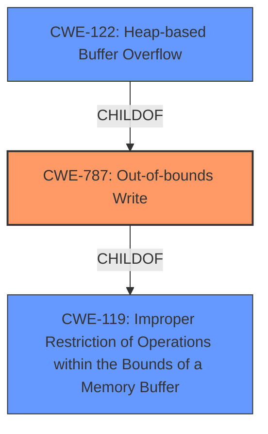

# Analysis Report for CVE-2020-21597

# Vulnerability Analysis Report: CVE-2020-21597

## Description


## Analysis (with Relationship Data)

# Summary
| CWE ID | CWE Name | Confidence | CWE Abstraction Level | CWE Vulnerability Mapping Label | CWE-Vulnerability Mapping Notes |
|---|---|---|---|---|---|
| CWE-787 | Out-of-bounds Write | 1.0 | Base | Allowed | Primary CWE |
| CWE-122 | Heap-based Buffer Overflow | 0.75 | Variant | Allowed | Secondary Candidate |
| CWE-119 | Improper Restriction of Operations within the Bounds of a Memory Buffer | 0.5 | Class | Discouraged | Secondary Candidate |

## Evidence and Confidence

*   **Confidence Score:** 0.9
*   **Evidence Strength:** HIGH

## Relationship Analysis
The primary CWE, CWE-787, is a base-level CWE that describes an out-of-bounds write. CWE-122, Heap-based Buffer Overflow, is a variant of CWE-787, specifying that the overflow occurs on the heap. CWE-119, Improper Restriction of Operations within the Bounds of a Memory Buffer, is a class-level CWE that represents a more general case of memory buffer errors, with CWE-787 being a specific type of such error. The relationship is hierarchical, with CWE-119 being the parent of CWE-787, and CWE-787 being the parent of CWE-122. Selecting CWE-787 offers a balance between specificity and broad applicability, though CWE-122 is more specific, the evidence leans towards a general out-of-bounds write on the heap and not a flaw in the allocation.



## Vulnerability Chain
The vulnerability chain starts with the processing of a crafted file, which leads to a **heap buffer overflow** in the `mc_chroma` function, resulting in a potential denial of service and arbitrary code execution. The root cause is the **improper handling of the crafted file** within the `mc_chroma` function, leading to the out-of-bounds write.
1.  Crafted file
2.  Improper handling within mc\_chroma function
3.  CWE-787: Out-of-bounds Write
4.  Denial of Service (DoS) / Arbitrary code execution.

## Summary of Analysis
The initial assessment pointed to CWE-787 due to the explicit mention of a **heap buffer overflow** in the vulnerability description and CVE reference links. The retriever results and similar CVE descriptions also strongly suggest CWE-787 as the primary candidate.

The final decision to select CWE-787 is primarily based on the evidence from the vulnerability description, which states that there is a **heap buffer overflow** in the mc_chroma function.
> libde265 v1.0.4 contains a **heap buffer overflow** in the mc_chroma function, which can be exploited via a crafted a file.
The CVE Reference Links Content Summary confirms this:
> The vulnerability is a **heap buffer overflow**.
The graph relationships show that CWE-787 is a child of CWE-119 and a parent of CWE-122. Although CWE-122 (Heap-based Buffer Overflow) is more specific, the description indicates a general out-of-bounds write and not necessarily a flaw specific to heap allocation mechanisms. Therefore, CWE-787 is at the optimal level of specificity.

Relevant CWE Information:

## CWE-787: Out-of-bounds Write
**Explanation:** The `mc_chroma` function in libde265 v1.0.4 writes data beyond the allocated buffer on the heap.
**Match:** The vulnerability description clearly states a **heap buffer overflow** due to a crafted file. The crafted file triggers the out-of-bounds write in the `mc_chroma` function.
**Security Implications:** This can lead to denial of service or arbitrary code execution by overwriting critical data in memory.
**Relationships:** CWE-787 is a child of CWE-119 (Improper Restriction of Operations within the Bounds of a Memory Buffer) and a parent of CWE-124 (Buffer Underwrite ('Buffer Underflow')).
**Mapping Guidance:** Usage: Allowed; Rationale: at the Base level of abstraction.
**Consideration:** CWE-120 (Buffer Copy without Checking Size of Input) was considered, but this is not a simple buffer copy issue but rather a more general out-of-bounds write.

## CWE-122: Heap-based Buffer Overflow
**Explanation:** A buffer overflow where the overwritten buffer is allocated on the heap.
**Match:** The vulnerability is explicitly described as a **heap buffer overflow**.
**Security Implications:** Can lead to denial of service or arbitrary code execution.
**Relationships:** Child of CWE-787 (Out-of-bounds Write).
**Mapping Guidance:** Usage: Allowed; Rationale: This CWE entry is at the Variant level of abstraction.
**Consideration:** While the vulnerability is a heap-based buffer overflow, the root cause is the out-of-bounds write, making CWE-787 a more fundamental classification.

## CWE-119: Improper Restriction of Operations within the Bounds of a Memory Buffer
**Explanation:** The product performs operations on a memory buffer, but it reads from or writes to a memory location outside the buffer's intended boundary.
**Match:** This is a general class of error that applies to buffer overflows.
**Security Implications:** Can lead to unpredictable behavior, information disclosure, denial of service, or arbitrary code execution.
**Relationships:** Parent of CWE-787 (Out-of-bounds Write).
**Mapping Guidance:** Usage: Discouraged; Rationale: Commonly misused, lower-level CWEs should be used instead.
**Consideration:** CWE-119 is too general; CWE-787 provides a more specific classification of the vulnerability.


## CWE Relationship Analysis

Current CWEs represent these abstraction levels: .


### Vulnerability Chain Analysis

**Chain starting from CWE-787:**
- 787 (Out-of-bounds Write) - ROOT


**Chain starting from CWE-124:**
- 124 (Buffer Underwrite ('Buffer Underflow')) - ROOT


### CWE Relationship Diagram

```mermaid
graph TD
    classDef primary fill:#f96,stroke:#333,stroke-width:2px
    classDef secondary fill:#69f,stroke:#333
    classDef tertiary fill:#9e9,stroke:#333
```


*Report generated on 2025-04-02 15:52:10*
