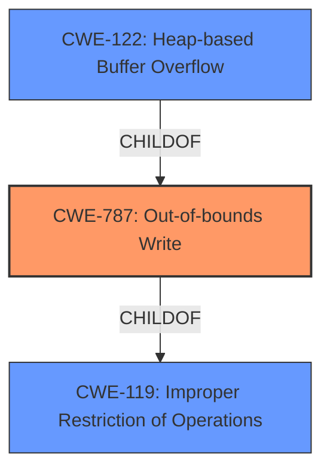

# Analysis Report for CVE-2020-21598

# Vulnerability Analysis Report: CVE-2020-21598

## Description


## Analysis (with Relationship Data)

# Summary
| CWE ID | CWE Name | Confidence | CWE Abstraction Level | CWE Vulnerability Mapping Label | CWE-Vulnerability Mapping Notes |
|---|---|---|---|---|---|
| CWE-787 | Out-of-bounds Write | 1.0 | Base | Allowed | Primary CWE |
| CWE-122 | Heap-based Buffer Overflow | 0.8 | Variant | Allowed | Secondary Candidate |
| CWE-119 | Improper Restriction of Operations within the Bounds of a Memory Buffer | 0.6 | Class | Discouraged | Secondary Candidate |

## Evidence and Confidence

*   **Confidence Score:** 0.9
*   **Evidence Strength:** HIGH

## Relationship Analysis
The primary CWE is CWE-787, which is a base-level CWE that describes the **root cause** of the vulnerability: writing data past the end of an allocated buffer. CWE-122 is a variant of CWE-787, specifying that the buffer is allocated on the heap. CWE-119 is a more general class-level CWE that describes improper restriction of operations within memory bounds. While CWE-122 and CWE-787 are related, CWE-787 is the more accurate base level description of the vulnerability.



## Vulnerability Chain
The vulnerability chain starts with the processing of a crafted file. This crafted file triggers a **heap buffer overflow** in the `ff_hevc_put_unweighted_pred_8_sse` function (CWE-787), potentially leading to denial of service or arbitrary code execution.

## Summary of Analysis
The initial analysis identified a **heap buffer overflow** due to a crafted file in `libde265`. The primary CWE is CWE-787 (Out-of-bounds Write) because the root cause is writing past the allocated buffer. This is supported by the vulnerability description which explicitly states "**heap buffer overflow**" in the `ff_hevc_put_unweighted_pred_8_sse` function. The CVE Reference Links Content Summary also states: "A **heap-buffer-overflow** occurs within the `ff_hevc_put_unweighted_pred_8_sse` function."

CWE-122 (Heap-based Buffer Overflow) was considered as a more specific variant of CWE-787 since the overflow occurs on the heap. While this information is valuable, the core issue remains the out-of-bounds write, making CWE-787 the most appropriate primary classification.

CWE-119 (Improper Restriction of Operations within the Bounds of a Memory Buffer) was also considered, as it's a more general class encompassing buffer overflows. However, the availability of the more specific CWE-787 makes it a better choice. The mapping guidance for CWE-119 explicitly discourages its use when more specific CWEs are available.

The selected CWEs are at the optimal level of specificity because they accurately represent the **root cause** (CWE-787) and the specific type of buffer overflow (CWE-122), while avoiding overly general classifications (CWE-119). The decision is based on the provided evidence, relationship analysis, and mapping guidance.


## CWE Relationship Analysis

Current CWEs represent these abstraction levels: .


### Vulnerability Chain Analysis

**Chain starting from CWE-787:**
- 787 (Out-of-bounds Write) - ROOT


**Chain starting from CWE-119:**
- 119 (Improper Restriction of Operations within the Bounds of a Memory Buffer) - ROOT


### CWE Relationship Diagram

```mermaid
graph TD
    classDef primary fill:#f96,stroke:#333,stroke-width:2px
    classDef secondary fill:#69f,stroke:#333
    classDef tertiary fill:#9e9,stroke:#333
```


*Report generated on 2025-04-02 00:30:58*
