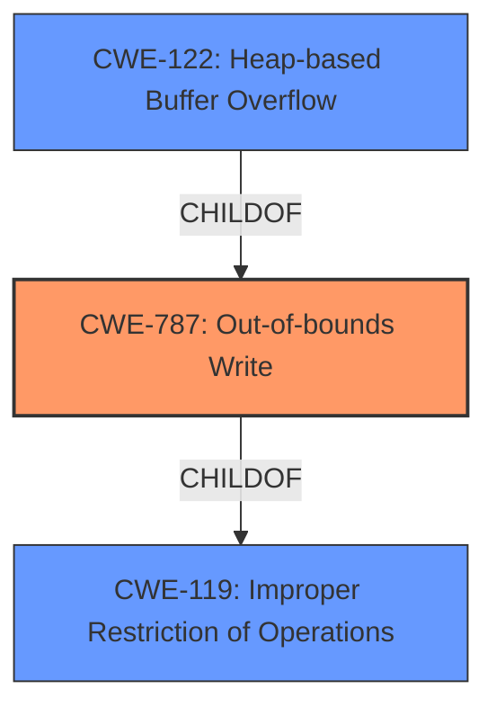

# Analysis Report for CVE-2020-21599

# Vulnerability Analysis Report: CVE-2020-21599

## Description


## Analysis (with Relationship Data)

# Summary
INSERT the assigned CWEs in a table format with the following columns: CWE ID, CWE Name, Confidence, CWE Abstraction Level, CWE Vulnerability Mapping Label, CWE-Vulnerability Mapping Notes
  - The Primary CWE should be first and noted as the Primary CWEs
  - The secondary candidate CWEs should be next and noted as secondary candidates.
  - The confidence is a confidence score 0 to 1 to rate your confidence in your assessment for that CWE.
  - The CWE Abstraction Level as one of these values: Base, Variant, Pillar, Class, Compound
  - The Mapping Notes Usage as one of these values: Allowed, Allowed-with-Review, Prohibited, Discouraged

| CWE ID | CWE Name | Confidence | CWE Abstraction Level | CWE Vulnerability Mapping Label | CWE-Vulnerability Mapping Notes |
|---|---|---|---|---|---|
| CWE-787 | Out-of-bounds Write | 1.0 | Base | Primary | Allowed |
| CWE-122 | Heap-based Buffer Overflow | 0.9 | Variant | Secondary | Allowed |
| CWE-119 | Improper Restriction of Operations within the Bounds of a Memory Buffer | 0.7 | Class | Secondary | Discouraged |

## Evidence and Confidence

*   **Confidence Score:** 0.9
*   **Evidence Strength:** HIGH

## Relationship Analysis
INSERT a concise analysis of the CWE relationships that impacted your decision:
  - Parent-child hierarchical relationships
  - Chain relationships showing progression of vulnerability
  - Peer relationships that offered alternative classifications
  - How abstraction levels influenced your selection

The primary CWE is CWE-787 **Out-of-bounds Write**, which is a base-level CWE. CWE-122 **Heap-based Buffer Overflow** is a variant of CWE-787 and is considered as a secondary CWE as the buffer is allocated in the heap memory. CWE-119 **Improper Restriction of Operations within the Bounds of a Memory Buffer** is a class-level CWE and a parent of CWE-787. While it broadly applies, it is less specific than CWE-787.



## Vulnerability Chain
INSERT the chain of root cause and weaknesses that followed for the Vulnerability Description.
  - Map the sequence from initial flaw to final impact
  - Identify which CWEs represent root causes vs. impacts
  - Note any missing links in the chain based on relationship data

The vulnerability chain begins with the processing of a crafted file, leading to a **heap buffer overflow** (CWE-122), which is a specific type of **out-of-bounds write** (CWE-787). The ultimate impact is denial of service, and potentially arbitrary code execution.

## Summary of Analysis
INSERT your analysis of both the initial analysis and criticism and your resulting conclusion.
  - Highlight how much your assessment is based on the provided evidence only, and show or quote that evidence.
  - Explain how the graph relationships influenced your final selection
  - Provide clear justification for your decision
  - Explain why your selected CWEs are at the optimal level of specificity

The primary weakness is a **heap buffer overflow** in the `de265_imageavailable_zscan` function, as stated in the vulnerability description: "libde265 v1.0.4 contains a **heap buffer overflow** in the de265_imageavailable_zscan function". The "CVE Reference Links Content Summary" confirms this, stating: "The vulnerability is a heap buffer overflow located in the `de265_image::available_zscan` function within the libde265 library."

CWE-787 **Out-of-bounds Write** is the most accurate base-level representation of the vulnerability, aligning with the description of writing data beyond the allocated buffer. CWE-122 **Heap-based Buffer Overflow** provides more specific information about where the buffer is allocated and is a variant of CWE-787. CWE-119 **Improper Restriction of Operations within the Bounds of a Memory Buffer** is a more general class.

The decision to prioritize CWE-787 is based on its direct relevance to the **out-of-bounds write** condition. While CWE-122 accurately captures the heap allocation aspect, CWE-787 represents the fundamental flaw.

Relevant CWE Information:

# Enhanced Context (25 CWEs)
The following CWEs were identified as potentially relevant to this vulnerability:

## CWE-131: Incorrect Calculation of Buffer Size
**Abstraction Level**: Base
**Similarity Score**: 0.78
**Source**: dense

**Description**:
The product does not correctly calculate the size to be used when allocating a buffer, which could lead to a buffer overflow.

**Mapping Guidance**:
- Usage: Allowed
- Rationale: This CWE entry is at the Base level of abstraction, which is a preferred level of abstraction for mapping to the root causes of vulnerabilities.

## CWE-191: Integer Underflow (Wrap or Wraparound)
**Abstraction Level**: Base
**Similarity Score**: 0.78
**Source**: dense

**Description**:
The product subtracts one value from another, such that the result is less than the minimum allowable integer value, which produces a value that is not equal to the correct result.

**Mapping Guidance**:
- Usage: Allowed
- Rationale: This CWE entry is at the Base level of abstraction, which is a preferred level of abstraction for mapping to the root causes of vulnerabilities.

## CWE-124: Buffer Underwrite ('Buffer Underflow')
**Abstraction Level**: Base
**Similarity Score**: 0.76
**Source**: dense

**Description**:
The product writes to a buffer using an index or pointer that references a memory location prior to the beginning of the buffer.

**Mapping Guidance**:
- Usage: Allowed
- Rationale: This CWE entry is at the Base level of abstraction, which is a preferred level of abstraction for mapping to the root causes of vulnerabilities.

## CWE-197: Numeric Truncation Error
**Abstraction Level**: Base
**Similarity Score**: 0.76
**Source**: dense

**Description**:
Truncation errors occur when a primitive is cast to a primitive of a smaller size and data is lost in the conversion.

**Mapping Guidance**:
- Usage: Allowed
- Rationale: This CWE entry is at the Base level of abstraction, which is a preferred level of abstraction for mapping to the root causes of vulnerabilities.

## CWE-805: Buffer Access with Incorrect Length Value
**Abstraction Level**: Base
**Similarity Score**: 0.76
**Source**: dense

**Description**:
The product uses a sequential operation to read or write a buffer, but it uses an incorrect length value that causes it to access memory that is outside of the bounds of the buffer.

**Mapping Guidance**:
- Usage: Allowed
- Rationale: This CWE entry is at the Base level of abstraction, which is a preferred level of abstraction for mapping to the root causes of vulnerabilities.

## CWE-125: Out-of-bounds Read
**Abstraction Level**: Base
**Similarity Score**: 0.76
**Source**: dense

**Description**:
The product reads data past the end, or before the beginning, of the intended buffer.

**Mapping Guidance**:
- Usage: Allowed
- Rationale: This CWE entry is at the Base level of abstraction, which is a preferred level of abstraction for mapping to the root causes of vulnerabilities.

## CWE-126: Buffer Over-read
**Abstraction Level**: Variant
**Similarity Score**: 0.76
**Source**: dense

**Description**:
The product reads from a buffer using buffer access mechanisms such as indexes or pointers that reference memory locations after the targeted buffer.

**Mapping Guidance**:
- Usage: Allowed
- Rationale: This CWE entry is at the Variant level of abstraction, which is a preferred level of abstraction for mapping to the root causes of vulnerabilities.

## CWE-681: Incorrect Conversion between Numeric Types
**Abstraction Level**: Base
**Similarity Score**: 0.75
**Source**: dense

**Description**:
When converting from one data type to another, such as long to integer, data can be omitted or translated in a way that produces unexpected values. If the resulting values are used in a sensitive context, then dangerous behaviors may occur.

**Mapping Guidance**:
- Usage: Allowed
- Rationale: This CWE entry is at the Base level of abstraction, which is a preferred level of abstraction for mapping to the root causes of vulnerabilities.

## CWE-193: Off-by


## CWE Relationship Analysis

Current CWEs represent these abstraction levels: .


### Vulnerability Chain Analysis

**Chain starting from CWE-787:**
- 787 (Out-of-bounds Write) - ROOT


**Chain starting from CWE-805:**
- 805 (Buffer Access with Incorrect Length Value) - ROOT


### CWE Relationship Diagram

```mermaid
graph TD
    classDef primary fill:#f96,stroke:#333,stroke-width:2px
    classDef secondary fill:#69f,stroke:#333
    classDef tertiary fill:#9e9,stroke:#333
```


*Report generated on 2025-04-02 16:52:47*
