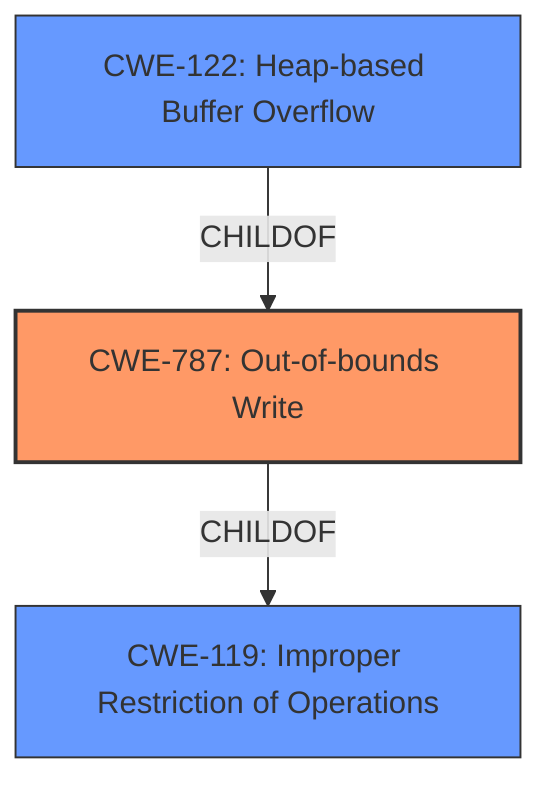

# Analysis for CVE-2020-21603

# Summary
| CWE ID | CWE Name | Confidence | CWE Abstraction Level | CWE Vulnerability Mapping Label | CWE-Vulnerability Mapping Notes |
|---|---|---|---|---|---|
| CWE-787 | Out-of-bounds Write | 1.0 | Base | Primary | Allowed |
| CWE-122 | Heap-based Buffer Overflow | 0.8 | Variant | Secondary | Allowed |
| CWE-119 | Improper Restriction of Operations within the Bounds of a Memory Buffer | 0.6 | Class | Secondary | Discouraged |

## Evidence and Confidence

*   **Confidence Score:** 0.9
*   **Evidence Strength:** HIGH

## Relationship Analysis
The primary weakness is CWE-787, which is a base-level CWE describing an out-of-bounds write. CWE-122 is a variant specifying that the out-of-bounds write occurs on the heap. CWE-119 is a more general class describing improper restrictions of operations within memory buffer bounds and is a parent of both CWE-787 and CWE-122. The relationship shows a hierarchical path from general to specific.

## Vulnerability Chain
The vulnerability chain involves a **heap buffer overflow** due to an out-of-bounds write in the `put_qpel_0_0_fallback_16` function. This is triggered by a crafted file, leading to a denial of service or potential arbitrary code execution.

## Summary of Analysis
The initial assessment, based on the provided evidence, indicates a clear **heap buffer overflow** vulnerability in libde265. The **Vulnerability Description** explicitly mentions a "**heap buffer overflow**". The **CVE Reference Links Content Summary** confirms the root cause as a "**Heap-buffer-overflow**" in the `put_qpel_0_0_fallback_16` function, leading to a memory write operation beyond the allocated buffer on the heap.

The relationship analysis shows that CWE-787 (Out-of-bounds Write) is the most appropriate base CWE, with CWE-122 (Heap-based Buffer Overflow) as a more specific variant. While CWE-119 (Improper Restriction of Operations within the Bounds of a Memory Buffer) is a parent class, it is too general for this specific vulnerability, as indicated by its "Discouraged" usage in the mapping guidance.

The selection of CWE-787 is based on the clear evidence of an out-of-bounds write, while CWE-122 is selected as the memory corruption occurs on the heap. These CWEs are at the optimal level of specificity, providing a detailed and accurate representation of the vulnerability based on the available information.

Relevant CWE Information:

# Enhanced Context (25 CWEs)

## CWE-131: Incorrect Calculation of Buffer Size
**Abstraction Level**: Base
**Similarity Score**: 0.78
**Source**: dense

**Description**:
The product does not correctly calculate the size to be used when allocating a buffer, which could lead to a buffer overflow.

*This CWE was considered but not selected because the description does not mention an incorrect calculation of a buffer size. The root cause appears to be a failure to validate buffer boundaries during the write operation.*

## CWE-191: Integer Underflow (Wrap or Wraparound)
**Abstraction Level**: Base
**Similarity Score**: 0.77
**Source**: dense

**Description**:
The product subtracts one value from another, such that the result is less than the minimum allowable integer value, which produces a value that is not equal to the correct result.

*This CWE was considered but not selected because it doesn't seem to be triggered by an integer underflow condition.*

## CWE-197: Numeric Truncation Error
**Abstraction Level**: Base
**Similarity Score**: 0.77
**Source**: dense

**Description**:
Truncation errors occur when a primitive is cast to a primitive of a smaller size and data is lost in the conversion.

*This CWE was considered but not selected because there is no evidence that a numeric truncation error is related to the root cause of the buffer overflow.*

## CWE-124: Buffer Underwrite ('Buffer Underflow')
**Abstraction Level**: Base
**Similarity Score**: 0.76
**Source**: dense

**Description**:
The product writes to a buffer using an index or pointer that references a memory location prior to the beginning of the buffer.

*This CWE was considered but not selected because the vulnerability description states that a heap buffer overflow occurs. A buffer underwrite would be writing before the buffer.*

## CWE-805: Buffer Access with Incorrect Length Value
**Abstraction Level**: Base
**Similarity Score**: 0.76
**Source**: dense

**Description**:
The product uses a sequential operation to read or write a buffer, but it uses an incorrect length value that causes it to access memory that is outside of the bounds of the buffer.

*This CWE was considered but not selected because while an incorrect length value could contribute to the overflow, the description primarily focuses on the out-of-bounds write itself.*

## CWE-125: Out-of-bounds Read
**Abstraction Level**: Base
**Similarity Score**: 0.76
**Source**: dense

**Description**:
The product reads data past the end, or before the beginning, of the intended buffer.

*This CWE was considered but not selected because the vulnerability description indicates a heap buffer overflow which is a write operation. This is a read operation.*

## CWE-126: Buffer Over-read
**Abstraction Level**: Variant
**Similarity Score**: 0.76
**Source**: dense

**Description**:
The product reads from a buffer using buffer access mechanisms such as indexes or pointers that reference memory locations after the targeted buffer.

*This CWE was considered but not selected because the vulnerability description indicates a heap buffer overflow which is a write operation. This is a read operation.*

## CWE-681: Incorrect Conversion between Numeric Types
**Abstraction Level**: Base
**Similarity Score**: 0.76
**Source**: dense

**Description**:
When converting from one data type to another, such as long to integer, data can be omitted or translated in a way that produces unexpected values. If the resulting values are used in a sensitive context, then dangerous behaviors may occur.

*This CWE was considered but not selected because it doesn't seem to be triggered by an incorrect conversion between numeric types.*

## CWE-193: Off-by-one Error
**Abstraction Level**: Base
**Similarity Score**: 0.75
**Source**: dense

**Description**:
A product calculates or uses an incorrect maximum or minimum value that is 1 more, or 1 less, than the correct value.

*This CWE was considered but not selected because there's no specific mention or indication of an off-by-one error being the root cause. The primary issue is the **heap buffer overflow** due to an out-of-bounds write.*

## CWE-190: Integer Overflow or Wraparound
**Abstraction Level**: Base
**Similarity Score**: 0.75
**Source**: dense

**Description**:
The product performs a calculation that can produce an integer overflow or wraparound when the logic assumes that the resulting value will always be larger than the original value.

*This CWE was considered but not selected because the description does not indicate that the root cause is an integer overflow. The primary issue is the **heap buffer overflow** due to an out-of-bounds write.*

## CWE-1284: Improper Validation of Specified Quantity in Input
**Abstraction Level**: Base
**Similarity Score**: 6667.14
**Source**: sparse

**Description**:
The product receives input that is expected to specify a quantity (such as size or length), but it does not validate or incorrectly validates that the quantity has the required properties.

*This CWE was considered but not selected because while a lack of validation could contribute to the overflow, the description primarily focuses on the out-of-bounds write itself.*

## CWE-120: Buffer Copy without Checking Size of Input ('Classic Buffer Overflow')
**Abstraction Level**: base
**Similarity Score**: 5.03
**Source**: graph

**Description**:
CWE-120: Buffer Copy without Checking Size of Input ('Classic Buffer Overflow')

*This CWE was considered but not selected because the description doesn't mention a buffer copy without checking the size of the input. The core issue is the **heap buffer overflow** in the specified function, suggesting the potential for out-of-bounds writes during its operation, not necessarily a