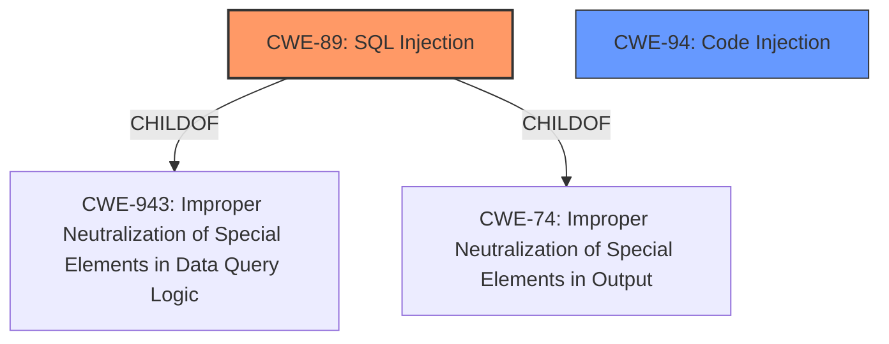

# Raw Analyzer Response for CVE-2020-21651

# Summary
| CWE ID | CWE Name | Confidence | CWE Abstraction Level | CWE Vulnerability Mapping Label | CWE-Vulnerability Mapping Notes |
|---|---|---|---|---|---|
| CWE-89 | Improper Neutralization of Special Elements used in an SQL Command ('SQL Injection') | 1.0 | Base | Allowed | Primary CWE |
| CWE-94 | Improper Control of Generation of Code ('Code Injection') | 0.7 | Base | Allowed-with-Review | Secondary Candidate |

## Evidence and Confidence

*   **Confidence Score:** 0.9
*   **Evidence Strength:** HIGH

## Relationship Analysis
The primary relationship influencing the CWE selection is that CWE-89 **(SQL Injection)** is a `ChildOf` CWE-943 **(Improper Neutralization of Special Elements in Data Query Logic)** and `ChildOf` CWE-74 **(Improper Neutralization of Special Elements in Output Used by a Downstream Component ('Injection'))**. CWE-94 **(Code Injection)** is a parent of CWE-96 **(Static Code Injection)**, CWE-95 **(Eval Injection)** and CWE-1336 **(Template Injection)**.

## Vulnerability Chain
The vulnerability chain starts with **improper input validation** and **lack of sanitization**, leading to **SQL Injection**, which then enables **arbitrary code execution**.
  - The root cause is the **failure to neutralize** special elements in user-supplied input.
  - This leads to the ability to inject SQL commands.
  - The injected SQL allows for the execution of arbitrary PHP code.
  - The final impact is remote code execution.

## Summary of Analysis
Initially, CWE-94 **(Code Injection)** seemed like a plausible candidate, but further analysis of the evidence revealed that the root cause is specifically related to **SQL Injection**. The CVE description and the reference link content summary clearly indicate that the `JIFENNAME` parameter is directly inserted into the database without proper sanitization, allowing for **SQL Injection**. This **SQL Injection** then leads to the ability to execute arbitrary PHP code. Therefore, CWE-89 **(SQL Injection)** is the more accurate and specific CWE to represent the root cause of this vulnerability.

The evidence from the CVE Reference Links Content Summary states: "The `add()` method in `WWW\application\admin\controller\point.php` of Myucms v2.2 does not sanitize user-supplied input. Specifically the `JIFENNAME` parameter is directly inserted into the database without proper sanitization," which directly supports the selection of CWE-89.

CWE-94 was considered because the **impact** of the vulnerability is remote code execution. However, CWE-94 is a more general case, and the vulnerability description specifically points to **SQL Injection** as the means of achieving code execution.

The decision to select CWE-89 is based on its specificity and the clear evidence of **SQL Injection** in the vulnerability description. This aligns with best practices of selecting the most specific CWE that accurately represents the root cause.

Relevant CWE Information:

# Enhanced Context (25 CWEs)
The following CWEs were identified as potentially relevant to this vulnerability:

## CWE-1336: Improper Neutralization of Special Elements Used in a Template Engine
**Abstraction Level**: Base
**Similarity Score**: 0.77
**Source**: dense

**Description**:
The product uses a template engine to insert or process externally-influenced input, but it does not neutralize or incorrectly neutralizes special elements or syntax that can be interpreted as template expressions or other code directives when processed by the engine.

**Mapping Guidance**:
- Usage: Allowed
- Rationale: This CWE entry is at the Base level of abstraction, which is a preferred level of abstraction for mapping to the root causes of vulnerabilities.

## CWE-917: Improper Neutralization of Special Elements used in an Expression Language Statement ('Expression Language Injection')
**Abstraction Level**: Base
**Similarity Score**: 0.76
**Source**: dense

**Description**:
The product constructs all or part of an expression language (EL) statement in a framework such as a Java Server Page (JSP) using externally-influenced input from an upstream component, but it does not neutralize or incorrectly neutralizes special elements that could modify the intended EL statement before it is executed.

**Mapping Guidance**:
- Usage: Allowed
- Rationale: This CWE entry is at the Base level of abstraction, which is a preferred level of abstraction for mapping to the root causes of vulnerabilities.

## CWE-80: Improper Neutralization of Script-Related HTML Tags in a Web Page (Basic XSS)
**Abstraction Level**: Variant
**Similarity Score**: 0.76
**Source**: dense

**Description**:
The product receives input from an upstream component, but it does not neutralize or incorrectly neutralizes special characters such as "<", ">", and "&" that could be interpreted as web-scripting elements when they are sent to a downstream component that processes web pages.

**Mapping Guidance**:
- Usage: Allowed
- Rationale: This CWE entry is at the Variant level of abstraction, which is a preferred level of abstraction for mapping to the root causes of vulnerabilities.

## CWE-74: Improper Neutralization of Special Elements in Output Used by a Downstream Component ('Injection')
**Abstraction Level**: Class
**Similarity Score**: 0.76
**Source**: dense

**Description**:
The product constructs all or part of a command, data structure, or record using externally-influenced input from an upstream component, but it does not neutralize or incorrectly neutralizes special elements that could modify how it is parsed or interpreted when it is sent to a downstream component.

**Mapping Guidance**:
- Usage: Discouraged
- Rationale: CWE-74 is high-level and often misused when lower-level weaknesses are more appropriate.

## CWE-184: Incomplete List of Disallowed Inputs
**Abstraction Level**: Base
**Similarity Score**: 0.74
**Source**: dense

**Description**:
The product implements a protection mechanism that relies on a list of inputs (or properties of inputs) that are not allowed by policy or otherwise require other action to neutralize before additional processing takes place, but the list is incomplete.

**Mapping Guidance**:
- Usage: Allowed
- Rationale: This CWE entry is at the Base level of abstraction, which is a preferred level of abstraction for mapping to the root causes of vulnerabilities.

## CWE-96: Improper Neutralization of Directives in Statically Saved Code ('Static Code Injection')
**Abstraction Level**: Base
**Similarity Score**: 0.74
**Source**: dense

**Description**:
The product receives input from an upstream component, but it does not neutralize or incorrectly neutralizes code syntax before inserting the input into an executable resource, such as a library, configuration file, or template.

**Mapping Guidance**:
- Usage: Allowed
- Rationale: This CWE entry is at the Base level of abstraction, which is a preferred level of abstraction for mapping to the root causes of vulnerabilities.

## CWE-138: Improper Neutralization of Special Elements
**Abstraction Level**: Class
**Similarity Score**: 0.73
**Source**: dense

**Description**:
The product receives input from an upstream component, but it does not neutralize or incorrectly neutralizes special elements that could be interpreted as control elements or syntactic markers when they are sent to a downstream component.

**Mapping Guidance**:
- Usage: Discouraged
- Rationale: This CWE entry is a level-1 Class (i.e., a child of a Pillar). It might have lower-level children that would be more appropriate

## CWE-1289: Improper Validation of Unsafe Equivalence in Input
**Abstraction Level**: Base
**Similarity Score**: 0.73
**Source**: dense

**Description**:
The product receives an input value that is used as a resource identifier or other type of reference, but it does not validate or incorrectly validates that the input is equivalent to a potentially-unsafe value.

**Mapping Guidance**:
- Usage: Allowed
- Rationale: This CWE entry is at the Base level of abstraction, which is a preferred level of abstraction for mapping to the root causes of vulnerabilities.

## CWE-943: Improper Neutralization of Special Elements in Data Query Logic
**Abstraction Level**: Class
**Similarity Score**: 0.73
**Source**: dense

**Description**:
The product generates a query intended to access or manipulate data in a data store such as a database, but it does not neutralize or incorrectly neutralizes special elements that can modify the intended logic of the query.

**Mapping Guidance**:
- Usage: Allowed-with-Review
- Rationale