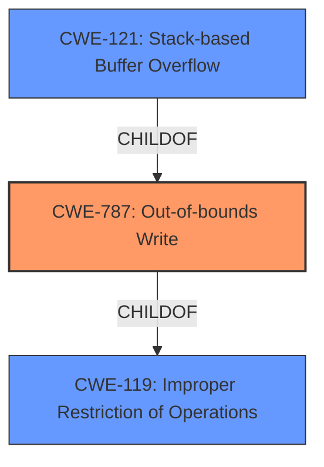

# Analysis Report for CVE-2020-21676

# Vulnerability Analysis Report: CVE-2020-21676

## Description


## Analysis (with Relationship Data)

# Summary
| CWE ID    | CWE Name                                                        | Confidence | CWE Abstraction Level | CWE Vulnerability Mapping Label | CWE-Vulnerability Mapping Notes |
| :-------- | :-------------------------------------------------------------- | :--------- | :-------------------- | :------------------------------ | :------------------------------ |
| CWE-787   | Out-of-bounds Write                                           | 1          | Base                  | Primary CWE                     | Allowed                       |
| CWE-121   | Stack-based Buffer Overflow                                     | 0.9        | Variant               | Secondary Candidate             | Allowed                       |
| CWE-119   | Improper Restriction of Operations within the Bounds of a Memory Buffer | 0.7        | Class                 | Secondary Candidate             | Discouraged                    |

## Evidence and Confidence

*   **Confidence Score:** 0.9
*   **Evidence Strength:** HIGH

## Relationship Analysis
The primary relationship is that CWE-121 (Stack-based Buffer Overflow) is a variant of CWE-787 (Out-of-bounds Write), which itself is a child of CWE-119 (Improper Restriction of Operations within the Bounds of a Memory Buffer). The analysis focuses on selecting the most specific CWE that accurately describes the vulnerability. Since the vulnerability description explicitly mentions a "stack-based buffer overflow," both CWE-787 and CWE-121 are considered. The final choice is based on selecting the most specific applicable CWE.



## Vulnerability Chain
The vulnerability chain starts with the **stack-based buffer overflow** (**WEAKNESS**) in the `genpstrx_text()` function. This **WEAKNESS** leads to a denial-of-service (DOS) (**IMPACT**) by converting a xfig file into pstricks format.

## Summary of Analysis
Initially, the vulnerability description points to a **stack-based buffer overflow**. The "CWE for similar CVE Descriptions" section also identifies CWE-787 (Out-of-bounds Write) as the primary match. The retriever results list CWE-119 (Improper Restriction of Operations within the Bounds of a Memory Buffer), CWE-190 (Integer Overflow or Wraparound), and CWE-121 (Stack-based Buffer Overflow) as potential candidates.

The description clearly states "A **stack-based buffer overflow** in the genpstrx_text() component in genpstricks.c of fig2dev 3.2.7b allows attackers to cause a denial of service (DOS) via converting a xfig file into pstricks format." This statement provides strong evidence for a buffer overflow occurring on the stack.

CWE-787 (Out-of-bounds Write) is selected as the primary CWE because it accurately describes the **WEAKNESS** of writing data beyond the intended buffer's boundaries.
CWE-121 (Stack-based Buffer Overflow) is considered as a secondary CWE because it specifies the location of the buffer (stack), providing more specific context. However, since CWE-787 already captures the fundamental **WEAKNESS** of out-of-bounds write, it is chosen as the primary. CWE-119 (Improper Restriction of Operations within the Bounds of a Memory Buffer) is a more general class of **WEAKNESS**, and while applicable, it is less specific than CWE-787.

The choice of CWE-787 is at the optimal level of specificity because it directly reflects the root cause (**out-of-bounds write**) identified in the vulnerability description and the "CVE Reference Links Content Summary".

Relevant CWE Information:
# Enhanced Context (25 CWEs)
The following CWEs were identified as potentially relevant to this vulnerability:

## CWE-124: Buffer Underwrite ('Buffer Underflow')
**Abstraction Level**: Base
**Similarity Score**: 0.77
**Source**: dense

**Description**:
The product writes to a buffer using an index or pointer that references a memory location prior to the beginning of the buffer.

**Mapping Guidance**:
- Usage: Allowed
- Rationale: This CWE entry is at the Base level of abstraction, which is a preferred level of abstraction for mapping to the root causes of vulnerabilities.

## CWE-191: Integer Underflow (Wrap or Wraparound)
**Abstraction Level**: Base
**Similarity Score**: 0.77
**Source**: dense

**Description**:
The product subtracts one value from another, such that the result is less than the minimum allowable integer value, which produces a value that is not equal to the correct result.

**Mapping Guidance**:
- Usage: Allowed
- Rationale: This CWE entry is at the Base level of abstraction, which is a preferred level of abstraction for mapping to the root causes of vulnerabilities.

## CWE-131: Incorrect Calculation of Buffer Size
**Abstraction Level**: Base
**Similarity Score**: 0.77
**Source**: dense

**Description**:
The product does not correctly calculate the size to be used when allocating a buffer, which could lead to a buffer overflow.

**Mapping Guidance**:
- Usage: Allowed
- Rationale: This CWE entry is at the Base level of abstraction, which is a preferred level of abstraction for mapping to the root causes of vulnerabilities.

## CWE-805: Buffer Access with Incorrect Length Value
**Abstraction Level**: Base
**Similarity Score**: 0.76
**Source**: dense

**Description**:
The product uses a sequential operation to read or write a buffer, but it uses an incorrect length value that causes it to access memory that is outside of the bounds of the buffer.

**Mapping Guidance**:
- Usage: Allowed
- Rationale: This CWE entry is at the Base level of abstraction, which is a preferred level of abstraction for mapping to the root causes of vulnerabilities.

## CWE-680: Integer Overflow to Buffer Overflow
**Abstraction Level**: Compound
**Similarity Score**: 0.75
**Source**: dense

**Description**:
The product performs a calculation to determine how much memory to allocate, but an integer overflow can occur that causes less memory to be allocated than expected, leading to a buffer overflow.

**Mapping Guidance**:
- Usage: Discouraged
- Rationale: This CWE entry is a named chain, which combines multiple weaknesses.

## CWE-125: Out-of-bounds Read
**Abstraction Level**: Base
**Similarity Score**: 0.75
**Source**: dense

**Description**:
The product reads data past the end, or before the beginning, of the intended buffer.

**Mapping Guidance**:
- Usage: Allowed
- Rationale: This CWE entry is at the Base level of abstraction, which is a preferred level of abstraction for mapping to the root causes of vulnerabilities.

## CWE-126: Buffer Over-read
**Abstraction Level**: Variant
**Similarity Score**: 0.75
**Source**: dense

**Description**:
The product reads from a buffer using buffer access mechanisms such as indexes or pointers that reference memory locations after the targeted buffer.

**Mapping Guidance**:
- Usage: Allowed
- Rationale: This CWE entry is at the Variant level of abstraction, which is a preferred level of abstraction for mapping to the root causes of vulnerabilities.

## CWE-193: Off-by-one Error
**Abstraction Level**: Base
**Similarity Score**: 0.74
**Source**: dense

**Description**:
A product calculates or uses an incorrect maximum or minimum value that is 1 more, or 1 less, than the correct value.

**Mapping Guidance**:
- Usage: Allowed
- Rationale: This CWE entry is at the Base level of abstraction, which is a preferred level of abstraction for mapping to the root causes of vulnerabilities.

## CWE-1325: Improperly Controlled Sequential Memory Allocation
**Abstraction Level**: Base
**Similarity Score**: 0.74
**Source**: dense

**Description**:
The product manages a group of objects or resources and performs a separate memory allocation for each object, but it does not properly limit the total amount of memory that is consumed by all of the combined objects.

**Mapping Guidance**:
- Usage: Allowed
- Rationale: This CWE entry is at the Base level of abstraction, which is a preferred level of abstraction for mapping to the root causes of vulnerabilities.

## CWE-190: Integer Overflow or Wraparound
**Abstraction Level**: Base
**Similarity Score**: 0.74
**Source**: dense

**Description**:
The product performs a calculation that can
         produce an integer overflow or wraparound when the logic
         assumes that the resulting value will always be larger than
         the original value. This occurs when an integer value


## CWE Relationship Analysis

Current CWEs represent these abstraction levels: .


### Vulnerability Chain Analysis

**Chain starting from CWE-787:**
- 787 (Out-of-bounds Write) - ROOT


**Chain starting from CWE-121:**
- 121 (Stack-based Buffer Overflow) - ROOT


### CWE Relationship Diagram

```mermaid
graph TD
    classDef primary fill:#f96,stroke:#333,stroke-width:2px
    classDef secondary fill:#69f,stroke:#333
    classDef tertiary fill:#9e9,stroke:#333
```


*Report generated on 2025-04-02 09:04:45*
