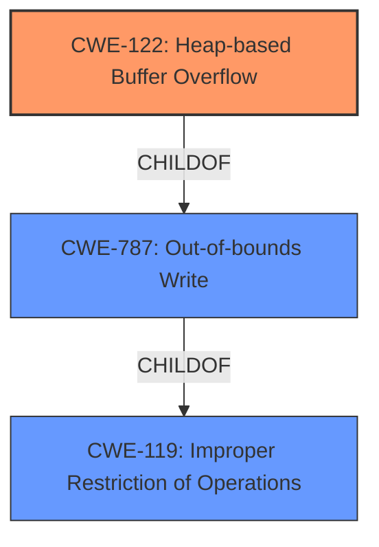

# Analysis Report for CVE-2020-21818

# Vulnerability Analysis Report: CVE-2020-21818

## Description


## Analysis (with Relationship Data)

# Summary
| CWE ID | CWE Name | Confidence | CWE Abstraction Level | CWE Vulnerability Mapping Label | CWE-Vulnerability Mapping Notes |
|---|---|---|---|---|---|
| CWE-122 | Heap-based Buffer Overflow | 1.0 | Variant | Primary | Allowed |
| CWE-787 | Out-of-bounds Write | 0.8 | Base | Secondary | Allowed |
| CWE-119 | Improper Restriction of Operations within the Bounds of a Memory Buffer | 0.6 | Class | Secondary | Discouraged |

## Evidence and Confidence

*   **Confidence Score:** 0.9
*   **Evidence Strength:** HIGH

## Relationship Analysis
The primary CWE is CWE-122, which is a variant of CWE-787 (Out-of-bounds Write), which in turn is a child of CWE-119 (Improper Restriction of Operations within the Bounds of a Memory Buffer). This hierarchy helps to classify the vulnerability with increasing levels of detail. The relationship between these CWEs influenced the selection, opting for the most specific variant (CWE-122) that accurately represents the **heap based buffer overflow**.



## Vulnerability Chain
The vulnerability chain involves a **heap based buffer overflow** (CWE-122) which is a specific type of out-of-bounds write (CWE-787). The initial flaw is the **improper** handling of memory allocation or data writing that leads to writing beyond the allocated buffer in the heap.

## Summary of Analysis
The initial assessment, guided by the vulnerability description and the retriever results, strongly points to CWE-122 (Heap-based Buffer Overflow) as the primary weakness. The description clearly states "**heap based buffer overflow**" and the "CWE for similar CVE Descriptions" lists CWE-787 as the primary match and CWE-787 and CWE-122 are highly rated in the retriever results.

The supporting evidence from the vulnerability description key phrases: "**weakness:** **heap based buffer overflow**" confirms this assessment. The CWE-122 is a variant of CWE-787 (Out-of-bounds Write), offering a more specific classification. CWE-119 (Improper Restriction of Operations within the Bounds of a Memory Buffer) is a more general class that encompasses both CWE-787 and CWE-122.

The selection of CWE-122 is based on the explicit mention of "heap-based buffer overflow" in the vulnerability description, making it the most accurate and specific classification.

Relevant CWE Information:

# Enhanced Context (25 CWEs)

## CWE-681: Incorrect Conversion between Numeric Types
**Abstraction Level**: Base
This CWE was considered but is not applicable because the vulnerability description does not mention any incorrect conversion between numeric types.

## CWE-191: Integer Underflow (Wrap or Wraparound)
**Abstraction Level**: Base
This CWE was considered but is not applicable because the vulnerability description does not mention any integer underflow.

## CWE-680: Integer Overflow to Buffer Overflow
**Abstraction Level**: Compound
This CWE was considered but is not applicable because the vulnerability description does not explicitly state an integer overflow leading to a buffer overflow. It is possible, but not explicitly stated.

## CWE-197: Numeric Truncation Error
**Abstraction Level**: Base
This CWE was considered but is not applicable because the vulnerability description does not mention any numeric truncation errors.

## CWE-131: Incorrect Calculation of Buffer Size
**Abstraction Level**: Base
This CWE was considered but is not applicable because the vulnerability description does not explicitly mention an incorrect calculation of buffer size. It is possible, but not explicitly stated.

## CWE-805: Buffer Access with Incorrect Length Value
**Abstraction Level**: Base
This CWE was considered but is not applicable because the vulnerability description does not explicitly mention an incorrect length value being used for buffer access.

## CWE-195: Signed to Unsigned Conversion Error
**Abstraction Level**: Variant
This CWE was considered but is not applicable because the vulnerability description does not mention any signed to unsigned conversion errors.

## CWE-124: Buffer Underwrite ('Buffer Underflow')
**Abstraction Level**: Base
This CWE was considered but is not applicable because the vulnerability description explicitly mentions a buffer overflow, not an underflow.

## CWE-190: Integer Overflow or Wraparound
**Abstraction Level**: Base
This CWE was considered but is not applicable because the vulnerability description does not explicitly mention any integer overflow or wraparound. It is possible, but not explicitly stated.

## CWE-682: Incorrect Calculation
**Abstraction Level**: Pillar
This CWE was considered but is too high-level and doesn't provide enough specific information about the vulnerability.

## CWE-125: Out-of-bounds Read
**Abstraction Level**: Base
This CWE was considered but is not applicable because the vulnerability description explicitly mentions a buffer overflow (write), not a read.

## CWE-193: Off-by-one Error
**Abstraction Level**: Base
This CWE was considered but is not applicable because the vulnerability description does not explicitly mention an off-by-one error. It is possible, but not explicitly stated.

## CWE-128: Wrap-around Error
**Abstraction Level**: base
This CWE was considered but is not applicable because the vulnerability description does not explicitly mention a wrap-around error.

## CWE-170: Improper Null Termination
**Abstraction Level**: base
This CWE was considered but is not applicable because the vulnerability description does not explicitly mention improper null termination.

## CWE-1284: Improper Validation of Specified Quantity in Input
**Abstraction Level**: base
This CWE was considered but is not applicable because the vulnerability description does not explicitly mention improper validation of specified quantity in input.

## CWE-617: Reachable Assertion
**Abstraction Level**: base
This CWE was considered but is not applicable because the vulnerability description does not explicitly mention a reachable assertion.

## CWE-463: Deletion of Data Structure Sentinel
**Abstraction Level**: base
This CWE was considered but is not applicable because the vulnerability description does not explicitly mention deletion of data structure sentinel.

## CWE-1339: Insufficient Precision or Accuracy of a Real Number
**Abstraction Level**: base
This CWE was considered but is not applicable because the vulnerability description does not explicitly mention insufficient precision or accuracy of a real number.

## CWE-120: Buffer Copy without Checking Size of Input ('Classic Buffer Overflow')
**Abstraction Level**: base
This CWE was considered but CWE-122 is a better fit since the overflow occurs on the heap.

## CWE-787: Out-of-bounds Write
**Abstraction Level**: base
This CWE was considered and included as a secondary CWE since CWE-122 is a specific type of out-of-bounds write.

## CWE-123: Write-what-where Condition
**Abstraction Level**: base
This CWE was considered but is not applicable because the vulnerability description does not explicitly mention a write-what-where condition.


## CWE Relationship Analysis

Current CWEs represent these abstraction levels: .


### Vulnerability Chain Analysis

**Chain starting from CWE-787:**
- 787 (Out-of-bounds Write) - ROOT


**Chain starting from CWE-680:**
- 680 (Integer Overflow to Buffer Overflow) - ROOT


### CWE Relationship Diagram

```mermaid
graph TD
    classDef primary fill:#f96,stroke:#333,stroke-width:2px
    classDef secondary fill:#69f,stroke:#333
    classDef tertiary fill:#9e9,stroke:#333
```


*Report generated on 2025-04-02 04:20:25*
