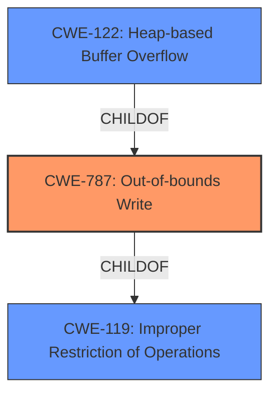

# Analysis for CVE-2020-21819

# Summary
| CWE ID | CWE Name | Confidence | CWE Abstraction Level | CWE Vulnerability Mapping Label | CWE-Vulnerability Mapping Notes |
|---|---|---|---|---|---|
| CWE-787 | Out-of-bounds Write | 1.0 | Base | Allowed | Primary CWE |
| CWE-122 | Heap-based Buffer Overflow | 0.7 | Variant | Allowed | Secondary Candidate |
| CWE-119 | Improper Restriction of Operations within the Bounds of a Memory Buffer | 0.5 | Class | Discouraged | Secondary Candidate |

## Evidence and Confidence

*   **Confidence Score:** 0.9
*   **Evidence Strength:** HIGH

## Relationship Analysis
The primary relationship that influenced my decision was the parent-child relationship between CWE-119 (Improper Restriction of Operations within the Bounds of a Memory Buffer), CWE-787 (Out-of-bounds Write), and CWE-122 (Heap-based Buffer Overflow). CWE-787 and CWE-122 are both children of CWE-119, making them more specific classifications. I chose CWE-787 as the primary because the description explicitly mentions an "out-of-bounds write". CWE-122 was considered a secondary option since the vulnerability is a heap-based buffer overflow, which is a variant of CWE-787.

## Vulnerability Chain
The chain of events is a follows: The program **incorrectly** handles input, leading to an **out-of-bounds write**, which in turn causes a **heap-based buffer overflow**. The root cause is the **improper** input handling, and the direct consequence is the **out-of-bounds write**.

## Summary of Analysis
The initial analysis identified CWE-787 as the primary weakness due to the explicit mention of a "**heap based buffer overflow**" in the vulnerability description, which strongly suggests an **out-of-bounds write**.

The "**weakness:** **heap based buffer overflow**" phrase from the "Vulnerability Description Key Phrases" section further supports this classification. The "CVE Reference Links Content Summary" also confirms the root cause as being a **NULL** pointer dereference which can cause a write to an unexpected memory address.

The selection of CWE-787 is further supported by the "CWE for similar CVE Descriptions" section, which lists CWE-787 as the "Primary CWE Match" and the "Top CWEs".

The graph relationships influenced the decision by highlighting the hierarchical relationship between CWE-119, CWE-787, and CWE-122. This helped to select the most specific and appropriate CWE.

The evidence provided is strong and supports the selection of CWE-787 as the primary weakness, with CWE-122 and CWE-119 as secondary candidates.

The selected CWEs are at the optimal level of specificity because CWE-787 directly describes the **out-of-bounds write** condition, while CWE-122 specifies the heap-based nature of the buffer overflow and CWE-119 represents the more general class of memory boundary errors.

Relevant CWE Information:

# Enhanced Context (25 CWEs)

## CWE-191: Integer Underflow (Wrap or Wraparound)
Not selected as there is no mention of arithmetic operations.

## CWE-805: Buffer Access with Incorrect Length Value
Not selected as the vulnerability description does not indicate an incorrect length value.

## CWE-131: Incorrect Calculation of Buffer Size
Not selected as the vulnerability description does not mention an incorrect calculation of buffer size.

## CWE-681: Incorrect Conversion between Numeric Types
Not selected as the vulnerability description does not mention incorrect conversion between numeric types.

## CWE-197: Numeric Truncation Error
Not selected as the vulnerability description does not indicate numeric truncation error.

## CWE-126: Buffer Over-read
Not selected as the vulnerability description indicates a write rather than a read.

## CWE-124: Buffer Underwrite ('Buffer Underflow')
Not selected as the vulnerability description indicates a write beyond the buffer, not before.

## CWE-127: Buffer Under-read
Not selected as the vulnerability description indicates a write rather than a read.

## CWE-680: Integer Overflow to Buffer Overflow
Not selected as the vulnerability description does not indicate an integer overflow.

## CWE-125: Out-of-bounds Read
Not selected as the vulnerability description indicates a write rather than a read.

## CWE-190: Integer Overflow or Wraparound
Not selected as the vulnerability description does not indicate an integer overflow.

## CWE-193: Off-by-one Error
Not selected as the vulnerability description does not indicate an off-by-one error.

## CWE-128: Wrap-around Error
Not selected as the vulnerability description does not indicate a wrap-around error.

## CWE-170: Improper Null Termination
Not selected as the vulnerability description does not indicate a null termination issue.

## CWE-195: Signed to Unsigned Conversion Error
Not selected as the vulnerability description does not indicate a signed to unsigned conversion error.

## CWE-1284: Improper Validation of Specified Quantity in Input
Not selected as the vulnerability description does not indicate improper validation of specified quantity in input.

## CWE-617: Reachable Assertion
Not selected as the vulnerability description does not indicate a reachable assertion.

## CWE-463: Deletion of Data Structure Sentinel
Not selected as the vulnerability description does not indicate deletion of data structure sentinel.

## CWE-1339: Insufficient Precision or Accuracy of a Real Number
Not selected as the vulnerability description does not indicate insufficient precision or accuracy of a real number.

## CWE-120: Buffer Copy without Checking Size of Input ('Classic Buffer Overflow')
Not selected as the vulnerability description does not explicitly mention a buffer copy operation without checking the size of the input. Though the end result is a buffer overflow, CWE-787 is a better fit because it focuses on the out-of-bounds write directly.