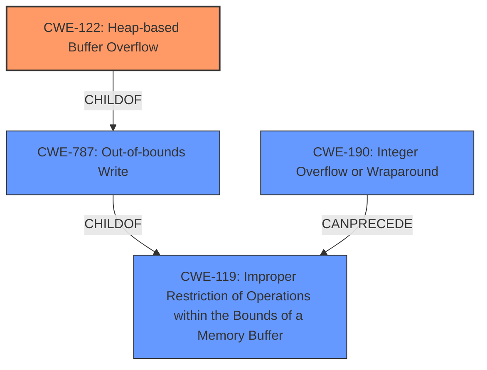

# Enhanced Analysis for CVE-2020-21830

# Summary
| CWE ID | CWE Name | Confidence | CWE Abstraction Level | CWE Vulnerability Mapping Label | CWE-Vulnerability Mapping Notes |
|---|---|---|---|---|---|
| CWE-122 | Heap-based Buffer Overflow | 0.9 | Variant | Allowed | Primary CWE |
| CWE-119 | Improper Restriction of Operations within the Bounds of a Memory Buffer | 0.6 | Class | Discouraged | Secondary Candidate |
| CWE-787 | Out-of-bounds Write | 0.5 | Base | Allowed | Secondary Candidate |
| CWE-190 | Integer Overflow or Wraparound | 0.4 | Base | Allowed | Secondary Candidate |

## Evidence and Confidence

*   **Confidence Score:** 0.9
*   **Evidence Strength:** HIGH

## Relationship Analysis
The primary CWE selected is CWE-122 (Heap-based Buffer Overflow), a Variant of CWE-787 (Out-of-bounds Write), which in turn is a ChildOf CWE-119 (Improper Restriction of Operations within the Bounds of a Memory Buffer). The vulnerability description clearly states a "heap based buffer overflow," making CWE-122 the most specific and appropriate choice. While CWE-119 is a parent, it's too general. CWE-787 is a parent of CWE-122 but less specific. CWE-190 was considered due to potential integer overflow leading to buffer overflows, but there's no direct evidence.



## Vulnerability Chain
The vulnerability chain starts with the **heap-based buffer overflow** (**CWE-122**). This leads to a potential out-of-bounds write (**CWE-787**), which then results in a segmentation fault and application crash. A potential integer overflow (**CWE-190**) could precede the heap overflow if the size of allocation is calculated improperly.

## Summary of Analysis
The initial analysis focused on identifying the most specific CWE that accurately reflected the **heap based buffer overflow** vulnerability. The vulnerability description clearly mentions "**heap based buffer overflow**," which directly corresponds to CWE-122. The "CVE Reference Links Content Summary" confirms this with a "NULL pointer dereference occurs in the `read_2004_compressed_section` function in `decode.c`". The relationship graph shows CWE-122 as a variant of CWE-787, which is a child of CWE-119. Given this evidence, CWE-122 is the most appropriate and specific classification. The choice of CWE-122 is further supported by its "Allowed" usage according to MITRE mapping guidance. While CWE-119 is a parent, it is too broad, and the guidance discourages its usage when more specific options are available.

Relevant CWE Information:
- CWE-122 Heap-based Buffer Overflow

# Enhanced Context (25 CWEs)
The following CWEs were identified as potentially relevant to this vulnerability:

## CWE-191: Integer Underflow (Wrap or Wraparound)
**Abstraction Level**: Base
**Similarity Score**: 0.77

## CWE-681: Incorrect Conversion between Numeric Types
**Abstraction Level**: Base
**Similarity Score**: 0.76

## CWE-197: Numeric Truncation Error
**Abstraction Level**: Base
**Similarity Score**: 0.76

## CWE-195: Signed to Unsigned Conversion Error
**Abstraction Level**: Variant
**Similarity Score**: 0.75

## CWE-194: Unexpected Sign Extension
**Abstraction Level**: Variant
**Similarity Score**: 0.75

## CWE-131: Incorrect Calculation of Buffer Size
**Abstraction Level**: Base
**Similarity Score**: 0.75

## CWE-125: Out-of-bounds Read
**Abstraction Level**: Base
**Similarity Score**: 0.73

## CWE-805: Buffer Access with Incorrect Length Value
**Abstraction Level**: Base
**Similarity Score**: 0.73

## CWE-680: Integer Overflow to Buffer Overflow
**Abstraction Level**: Compound
**Similarity Score**: 0.73

## CWE-124: Buffer Underwrite ('Buffer Underflow')
**Abstraction Level**: Base
**Similarity Score**: 0.73

## CWE-190: Integer Overflow or Wraparound
**Abstraction Level**: Base
**Similarity Score**: 6417.41

## CWE-197: Numeric Truncation Error
**Abstraction Level**: Base
**Similarity Score**: 6394.05

## CWE-681: Incorrect Conversion between Numeric Types
**Abstraction Level**: Base
**Similarity Score**: 6150.57

## CWE-125: Out-of-bounds Read
**Abstraction Level**: Base
**Similarity Score**: 6111.42

## CWE-194: Unexpected Sign Extension
**Abstraction Level**: Variant
**Similarity Score**: 6018.32

## CWE-128: Wrap-around Error
**Abstraction Level**: base
**Similarity Score**: 5.03

## CWE-170: Improper Null Termination
**Abstraction Level**: base
**Similarity Score**: 5.03

## CWE-1284: Improper Validation of Specified Quantity in Input
**Abstraction Level**: base
**Similarity Score**: 4.33

## CWE-617: Reachable Assertion
**Abstraction Level**: base
**Similarity Score**: 4.33

## CWE-123: Write-what-where Condition
**Abstraction Level**: base
**Similarity Score**: 3.89

## CWE-463: Deletion of Data Structure Sentinel
**Abstraction Level**: base
**Similarity Score**: 3.64

## CWE-120: Buffer Copy without Checking Size of Input ('Classic Buffer Overflow')
**Abstraction Level**: base
**Similarity Score**: 3.57

## CWE-1339: Insufficient Precision or Accuracy of a Real Number
**Abstraction Level**: base
**Similarity Score**: 3.57

## CWE-190: Integer Overflow or Wraparound
**Abstraction Level**: Base
**Similarity Score**: 3.31

## CWE-787: Out-of-bounds Write
**Abstraction Level**: base
**Similarity Score**: 3.30


## CWE Relationship Analysis

Current CWEs represent these abstraction levels: .


### Vulnerability Chain Analysis

**Chain starting from CWE-787:**
- 787 (Out-of-bounds Write) - ROOT


**Chain starting from CWE-680:**
- 680 (Integer Overflow to Buffer Overflow) - ROOT


### CWE Relationship Diagram

```mermaid
graph TD
    classDef primary fill:#f96,stroke:#333,stroke-width:2px
    classDef secondary fill:#69f,stroke:#333
    classDef tertiary fill:#9e9,stroke:#333
```