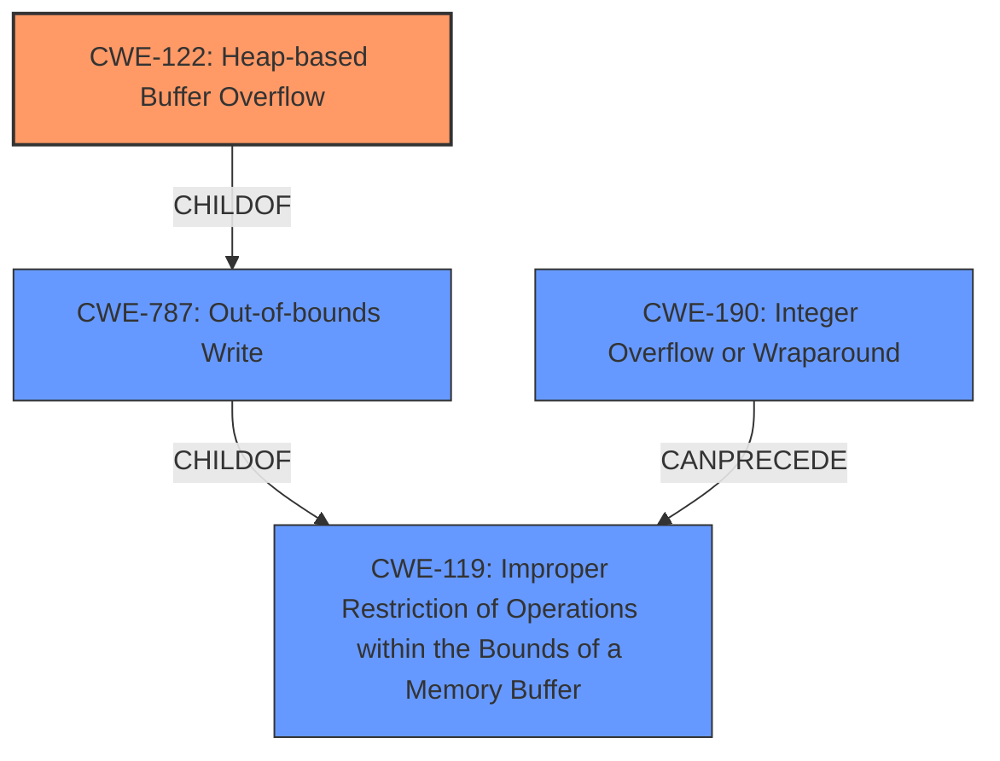

# Analysis for CVE-2020-21830

# Summary
| CWE ID | CWE Name | Confidence | CWE Abstraction Level | CWE Vulnerability Mapping Label | CWE-Vulnerability Mapping Notes |
|---|---|---|---|---|---|
| CWE-122 | Heap-based Buffer Overflow | 0.9 | Variant | Allowed | Primary CWE |
| CWE-119 | Improper Restriction of Operations within the Bounds of a Memory Buffer | 0.6 | Class | Discouraged | Secondary Candidate |
| CWE-787 | Out-of-bounds Write | 0.5 | Base | Allowed | Secondary Candidate |
| CWE-190 | Integer Overflow or Wraparound | 0.4 | Base | Allowed | Secondary Candidate |

## Evidence and Confidence

*   **Confidence Score:** 0.9
*   **Evidence Strength:** HIGH

## Relationship Analysis
The primary CWE selected is CWE-122 (Heap-based Buffer Overflow), a Variant of CWE-787 (Out-of-bounds Write), which in turn is a ChildOf CWE-119 (Improper Restriction of Operations within the Bounds of a Memory Buffer). The vulnerability description clearly states a "heap based buffer overflow," making CWE-122 the most specific and appropriate choice. While CWE-119 is a parent, it's too general. CWE-787 is a parent of CWE-122 but less specific. CWE-190 was considered due to potential integer overflow leading to buffer overflows, but there's no direct evidence.

## Vulnerability Chain
The vulnerability chain starts with the **heap-based buffer overflow** (**CWE-122**). This leads to a potential out-of-bounds write (**CWE-787**), which then results in a segmentation fault and application crash. A potential integer overflow (**CWE-190**) could precede the heap overflow if the size of allocation is calculated improperly.

## Summary of Analysis
The initial analysis focused on identifying the most specific CWE that accurately reflected the **heap based buffer overflow** vulnerability. The vulnerability description clearly mentions "**heap based buffer overflow**," which directly corresponds to CWE-122. The "CVE Reference Links Content Summary" confirms this with a "NULL pointer dereference occurs in the `read_2004_compressed_section` function in `decode.c`". The relationship graph shows CWE-122 as a variant of CWE-787, which is a child of CWE-119. Given this evidence, CWE-122 is the most appropriate and specific classification. The choice of CWE-122 is further supported by its "Allowed" usage according to MITRE mapping guidance. While CWE-119 is a parent, it is too broad, and the guidance discourages its usage when more specific options are available.

Relevant CWE Information:
- CWE-122 Heap-based Buffer Overflow

# Enhanced Context (25 CWEs)
The following CWEs were identified as potentially relevant to this vulnerability:

## CWE-191: Integer Underflow (Wrap or Wraparound)
**Abstraction Level**: Base
**Similarity Score**: 0.77

## CWE-681: Incorrect Conversion between Numeric Types
**Abstraction Level**: Base
**Similarity Score**: 0.76

## CWE-197: Numeric Truncation Error
**Abstraction Level**: Base
**Similarity Score**: 0.76

## CWE-195: Signed to Unsigned Conversion Error
**Abstraction Level**: Variant
**Similarity Score**: 0.75

## CWE-194: Unexpected Sign Extension
**Abstraction Level**: Variant
**Similarity Score**: 0.75

## CWE-131: Incorrect Calculation of Buffer Size
**Abstraction Level**: Base
**Similarity Score**: 0.75

## CWE-125: Out-of-bounds Read
**Abstraction Level**: Base
**Similarity Score**: 0.73

## CWE-805: Buffer Access with Incorrect Length Value
**Abstraction Level**: Base
**Similarity Score**: 0.73

## CWE-680: Integer Overflow to Buffer Overflow
**Abstraction Level**: Compound
**Similarity Score**: 0.73

## CWE-124: Buffer Underwrite ('Buffer Underflow')
**Abstraction Level**: Base
**Similarity Score**: 0.73

## CWE-190: Integer Overflow or Wraparound
**Abstraction Level**: Base
**Similarity Score**: 6417.41

## CWE-197: Numeric Truncation Error
**Abstraction Level**: Base
**Similarity Score**: 6394.05

## CWE-681: Incorrect Conversion between Numeric Types
**Abstraction Level**: Base
**Similarity Score**: 6150.57

## CWE-125: Out-of-bounds Read
**Abstraction Level**: Base
**Similarity Score**: 6111.42

## CWE-194: Unexpected Sign Extension
**Abstraction Level**: Variant
**Similarity Score**: 6018.32

## CWE-128: Wrap-around Error
**Abstraction Level**: base
**Similarity Score**: 5.03

## CWE-170: Improper Null Termination
**Abstraction Level**: base
**Similarity Score**: 5.03

## CWE-1284: Improper Validation of Specified Quantity in Input
**Abstraction Level**: base
**Similarity Score**: 4.33

## CWE-617: Reachable Assertion
**Abstraction Level**: base
**Similarity Score**: 4.33

## CWE-123: Write-what-where Condition
**Abstraction Level**: base
**Similarity Score**: 3.89

## CWE-463: Deletion of Data Structure Sentinel
**Abstraction Level**: base
**Similarity Score**: 3.64

## CWE-120: Buffer Copy without Checking Size of Input ('Classic Buffer Overflow')
**Abstraction Level**: base
**Similarity Score**: 3.57

## CWE-1339: Insufficient Precision or Accuracy of a Real Number
**Abstraction Level**: base
**Similarity Score**: 3.57

## CWE-190: Integer Overflow or Wraparound
**Abstraction Level**: Base
**Similarity Score**: 3.31

## CWE-787: Out-of-bounds Write
**Abstraction Level**: base
**Similarity Score**: 3.30

# Enhanced Query for CVE-2020-21830

## Vulnerability Description
A **heap based buffer overflow** vulneraibility exists in GNU LibreDWG 0.10 via bit_calc_CRC ../../src/bits.c2213.

### Vulnerability Description Key Phrases
- **weakness:** **heap based buffer overflow**
- **product:** GNU LibreDWG
- **version:** 0.10
- **component:** bit_calc_CRC ../../src/bits.c2213

## CVE Reference Links Content Summary
The provided content includes a Github issue report that describes a vulnerability found via fuzzing, which is relevant to the CVE description.

**Root cause of vulnerability:**
A NULL pointer dereference occurs in the `read_2004_compressed_section` function in `decode.c`.

**Weaknesses/vulnerabilities present:**
- Null pointer dereference. The code attempts to read memory from a NULL pointer.

**Impact of exploitation:**
- Segmentation fault (SEGV), leading to a crash of the application.

**Attack vectors:**
- By providing a specially crafted DWG file as input to the `dwgbmp` tool.

**Required attacker capabilities/position:**
- The attacker needs the ability to provide a malicious DWG file to be processed by the vulnerable application. The attacker can do it locally if they have access to the system where the `dwgbmp` tool is executed or remotely if the tool is part of a service that accepts user-provided files.

The provided issue report contains the following additional technical details:
- Specific function call stack at the moment of the crash.
- The crash happened within memcpy
- The location of vulnerable code is `/src/decode.c:2417`
- The PoC causing this crash is available at a specified URL.
- The issue was found by fuzzing.
- The application affected is `dwgbmp`

## Retriever Results

### Top Combined Results

| Rank | CWE ID | Name | Abstraction | Usage  | Retrievers | Individual Scores |
|------|--------|------|-------------|-------|------------|-------------------|
| 1 | 119 | Improper Restriction of Operations within the Bounds of a Memory Buffer | Class | Discouraged | alternate_terms | 0.800 |
| 2 | 190 | Integer Overflow or Wraparound | Base | Allowed | alternate_terms | 0.800 |
| 3 | 122 | Heap-based Buffer Overflow | Variant | Allowed | sparse | 0.199 |
| 4 | 193 | Off-by-one Error | Base | Allowed | sparse | 0.137 |
| 5 | 197 | Numeric Truncation Error | Base | Allowed | sparse | 0.129 |
| 6 | 126 | Buffer Over-read | Variant | Allowed | dense | 0.582 |
| 7 | 128 | Wrap-around Error | Base | Allowed | graph | 0.003 |
| 8 | 125 | Out-of-bounds Read | Base | Allowed | sparse | 0.124 |
| 9 | 194 | Unexpected Sign Extension | Variant | Allowed | sparse | 0.123 |
| 10 | 195 | Signed to Unsigned Conversion Error | Variant | Allowed | sparse | 0.121 |

# Complete CWE Specifications

## CWE-119: Improper Restriction of Operations within the Bounds of a Memory Buffer
**Abstraction:** Class
**Status:** Stable

### Description
The product performs operations on a memory buffer, but it reads from or writes to a memory location outside the buffer's intended boundary. This may result in read or write operations on unexpected memory locations that could be linked to other variables, data structures, or internal program data.

### Extended Description
Not provided

### Alternative Terms
Buffer Overflow: This term has many different meanings to different audiences. From a CWE mapping perspective, this term should be avoided where possible. Some researchers, developers, and tools intend for it to mean "write past the end of a buffer," whereas others use the same term to mean "any read or write outside the boundaries of a buffer, whether before the beginning of the buffer or after the end of the buffer." Others could mean "any action after the end of a buffer, whether it is a read or write." Since the term is commonly used for exploitation and for vulnerabilities, it further confuses things.
buffer overrun: Some prominent vendors and researchers use the term "buffer overrun," but most people use "buffer overflow." See the alternate term for "buffer overflow" for context.
memory safety: Generally used for techniques that avoid weaknesses related to memory access, such as those identified by CWE-119 and its descendants. However, the term is not formal, and there is likely disagreement between practitioners as to which weaknesses are implicitly covered by the "memory safety" term.

### Relationships
ChildOf -> CWE-118
ChildOf -> CWE-20

### Mapping Guidance
**Usage:** Discouraged
**Rationale:** CWE-119 is commonly misused in low-information vulnerability reports when lower-level CWEs could be used instead, or when more details about the vulnerability are available.
**Comments:** Look at CWE-119's children and consider mapping to CWEs such as CWE-787: Out-of-bounds Write, CWE-125: Out-of-bounds Read, or others.
**Reasons:**
- Frequent Misuse

### Additional Notes
**[Applicable Platform]** 

It is possible in any programming languages without memory management support to attempt an operation outside of the bounds of a memory buffer, but the consequences will vary widely depending on the language, platform, and chip architecture.

### Observed Examples
- **CVE-2021-22991:** Incorrect URI normalization in application traffic product leads to buffer overflow, as exploited in the wild per CISA KEV.
- **CVE-2020-29557:** Buffer overflow in Wi-Fi router web interface, as exploited in the wild per CISA KEV.
- **CVE-2009-2550:** Classic stack-based buffer overflow in media player using a long entry in a playlist

## CWE-190: Integer Overflow or Wraparound
**Abstraction:** Base
**Status:** Stable

### Description
The product performs a calculation that can
         produce an integer overflow or wraparound when the logic
         assumes that the resulting value will always be larger than
         the original value. This occurs when an integer value is
         incremented to a value that is too large to store in the
         associated representation. When this occurs, the value may
         become a very small or negative number.

### Extended Description
Not provided

### Alternative Terms
Overflow: The terms "overflow" and "wraparound" are used interchangeably by some people, but they can have more precise distinctions by others. See Terminology Notes.
Wraparound: The terms "overflow" and "wraparound" are used interchangeably by some people, but they can have more precise distinctions by others. See Terminology Notes.
wrap, wrap-around, wrap around: Alternate spellings of "wraparound"

### Relationships
ChildOf -> CWE-682
ChildOf -> CWE-682
ChildOf -> CWE-20
CanPrecede -> CWE-119

### Mapping Guidance
**Usage:** Allowed
**Rationale:** This CWE entry is at the Base level of abstraction, which is a preferred level of abstraction for mapping to the root causes of vulnerabilities.
**Comments:** Be careful of terminology problems with "overflow," "underflow," and "wraparound" - see Terminology Notes. Carefully read both the name and description to ensure that this mapping is an appropriate fit. Do not try to 'force' a mapping to a lower-level Base/Variant simply to comply with this preferred level of abstraction.
**Reasons:**
- Acceptable-Use
**Suggested Alternatives:**
- CWE-191: Integer Underflow (Wrap or Wraparound). Consider CWE-191 when the result is less than the minimum value that can be represented (sometimes called "underflows").

### Additional Notes
**[Relationship]** Integer overflows can be primary to buffer overflows when they cause less memory to be allocated than expected.

**[Terminology]** 

"Integer overflow" is sometimes used to cover several types of errors, including signedness errors, or buffer overflows that involve manipulation of integer data types instead of characters. Part of the confusion results from the fact that 0xffffffff is -1 in a signed context. Other confusion also arises because of the role that integer overflows have in chains.

A "wraparound" is a well-defined, standard behavior that follows specific rules for how to handle situations when the intended numeric value is too large or too small to be represented, as specified in standards such as C11.

"Overflow" is sometimes conflated with "wraparound" but typically indicates a non-standard or undefined behavior.

The "overflow" term is sometimes used to indicate cases where either the maximum or the minimum is exceeded, but others might only use "overflow" to indicate exceeding the maximum while using "underflow" for exceeding the minimum.

Some people use "overflow" to mean any value outside the representable range - whether greater than the maximum, or less than the minimum - but CWE uses "underflow" for cases in which the intended result is less than the minimum.

See [REF-1440] for additional explanation of the ambiguity of terminology.

**[Other]** While there may be circumstances in which the logic intentionally relies on wrapping - such as with modular arithmetic in timers or counters - it can have security consequences if the wrap is unexpected. This is especially the case if the integer overflow can be triggered using user-supplied inputs.

### Observed Examples
- **CVE-2021-43537:** Chain: in a web browser, an unsigned 64-bit integer is forcibly cast to a 32-bit integer (CWE-681) and potentially leading to an integer overflow (CWE-190). If an integer overflow occurs, this can cause heap memory corruption (CWE-122)
- **CVE-2022-21668:** Chain: Python library does not limit the resources used to process images that specify a very large number of bands (CWE-1284), leading to excessive memory consumption (CWE-789) or an integer overflow (CWE-190).
- **CVE-2022-0545:** Chain: 3D renderer has an integer overflow (CWE-190) leading to write-what-where condition (CWE-123) using a crafted image.

## CWE-122: Heap-based Buffer Overflow
**Abstraction:** Variant
**Status:** Draft

### Description
A heap overflow condition is a buffer overflow, where the buffer that can be overwritten is allocated in the heap portion of memory, generally meaning that the buffer was allocated using a routine such as malloc().

### Extended Description
Not provided

### Alternative Terms
None

### Relationships
ChildOf -> CWE-788
ChildOf -> CWE-787

### Mapping Guidance
**Usage:** Allowed
**Rationale:** This CWE entry is at the Variant level of abstraction, which is a preferred level of abstraction for mapping to the root causes of vulnerabilities.
**Comments:** Carefully read both the name and description to ensure that this mapping is an appropriate fit. Do not try to 'force' a mapping to a lower-level Base/Variant simply to comply with this preferred level of abstraction.
**Reasons:**
- Acceptable-Use

### Additional Notes
**[Relationship]** Heap-based buffer overflows are usually just as dangerous as stack-based buffer overflows.

### Observed Examples
- **CVE-2021-43537:** Chain: in a web browser, an unsigned 64-bit integer is forcibly cast to a 32-bit integer (CWE-681) and potentially leading to an integer overflow (CWE-190). If an integer overflow occurs, this can cause heap memory corruption (CWE-122)
- **CVE-2007-4268:** Chain: integer signedness error (CWE-195) passes signed comparison, leading to heap overflow (CWE-122)
- **CVE-2009-2523:** Chain: product does not handle when an input string is not NULL terminated (CWE-170), leading to buffer over-read (CWE-125) or heap-based buffer overflow (CWE-122).

## CWE-193: Off-by-one Error
**Abstraction:** Base
**Status:** Draft

### Description
A product calculates or uses an incorrect maximum or minimum value that is 1 more, or 1 less, than the correct value.

### Extended Description
Not provided

### Alternative Terms
off-by-five: An "off-by-five" error was reported for sudo in 2002 (CVE-2002-0184), but that is more like a "length calculation" error.

### Relationships
ChildOf -> CWE-682
ChildOf -> CWE-682
CanPrecede -> CWE-617
CanPrecede -> CWE-170
CanPrecede -> CWE-119

### Mapping Guidance
**Usage:** Allowed
**Rationale:** This CWE entry is at the Base level of abstraction, which is a preferred level of abstraction for mapping to the root causes of vulnerabilities.
**Comments:** Carefully read both the name and description to ensure that this mapping is an appropriate fit. Do not try to 'force' a mapping to a lower-level Base/Variant simply to comply with this preferred level of abstraction.
**Reasons:**
- Acceptable-Use

### Additional Notes
**[Relationship]** This is not always a buffer overflow. For example, an off-by-one error could be a factor in a partial comparison, a read from the wrong memory location, an incorrect conditional, etc.

### Observed Examples
- **CVE-2003-0252:** Off-by-one error allows remote attackers to cause a denial of service and possibly execute arbitrary code via requests that do not contain newlines.
- **CVE-2001-1391:** Off-by-one vulnerability in driver allows users to modify kernel memory.
- **CVE-2002-0083:** Off-by-one error allows local users or remote malicious servers to gain privileges.

## CWE-197: Numeric Truncation Error
**Abstraction:** Base
**Status:** Incomplete

### Description
Truncation errors occur when a primitive is cast to a primitive of a smaller size and data is lost in the conversion.

### Extended Description
When a primitive is cast to a smaller primitive, the high order bits of the large value are lost in the conversion, potentially resulting in an unexpected value that is not equal to the original value. This value may be required as an index into a buffer, a loop iterator, or simply necessary state data. In any case, the value cannot be trusted and the system will be in an undefined state. While this method may be employed viably to isolate the low bits of a value, this usage is rare, and truncation usually implies that an implementation error has occurred.

### Alternative Terms
None

### Relationships
ChildOf -> CWE-681
ChildOf -> CWE-681
ChildOf -> CWE-681
CanAlsoBe -> CWE-195
CanAlsoBe -> CWE-196
CanAlsoBe -> CWE-192
CanAlsoBe -> CWE-194

### Mapping Guidance
**Usage:** Allowed
**Rationale:** This CWE entry is at the Base level of abstraction, which is a preferred level of abstraction for mapping to the root causes of vulnerabilities.
**Comments:** Carefully read both the name and description to ensure that this mapping is an appropriate fit. Do not try to 'force' a mapping to a lower-level Base/Variant simply to comply with this preferred level of abstraction.
**Reasons:**
- Acceptable-Use

### Additional Notes
**[Research Gap]** This weakness has traditionally been under-studied and under-reported, although vulnerabilities in popular software have been published in 2008 and 2009.

### Observed Examples
- **CVE-2020-17087:** Chain: integer truncation (CWE-197) causes small buffer allocation (CWE-131) leading to out-of-bounds write (CWE-787) in kernel pool, as exploited in the wild per CISA KEV.
- **CVE-2009-0231:** Integer truncation of length value leads to heap-based buffer overflow.
- **CVE-2008-3282:** Size of a particular type changes for 64-bit platforms, leading to an integer truncation in document processor causes incorrect index to be generated.

## CWE-126: Buffer Over-read
**Abstraction:** Variant
**Status:** Draft

### Description
The product reads from a buffer using buffer access mechanisms such as indexes or pointers that reference memory locations after the targeted buffer.

### Extended Description
This typically occurs when the pointer or its index is incremented to a position beyond the bounds of the buffer or when pointer arithmetic results in a position outside of the valid memory location to name a few. This may result in exposure of sensitive information or possibly a crash.

### Alternative Terms
None

### Relationships
ChildOf -> CWE-125
ChildOf -> CWE-788

### Mapping Guidance
**Usage:** Allowed
**Rationale:** This CWE entry is at the Variant level of abstraction, which is a preferred level of abstraction for mapping to the root causes of vulnerabilities.
**Comments:** Carefully read both the name and description to ensure that this mapping is an appropriate fit. Do not try to 'force' a mapping to a lower-level Base/Variant simply to comply with this preferred level of abstraction.
**Reasons:**
- Acceptable-Use

### Additional Notes
**[Relationship]** These problems may be resultant from missing sentinel values (CWE-463) or trusting a user-influenced input length variable.

### Observed Examples
- **CVE-2022-1733:** Text editor has out-of-bounds read past end of line while indenting C code
- **CVE-2014-0160:** Chain: "Heartbleed" bug receives an inconsistent length parameter (CWE-130) enabling an out-of-bounds read (CWE-126), returning memory that could include private cryptographic keys and other sensitive data.
- **CVE-2009-2523:** Chain: product does not handle when an input string is not NULL terminated, leading to buffer over-read or heap-based buffer overflow.

## CWE-128: Wrap-around Error
**Abstraction:** Base
**Status:** Incomplete

### Description
Wrap around errors occur whenever a value is incremented past the maximum value for its type and therefore "wraps around" to a very small, negative, or undefined value.

### Extended Description
Not provided

### Alternative Terms
None

### Relationships
ChildOf -> CWE-682
CanPrecede -> CWE-119
PeerOf -> CWE-190

### Mapping Guidance
**Usage:** Allowed
**Rationale:** This CWE entry is at the Base level of abstraction, which is a preferred level of abstraction for mapping to the root causes of vulnerabilities.
**Comments:** Carefully read both the name and description to ensure that this mapping is an appropriate fit. Do not try to 'force' a mapping to a lower-level Base/Variant simply to comply with this preferred level of abstraction.
**Reasons:**
- Acceptable-Use

### Additional Notes
**[Relationship]** The relationship between overflow and wrap-around needs to be examined more closely, since several entries (including CWE-190) are closely related.

## CWE-125: Out-of-bounds Read
**Abstraction:** Base
**Status:** Draft

### Description
The product reads data past the end, or before the beginning, of the intended buffer.

### Extended Description
Not provided

### Alternative Terms
OOB read: Shorthand for "Out of bounds" read

### Relationships
ChildOf -> CWE-119
ChildOf -> CWE-119
ChildOf -> CWE-119
ChildOf -> CWE-119

### Mapping Guidance
**Usage:** Allowed
**Rationale:** This CWE entry is at the Base level of abstraction, which is a preferred level of abstraction for mapping to the root causes of vulnerabilities.
**Comments:** Carefully read both the name and description to ensure that this mapping is an appropriate fit. Do not try to 'force' a mapping to a lower-level Base/Variant simply to comply with this preferred level of abstraction.
**Reasons:**
- Acceptable-Use

### Observed Examples
- **CVE-2023-1018:** The reference implementation code for a Trusted Platform Module does not implement length checks on data, allowing for an attacker to read 2 bytes past the end of a buffer.
- **CVE-2020-11899:** Out-of-bounds read in IP stack used in embedded systems, as exploited in the wild per CISA KEV.
- **CVE-2014-0160:** Chain: "Heartbleed" bug receives an inconsistent length parameter (CWE-130) enabling an out-of-bounds read (CWE-126), returning memory that could include private cryptographic keys and other sensitive data.

## CWE-194: Unexpected Sign Extension
**Abstraction:** Variant
**Status:** Incomplete

### Description
The product performs an operation on a number that causes it to be sign extended when it is transformed into a larger data type. When the original number is negative, this can produce unexpected values that lead to resultant weaknesses.

### Extended Description
Not provided

### Alternative Terms
None

### Relationships
ChildOf -> CWE-681
ChildOf -> CWE-681
ChildOf -> CWE-681

### Mapping Guidance
**Usage:** Allowed
**Rationale:** This CWE entry is at the Variant level of abstraction, which is a preferred level of abstraction for mapping to the root causes of vulnerabilities.
**Comments:** Carefully read both the name and description to ensure that this mapping is an appropriate fit. Do not try to 'force' a mapping to a lower-level Base/Variant simply to comply with this preferred level of abstraction.
**Reasons:**
- Acceptable-Use

### Additional Notes
**[Relationship]** Sign extension errors can lead to buffer overflows and other memory-based problems. They are also likely to be factors in other weaknesses that are not based on memory operations, but rely on numeric calculation.

**[Maintenance]** This entry is closely associated with signed-to-unsigned conversion errors (CWE-195) and other numeric errors. These relationships need to be more closely examined within CWE.

### Observed Examples
- **CVE-2018-10887:** Chain: unexpected sign extension (CWE-194) leads to integer overflow (CWE-190), causing an out-of-bounds read (CWE-125)
- **CVE-1999-0234:** Sign extension error produces -1 value that is treated as a command separator, enabling OS command injection.
- **CVE-2003-0161:** Product uses "char" type for input character. When char is implemented as a signed type, ASCII value 0xFF (255), a sign extension produces a -1 value that is treated as a program-specific separator value, effectively disabling a length check and leading to a buffer overflow. This is also a multiple interpretation error.

## CWE-195: Signed to Unsigned Conversion Error
**Abstraction:** Variant
**Status:** Draft

### Description
The product uses a signed primitive and performs a cast to an unsigned primitive, which can produce an unexpected value if the value of the signed primitive can not be represented using an unsigned primitive.

### Extended Description

It is dangerous to rely on implicit casts between signed and unsigned numbers because the result can take on an unexpected value and violate assumptions made by the program.

Often, functions will return negative values to indicate a failure. When the result of a function is to be used as a size parameter, using these negative return values can have unexpected results. For example, if negative size values are passed to the standard memory copy or allocation functions they will be implicitly cast to a large unsigned value. This may lead to an exploitable buffer overflow or underflow condition.

### Alternative Terms
None

### Relationships
ChildOf -> CWE-681
ChildOf -> CWE-681
ChildOf -> CWE-681
CanPrecede -> CWE-119

### Mapping Guidance
**Usage:** Allowed
**Rationale:** This CWE entry is at the Variant level of abstraction, which is a preferred level of abstraction for mapping to the root causes of vulnerabilities.
**Comments:** Carefully read both the name and description to ensure that this mapping is an appropriate fit. Do not try to 'force' a mapping to a lower-level Base/Variant simply to comply with this preferred level of abstraction.
**Reasons:**
- Acceptable-Use

### Observed Examples
- **CVE-2007-4268:** Chain: integer signedness error (CWE-195) passes signed comparison, leading to heap overflow (CWE-122)

