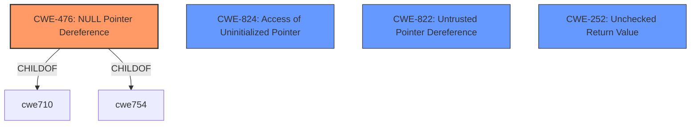

# Raw Analyzer Response for CVE-2020-21834

# Summary
| CWE ID | CWE Name | Confidence | CWE Abstraction Level | CWE Vulnerability Mapping Label | CWE-Vulnerability Mapping Notes |
|---|---|---|---|---|---|
| CWE-476 | NULL Pointer Dereference | 1.0 | Base | Allowed | Primary CWE |

## Evidence and Confidence

*   **Confidence Score:** 1.0
*   **Evidence Strength:** HIGH

## Relationship Analysis
The primary relationship that influenced the decision was the direct match of the vulnerability description to the definition of CWE-476, **NULL Pointer Dereference**. The other CWEs, while related to memory and pointers, did not directly address the **null pointer dereference** as the root cause.

## Vulnerability Chain
The vulnerability chain is straightforward: a malformed DWG file leads to a **NULL pointer dereference** in the `read_2004_compressed_section` function, resulting in a program crash and denial of service.

## Summary of Analysis
The analysis is primarily based on the provided evidence, which clearly indicates a **NULL pointer dereference** as the root cause. The vulnerability description explicitly mentions "null pointer deference," and the CVE reference links confirm this, stating that the vulnerability is a **NULL pointer dereference** in the `read_2004_compressed_section` function.

The graph relationships reinforced the directness of the CWE-476 mapping. While other CWEs like CWE-824, CWE-822, and CWE-252 were considered, they represent different types of pointer-related issues and were not as directly relevant as CWE-476.

The selected CWE is at the optimal level of specificity because it precisely describes the root cause of the vulnerability, which is the dereferencing of a NULL pointer.

# Enhanced Context (25 CWEs)
The following CWEs were identified as potentially relevant to this vulnerability:

## CWE-476: NULL Pointer Dereference
**Abstraction Level**: Base
**Similarity Score**: 0.79
**Source**: dense

**Description**:
The product dereferences a pointer that it expects to be valid but is NULL.

**Mapping Guidance**:
- Usage: Allowed
- Rationale: This CWE entry is at the Base level of abstraction, which is a preferred level of abstraction for mapping to the root causes of vulnerabilities.

## CWE-824: Access of Uninitialized Pointer
**Abstraction Level**: Base
**Similarity Score**: 0.78
**Source**: dense

**Description**:
The product accesses or uses a pointer that has not been initialized.

**Mapping Guidance**:
- Usage: Allowed
- Rationale: This CWE entry is at the Base level of abstraction, which is a preferred level of abstraction for mapping to the root causes of vulnerabilities.

## CWE-822: Untrusted Pointer Dereference
**Abstraction Level**: Base
**Similarity Score**: 0.78
**Source**: dense

**Description**:
The product obtains a value from an untrusted source, converts this value to a pointer, and dereferences the resulting pointer.

**Mapping Guidance**:
- Usage: Allowed
- Rationale: This CWE entry is at the Base level of abstraction, which is a preferred level of abstraction for mapping to the root causes of vulnerabilities.

## CWE-252: Unchecked Return Value
**Abstraction Level**: Base
**Similarity Score**: 0.78
**Source**: dense

**Description**:
The product does not check the return value from a method or function, which can prevent it from detecting unexpected states and conditions.

**Mapping Guidance**:
- Usage: Allowed
- Rationale: This CWE entry is at the Base level of abstraction, which is a preferred level of abstraction for mapping to the root causes of vulnerabilities.

**CWE-476: NULL Pointer Dereference**

*   **How the vulnerability's details match the CWE's characteristics:** The vulnerability description explicitly states a **"null pointer deference"** issue. The CVE reference links confirm that the root cause is a **NULL pointer dereference** in the `read_2004_compressed_section` function. This directly aligns with CWE-476's description: "The product dereferences a pointer that it expects to be valid but is NULL."
*   **The security implications and potential impact:** The program crashes due to a segmentation fault (SEGV), leading to a denial of service.
*   **Any parent-child relationships or chain patterns that influenced your mapping:** CWE-476 is a base-level CWE.
*   **Whether the weakness is primary or secondary in the vulnerability:** The **NULL pointer dereference** is the primary weakness and the direct cause of the crash.
*   **How the official MITRE mapping guidance influenced your decision:** The MITRE mapping guidance for CWE-476 allows its usage and states that it is a preferred level of abstraction.

**CWE-824: Access of Uninitialized Pointer**

*   Considered but not used because the root cause is not accessing an uninitialized pointer, but rather dereferencing a pointer that is explicitly NULL.

**CWE-822: Untrusted Pointer Dereference**

*   Considered but not used because the pointer being dereferenced is not necessarily obtained from an untrusted source, but becomes NULL due to other program logic.

**CWE-252: Unchecked Return Value**

*   Considered but not used because there is no evidence of an unchecked return value leading to a NULL pointer in the description.