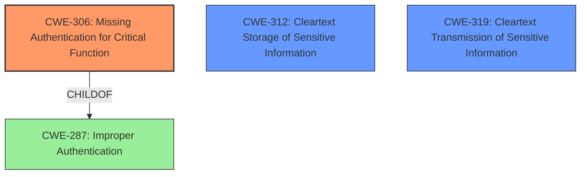

# Enhanced Analysis for CVE-2020-21934

# Summary
| CWE ID | CWE Name | Confidence | CWE Abstraction Level | CWE Vulnerability Mapping Label | CWE-Vulnerability Mapping Notes |
|---|---|---|---|---|---|
| CWE-306 | Missing Authentication for Critical Function | 1.0 | Base | Allowed | Primary CWE |
| CWE-312 | Cleartext Storage of Sensitive Information | 0.7 | Base | Allowed | Secondary Candidate |
| CWE-319 | Cleartext Transmission of Sensitive Information | 0.7 | Base | Allowed | Secondary Candidate |

## Evidence and Confidence

*   **Confidence Score:** 0.9
*   **Evidence Strength:** HIGH

## Relationship Analysis
The primary CWE selected is CWE-306, which is a Base level CWE and a child of CWE-287 (Improper Authentication). CWE-306 is more specific than its parent, as it focuses on the absence of authentication for critical functions, aligning with the vulnerability description. CWE-312 and CWE-319 are related to the impact of the vulnerability (sensitive information exposure), but CWE-306 directly reflects the root cause which is the missing authentication. The other CWEs listed, such as CWE-78, CWE-425, and CWE-287, are not as directly relevant to the root cause, which is the lack of authentication.



## Vulnerability Chain
The vulnerability chain starts with the **missing authentication** for the Syslog download function (CWE-306). This leads to unauthorized access to the Syslog file. The Syslog file contains sensitive information, including admin passwords and private keys in plain text (CWE-312) and is transmitted in cleartext (CWE-319).

## Summary of Analysis
The initial analysis focused on identifying the root cause of the vulnerability. The description clearly indicates that the Syslog download function lacks proper authentication checks, allowing unauthorized access.

The evidence from the "CVE Reference Links Content Summary" section is sufficient and states:
*   "The vulnerability stems from the **lack of proper authentication checks** when accessing the `/HNAP1/GetDownLoadSyslog` endpoint."
*   "**Weakness**: Insufficient access control and authentication."
*   "An attacker can download the router's system logs **without proper authentication**."
*   "The logs reveal **plaintext passwords and private keys**."

The graph relationships confirm that CWE-306 is a specific type of improper authentication (CWE-287). While CWE-312 and CWE-319 describe the impact of the vulnerability (exposure of sensitive information), CWE-306 directly addresses the root cause of the authentication bypass.

Therefore, CWE-306 is the most appropriate and specific CWE to describe this vulnerability.

**CWE-78: Improper Neutralization of Special Elements used in an OS Command ('OS Command Injection')** - This CWE was considered, but it does not fit the vulnerability because the issue is not related to OS command injection. The vulnerability is about bypassing authentication to download the Syslog file.

**CWE-425: Direct Request ('Forced Browsing')** - This CWE was considered, but it is also not the best fit. While the attack involves a direct request to the `/HNAP1/GetDownLoadSyslog` endpoint, the underlying issue is the missing authentication for that endpoint, making CWE-306 a more accurate representation of the root cause.

**CWE-287: Improper Authentication** - This CWE is a parent of CWE-306 and is too general. CWE-306 is more specific as it identifies the missing authentication.

**CWE-522: Insufficiently Protected Credentials** - This CWE was considered, but it is more relevant to cases where credentials are transmitted or stored insecurely. While the Syslog file contains sensitive information, including passwords, the primary issue is the lack of authentication to access the file in the first place.

**CWE-312: Cleartext Storage of Sensitive Information** and **CWE-319: Cleartext Transmission of Sensitive Information** - These are secondary to CWE-306 because they are a consequence of the missing authentication.

I am very confident (Confidence Score: 0.9) that CWE-306 accurately represents the root cause of this vulnerability.


## CWE Relationship Analysis

Current CWEs represent these abstraction levels: .


### Vulnerability Chain Analysis

**Chain starting from CWE-306:**
- 306 (Missing Authentication for Critical Function) - ROOT


**Chain starting from CWE-312:**
- 312 (Cleartext Storage of Sensitive Information) - ROOT


### CWE Relationship Diagram

```mermaid
graph TD
    classDef primary fill:#f96,stroke:#333,stroke-width:2px
    classDef secondary fill:#69f,stroke:#333
    classDef tertiary fill:#9e9,stroke:#333
```