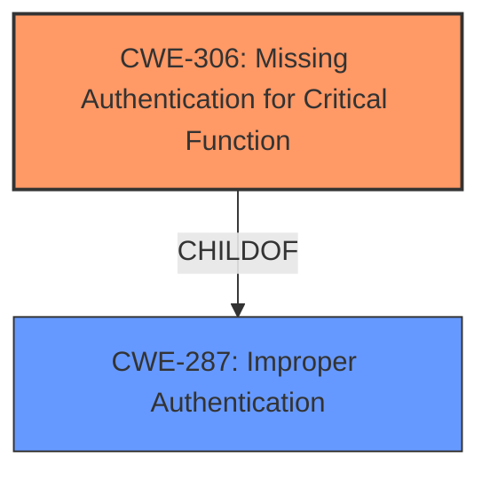

# Analysis Report for CVE-2020-21991

# Vulnerability Analysis Report: CVE-2020-21991

## Description


## Analysis (with Relationship Data)

# Summary
| CWE ID | CWE Name | Confidence | CWE Abstraction Level | CWE Vulnerability Mapping Label | CWE-Vulnerability Mapping Notes |
|---|---|---|---|---|---|
| CWE-306 | Missing Authentication for Critical Function | 1.0 | Base | Primary | Allowed |
| CWE-287 | Improper Authentication | 0.7 | Class | Secondary | Discouraged |

## Evidence and Confidence

*   **Confidence Score:** 0.9
*   **Evidence Strength:** HIGH

## Relationship Analysis
The primary CWE is CWE-306, which is a base-level CWE indicating a **missing authentication** check. This aligns with the vulnerability description stating a "**missing control check**" that leads to an **authentication bypass**. CWE-306 is a child of the class-level CWE-287 (Improper Authentication). While CWE-287 broadly applies, CWE-306 provides a more specific description of the vulnerability, focusing on the absence of authentication rather than a flaw in the authentication process itself. Thus, CWE-306 is the appropriate choice.



## Vulnerability Chain
The vulnerability chain starts with the **missing control check** (CWE-306), which leads to an **authentication bypass**. This allows an unauthenticated attacker to access the management interface with admin privileges.
- **Root Cause:** CWE-306: Missing Authentication for Critical Function
- **Impact:** Authentication Bypass, Privilege Escalation

## Summary of Analysis
The analysis concludes that CWE-306 (Missing Authentication for Critical Function) is the most appropriate primary CWE for this vulnerability. This decision is based on the evidence from the vulnerability description, which explicitly mentions a "**missing control check**" when directly calling the autologin GET parameter. The CVE Reference Links Content Summary also highlights the **missing access control** as a core issue.

The Retriever Results also list CWE-306 as a top candidate. While CWE-287 (Improper Authentication) is also listed, it is a more general class-level CWE. The mapping guidance for CWE-287 discourages its use when lower-level CWE entries are applicable, suggesting CWE-306 as a possible alternative. Given the specific nature of the vulnerability—the complete absence of authentication for a critical function—CWE-306 is the more accurate choice.

The selection of CWE-306 is at the optimal level of specificity because it directly reflects the **root cause** of the vulnerability: the **missing authentication** check. This is a base-level CWE, which is preferred for mapping to the root causes of vulnerabilities.

Relevant CWE Information:

# Enhanced Context (25 CWEs)
The following CWEs were identified as potentially relevant to this vulnerability:

## CWE-305: Authentication Bypass by Primary Weakness
**Abstraction Level**: Base
**Similarity Score**: 0.80
**Source**: dense

**Description**:
The authentication algorithm is sound, but the implemented mechanism can be bypassed as the result of a separate weakness that is primary to the authentication error.

**Mapping Guidance**:
- Usage: Allowed
- Rationale: This CWE entry is at the Base level of abstraction, which is a preferred level of abstraction for mapping to the root causes of vulnerabilities.

## CWE-302: Authentication Bypass by Assumed-Immutable Data
**Abstraction Level**: Base
**Similarity Score**: 0.80
**Source**: dense

**Description**:
The authentication scheme or implementation uses key data elements that are assumed to be immutable, but can be controlled or modified by the attacker.

**Mapping Guidance**:
- Usage: Allowed
- Rationale: This CWE entry is at the Base level of abstraction, which is a preferred level of abstraction for mapping to the root causes of vulnerabilities.

## CWE-288: Authentication Bypass Using an Alternate Path or Channel
**Abstraction Level**: Base
**Similarity Score**: 0.79
**Source**: dense

**Description**:
The product requires authentication, but the product has an alternate path or channel that does not require authentication.

**Mapping Guidance**:
- Usage: Allowed
- Rationale: This CWE entry is at the Base level of abstraction, which is a preferred level of abstraction for mapping to the root causes of vulnerabilities.

## CWE-303: Incorrect Implementation of Authentication Algorithm
**Abstraction Level**: Base
**Similarity Score**: 0.79
**Source**: dense

**Description**:
The requirements for the product dictate the use of an established authentication algorithm, but the implementation of the algorithm is incorrect.

**Mapping Guidance**:
- Usage: Allowed
- Rationale: This CWE entry is at the Base level of abstraction, which is a preferred level of abstraction for mapping to the root causes of vulnerabilities.

## CWE-290: Authentication Bypass by Spoofing
**Abstraction Level**: Base
**Similarity Score**: 0.78
**Source**: dense

**Description**:
This attack-focused weakness is caused by incorrectly implemented authentication schemes that are subject to spoofing attacks.

**Mapping Guidance**:
- Usage: Allowed
- Rationale: This CWE entry is at the Base level of abstraction, which is a preferred level of abstraction for mapping to the root causes of vulnerabilities.

## CWE-289: Authentication Bypass by Alternate Name
**Abstraction Level**: Base
**Similarity Score**: 0.78
**Source**: dense

**Description**:
The product performs authentication based on the name of a resource being accessed, or the name of the actor performing the access, but it does not properly check all possible names for that resource or actor.

**Mapping Guidance**:
- Usage: Allowed
- Rationale: This CWE entry is at the Base level of abstraction, which is a preferred level of abstraction for mapping to the root causes of vulnerabilities.

## CWE-1390: Weak Authentication
**Abstraction Level**: Class
**Similarity Score**: 0.78
**Source**: dense

**Description**:
The product uses an authentication mechanism to restrict access to specific users or identities, but the mechanism does not sufficiently prove that the claimed identity is correct.

**Mapping Guidance**:
- Usage: Allowed-with-Review
- Rationale: This CWE entry is a Class and might have Base-level children that would be more appropriate

## CWE-1391: Use of Weak Credentials
**Abstraction Level**: Class
**Similarity Score**: 0.78
**Source**: dense

**Description**:
The product uses weak credentials (such as a default key or hard-coded password) that can be calculated, derived, reused, or guessed by an attacker.

**Mapping Guidance**:
- Usage: Allowed-with-Review
- Rationale: This CWE entry is a Class and might have Base-level children that would be more appropriate

## CWE-472: External Control of Assumed-Immutable Web Parameter
**Abstraction Level**: Base
**Similarity Score**: 0.78
**Source**: dense

**Description**:
The web application does not sufficiently verify inputs that are assumed to be immutable but are actually externally controllable, such as hidden form fields.

**Mapping Guidance**:
- Usage: Allowed
- Rationale: This CWE entry is at the Base level of abstraction, which is a preferred level of abstraction for mapping to the root causes of vulnerabilities.

## CWE-807: Reliance on Untrusted Inputs in a Security Decision
**Abstraction Level**: Base
**Similarity Score**: 0.78
**Source**: dense

**Description**:
The product uses a protection mechanism that relies on the existence or values of an input, but the input can be modified by an untrusted actor in a way that bypasses the protection mechanism.

**Mapping Guidance**:
- Usage: Allowed
- Rationale: This CWE entry is at the Base level of abstraction, which is a preferred level of abstraction for mapping to the root causes of vulnerabilities.

## CWE-639: Authorization Bypass Through User-Controlled Key
**Abstraction Level**: Base
**Similarity Score**: 5528.98
**Source**: sparse

**Description**:
The system's authorization functionality does not prevent one user from gaining access to another user's data or record by modifying the key value identifying the data.

**Mapping Guidance**:
- Usage: Allowed
- Rationale: This CWE entry is at the Base level of abstraction, which is a preferred level of abstraction for mapping to the root causes of vulnerabilities.

## CWE-1390: Weak Authentication
**Abstraction Level**: Class
**Similarity Score**: 5312.07
**Source**: sparse

**Description**:
The product uses an authentication mechanism to restrict access to specific users or identities, but the mechanism does not sufficiently prove that the claimed identity is correct.

**Mapping Guidance**:
- Usage: Allowed-with-Review
- Rationale: This CWE entry is a Class and might have Base-level children that would be more appropriate

## CWE-472: External Control of Assumed-Immutable Web Parameter
**


## CWE Relationship Analysis

Current CWEs represent these abstraction levels: .


### Vulnerability Chain Analysis

**Chain starting from CWE-288:**
- 288 (Authentication Bypass Using an Alternate Path or Channel) - ROOT


**Chain starting from CWE-306:**
- 306 (Missing Authentication for Critical Function) - ROOT


### CWE Relationship Diagram

```mermaid
graph TD
    classDef primary fill:#f96,stroke:#333,stroke-width:2px
    classDef secondary fill:#69f,stroke:#333
    classDef tertiary fill:#9e9,stroke:#333
```


*Report generated on 2025-04-02 15:59:14*
