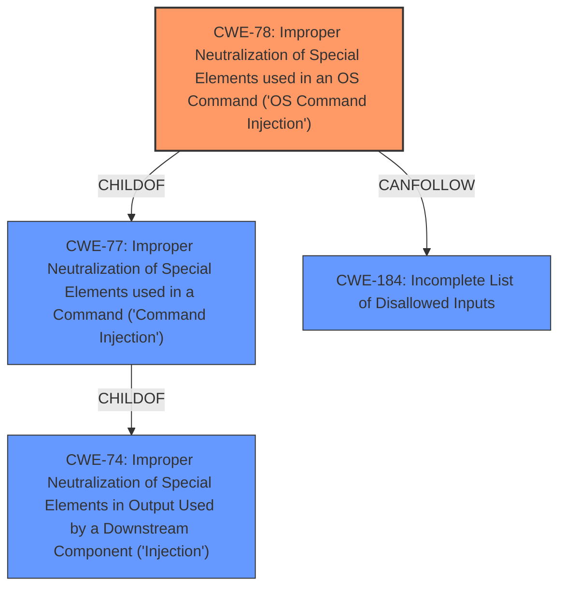

# Analysis for CVE-2020-21992

# Summary
| CWE ID | CWE Name | Confidence | CWE Abstraction Level | CWE Vulnerability Mapping Label | CWE-Vulnerability Mapping Notes |
|---|---|---|---|---|---|
| CWE-78 | Improper Neutralization of Special Elements used in an OS Command ('OS Command Injection') | 1.0 | Base | Allowed | Primary CWE |
| CWE-184 | Incomplete List of Disallowed Inputs | 0.7 | Base | Allowed | Secondary Candidate |

## Evidence and Confidence

*   **Confidence Score:** 1.0
*   **Evidence Strength:** HIGH

## Relationship Analysis
The primary relationship that influenced my decision was the ChildOf relationship between CWE-78 and CWE-77. Although CWE-77 was a high scoring match from the Retriever, the vulnerability specifically involves OS commands, making the more specific CWE-78 a better fit. The relationship between CWE-184 and CWE-78 was also considered. CWE-184 can precede CWE-78, indicating a potential chain where an incomplete list of disallowed inputs leads to OS command injection.

## Vulnerability Chain
The vulnerability chain starts with the **par POST parameter not being sanitized** (likely leading to CWE-184), which then allows for **command injection** (CWE-78). This allows an attacker to execute system commands as the root user.

## Summary of Analysis
The initial analysis identified **command injection** as a key weakness. The Retriever results and graph relationships further refined this to OS Command Injection (CWE-78), as the commands are being executed at the OS level. The vulnerability description clearly states that the **par POST parameter not being sanitized** is the root cause, and the CVE Reference Links Content Summary confirms that the `web.cgi` binary uses the `system()` function with unsanitized input. This, combined with the usage of `mailx` and a format string vulnerability, allows an attacker to execute arbitrary commands. CWE-78 is the most specific and appropriate CWE to represent this vulnerability. The possibility of an incomplete list of disallowed inputs (CWE-184) contributing to the vulnerability was also considered.

The evidence for CWE-78 is:
*   Vulnerability Description Key Phrases: "**weakness:** **command injection**"
*   Vulnerability Description: "suffers from an authenticated remote **command injection** vulnerability"
*   CVE Reference Links Content Summary: "**Remote Command Injection:**  The primary vulnerability is the ability to inject and execute arbitrary operating system commands."
*   CVE Reference Links Content Summary: "The `web.cgi` binary (an ARM executable) uses the `system()` function to execute commands via the `mailx` service."

Relevant CWE Information:

# Enhanced Context (25 CWEs)
The following CWEs were identified as potentially relevant to this vulnerability:

## CWE-1289: Improper Validation of Unsafe Equivalence in Input
**Abstraction Level**: Base
**Similarity Score**: 0.75

## CWE-74: Improper Neutralization of Special Elements in Output Used by a Downstream Component ('Injection')
**Abstraction Level**: Class
**Similarity Score**: 0.75

## CWE-184: Incomplete List of Disallowed Inputs
**Abstraction Level**: Base
**Similarity Score**: 0.74

## CWE-138: Improper Neutralization of Special Elements
**Abstraction Level**: Class
**Similarity Score**: 0.74

## CWE-183: Permissive List of Allowed Inputs
**Abstraction Level**: Base
**Similarity Score**: 0.73

## CWE-807: Reliance on Untrusted Inputs in a Security Decision
**Abstraction Level**: Base
**Similarity Score**: 0.73

## CWE-41: Improper Resolution of Path Equivalence
**Abstraction Level**: Base
**Similarity Score**: 0.73

## CWE-73: External Control of File Name or Path
**Abstraction Level**: Base
**Similarity Score**: 0.72

## CWE-23: Relative Path Traversal
**Abstraction Level**: Base
**Similarity Score**: 0.71

## CWE-653: Improper Isolation or Compartmentalization
**Abstraction Level**: Class
**Similarity Score**: 0.71

## CWE-88: Improper Neutralization of Argument Delimiters in a Command ('Argument Injection')
**Abstraction Level**: Base
**Similarity Score**: 9723.33

## CWE-22: Improper Limitation of a Pathname to a Restricted Directory ('Path Traversal')
**Abstraction Level**: Base
**Similarity Score**: 9641.64

## CWE-184: Incomplete List of Disallowed Inputs
**Abstraction Level**: Base
**Similarity Score**: 9442.51

## CWE-138: Improper Neutralization of Special Elements
**Abstraction Level**: Class
**Similarity Score**: 9411.25

## CWE-116: Improper Encoding or Escaping of Output
**Abstraction Level**: Class
**Similarity Score**: 9358.98

## CWE-78: Improper Neutralization of Special Elements used in an OS Command ('OS Command Injection')
**Abstraction Level**: base
**Similarity Score**: 5.03

**CWE-78 Chosen:** The vulnerability involves injecting operating system commands, aligning precisely with the description of CWE-78. The **par POST parameter not being sanitized** allows an attacker to inject commands that are then executed by the system. This directly corresponds to the improper neutralization of special elements used in an OS command.

## CWE-98: Improper Control of Filename for Include/Require Statement in PHP Program ('PHP Remote File Inclusion')
**Abstraction Level**: variant
**Similarity Score**: 4.53

## CWE-94: Improper Control of Generation of Code ('Code Injection')
**Abstraction Level**: base
**Similarity Score**: 4.33

## CWE-79: Improper Neutralization of Input During Web Page Generation ('Cross-site Scripting')
**Abstraction Level**: base
**Similarity Score**: 4.33

## CWE-434: Unrestricted Upload of File with Dangerous Type
**Abstraction Level**: base
**Similarity Score**: 4.33

## CWE-22: Improper Limitation of a Pathname to a Restricted Directory ('Path Traversal')
**Abstraction Level**: base
**Similarity Score**: 4.33

## CWE-770: Allocation of Resources Without Limits or Throttling
**Abstraction Level**: base
**Similarity Score**: 4.33

## CWE-190: Integer Overflow or Wraparound
**Abstraction Level**: base
**Similarity Score**: 4.33

## CWE-88: Improper Neutralization of Argument Delimiters in a Command ('Argument Injection')
**Abstraction Level**: base
**Similarity Score**: 3.64

## CWE-426: Untrusted Search Path
**Abstraction Level**: base
**Similarity Score**: 3.64

CWE-77 (Improper Neutralization of Special Elements used in a Command ('Command Injection')) was considered but not chosen as CWE-78 is more specific because the command is an OS command. Other CWEs such as CWE-22, CWE-79, and CWE-89 were considered but did not match the specifics of the vulnerability, which clearly involves OS command execution rather than file path manipulation, web page generation, or SQL command construction. Also, code injection CWE-94 was not selected because it wasn't constructing a new code segment.
CWE-184 (Incomplete List of Disallowed Inputs) was considered as a secondary weakness because the root cause of the vulnerability is the **par POST parameter not being sanitized**, which may be because the denylist is incomplete.