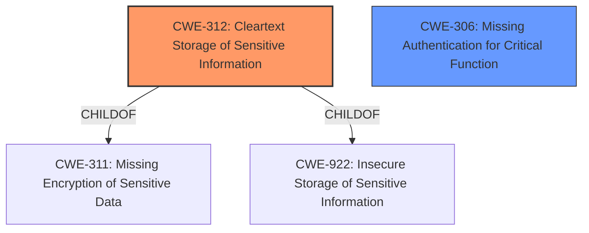

# Raw Analyzer Response for CVE-2020-21994

# Summary
| CWE ID | CWE Name | Confidence | CWE Abstraction Level | CWE Vulnerability Mapping Label | CWE-Vulnerability Mapping Notes |
|---|---|---|---|---|---|
| CWE-312 | Cleartext Storage of Sensitive Information | 1.0 | Base | Primary | Allowed |
| CWE-306 | Missing Authentication for Critical Function | 0.75 | Base | Secondary | Allowed |

## Evidence and Confidence

*   **Confidence Score:** 0.9
*   **Evidence Strength:** HIGH

## Relationship Analysis
The primary relationship that influenced the selection was the parent-child relationship. CWE-312 [Cleartext Storage of Sensitive Information] is a child of CWE-311 [Missing Encryption of Sensitive Data] and CWE-922 [Insecure Storage of Sensitive Information]. Because the vulnerability involves storing credentials in cleartext, CWE-312 is a more specific and appropriate choice than its parents. CWE-306 [Missing Authentication for Critical Function] is included because the unprotected directory lacks authentication, which is a separate but related weakness.

## Vulnerability Chain
The vulnerability chain starts with the **cleartext storage** of administrative login credentials in an XML file. This leads to **inadequate access control** because the directory is unprotected. This allows an unauthenticated attacker to access the file and leads to **authentication bypass**.

## Summary of Analysis
The analysis is based on the provided evidence, specifically the "Vulnerability Description Key Phrases" and "CVE Reference Links Content Summary". The **weakness** is described as "**clear-text credentials disclosure**", and the root cause is the system storing administrative login credentials in **cleartext** within an XML file located in an unprotected directory. This directly supports the selection of CWE-312 [Cleartext Storage of Sensitive Information] as the primary CWE. The lack of protection on the directory is a separate weakness.

The retriever results also support the choice of CWE-312 [Cleartext Storage of Sensitive Information], as well as other related CWEs like CWE-256 [Plaintext Storage of a Password]. However, CWE-312 [Cleartext Storage of Sensitive Information] is more encompassing as it refers to sensitive information in general, not just passwords.

The selection of CWE-312 [Cleartext Storage of Sensitive Information] is at the optimal level of specificity because it accurately describes the **root cause** of the vulnerability, which is the storage of sensitive information in **cleartext**. The CWE's description matches the vulnerability details: "The product stores sensitive information in cleartext within a resource that might be accessible to another control sphere."

CWE-306 [Missing Authentication for Critical Function] is a secondary weakness because the unprotected directory allows unauthorized access to the **cleartext credentials**. This missing authentication is critical for protecting the sensitive XML file.

Relevant CWE Information:

# Enhanced Context (25 CWEs)
The following CWEs were identified as potentially relevant to this vulnerability:

## CWE-312: Cleartext Storage of Sensitive Information
**Abstraction Level**: Base
**Similarity Score**: 0.81
**Source**: dense

**Description**:
The product stores sensitive information in cleartext within a resource that might be accessible to another control sphere.

**Mapping Guidance**:
- Usage: Allowed
- Rationale: This CWE entry is at the Base level of abstraction, which is a preferred level of abstraction for mapping to the root causes of vulnerabilities.

## CWE-306: Missing Authentication for Critical Function
**Abstraction Level**: Base
**Status:** Draft

### Description
The product does not perform any authentication for functionality that requires a provable user identity or consumes a significant amount of resources.

### Extended Description
Not provided

### Alternative Terms
None

### Relationships
ChildOf -> CWE-287
ChildOf -> CWE-287

### Mapping Guidance
**Usage:** Allowed
**Rationale:** This CWE entry is at the Base level of abstraction, which is a preferred level of abstraction for mapping to the root causes of vulnerabilities.
**Comments:** Carefully read both the name and description to ensure that this mapping is an appropriate fit. Do not try to 'force' a mapping to a lower-level Base/Variant simply to comply with this preferred level of abstraction.
**Reasons:**
- Acceptable-Use

### Considered but not used:
CWE-256 [Plaintext Storage of a Password]: Considered but not used because the vulnerability involves more than just passwords being stored in cleartext. The XML file could contain other sensitive information as well.
CWE-319 [Cleartext Transmission of Sensitive Information]: Considered but not used because the vulnerability is about storage, not transmission.
CWE-798 [Use of Hard-coded Credentials]: Considered but not used because the vulnerability is about exposure of existing credentials in **cleartext**, not the use of hard-coded credentials in the code.
CWE-522 [Insufficiently Protected Credentials]: Considered but not used because it is a class level CWE, and CWE-312 [Cleartext Storage of Sensitive Information] is a more specific base level CWE.