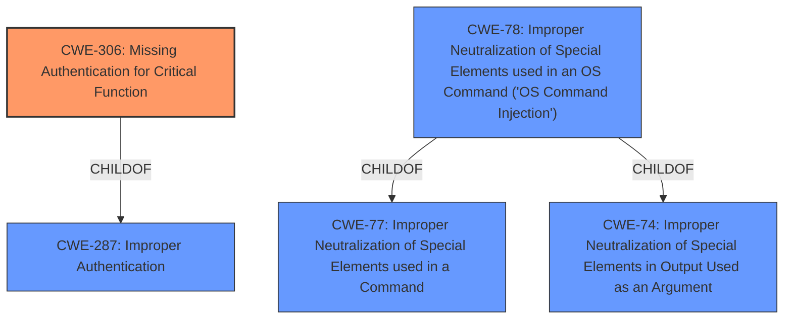

# Enhanced Analysis for CVE-2020-21996

# Summary
| CWE ID | CWE Name | Confidence | CWE Abstraction Level | CWE Vulnerability Mapping Label | CWE-Vulnerability Mapping Notes |
|---|---|---|---|---|---|
| CWE-306 | Missing Authentication for Critical Function | 1.0 | Base | Allowed | Primary CWE |
| CWE-78  | Improper Neutralization of Special Elements used in an OS Command ('OS Command Injection') | 0.6 | Base | Allowed | Secondary CWE |

## Evidence and Confidence

*   **Confidence Score:** 0.8
*   **Evidence Strength:** HIGH

## Relationship Analysis
The primary CWE is CWE-306 which is a base level weakness indicating that a critical function lacks authentication. CWE-306 is a child of CWE-287 (Improper Authentication). CWE-78 (Improper Neutralization of Special Elements used in an OS Command) is a base level weakness and is a child of CWE-77 (Improper Neutralization of Special Elements used in a Command) and CWE-74 (Improper Neutralization of Special Elements in Output Used as an Argument). I considered CWE-78 because the lack of authentication leads to an OS command being executed, so the relationship is more of a consequence.



## Vulnerability Chain
The vulnerability chain starts with the **missing authentication** (CWE-306) for the `restart.php` endpoint. This allows an attacker to send a request to this endpoint, which then triggers the execution of a system reboot command, resulting in a denial of service. The chain is: Missing Authentication -> Command Execution -> Denial of Service.

## Summary of Analysis
Initially, the analysis focused on the **unauthenticated reboot command execution** as the primary weakness. The "CVE Reference Links Content Summary" section highlights the **lack of authentication** on the `restart.php` endpoint, leading to a system reboot.

The retriever results suggested CWE-306 (Missing Authentication for Critical Function) as a strong candidate, which directly aligns with the **root cause** of the vulnerability. While CWE-78 (Improper Neutralization of Special Elements used in an OS Command) was also considered due to the reboot command execution, it was determined that the **missing authentication** is the more fundamental issue. The reboot command execution is a consequence of the **missing authentication**, making CWE-306 the primary weakness.

CWE-20 (Improper Input Validation) was considered but discarded because the core issue isn't about validating input, but rather about the **lack of authentication** required to access the functionality in the first place.

The final decision to prioritize CWE-306 is based on the direct evidence of **missing authentication** for a critical function, which is the root cause of the vulnerability. The selected CWEs are at the optimal level of specificity, with CWE-306 accurately representing the primary weakness and CWE-78 representing the secondary weakness.

Relevant CWE Information:

# Enhanced Context (25 CWEs)
The following CWEs were identified as potentially relevant to this vulnerability:

## CWE-1289: Improper Validation of Unsafe Equivalence in Input
**Abstraction Level**: Base
**Similarity Score**: 0.78
**Source**: dense

**Description**:
The product receives an input value that is used as a resource identifier or other type of reference, but it does not validate or incorrectly validates that the input is equivalent to a potentially-unsafe value.
**Rationale for not selecting:** This vulnerability isn't about validating unsafe equivalences in input but rather about the **lack of authentication** for a critical function.

## CWE-703: Improper Check or Handling of Exceptional Conditions
**Abstraction Level**: Pillar
**Similarity Score**: 0.76
**Source**: dense
**Description**:
The product does not properly anticipate or handle exceptional conditions that rarely occur during normal operation of the product.
**Rationale for not selecting:** Too high level and does not reflect the root cause which is **missing authentication**.

## CWE-754: Improper Check for Unusual or Exceptional Conditions
**Abstraction Level**: Class
**Similarity Score**: 0.74
**Source**: dense
**Description**:
The product does not check or incorrectly checks for unusual or exceptional conditions that are not expected to occur frequently during day to day operation of the product.
**Rationale for not selecting:** The root cause is the **missing authentication** for critical function, which is better represented by CWE-306.

## CWE-664: Improper Control of a Resource Through its Lifetime
**Abstraction Level**: Pillar
**Similarity Score**: 0.74
**Source**: dense
**Description**:
The product does not maintain or incorrectly maintains control over a resource throughout its lifetime of creation, use, and release.
**Rationale for not selecting:** Too high level. The root cause is the **missing authentication** for critical function, which is better represented by CWE-306.

## CWE-1288: Improper Validation of Consistency within Input
**Abstraction Level**: Base
**Similarity Score**: 0.74
**Source**: dense
**Description**:
The product receives a complex input with multiple elements or fields that must be consistent with each other, but it does not validate or incorrectly validates that the input is actually consistent.
**Rationale for not selecting:** The vulnerability is not about validating consistency within input but about the **missing authentication**.

## CWE-691: Insufficient Control Flow Management
**Abstraction Level**: Pillar
**Similarity Score**: 0.74
**Source**: dense
**Description**:
The code does not sufficiently manage its control flow during execution, creating conditions in which the control flow can be modified in unexpected ways.
**Rationale for not selecting:** Too high level and does not reflect the root cause which is **missing authentication**.

## CWE-184: Incomplete List of Disallowed Inputs
**Abstraction Level**: Base
**Similarity Score**: 0.74
**Source**: dense
**Description**:
The product implements a protection mechanism that relies on a list of inputs (or properties of inputs) that are not allowed by policy or otherwise require other action to neutralize before additional processing takes place, but the list is incomplete.
**Rationale for not selecting:** The primary issue is not an incomplete list of disallowed inputs, but rather the **lack of any authentication** for a critical function.

## CWE-807: Reliance on Untrusted Inputs in a Security Decision
**Abstraction Level**: Base
**Similarity Score**: 0.74
**Source**: dense
**Description**:
The product uses a protection mechanism that relies on the existence or values of an input, but the input can be modified by an untrusted actor in a way that bypasses the protection mechanism.
**Rationale for not selecting:** The primary issue is the **lack of authentication** rather than reliance on untrusted inputs in a security decision.

## CWE-274: Improper Handling of Insufficient Privileges
**Abstraction Level**: Base
**Similarity Score**: 0.74
**Source**: dense
**Description**:
The product does not handle or incorrectly handles when it has insufficient privileges to perform an operation, leading to resultant weaknesses.
**Rationale for not selecting:** The issue is not about handling insufficient privileges, but rather the **missing authentication** for a critical function.

## CWE-653: Improper Isolation or Compartmentalization
**Abstraction Level**: Class
**Similarity Score**: 0.73
**Source**: dense
**Description**:
The product does not properly compartmentalize or isolate functionality, processes, or resources that require different privilege levels, rights, or permissions.
**Rationale for not selecting:** The primary issue is the **lack of authentication** rather than improper isolation or compartmentalization.

## CWE-1284: Improper Validation of Specified Quantity in Input
**Abstraction Level**: Base
**Similarity Score**: 8206.25
**Source**: sparse
**Description**:
The product receives input that is expected to specify a quantity (such as size or length), but it does not validate or incorrectly validates that the quantity has the required properties.
**Rationale for not selecting:** The vulnerability is not about validating a specified quantity in input. The core issue is the **missing authentication**.

## CWE-22: Improper Limitation of a Pathname to a Restricted Directory ('Path Traversal')
**Abstraction Level**: Base
**Similarity Score


## CWE Relationship Analysis

Current CWEs represent these abstraction levels: .


### Vulnerability Chain Analysis

**Chain starting from CWE-754:**
- 754 (Improper Check for Unusual or Exceptional Conditions) - ROOT


**Chain starting from CWE-691:**
- 691 (Insufficient Control Flow Management) - ROOT


### CWE Relationship Diagram

```mermaid
graph TD
    classDef primary fill:#f96,stroke:#333,stroke-width:2px
    classDef secondary fill:#69f,stroke:#333
    classDef tertiary fill:#9e9,stroke:#333
```