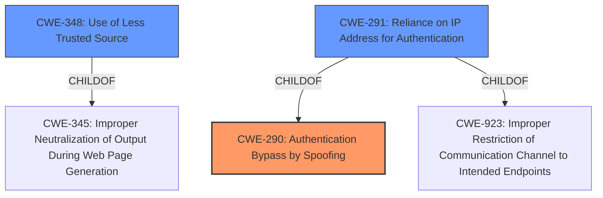

# Analysis for CVE-2020-22001

# Summary
| CWE ID | CWE Name | Confidence | CWE Abstraction Level | CWE Vulnerability Mapping Label | CWE-Vulnerability Mapping Notes |
|---|---|---|---|---|---|
| CWE-290 | Authentication Bypass by Spoofing | 0.9 | Base | Allowed | Primary CWE |
| CWE-348 | Use of Less Trusted Source | 0.7 | Base | Allowed | Secondary Candidate |
| CWE-291 | Reliance on IP Address for Authentication | 0.6 | Variant | Allowed | Secondary Candidate |

## Evidence and Confidence

*   **Confidence Score:** 0.8
*   **Evidence Strength:** HIGH

## Relationship Analysis
The primary CWE is CWE-290 Authentication Bypass by Spoofing, which is a base-level CWE. CWE-291 Reliance on IP Address for Authentication is a variant of CWE-290 and also a child of CWE-923 Improper Restriction of Communication Channel to Intended Endpoints. CWE-348 Use of Less Trusted Source is a child of CWE-345 Improper Neutralization of Output During Web Page Generation. Using the X-Forwarded-For header which is easily spoofed is using a less trusted source. The relationships indicate that the vulnerability stems from trusting an easily manipulated source (the X-Forwarded-For header) for authentication, leading to spoofing and ultimately bypassing authentication.

## Vulnerability Chain
The vulnerability chain starts with the application's **reliance on the X-Forwarded-For header (a less trusted source)** for determining the client's IP address. This **improper input handling** leads to **IP address spoofing**, which then results in the **authentication bypass**. The final impact is unauthorized remote control of the smart home solution.

## Summary of Analysis
The initial assessment focused on identifying the root cause of the authentication bypass. The vulnerability description and CVE details clearly point to the application **incorrectly trusting the X-Forwarded-For header** for authentication purposes, which allows an attacker to **spoof their IP address** and gain unauthorized access.

The relationship graph helped to refine the selection by illustrating the connections between different CWEs. CWE-290 (Authentication Bypass by Spoofing) emerged as the primary weakness due to the direct link between the spoofed IP address and the bypassed authentication. The use of the `X-Forwarded-For` header when `REMOTE_ADDR` would have been more appropriate is a **reliance on a less trusted source**. The selected CWEs are at the optimal level of specificity, providing a clear and accurate representation of the vulnerability.

The vulnerability description states that "HomeAutomation 3.3.2 suffers from an authentication bypass vulnerability when **spoofing client IP address using the X-Forwarded-For header** with the local (loopback) IP address value allowing remote control of the smart home solution."

Relevant CWE Information:

# Enhanced Context (25 CWEs)
The following CWEs were identified as potentially relevant to this vulnerability:

## CWE-113: Improper Neutralization of CRLF Sequences in HTTP Headers ('HTTP Request/Response Splitting')
**Abstraction Level**: Variant
**Similarity Score**: 0.77
**Source**: dense

**Description**:
The product receives data from an HTTP agent/component (e.g., web server, proxy, browser, etc.), but it does not neutralize or incorrectly neutralizes CR and LF characters before the data is included in outgoing HTTP headers.

**Mapping Guidance**:
- Usage: Allowed
- Rationale: This CWE entry is at the Variant level of abstraction, which is a preferred level of abstraction for mapping to the root causes of vulnerabilities.

*This CWE was not selected since the vulnerability is not about CRLF injection.*

## CWE-74: Improper Neutralization of Special Elements in Output Used by a Downstream Component ('Injection')
**Abstraction Level**: Class
**Similarity Score**: 0.76
**Source**: dense

**Description**:
The product constructs all or part of a command, data structure, or record using externally-influenced input from an upstream component, but it does not neutralize or incorrectly neutralizes special elements that could modify how it is parsed or interpreted when it is sent to a downstream component.

**Mapping Guidance**:
- Usage: Discouraged
- Rationale: CWE-74 is high-level and often misused when lower-level weaknesses are more appropriate.

*This CWE was not selected because it is too generic.*

## CWE-294: Authentication Bypass by Capture-replay
**Abstraction Level**: Base
**Similarity Score**: 0.76
**Source**: dense

**Description**:
A capture-replay flaw exists when the design of the product makes it possible for a malicious user to sniff network traffic and bypass authentication by replaying it to the server in question to the same effect as the original message (or with minor changes).

**Mapping Guidance**:
- Usage: Allowed
- Rationale: This CWE entry is at the Base level of abstraction, which is a preferred level of abstraction for mapping to the root causes of vulnerabilities.

*This CWE was not selected because it doesn't involve replaying captured traffic.*

## CWE-289: Authentication Bypass by Alternate Name
**Abstraction Level**: Base
**Similarity Score**: 0.75
**Source**: dense

**Description**:
The product performs authentication based on the name of a resource being accessed, or the name of the actor performing the access, but it does not properly check all possible names for that resource or actor.

**Mapping Guidance**:
- Usage: Allowed
- Rationale: This CWE entry is at the Base level of abstraction, which is a preferred level of abstraction for mapping to the root causes of vulnerabilities.

*This CWE was not selected because it is specific to resource/actor name issues.*

## CWE-41: Improper Resolution of Path Equivalence
**Abstraction Level**: Base
**Similarity Score**: 0.75
**Source**: dense

**Description**:
The product is vulnerable to file system contents disclosure through path equivalence. Path equivalence involves the use of special characters in file and directory names. The associated manipulations are intended to generate multiple names for the same object.

**Mapping Guidance**:
- Usage: Allowed
- Rationale: This CWE entry is at the Base level of abstraction, which is a preferred level of abstraction for mapping to the root causes of vulnerabilities.

*This CWE was not selected because it's a filesystem specific weakness.*

## CWE-1390: Weak Authentication
**Abstraction Level**: Class
**Similarity Score**: 0.75
**Source**: dense

**Description**:
The product uses an authentication mechanism to restrict access to specific users or identities, but the mechanism does not sufficiently prove that the claimed identity is correct.

**Mapping Guidance**:
- Usage: Allowed-with-Review
**Rationale:** This CWE entry is a Class and might have Base-level children that would be more appropriate

*This CWE was not selected because its too generic.*

## CWE-303: Incorrect Implementation of Authentication Algorithm
**Abstraction Level**: Base
**Similarity Score**: 0.75
**Source**: dense

**Description**:
The requirements for the product dictate the use of an established authentication algorithm, but the implementation of the algorithm is incorrect.

**Mapping Guidance**:
- Usage: Allowed
- Rationale: This CWE entry is at the Base level of abstraction, which is a preferred level of abstraction for mapping to the root causes of vulnerabilities.

*This CWE was not selected because there is no algorithm involved, only the trusting of a header field.*

## CWE-807: Reliance on Untrusted Inputs in a Security Decision
**Abstraction Level**: Base
**Similarity Score**: 0.75
**Source**: dense

**Description**:
The product uses a protection mechanism that relies on the existence or values of an input, but the input can be modified by an untrusted actor in a way that bypasses the protection mechanism.

**Mapping Guidance**:
- Usage: Allowed
- Rationale: This CWE entry is at the Base level of abstraction, which is a preferred level of abstraction for mapping to the root causes of vulnerabilities.

*This CWE was not selected because it is too general.*

## CWE-1289: Improper Validation of Unsafe Equivalence in Input
**Abstraction Level**: Base
**Similarity Score**: 0.75
**Source**: dense

**Description

# Enhanced Query for CVE-2020-22001

## Vulnerability Description
HomeAutomation 3.3.2 suffers from an authentication bypass vulnerability when spoofing client IP address using the X-Forwarded-For header with the local (loopback) IP address value allowing remote control of the smart home solution.

### Vulnerability Description Key Phrases
- **impact:** authentication bypass
- **vector:** spoofing client IP address using the X-Forwarded-For header with the local IP address value
- **product:** HomeAutomation
- **version:** 3.3.2

## CVE Reference Links Content Summary
Based on the provided content, here's a breakdown of the vulnerability:

**Root Cause:**

*   The application incorrectly trusts the `X-Forwarded-For` header to determine the client's IP address. It uses this header instead of the actual `REMOTE_ADDR` to check if a user is accessing the application from a "local" network.

**Weaknesses/Vulnerabilities:**

*   **Authentication Bypass:** By manipulating the `X-Forwarded-For` header and inserting a local/loopback IP address (e.g., 127.0.0.1 or any IP matching the configured local network), an attacker can bypass the authentication mechanism. The application's logic incorrectly assumes that if the IP in `X-Forwarded-For` is local, the request is from a trusted source, and thus bypasses login requirements.
*   **IP Address Spoofing:** The vulnerability stems from the application's reliance on a user-controlled header (`X-Forwarded-For`) for security decisions.
*   **Insecure IP Address Verification:** The `isIpLocal()` function does not properly validate if the request originates from a local network.

**Impact of Exploitation:**

*   **Complete Takeover:** Successful exploitation allows an attacker to gain unauthorized access to the HomeAutomation system, potentially granting full control of connected smart devices.
*   **Remote Control:** An attacker can control devices (switches, dimmers, etc.), access sensor data, and modify schedules.
*   **Confidentiality Breach:** Attackers can view system configurations, user data, and sensitive information related to connected devices.
*   **Integrity Violation:** Attackers can modify configurations, schedules, or device status, leading to denial of service or unexpected behavior of the smart home.
*   **Availability Disruption:** Attackers can cause device malfunctions or disrupt scheduling, rendering the home automation system unavailable.

**Attack Vectors:**

*   **Network-Based Attack:** The vulnerability is exploitable remotely over the network.
*   **HTTP Header Manipulation:** Attackers must craft malicious HTTP requests that include a spoofed IP address within the `X-Forwarded-For` header.

**Required Attacker Capabilities/Position:**

*   **Network Access:** The attacker must be able to reach the vulnerable web interface over the network.
*   **HTTP Request Crafting:** The attacker must be capable of generating and sending custom HTTP requests.
*   **Understanding of `X-Forwarded-For` header:** The attacker must know how to manipulate the `X-Forwarded-For` header to insert a local IP address.

## Retriever Results

### Top Combined Results

| Rank | CWE ID | Name | Abstraction | Usage  | Retrievers | Individual Scores |
|------|--------|------|-------------|-------|------------|-------------------|
| 1 | 290 | Authentication Bypass by Spoofing | Base | Allowed | sparse | 0.093 |
| 2 | 295 | Improper Certificate Validation | Base | Allowed | sparse | 0.069 |
| 3 | 348 | Use of Less Trusted Source | Base | Allowed | sparse | 0.062 |
| 4 | 291 | Reliance on IP Address for Authentication | Variant | Allowed | sparse | 0.062 |
| 5 | 1390 | Weak Authentication | Class | Allowed-with-Review | sparse | 0.060 |
| 6 | 305 | Authentication Bypass by Primary Weakness | Base | Allowed | dense | 0.549 |
| 7 | 294 | Authentication Bypass by Capture-replay | Base | Allowed | graph | 0.002 |
| 8 | 201 | Insertion of Sensitive Information Into Sent Data | Base | Allowed | sparse | 0.060 |
| 9 | 863 | Incorrect Authorization | Class | Allowed-with-Review | sparse | 0.057 |
| 10 | 93 | Improper Neutralization of CRLF Sequences ('CRLF Injection') | Base | Allowed | sparse | 0.056 |

# Complete CWE Specifications

## CWE-290: Authentication Bypass by Spoofing
**Abstraction:** Base
**Status:** Incomplete

### Description
This attack-focused weakness is caused by incorrectly implemented authentication schemes that are subject to spoofing attacks.

### Extended Description
Not provided

### Alternative Terms
None

### Relationships
ChildOf -> CWE-1390
ChildOf -> CWE-287

### Mapping Guidance
**Usage:** Allowed
**Rationale:** This CWE entry is at the Base level of abstraction, which is a preferred level of abstraction for mapping to the root causes of vulnerabilities.
**Comments:** Carefully read both the name and description to ensure that this mapping is an appropriate fit. Do not try to 'force' a mapping to a lower-level Base/Variant simply to comply with this preferred level of abstraction.
**Reasons:**
- Acceptable-Use

### Additional Notes
**[Relationship]** This can be resultant from insufficient verification.

### Observed Examples
- **CVE-2022-30319:** S-bus functionality in a home automation product performs access control using an IP allowlist, which can be bypassed by a forged IP address.
- **CVE-2009-1048:** VOIP product allows authentication bypass using 127.0.0.1 in the Host header.

## CWE-295: Improper Certificate Validation
**Abstraction:** Base
**Status:** Draft

### Description
The product does not validate, or incorrectly validates, a certificate.

### Extended Description
When a certificate is invalid or malicious, it might allow an attacker to spoof a trusted entity by interfering in the communication path between the host and client. The product might connect to a malicious host while believing it is a trusted host, or the product might be deceived into accepting spoofed data that appears to originate from a trusted host.

### Alternative Terms
None

### Relationships
ChildOf -> CWE-287
ChildOf -> CWE-287
PeerOf -> CWE-322

### Mapping Guidance
**Usage:** Allowed
**Rationale:** This CWE entry is at the Base level of abstraction, which is a preferred level of abstraction for mapping to the root causes of vulnerabilities.
**Comments:** Carefully read both the name and description to ensure that this mapping is an appropriate fit. Do not try to 'force' a mapping to a lower-level Base/Variant simply to comply with this preferred level of abstraction.
**Reasons:**
- Acceptable-Use

### Observed Examples
- **CVE-2019-12496:** A Go framework for robotics, drones, and IoT devices skips verification of root CA certificates by default.
- **CVE-2014-1266:** chain: incorrect "goto" in Apple SSL product bypasses certificate validation, allowing Adversary-in-the-Middle (AITM) attack (Apple "goto fail" bug). CWE-705 (Incorrect Control Flow Scoping) -> CWE-561 (Dead Code) -> CWE-295 (Improper Certificate Validation) -> CWE-393 (Return of Wrong Status Code) -> CWE-300 (Channel Accessible by Non-Endpoint).
- **CVE-2021-22909:** Chain: router's firmware update procedure uses curl with "-k" (insecure) option that disables certificate validation (CWE-295), allowing adversary-in-the-middle (AITM) compromise with a malicious firmware image (CWE-494).

## CWE-348: Use of Less Trusted Source
**Abstraction:** Base
**Status:** Draft

### Description
The product has two different sources of the same data or information, but it uses the source that has less support for verification, is less trusted, or is less resistant to attack.

### Extended Description
Not provided

### Alternative Terms
None

### Relationships
ChildOf -> CWE-345

### Mapping Guidance
**Usage:** Allowed
**Rationale:** This CWE entry is at the Base level of abstraction, which is a preferred level of abstraction for mapping to the root causes of vulnerabilities.
**Comments:** Carefully read both the name and description to ensure that this mapping is an appropriate fit. Do not try to 'force' a mapping to a lower-level Base/Variant simply to comply with this preferred level of abstraction.
**Reasons:**
- Acceptable-Use

### Observed Examples
- **CVE-2001-0860:** Product uses IP address provided by a client, instead of obtaining it from the packet headers, allowing easier spoofing.
- **CVE-2004-1950:** Web product uses the IP address in the X-Forwarded-For HTTP header instead of a server variable that uses the connecting IP address, allowing filter bypass.
- **CVE-2001-0908:** Product logs IP address specified by the client instead of obtaining it from the packet headers, allowing information hiding.

## CWE-291: Reliance on IP Address for Authentication
**Abstraction:** Variant
**Status:** Incomplete

### Description
The product uses an IP address for authentication.

### Extended Description
IP addresses can be easily spoofed. Attackers can forge the source IP address of the packets they send, but response packets will return to the forged IP address. To see the response packets, the attacker has to sniff the traffic between the victim machine and the forged IP address. In order to accomplish the required sniffing, attackers typically attempt to locate themselves on the same subnet as the victim machine. Attackers may be able to circumvent this requirement by using source routing, but source routing is disabled across much of the Internet today. In summary, IP address verification can be a useful part of an authentication scheme, but it should not be the single factor required for authentication.

### Alternative Terms
None

### Relationships
ChildOf -> CWE-290
ChildOf -> CWE-923
ChildOf -> CWE-471

### Mapping Guidance
**Usage:** Allowed
**Rationale:** This CWE entry is at the Variant level of abstraction, which is a preferred level of abstraction for mapping to the root causes of vulnerabilities.
**Comments:** Carefully read both the name and description to ensure that this mapping is an appropriate fit. Do not try to 'force' a mapping to a lower-level Base/Variant simply to comply with this preferred level of abstraction.
**Reasons:**
- Acceptable-Use

### Observed Examples
- **CVE-2022-30319:** S-bus functionality in a home automation product performs access control using an IP allowlist, which can be bypassed by a forged IP address.

## CWE-1390: Weak Authentication
**Abstraction:** Class
**Status:** Incomplete

### Description
The product uses an authentication mechanism to restrict access to specific users or identities, but the mechanism does not sufficiently prove that the claimed identity is correct.

### Extended Description

Attackers may be able to bypass weak authentication faster and/or with less effort than expected.

### Alternative Terms
None

### Relationships
ChildOf -> CWE-287

### Mapping Guidance
**Usage:** Allowed-with-Review
**Rationale:** This CWE entry is a Class and might have Base-level children that would be more appropriate
**Comments:** Examine children of this entry to see if there is a better fit
**Reasons:**
- Abstraction

### Observed Examples
- **CVE-2022-30034:** Chain: Web UI for a Python RPC framework does not use regex anchors to validate user login emails (CWE-777), potentially allowing bypass of OAuth (CWE-1390).
- **CVE-2022-35248:** Chat application skips validation when Central Authentication Service (CAS) is enabled, effectively removing the second factor from two-factor authentication
- **CVE-2021-3116:** Chain: Python-based HTTP Proxy server uses the wrong boolean operators (CWE-480) causing an incorrect comparison (CWE-697) that identifies an authN failure if all three conditions are met instead of only one, allowing bypass of the proxy authentication (CWE-1390)

## CWE-305: Authentication Bypass by Primary Weakness
**Abstraction:** Base
**Status:** Draft

### Description
The authentication algorithm is sound, but the implemented mechanism can be bypassed as the result of a separate weakness that is primary to the authentication error.

### Extended Description
Not provided

### Alternative Terms
None

### Relationships
ChildOf -> CWE-1390

### Mapping Guidance
**Usage:** Allowed
**Rationale:** This CWE entry is at the Base level of abstraction, which is a preferred level of abstraction for mapping to the root causes of vulnerabilities.
**Comments:** Carefully read both the name and description to ensure that this mapping is an appropriate fit. Do not try to 'force' a mapping to a lower-level Base/Variant simply to comply with this preferred level of abstraction.
**Reasons:**
- Acceptable-Use

### Additional Notes
**[Relationship]** Most "authentication bypass" errors are resultant, not primary.

### Observed Examples
- **CVE-2002-1374:** The provided password is only compared against the first character of the real password.
- **CVE-2000-0979:** The password is not properly checked, which allows remote attackers to bypass access controls by sending a 1-byte password that matches the first character of the real password.
- **CVE-2001-0088:** Chain: Forum software does not properly initialize an array, which inadvertently sets the password to a single character, allowing remote attackers to easily guess the password and gain administrative privileges.

## CWE-294: Authentication Bypass by Capture-replay
**Abstraction:** Base
**Status:** Incomplete

### Description
A capture-replay flaw exists when the design of the product makes it possible for a malicious user to sniff network traffic and bypass authentication by replaying it to the server in question to the same effect as the original message (or with minor changes).

### Extended Description
Capture-replay attacks are common and can be difficult to defeat without cryptography. They are a subset of network injection attacks that rely on observing previously-sent valid commands, then changing them slightly if necessary and resending the same commands to the server.

### Alternative Terms
None

### Relationships
ChildOf -> CWE-1390
ChildOf -> CWE-287

### Mapping Guidance
**Usage:** Allowed
**Rationale:** This CWE entry is at the Base level of abstraction, which is a preferred level of abstraction for mapping to the root causes of vulnerabilities.
**Comments:** Carefully read both the name and description to ensure that this mapping is an appropriate fit. Do not try to 'force' a mapping to a lower-level Base/Variant simply to comply with this preferred level of abstraction.
**Reasons:**
- Acceptable-Use

### Observed Examples
- **CVE-2005-3435:** product authentication succeeds if user-provided MD5 hash matches the hash in its database; this can be subjected to replay attacks.
- **CVE-2007-4961:** Chain: cleartext transmission of the MD5 hash of password (CWE-319) enables attacks against a server that is susceptible to replay (CWE-294).

## CWE-201: Insertion of Sensitive Information Into Sent Data
**Abstraction:** Base
**Status:** Draft

### Description
The code transmits data to another actor, but a portion of the data includes sensitive information that should not be accessible to that actor.

### Extended Description
Not provided

### Alternative Terms
None

### Relationships
ChildOf -> CWE-200
CanAlsoBe -> CWE-209
CanAlsoBe -> CWE-202

### Mapping Guidance
**Usage:** Allowed
**Rationale:** This CWE entry is at the Base level of abstraction, which is a preferred level of abstraction for mapping to the root causes of vulnerabilities.
**Comments:** Carefully read both the name and description to ensure that this mapping is an appropriate fit. Do not try to 'force' a mapping to a lower-level Base/Variant simply to comply with this preferred level of abstraction.
**Reasons:**
- Acceptable-Use

### Additional Notes
**[Other]** Sensitive information could include data that is sensitive in and of itself (such as credentials or private messages), or otherwise useful in the further exploitation of the system (such as internal file system structure).

### Observed Examples
- **CVE-2022-0708:** Collaboration platform does not clear team emails in a response, allowing leak of email addresses

## CWE-863: Incorrect Authorization
**Abstraction:** Class
**Status:** Incomplete

### Description
The product performs an authorization check when an actor attempts to access a resource or perform an action, but it does not correctly perform the check.

### Extended Description
Not provided

### Alternative Terms
AuthZ: "AuthZ" is typically used as an abbreviation of "authorization" within the web application security community. It is distinct from "AuthN" (or, sometimes, "AuthC") which is an abbreviation of "authentication." The use of "Auth" as an abbreviation is discouraged, since it could be used for either authentication or authorization.

### Relationships
ChildOf -> CWE-285
ChildOf -> CWE-284

### Mapping Guidance
**Usage:** Allowed-with-Review
**Rationale:** This CWE entry is a Class and might have Base-level children that would be more appropriate
**Comments:** Examine children of this entry to see if there is a better fit
**Reasons:**
- Abstraction

### Additional Notes
**[Terminology]** 

Assuming a user with a given identity, authorization is the process of determining whether that user can access a given resource, based on the user's privileges and any permissions or other access-control specifications that apply to the resource.

### Observed Examples
- **CVE-2021-39155:** Chain: A microservice integration and management platform compares the hostname in the HTTP Host header in a case-sensitive way (CWE-178, CWE-1289), allowing bypass of the authorization policy (CWE-863) using a hostname with mixed case or other variations.
- **CVE-2019-15900:** Chain: sscanf() call is used to check if a username and group exists, but the return value of sscanf() call is not checked (CWE-252), causing an uninitialized variable to be checked (CWE-457), returning success to allow authorization bypass for executing a privileged (CWE-863).
- **CVE-2009-2213:** Gateway uses default "Allow" configuration for its authorization settings.

## CWE-93: Improper Neutralization of CRLF Sequences ('CRLF Injection')
**Abstraction:** Base
**Status:** Draft

### Description
The product uses CRLF (carriage return line feeds) as a special element, e.g. to separate lines or records, but it does not neutralize or incorrectly neutralizes CRLF sequences from inputs.

### Extended Description
Not provided

### Alternative Terms
None

### Relationships
ChildOf -> CWE-74
CanPrecede -> CWE-117

### Mapping Guidance
**Usage:** Allowed
**Rationale:** This CWE entry is at the Base level of abstraction, which is a preferred level of abstraction for mapping to the root causes of vulnerabilities.
**Comments:** Carefully read both the name and description to ensure that this mapping is an appropriate fit. Do not try to 'force' a mapping to a lower-level Base/Variant simply to comply with this preferred level of abstraction.
**Reasons:**
- Acceptable-Use

### Observed Examples
- **CVE-2002-1771:** CRLF injection enables spam proxy (add mail headers) using email address or name.
- **CVE-2002-1783:** CRLF injection in API function arguments modify headers for outgoing requests.
- **CVE-2004-1513:** Spoofed entries in web server log file via carriage returns

