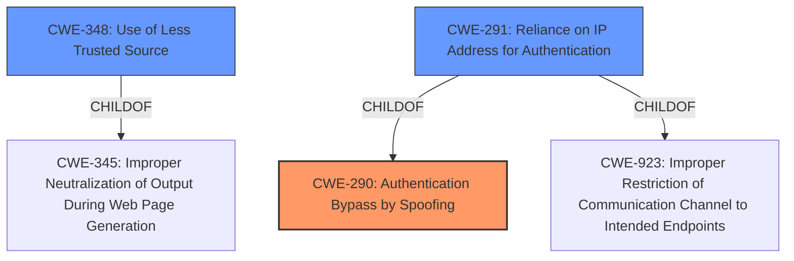

# Analysis Report for CVE-2020-22001

# Vulnerability Analysis Report: CVE-2020-22001

## Description


## Analysis (with Relationship Data)

# Summary
| CWE ID | CWE Name | Confidence | CWE Abstraction Level | CWE Vulnerability Mapping Label | CWE-Vulnerability Mapping Notes |
|---|---|---|---|---|---|
| CWE-290 | Authentication Bypass by Spoofing | 0.9 | Base | Allowed | Primary CWE |
| CWE-348 | Use of Less Trusted Source | 0.7 | Base | Allowed | Secondary Candidate |
| CWE-291 | Reliance on IP Address for Authentication | 0.6 | Variant | Allowed | Secondary Candidate |

## Evidence and Confidence

*   **Confidence Score:** 0.8
*   **Evidence Strength:** HIGH

## Relationship Analysis
The primary CWE is CWE-290 Authentication Bypass by Spoofing, which is a base-level CWE. CWE-291 Reliance on IP Address for Authentication is a variant of CWE-290 and also a child of CWE-923 Improper Restriction of Communication Channel to Intended Endpoints. CWE-348 Use of Less Trusted Source is a child of CWE-345 Improper Neutralization of Output During Web Page Generation. Using the X-Forwarded-For header which is easily spoofed is using a less trusted source. The relationships indicate that the vulnerability stems from trusting an easily manipulated source (the X-Forwarded-For header) for authentication, leading to spoofing and ultimately bypassing authentication.



## Vulnerability Chain
The vulnerability chain starts with the application's **reliance on the X-Forwarded-For header (a less trusted source)** for determining the client's IP address. This **improper input handling** leads to **IP address spoofing**, which then results in the **authentication bypass**. The final impact is unauthorized remote control of the smart home solution.

## Summary of Analysis
The initial assessment focused on identifying the root cause of the authentication bypass. The vulnerability description and CVE details clearly point to the application **incorrectly trusting the X-Forwarded-For header** for authentication purposes, which allows an attacker to **spoof their IP address** and gain unauthorized access.

The relationship graph helped to refine the selection by illustrating the connections between different CWEs. CWE-290 (Authentication Bypass by Spoofing) emerged as the primary weakness due to the direct link between the spoofed IP address and the bypassed authentication. The use of the `X-Forwarded-For` header when `REMOTE_ADDR` would have been more appropriate is a **reliance on a less trusted source**. The selected CWEs are at the optimal level of specificity, providing a clear and accurate representation of the vulnerability.

The vulnerability description states that "HomeAutomation 3.3.2 suffers from an authentication bypass vulnerability when **spoofing client IP address using the X-Forwarded-For header** with the local (loopback) IP address value allowing remote control of the smart home solution."

Relevant CWE Information:

# Enhanced Context (25 CWEs)
The following CWEs were identified as potentially relevant to this vulnerability:

## CWE-113: Improper Neutralization of CRLF Sequences in HTTP Headers ('HTTP Request/Response Splitting')
**Abstraction Level**: Variant
**Similarity Score**: 0.77
**Source**: dense

**Description**:
The product receives data from an HTTP agent/component (e.g., web server, proxy, browser, etc.), but it does not neutralize or incorrectly neutralizes CR and LF characters before the data is included in outgoing HTTP headers.

**Mapping Guidance**:
- Usage: Allowed
- Rationale: This CWE entry is at the Variant level of abstraction, which is a preferred level of abstraction for mapping to the root causes of vulnerabilities.

*This CWE was not selected since the vulnerability is not about CRLF injection.*

## CWE-74: Improper Neutralization of Special Elements in Output Used by a Downstream Component ('Injection')
**Abstraction Level**: Class
**Similarity Score**: 0.76
**Source**: dense

**Description**:
The product constructs all or part of a command, data structure, or record using externally-influenced input from an upstream component, but it does not neutralize or incorrectly neutralizes special elements that could modify how it is parsed or interpreted when it is sent to a downstream component.

**Mapping Guidance**:
- Usage: Discouraged
- Rationale: CWE-74 is high-level and often misused when lower-level weaknesses are more appropriate.

*This CWE was not selected because it is too generic.*

## CWE-294: Authentication Bypass by Capture-replay
**Abstraction Level**: Base
**Similarity Score**: 0.76
**Source**: dense

**Description**:
A capture-replay flaw exists when the design of the product makes it possible for a malicious user to sniff network traffic and bypass authentication by replaying it to the server in question to the same effect as the original message (or with minor changes).

**Mapping Guidance**:
- Usage: Allowed
- Rationale: This CWE entry is at the Base level of abstraction, which is a preferred level of abstraction for mapping to the root causes of vulnerabilities.

*This CWE was not selected because it doesn't involve replaying captured traffic.*

## CWE-289: Authentication Bypass by Alternate Name
**Abstraction Level**: Base
**Similarity Score**: 0.75
**Source**: dense

**Description**:
The product performs authentication based on the name of a resource being accessed, or the name of the actor performing the access, but it does not properly check all possible names for that resource or actor.

**Mapping Guidance**:
- Usage: Allowed
- Rationale: This CWE entry is at the Base level of abstraction, which is a preferred level of abstraction for mapping to the root causes of vulnerabilities.

*This CWE was not selected because it is specific to resource/actor name issues.*

## CWE-41: Improper Resolution of Path Equivalence
**Abstraction Level**: Base
**Similarity Score**: 0.75
**Source**: dense

**Description**:
The product is vulnerable to file system contents disclosure through path equivalence. Path equivalence involves the use of special characters in file and directory names. The associated manipulations are intended to generate multiple names for the same object.

**Mapping Guidance**:
- Usage: Allowed
- Rationale: This CWE entry is at the Base level of abstraction, which is a preferred level of abstraction for mapping to the root causes of vulnerabilities.

*This CWE was not selected because it's a filesystem specific weakness.*

## CWE-1390: Weak Authentication
**Abstraction Level**: Class
**Similarity Score**: 0.75
**Source**: dense

**Description**:
The product uses an authentication mechanism to restrict access to specific users or identities, but the mechanism does not sufficiently prove that the claimed identity is correct.

**Mapping Guidance**:
- Usage: Allowed-with-Review
**Rationale:** This CWE entry is a Class and might have Base-level children that would be more appropriate

*This CWE was not selected because its too generic.*

## CWE-303: Incorrect Implementation of Authentication Algorithm
**Abstraction Level**: Base
**Similarity Score**: 0.75
**Source**: dense

**Description**:
The requirements for the product dictate the use of an established authentication algorithm, but the implementation of the algorithm is incorrect.

**Mapping Guidance**:
- Usage: Allowed
- Rationale: This CWE entry is at the Base level of abstraction, which is a preferred level of abstraction for mapping to the root causes of vulnerabilities.

*This CWE was not selected because there is no algorithm involved, only the trusting of a header field.*

## CWE-807: Reliance on Untrusted Inputs in a Security Decision
**Abstraction Level**: Base
**Similarity Score**: 0.75
**Source**: dense

**Description**:
The product uses a protection mechanism that relies on the existence or values of an input, but the input can be modified by an untrusted actor in a way that bypasses the protection mechanism.

**Mapping Guidance**:
- Usage: Allowed
- Rationale: This CWE entry is at the Base level of abstraction, which is a preferred level of abstraction for mapping to the root causes of vulnerabilities.

*This CWE was not selected because it is too general.*

## CWE-1289: Improper Validation of Unsafe Equivalence in Input
**Abstraction Level**: Base
**Similarity Score**: 0.75
**Source**: dense

**Description


## CWE Relationship Analysis

Current CWEs represent these abstraction levels: .


### Vulnerability Chain Analysis

**Chain starting from CWE-113:**
- 113 (Improper Neutralization of CRLF Sequences in HTTP Headers ('HTTP Request/Response Splitting')) - ROOT


**Chain starting from CWE-303:**
- 303 (Incorrect Implementation of Authentication Algorithm) - ROOT


### CWE Relationship Diagram

```mermaid
graph TD
    classDef primary fill:#f96,stroke:#333,stroke-width:2px
    classDef secondary fill:#69f,stroke:#333
    classDef tertiary fill:#9e9,stroke:#333
```


*Report generated on 2025-04-02 16:36:43*
