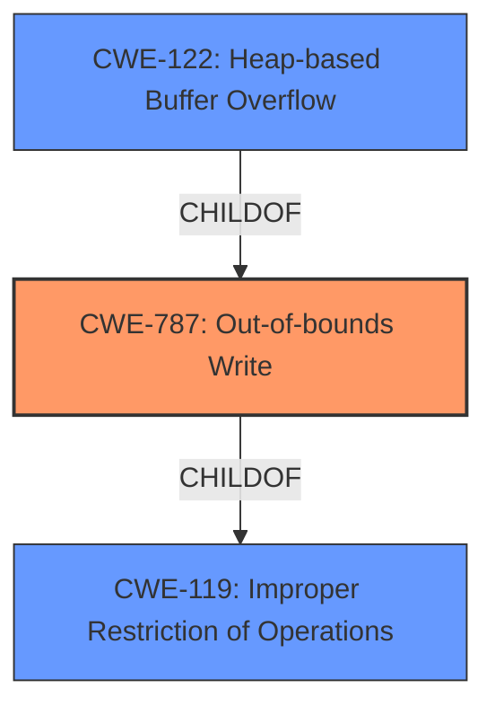

# Analysis for CVE-2020-22022

# Summary
| CWE ID | CWE Name | Confidence | CWE Abstraction Level | CWE Vulnerability Mapping Label | CWE-Vulnerability Mapping Notes |
|---|---|---|---|---|---|
| CWE-787 | Out-of-bounds Write | 1.0 | Base | Allowed | Primary CWE |
| CWE-122 | Heap-based Buffer Overflow | 0.7 | Variant | Allowed | Secondary Candidate |
| CWE-119 | Improper Restriction of Operations within the Bounds of a Memory Buffer | 0.5 | Class | Discouraged | Secondary Candidate |

## Evidence and Confidence

*   **Confidence Score:** 0.9
*   **Evidence Strength:** HIGH

## Relationship Analysis
The primary CWE is CWE-787 Out-of-bounds Write which is a base level CWE and a child of CWE-119. The vulnerability is described as a **heap-based buffer overflow**, suggesting CWE-122 as a more specific variant, but the description of the vulnerability indicates it is due to writing outside the bounds of a buffer. CWE-119 is a class-level CWE that is too general.

## Vulnerability Chain
The vulnerability chain starts with the **heap-based buffer overflow** condition due to writing outside the buffer, leading to memory corruption and potentially other consequences.

## Summary of Analysis
The initial analysis identified a **heap-based buffer overflow** in FFmpeg 4.2, specifically in the `filter_frame` function within `libavfilter/vf_fieldorder.c`. The vulnerability leads to memory corruption and other potential consequences.

The primary CWE match based on similar CVE descriptions is CWE-787 (Out-of-bounds Write). The retriever results also suggest CWE-119 (Improper Restriction of Operations within the Bounds of a Memory Buffer), CWE-122 (Heap-based Buffer Overflow), and other related CWEs.

Based on the vulnerability description and the CVE reference links content summary, the root cause is a **heap-based buffer overflow** due to writing outside the bounds of a buffer. CWE-787 (Out-of-bounds Write) is the most appropriate CWE because it accurately describes the **weakness** of writing data past the end of the allocated buffer. The CVE reference links content summary explicitly states that a heap-based buffer overflow vulnerability exists.

CWE-122 (Heap-based Buffer Overflow) is a variant of CWE-787, but the description emphasizes the location of the overflow (heap) rather than the root cause (out-of-bounds write). While the vulnerability is indeed heap-based, focusing on CWE-787 provides a more accurate representation of the underlying **weakness**.

CWE-119 (Improper Restriction of Operations within the Bounds of a Memory Buffer) is a more general class-level CWE. While it is related, it is less specific than CWE-787. The mapping guidance for CWE-119 discourages its use when lower-level CWEs are available.

Therefore, CWE-787 is the optimal choice because it accurately represents the root cause **weakness** and is at the base level of abstraction. The selection is heavily based on the provided evidence, specifically the vulnerability description and the CVE reference links content summary.

Relevant CWE Information:

# Enhanced Context (25 CWEs)
The following CWEs were identified as potentially relevant to this vulnerability:

## CWE-191: Integer Underflow (Wrap or Wraparound)
**Abstraction Level**: Base
**Similarity Score**: 0.79
**Source**: dense

**Description**:
The product subtracts one value from another, such that the result is less than the minimum allowable integer value, which produces a value that is not equal to the correct result.

**Mapping Guidance**:
- Usage: Allowed
- Rationale: This CWE entry is at the Base level of abstraction, which is a preferred level of abstraction for mapping to the root causes of vulnerabilities.

## CWE-197: Numeric Truncation Error
**Abstraction Level**: Base
**Similarity Score**: 0.79
**Source**: dense

**Description**:
Truncation errors occur when a primitive is cast to a primitive of a smaller size and data is lost in the conversion.

**Mapping Guidance**:
- Usage: Allowed
- Rationale: This CWE entry is at the Base level of abstraction, which is a preferred level of abstraction for mapping to the root causes of vulnerabilities.

## CWE-681: Incorrect Conversion between Numeric Types
**Abstraction Level**: Base
**Similarity Score**: 0.78
**Source**: dense

**Description**:
When converting from one data type to another, such as long to integer, data can be omitted or translated in a way that produces unexpected values. If the resulting values are used in a sensitive context, then dangerous behaviors may occur.

**Mapping Guidance**:
- Usage: Allowed
- Rationale: This CWE entry is at the Base level of abstraction, which is a preferred level of abstraction for mapping to the root causes of vulnerabilities.

## CWE-131: Incorrect Calculation of Buffer Size
**Abstraction Level**: Base
**Similarity Score**: 0.77
**Source**: dense

**Description**:
The product does not correctly calculate the size to be used when allocating a buffer, which could lead to a buffer overflow.

**Mapping Guidance**:
- Usage: Allowed
- Rationale: This CWE entry is at the Base level of abstraction, which is a preferred level of abstraction for mapping to the root causes of vulnerabilities.

## CWE-124: Buffer Underwrite ('Buffer Underflow')
**Abstraction Level**: Base
**Similarity Score**: 0.76
**Source**: dense

**Description**:
The product writes to a buffer using an index or pointer that references a memory location prior to the beginning of the buffer.

**Mapping Guidance**:
- Usage: Allowed
- Rationale: This CWE entry is at the Base level of abstraction, which is a preferred level of abstraction for mapping to the root causes of vulnerabilities.

## CWE-805: Buffer Access with Incorrect Length Value
**Abstraction Level**: Base
**Similarity Score**: 0.76
**Source**: dense

**Description**:
The product uses a sequential operation to read or write a buffer, but it uses an incorrect length value that causes it to access memory that is outside of the bounds of the buffer.

**Mapping Guidance**:
- Usage: Allowed
- Rationale: This CWE entry is at the Base level of abstraction, which is a preferred level of abstraction for mapping to the root causes of vulnerabilities.

## CWE-125: Out-of-bounds Read
**Abstraction Level**: Base
**Similarity Score**: 0.76
**Source**: dense

**Description**:
The product reads data past the end, or before the beginning, of the intended buffer.

**Mapping Guidance**:
- Usage: Allowed
- Rationale: This CWE entry is at the Base level of abstraction, which is a preferred level of abstraction for mapping to the root causes of vulnerabilities.

## CWE-839: Numeric Range Comparison Without Minimum Check
**Abstraction Level**: Base
**Similarity Score**: 0.76
**Source**: dense

**Description**:
The product checks a value to ensure that it is less than or equal to a maximum, but it does not also verify that the value is greater than or equal to the minimum.

**Mapping Guidance**:
- Usage: Allowed
- Rationale: This CWE entry is at the Base level of abstraction, which is a preferred level of abstraction for mapping to the root causes of vulnerabilities.

## CWE-680: Integer Overflow to Buffer Overflow
**Abstraction Level**: Compound
**Similarity Score**: 0.75
**Source**: dense

**Description**:
The product performs a calculation to determine how much memory to allocate, but an integer overflow can occur that causes less memory to be allocated than expected, leading to a buffer overflow.

**Mapping Guidance**:
- Usage: Discouraged
- Rationale: This CWE entry is a named chain, which combines multiple weaknesses.

## CWE-193: Off-by-one Error
**Abstraction Level**: Base
**Similarity Score**: 0.75
**Source**: dense

**Description**:
A product calculates or uses an incorrect maximum or minimum value that is 1 more, or 1 less, than the correct value.

**Mapping Guidance**:
- Usage: Allowed
- Rationale: This CWE entry is at the Base level of abstraction, which is a preferred level of abstraction for mapping to the root causes of vulnerabilities.

## CWE-190: Integer Overflow or Wraparound
**Abstraction Level**: