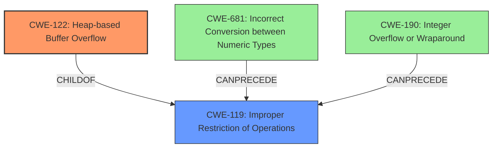

# Analysis Report for CVE-2020-22030

# Vulnerability Analysis Report: CVE-2020-22030

## Description


## Analysis (with Relationship Data)

# Summary
| CWE ID  | CWE Name  | Confidence | CWE Abstraction Level | CWE Vulnerability Mapping Label | CWE-Vulnerability Mapping Notes |
|---|---|---|---|---|---|
| CWE-122 | Heap-based Buffer Overflow | 1.0 | Variant | Allowed | Primary CWE |
| CWE-119 | Improper Restriction of Operations within the Bounds of a Memory Buffer | 0.7 | Class | Discouraged | Secondary Candidate |
| CWE-681 | Incorrect Conversion between Numeric Types | 0.5 | Base | Allowed | Secondary Candidate |

## Evidence and Confidence

*   **Confidence Score:** 0.9
*   **Evidence Strength:** HIGH

## Relationship Analysis
The primary relationship influencing the CWE selection is the parent-child relationship between CWE-119 (Improper Restriction of Operations within the Bounds of a Memory Buffer) and CWE-122 (Heap-based Buffer Overflow). CWE-122 is a variant of CWE-119, specifying that the buffer overflow occurs on the heap. Given the explicit mention of "heap-based buffer overflow" in the vulnerability description, the more specific CWE-122 is chosen. CWE-190 (Integer Overflow or Wraparound) can precede CWE-119, which could contribute to an incorrect buffer size calculation. CWE-681 (Incorrect Conversion between Numeric Types) can also precede CWE-119, such as by truncating a value used for buffer size.



## Vulnerability Chain
The vulnerability chain, based on the provided information and relationship analysis is:
1.  Possibly, an incorrect conversion between numeric types (CWE-681) or integer overflow (CWE-190) leads to
2.  **Heap-based Buffer Overflow** (CWE-122) because of an **improper** buffer size calculation or **missing** bounds check.
3.  Results in memory corruption.

## Summary of Analysis
The initial assessment strongly points to CWE-122 due to the explicit mention of a "heap-based buffer overflow" in the vulnerability description. The retriever results also list CWE-122, although with a lower score than other candidates. The root cause is a **heap-based buffer overflow** in FFmpeg 4.2 at libavfilter/af_afade.c in crossfade_samples_fltp, which might lead to memory corruption and other potential consequences.

The evidence from the vulnerability description is: "A **heap-based Buffer Overflow** vulnerability exists in FFmpeg 4.2 at libavfilter/af_afade.c in crossfade_samples_fltp, which might lead to memory corruption and other potential consequences."

The CVE Reference Links Content Summary reinforces this by stating: "**Root Cause:** A heap-buffer-overflow vulnerability exists within the `crossfade_samples_fltp` function in the `libavfilter/af_afade.c` file."

The graph relationships show that CWE-122 is a child of CWE-119, making it more specific. The selected CWE is at the optimal level of specificity because it precisely describes the type and location of the buffer overflow.

Relevant CWE Information:

# Enhanced Context (25 CWEs)
The following CWEs were identified as potentially relevant to this vulnerability:

## CWE-191: Integer Underflow (Wrap or Wraparound)
**Abstraction Level**: Base
**Similarity Score**: 0.79
**Source**: dense

**Description**:
The product subtracts one value from another, such that the result is less than the minimum allowable integer value, which produces a value that is not equal to the correct result.

**Mapping Guidance**:
- Usage: Allowed
- Rationale: This CWE entry is at the Base level of abstraction, which is a preferred level of abstraction for mapping to the root causes of vulnerabilities.


## CWE-197: Numeric Truncation Error
**Abstraction Level**: Base
**Similarity Score**: 0.79
**Source**: dense

**Description**:
Truncation errors occur when a primitive is cast to a primitive of a smaller size and data is lost in the conversion.

**Mapping Guidance**:
- Usage: Allowed
- Rationale: This CWE entry is at the Base level of abstraction, which is a preferred level of abstraction for mapping to the root causes of vulnerabilities.


## CWE-681: Incorrect Conversion between Numeric Types
**Abstraction Level**: Base
**Similarity Score**: 0.77
**Source**: dense

**Description**:
When converting from one data type to another, such as long to integer, data can be omitted or translated in a way that produces unexpected values. If the resulting values are used in a sensitive context, then dangerous behaviors may occur.

**Mapping Guidance**:
- Usage: Allowed
- Rationale: This CWE entry is at the Base level of abstraction, which is a preferred level of abstraction for mapping to the root causes of vulnerabilities.


## CWE-131: Incorrect Calculation of Buffer Size
**Abstraction Level**: Base
**Similarity Score**: 0.77
**Source**: dense

**Description**:
The product does not correctly calculate the size to be used when allocating a buffer, which could lead to a buffer overflow.

**Mapping Guidance**:
- Usage: Allowed
- Rationale: This CWE entry is at the Base level of abstraction, which is a preferred level of abstraction for mapping to the root causes of vulnerabilities.


## CWE-125: Out-of-bounds Read
**Abstraction Level**: Base
**Similarity Score**: 0.76
**Source**: dense

**Description**:
The product reads data past the end, or before the beginning, of the intended buffer.

**Mapping Guidance**:
- Usage: Allowed
- Rationale: This CWE entry is at the Base level of abstraction, which is a preferred level of abstraction for mapping to the root causes of vulnerabilities.


## CWE-124: Buffer Underwrite ('Buffer Underflow')
**Abstraction Level**: Base
**Similarity Score**: 0.76
**Source**: dense

**Description**:
The product writes to a buffer using an index or pointer that references a memory location prior to the beginning of the buffer.

**Mapping Guidance**:
- Usage: Allowed
- Rationale: This CWE entry is at the Base level of abstraction, which is a preferred level of abstraction for mapping to the root causes of vulnerabilities.


## CWE-805: Buffer Access with Incorrect Length Value
**Abstraction Level**: Base
**Similarity Score**: 0.75
**Source**: dense

**Description**:
The product uses a sequential operation to read or write a buffer, but it uses an incorrect length value that causes it to access memory that is outside of the bounds of the buffer.

**Mapping Guidance**:
- Usage: Allowed
- Rationale: This CWE entry is at the Base level of abstraction, which is a preferred level of abstraction for mapping to the root causes of vulnerabilities.


## CWE-190: Integer Overflow or Wraparound
**Abstraction Level**: Base
**Similarity Score**: 0.75
**Source**: dense

**Description**:
The product performs a calculation that can
         produce an integer overflow or wraparound when the logic
         assumes that the resulting value will always be larger than
         the original value. This occurs when an integer value is
         incremented to a value that is too large to store in the
         associated representation. When this occurs, the value may
         become a very small or negative number.

**Mapping Guidance**:
- Usage: Allowed
- Rationale: This CWE entry is at the Base level of abstraction, which is a preferred level of abstraction for mapping to the root causes of vulnerabilities.


## CWE-839: Numeric Range Comparison Without Minimum Check
**Abstraction Level**: Base
**Similarity Score**: 0.75
**Source**: dense

**Description**:
The product checks a value to ensure that it is less than or equal to a maximum, but it does not also verify that the value is greater than or equal to the minimum.

**Mapping Guidance**:
- Usage: Allowed
- Rationale: This CWE entry is at the Base level of abstraction, which is a preferred level of abstraction for mapping to the root causes of vulnerabilities.


## CWE-129: Improper Validation of Array Index
**Abstraction Level**: Variant
**Similarity Score**: 0.75
**Source**: dense


## CWE Relationship Analysis

Current CWEs represent these abstraction levels: .


### Vulnerability Chain Analysis

**Chain starting from CWE-839:**
- 839 (Numeric Range Comparison Without Minimum Check) - ROOT


**Chain starting from CWE-805:**
- 805 (Buffer Access with Incorrect Length Value) - ROOT


### CWE Relationship Diagram

```mermaid
graph TD
    classDef primary fill:#f96,stroke:#333,stroke-width:2px
    classDef secondary fill:#69f,stroke:#333
    classDef tertiary fill:#9e9,stroke:#333
```


*Report generated on 2025-04-02 06:46:38*
