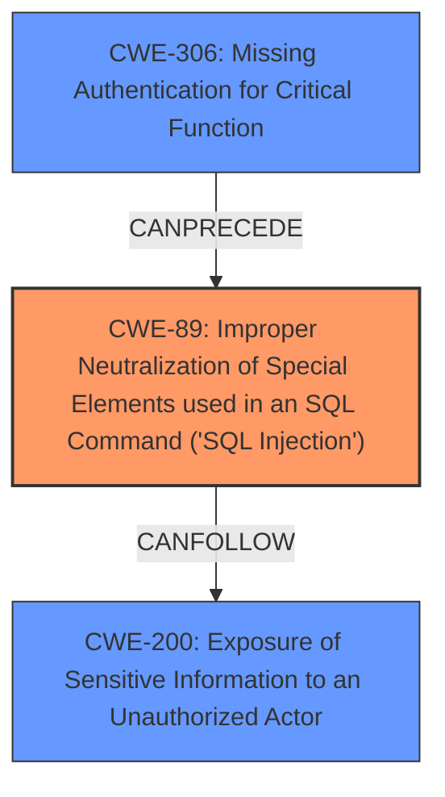

# Analysis Report for CVE-2020-22176

# Vulnerability Analysis Report: CVE-2020-22176

## Description


## Analysis (with Relationship Data)

# Summary
| CWE ID | CWE Name | Confidence | CWE Abstraction Level | CWE Vulnerability Mapping Label | CWE-Vulnerability Mapping Notes |
|---|---|---|---|---|---|
| CWE-89 | Improper Neutralization of Special Elements used in an SQL Command ('SQL Injection') | 1 | Base | Primary | Allowed |
| CWE-306 | Missing Authentication for Critical Function | 0.8 | Base | Secondary | Allowed |
| CWE-200 | Exposure of Sensitive Information to an Unauthorized Actor | 0.7 | Class | Secondary | Discouraged |

## Evidence and Confidence

*   **Confidence Score:** 0.9
*   **Evidence Strength:** HIGH

## Relationship Analysis
The primary weakness is **CWE-89 [Improper Neutralization of Special Elements used in an SQL Command ('SQL Injection')]**, which stems from the application's failure to properly sanitize user-supplied inputs before incorporating them into SQL queries. This can lead to **CWE-200 [Exposure of Sensitive Information to an Unauthorized Actor]** as sensitive data can be extracted through the injected SQL commands. Some instances are compounded by **CWE-306 [Missing Authentication for Critical Function]**, where a flawed authentication bypass allows unauthorized users to exploit the SQL injection vulnerabilities.



## Vulnerability Chain
The vulnerability chain starts with the **ROOTCAUSE** of **CWE-89 [Improper Neutralization of Special Elements used in an SQL Command ('SQL Injection')]**, where user-supplied data is directly incorporated into SQL queries without proper sanitization. In certain scenarios, this is preceded by **CWE-306 [Missing Authentication for Critical Function]**, which enables unauthenticated access to vulnerable functions. The resulting **impact** is **CWE-200 [Exposure of Sensitive Information to an Unauthorized Actor]**, as attackers can extract sensitive data from the database.

## Summary of Analysis
The initial assessment identified multiple SQL injection vulnerabilities due to the **IMPROPER** handling of user inputs in SQL queries, leading to potential sensitive information disclosure. This is further compounded by authentication bypass issues in certain instances.

*   **CWE-89 [Improper Neutralization of Special Elements used in an SQL Command ('SQL Injection')]** is selected as the primary CWE because the **ROOTCAUSE** in multiple areas is the application’s failure to sanitize user-supplied inputs before incorporating them into SQL queries. The "CVE Reference Links Content Summary" states: "The application directly incorporates the user-supplied `username` POST parameter into an SQL query without sanitization or parameterization."
*   **CWE-306 [Missing Authentication for Critical Function]** is included as a secondary CWE because the "CVE Reference Links Content Summary" indicates a "flawed authentication bypass" in some instances.
*   **CWE-200 [Exposure of Sensitive Information to an Unauthorized Actor]** is included as a secondary CWE because the "Vulnerability Description Key Phrases" indicate an "impact: sensitive information disclosure" and the "CVE Reference Links Content Summary" indicates that "An unauthenticated remote attacker can manipulate the SQL query to extract sensitive database information." However, **CWE-200 [Exposure of Sensitive Information to an Unauthorized Actor]** is a class level CWE and is "Discouraged" for usage, but it is included because it accurately identifies the impact of the vulnerability.

The selected CWEs are at the optimal level of specificity. **CWE-89 [Improper Neutralization of Special Elements used in an SQL Command ('SQL Injection')]** is a base level CWE, and **CWE-306 [Missing Authentication for Critical Function]** is also a base level CWE. I have followed the MITRE mapping guidance by selecting the most specific base level CWEs that accurately represent the vulnerability. **CWE-200 [Exposure of Sensitive Information to an Unauthorized Actor]** is a class level CWE, but it is included because it accurately identifies the impact of the vulnerability.


## CWE Relationship Analysis

Current CWEs represent these abstraction levels: .


### Vulnerability Chain Analysis

**Chain starting from CWE-89:**
- 89 (Improper Neutralization of Special Elements used in an SQL Command ('SQL Injection')) - ROOT


**Chain starting from CWE-306:**
- 306 (Missing Authentication for Critical Function) - ROOT


### CWE Relationship Diagram

```mermaid
graph TD
    classDef primary fill:#f96,stroke:#333,stroke-width:2px
    classDef secondary fill:#69f,stroke:#333
    classDef tertiary fill:#9e9,stroke:#333
```


*Report generated on 2025-04-02 17:26:11*
