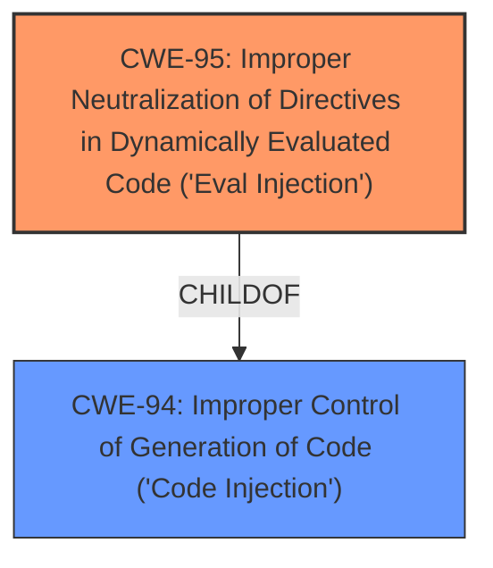

# Enhanced Analysis for CVE-2020-22201

# Summary
| CWE ID | CWE Name | Confidence | CWE Abstraction Level | CWE Vulnerability Mapping Label | CWE-Vulnerability Mapping Notes |
|---|---|---|---|---|---|
| CWE-95 | Improper Neutralization of Directives in Dynamically Evaluated Code ('Eval Injection') | 1.0 | Variant | Allowed | Primary CWE |
| CWE-94 | Improper Control of Generation of Code ('Code Injection') | 0.8 | Base | Allowed-with-Review | Secondary Candidate |

## Evidence and Confidence

*   **Confidence Score:** 0.9
*   **Evidence Strength:** HIGH

## Relationship Analysis
The primary CWE, CWE-95, is a variant of CWE-94. This hierarchical relationship indicates that CWE-95 is a more specific case of code injection, focusing on the use of `eval()`. The vulnerability description clearly states that the `pagesize` parameter is used in an `eval` function, making CWE-95 the more appropriate choice.



## Vulnerability Chain
The vulnerability chain starts with **unfiltered user input** via the `pagesize` parameter, leading to **code injection** because this input is directly passed to the `$urlrules` variable without sanitization, which is then used within an `eval()` function. The final impact is **arbitrary command injection** leading to remote code execution (RCE).

## Summary of Analysis
Initially, both CWE-95 and CWE-94 were considered due to the nature of the vulnerability involving code injection. However, the explicit mention of the use of the `eval()` function in the "CVE Reference Links Content Summary" strongly supports CWE-95 as the primary weakness.

>   "The `pagesize` parameter in `yp/product.php` is directly passed to the `$urlrules` variable without any filtering. This variable is later used in an `eval` function, allowing for arbitrary PHP code execution."

CWE-95 is a variant of CWE-94, indicating a more specific scenario of code injection where the injected code is dynamically evaluated. This specificity makes CWE-95 the most accurate representation of the vulnerability. The evidence is strong, and the relationship analysis further supports this decision.

Relevant CWE Information:

# Enhanced Context (25 CWEs)
The following CWEs were identified as potentially relevant to this vulnerability:

## CWE-74: Improper Neutralization of Special Elements in Output Used by a Downstream Component ('Injection')
**Abstraction Level**: Class
**Similarity Score**: 0.80
**Source**: dense

**Description**:
The product constructs all or part of a command, data structure, or record using externally-influenced input from an upstream component, but it does not neutralize or incorrectly neutralizes special elements that could modify how it is parsed or interpreted when it is sent to a downstream component.

**Mapping Guidance**:
- Usage: Discouraged
- Rationale: CWE-74 is high-level and often misused when lower-level weaknesses are more appropriate.

## CWE-95: Improper Neutralization of Directives in Dynamically Evaluated Code ('Eval Injection')
**Abstraction:** Variant
**Status:** Incomplete

### Description
The product receives input from an upstream component, but it does not neutralize or incorrectly neutralizes code syntax before using the input in a dynamic evaluation call (e.g. "eval").

### Extended Description
This may allow an attacker to execute arbitrary code, or at least modify what code can be executed.

### Alternative Terms
None

### Relationships
ChildOf -> CWE-94

### Mapping Guidance
**Usage:** Allowed
**Rationale:** This CWE entry is at the Variant level of abstraction, which is a preferred level of abstraction for mapping to the root causes of vulnerabilities.
**Comments:** Carefully read both the name and description to ensure that this mapping is an appropriate fit. Do not try to 'force' a mapping to a lower-level Base/Variant simply to comply with this preferred level of abstraction.
**Reasons:**
- Acceptable-Use

### Additional Notes
**[Other]** Factors: special character errors can play a role in increasing the variety of code that can be injected, although some vulnerabilities do not require special characters at all, e.g. when a single function without arguments can be referenced and a terminator character is not necessary.

### Observed Examples
- **CVE-2024-4181:** Framework for LLM applications allows eval injection via a crafted response from a hosting provider.
- **CVE-2022-2054:** Python compiler uses eval() to execute malicious strings as Python code.
- **CVE-2021-22204:** Chain: regex in EXIF processor code does not correctly determine where a string ends (CWE-625), enabling eval injection (CWE-95), as exploited in the wild per CISA KEV.

### Technical Explanation for CWE-95:
CWE-95 (Improper Neutralization of Directives in Dynamically Evaluated Code ('Eval Injection')) accurately describes the vulnerability because the **root cause** is the lack of proper input sanitization before the `pagesize` parameter is used within the `eval()` function. An attacker can inject arbitrary PHP code by crafting a malicious `pagesize` parameter, which is then executed by the `eval()` function.

The security implication is severe, leading to Remote Code Execution (RCE). The impact allows the attacker to execute arbitrary commands on the server, potentially compromising the entire system.

CWE-95 is a variant of CWE-94 (Improper Control of Generation of Code ('Code Injection')), indicating a more specific type of code injection involving dynamic evaluation. This relationship influenced the selection because the use of `eval()` narrows down the weakness to this specific variant.

### Technical Explanation for CWE-94:
CWE-94 (Improper Control of Generation of Code ('Code Injection')) is considered as a secondary candidate because the vulnerability involves injecting code. However, it is a more general case. Given that the `eval()` function is used, CWE-95 is a better fit.

### CWEs Considered But Not Used:
- CWE-78: Improper Neutralization of Special Elements used in an OS Command ('OS Command Injection') - While the ultimate impact is command execution, the **root cause** is not directly related to OS command injection but rather the use of `eval()` with unsanitized input.
- CWE-79: Improper Neutralization of Input During Web Page Generation ('Cross-site Scripting') - This is not relevant as the vulnerability does not involve injecting script into a web page.
- CWE-22: Improper Limitation of a Pathname to a Restricted Directory ('Path Traversal') - This is not relevant as the vulnerability does not involve path manipulation.
- CWE-434: Unrestricted Upload of File with Dangerous Type - This is not relevant as the vulnerability does not involve file uploads.
- CWE-89: Improper Neutralization of Special Elements used in an SQL Command ('SQL Injection') - This is not relevant as the vulnerability does not involve SQL injection.
- CWE-116: Improper Encoding or Escaping of Output - Although encoding could have prevented the eval, this vulnerability is more directly caused by the lack of sanitization before dynamic evaluation.
- CWE-184: Incomplete List of Disallowed Inputs - There's no clear evidence of a denylist being attempted.


## CWE Relationship Analysis

Current CWEs represent these abstraction levels: .


### Vulnerability Chain Analysis

**Chain starting from CWE-79:**
- 79 (Improper Neutralization of Input During Web Page Generation ('Cross-site Scripting')) - ROOT


**Chain starting from CWE-78:**
- 78 (Improper Neutralization of Special Elements used in an OS Command ('OS Command Injection')) - ROOT


### CWE Relationship Diagram

```mermaid
graph TD
    classDef primary fill:#f96,stroke:#333,stroke-width:2px
    classDef secondary fill:#69f,stroke:#333
    classDef tertiary fill:#9e9,stroke:#333
```