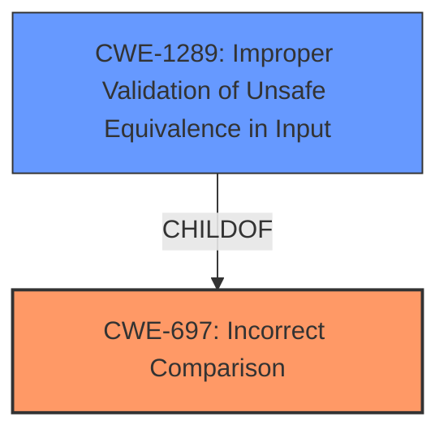

# Enhanced Analysis for CVE-2020-22784

# Summary
| CWE ID | CWE Name | Confidence | CWE Abstraction Level | CWE Vulnerability Mapping Label | CWE-Vulnerability Mapping Notes |
|---|---|---|---|---|---|
| CWE-697 | Incorrect Comparison | 0.8 | Pillar | Primary | Discouraged |
| CWE-1289 | Improper Validation of Unsafe Equivalence in Input | 0.6 | Base | Secondary | Allowed |

## Evidence and Confidence

*   **Confidence Score:** 0.7
*   **Evidence Strength:** MEDIUM

## Relationship Analysis
The primary relationship influencing the CWE selection is that CWE-697 is a very general Pillar, while CWE-1289 is a more specific Base. Given the evidence, both are plausible but CWE-1289 offers more detail related to the input validation aspect.



## Vulnerability Chain
The vulnerability chain starts with the **MySQL omitting trailing spaces on char / varchar columns during comparisons**, leading to **incorrect comparison**, and finally resulting in a bypass of access controls enforced on key names.

## Summary of Analysis
Initially, CWE-697 was considered because the vulnerability involves an **incorrect comparison**. The vulnerability description states: "In Etherpad UeberDB < 0.4.4, due to **MySQL omitting trailing spaces on char / varchar columns during comparisons**, retrieving database records using UeberDBs MySQL connector could allow bypassing access controls enforced on key names." This directly points to an **incorrect comparison** performed by MySQL.

However, upon further analysis, CWE-1289 was also considered. The vulnerability involves **MySQL omitting trailing spaces on char / varchar columns during comparisons** which is a form of improper validation since equivalence wasn't correctly determined in the input "key name" used for accessing database records.

The final decision is to include both CWE-697 and CWE-1289. CWE-697 is a higher-level description of the general problem of **incorrect comparison**, while CWE-1289 describes the more specific improper validation aspect relating to how equivalence in input is handled. The abstraction levels and mapping guidance support this decision. The evidence supports this mapping, but more detail on the exact implementation of the access controls would increase confidence.

Relevant CWE Information:

# Enhanced Context (25 CWEs)
The following CWEs were identified as potentially relevant to this vulnerability:

## CWE-1289: Improper Validation of Unsafe Equivalence in Input
**Abstraction Level**: Base
**Similarity Score**: 0.77
**Source**: dense

**Description**:
The product receives an input value that is used as a resource identifier or other type of reference, but it does not validate or incorrectly validates that the input is equivalent to a potentially-unsafe value.

**Mapping Guidance**:
- Usage: Allowed
- Rationale: This CWE entry is at the Base level of abstraction, which is a preferred level of abstraction for mapping to the root causes of vulnerabilities.

## CWE-697: Incorrect Comparison
**Abstraction:** Pillar
**Status:** Incomplete

### Description
The product compares two entities in a security-relevant context, but the comparison is incorrect, which may lead to resultant weaknesses.

### Extended Description


This Pillar covers several possibilities:


  - the comparison checks one factor incorrectly;

  - the comparison should consider multiple factors, but it does not check at least one of those factors at all;

  - the comparison checks the wrong factor.

### Mapping Guidance
**Usage:** Discouraged
**Rationale:** This CWE entry is extremely high-level, a Pillar. However, sometimes this weakness is forced to be used due to the lack of in-depth weakness research. See Research Gaps.
**Comments:** Where feasible, consider children or descendants of this entry instead.

### Technical Explanation for CWE-697:
The vulnerability's details align with CWE-697 because the **root cause** is the **incorrect comparison** of key names in the MySQL database due to the omission of trailing spaces. This leads to the system failing to properly differentiate between different keys, potentially granting unauthorized access. The security implication is a bypass of access controls. CWE-697 is a Pillar, which is a high-level categorization. The MITRE mapping guidance discourages its use when more specific CWEs are available, but it accurately captures the general nature of the **incorrect comparison**.

### Technical Explanation for CWE-1289:
The vulnerability aligns with CWE-1289 because the system receives an input value (the key name) that's used as a resource identifier but **does not validate or incorrectly validates** that the input is equivalent to a potentially-unsafe value. The **root cause** is **MySQL omitting trailing spaces on char / varchar columns during comparisons**. The security implication is a bypass of access control which enables an attacker to get unauthorized access. CWE-1289 is at the Base level, providing a more specific view of the weakness.

### CWEs Considered But Not Used
CWE-287 (Improper Authentication) was considered but not ultimately chosen because the vulnerability is not directly related to the authentication process itself but rather to an **incorrect comparison** within the database query that bypasses access control. CWE-41 (Improper Resolution of Path Equivalence) was considered because it involves path equivalence issues, but the vulnerability doesn't primarily revolve around file system paths but rather database key comparisons. The same rationale applies to excluding CWE-59 (Improper Link Resolution Before File Access).


## CWE Relationship Analysis

Current CWEs represent these abstraction levels: .


### Vulnerability Chain Analysis

**Chain starting from CWE-41:**
- 41 (Improper Resolution of Path Equivalence) - ROOT


**Chain starting from CWE-287:**
- 287 (Improper Authentication) - ROOT


### CWE Relationship Diagram

```mermaid
graph TD
    classDef primary fill:#f96,stroke:#333,stroke-width:2px
    classDef secondary fill:#69f,stroke:#333
    classDef tertiary fill:#9e9,stroke:#333
```