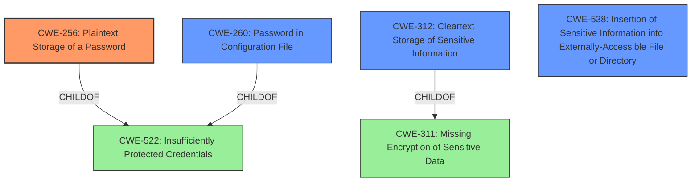

# Analysis Report for CVE-2020-2291

# Vulnerability Analysis Report: CVE-2020-2291

## Description


## Analysis (with Relationship Data)

# Summary
| CWE ID | CWE Name | Confidence | CWE Abstraction Level | CWE Vulnerability Mapping Label | CWE-Vulnerability Mapping Notes |
|---|---|---|---|---|---|
| CWE-256 | Plaintext Storage of a Password | 1.0 | Base | Allowed | Primary CWE |
| CWE-260 | Password in Configuration File | 0.8 | Base | Allowed | Secondary Candidate |
| CWE-538 | Insertion of Sensitive Information into Externally-Accessible File or Directory | 0.6 | Base | Allowed | Secondary Candidate |
| CWE-312 | Cleartext Storage of Sensitive Information | 0.6 | Base | Allowed | Secondary Candidate |

## Evidence and Confidence

*   **Confidence Score:** 0.9
*   **Evidence Strength:** HIGH

## Relationship Analysis
The primary CWE is CWE-256 [Plaintext Storage of a Password], a base level CWE. CWE-256 is a child of CWE-522 [Insufficiently Protected Credentials], which is a class level CWE. CWE-260 [Password in Configuration File] is also a child of CWE-522. CWE-312 [Cleartext Storage of Sensitive Information] is a child of CWE-311 [Missing Encryption of Sensitive Data].



## Vulnerability Chain
The vulnerability chain starts with the **unencrypted storage** of the password in the global configuration file. This leads to the impact of unauthorized viewing of the password, which could potentially lead to unauthorized access to the CouchDB server.

## Summary of Analysis
The vulnerability involves the Jenkins couchdb-statistics Plugin storing its server password **unencrypted** in its global configuration file. This allows users with access to the Jenkins controller file system to view the password.

The primary CWE selected is CWE-256 [Plaintext Storage of a Password]. This is because the root cause of the vulnerability is the storage of the password in plaintext. The **Vulnerability Description Key Phrases** indicated the **weakness** was the **unencrypted storage**. The **CVE Reference Links Content Summary** also indicates that the root cause of the vulnerability is that the couchdb-statistics Plugin stores its server password **unencrypted** in its global configuration file.

CWE-260 [Password in Configuration File] was also considered since the password was stored in a configuration file, which is accessible to users with access to the Jenkins controller file system.

CWE-538 [Insertion of Sensitive Information into Externally-Accessible File or Directory] was considered because the **unencrypted** password was placed in a file that is accessible to actors who are allowed to have access to the files, but not to the sensitive information.

CWE-312 [Cleartext Storage of Sensitive Information] was considered because the sensitive information (the password) is stored in **cleartext**.

CWE-256 [Plaintext Storage of a Password] is the most specific and appropriate CWE because the password is in plaintext. All of the selected CWEs are base or variant level, which are the preferred levels of abstraction for mapping to the root causes of vulnerabilities.


## CWE Relationship Analysis

Current CWEs represent these abstraction levels: .


### Vulnerability Chain Analysis

**Chain starting from CWE-312:**
- 312 (Cleartext Storage of Sensitive Information) - ROOT


**Chain starting from CWE-538:**
- 538 (Insertion of Sensitive Information into Externally-Accessible File or Directory) - ROOT


### CWE Relationship Diagram

```mermaid
graph TD
    classDef primary fill:#f96,stroke:#333,stroke-width:2px
    classDef secondary fill:#69f,stroke:#333
    classDef tertiary fill:#9e9,stroke:#333
```


*Report generated on 2025-04-02 07:50:26*
