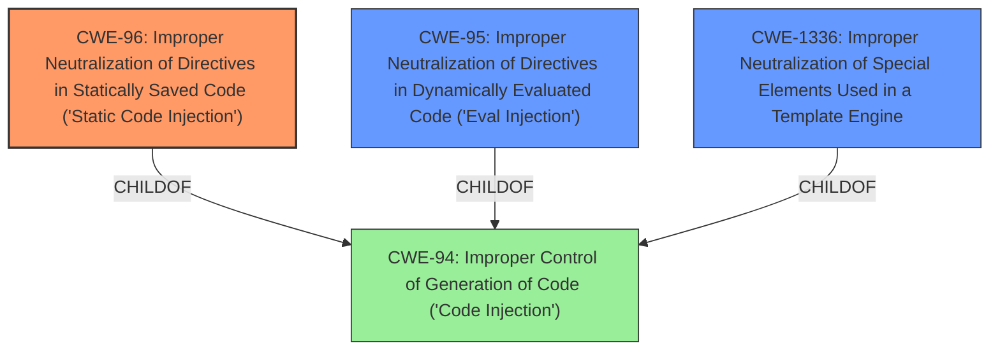

# Enhanced Analysis for CVE-2020-22937

# Summary
| CWE ID | CWE Name | Confidence | CWE Abstraction Level | CWE Vulnerability Mapping Label | CWE-Vulnerability Mapping Notes |
|---|---|---|---|---|---|
| CWE-96 | Improper Neutralization of Directives in Statically Saved Code ('Static Code Injection') | 1 | Base | Primary | Allowed |
| CWE-95 | Improper Neutralization of Directives in Dynamically Evaluated Code ('Eval Injection') | 0.75 | Variant | Secondary | Allowed |
| CWE-1336 | Improper Neutralization of Special Elements Used in a Template Engine | 0.5 | Base | Secondary | Allowed |

## Evidence and Confidence

*   **Confidence Score:** 0.9
*   **Evidence Strength:** HIGH

## Relationship Analysis
The primary CWE selected is CWE-96, which is a base-level CWE describing static code injection. The analysis also considered CWE-95 (Eval Injection) and CWE-1336 (Improper Neutralization of Special Elements Used in a Template Engine) as secondary candidates due to the nature of the vulnerability involving injecting code into a file.



## Vulnerability Chain
The vulnerability chain begins with the **lack of input sanitization** when processing the `mydbtbpre` parameter, which leads to **code injection** because the unsanitized input is directly inserted into a configuration file. The ultimate impact is **arbitrary code execution**, potentially leading to a webshell and full control of the server.

## Summary of Analysis
The initial assessment identified CWE-96 as the primary weakness due to the direct injection of PHP code into a static configuration file. The evidence from the "CVE Reference Links Content Summary" clearly states that the `mydbtbpre` parameter is directly inserted into the configuration file without any filtering or sanitization, allowing an attacker to inject arbitrary PHP code.

> The vulnerability stems from the **lack of proper input sanitization** when processing the database table prefix (`mydbtbpre`) during the CMS installation... This function performs string replacements on a configuration file template, where the provided `mydbtbpre` is directly inserted into the configuration file without any filtering or sanitization.
> **Code Injection:** The primary vulnerability is code injection. Because the `mydbtbpre` parameter is not sanitized, an attacker can inject arbitrary PHP code into the configuration file by setting it to a value like `phome_';phpinfo();//`.

CWE-96 (Improper Neutralization of Directives in Statically Saved Code ('Static Code Injection')) is the most appropriate because it specifically addresses the scenario where code is injected into an executable resource like a configuration file. The "Mapping Guidance" for CWE-96 also states it is at the Base level of abstraction, which is preferred.

CWE-95 (Improper Neutralization of Directives in Dynamically Evaluated Code ('Eval Injection')) was considered as a secondary CWE because the injected code is then dynamically evaluated when the configuration file is used. However, the initial injection into the static file is the primary weakness.

CWE-1336 (Improper Neutralization of Special Elements Used in a Template Engine) was also considered because the configuration file could be viewed as a template. However, the core issue is the direct injection of code, rather than the improper handling of template syntax.

The relationships in the graph highlight how CWE-96, CWE-95, and CWE-1336 are all children of CWE-94 (Improper Control of Generation of Code ('Code Injection')), but CWE-96 is the most specific and accurate representation of the vulnerability.

The mitigation of adding PHP character filtering aligns with preventing the code injection by sanitizing the input.

Other CWEs Considered and Rejected:

*   CWE-78 (Improper Neutralization of Special Elements used in an OS Command ('OS Command Injection')): This was rejected because the vulnerability does not involve the construction of OS commands.
*   CWE-434 (Unrestricted Upload of File with Dangerous Type): This was rejected because the vulnerability does not involve uploading files.
*   CWE-22 (Improper Limitation of a Pathname to a Restricted Directory ('Path Traversal')): This was rejected because the vulnerability does not involve path traversal.


## CWE Relationship Analysis

Current CWEs represent these abstraction levels: .


### Vulnerability Chain Analysis

**Chain starting from CWE-1336:**
- 1336 (Improper Neutralization of Special Elements Used in a Template Engine) - ROOT


**Chain starting from CWE-96:**
- 96 (Improper Neutralization of Directives in Statically Saved Code ('Static Code Injection')) - ROOT


### CWE Relationship Diagram

```mermaid
graph TD
    classDef primary fill:#f96,stroke:#333,stroke-width:2px
    classDef secondary fill:#69f,stroke:#333
    classDef tertiary fill:#9e9,stroke:#333
```