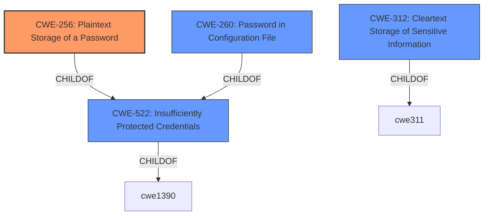

# Raw Analyzer Response for CVE-2020-2297

# Summary
| CWE ID | CWE Name | Confidence | CWE Abstraction Level | CWE Vulnerability Mapping Label | CWE-Vulnerability Mapping Notes |
|---|---|---|---|---|---|
| CWE-256 | Plaintext Storage of a Password | 1.0 | Base | Allowed | Primary CWE |
| CWE-260 | Password in Configuration File | 0.8 | Base | Allowed | Secondary Candidate |
| CWE-312 | Cleartext Storage of Sensitive Information | 0.7 | Base | Allowed | Secondary Candidate |
| CWE-522 | Insufficiently Protected Credentials | 0.6 | Class | Allowed-with-Review | Secondary Candidate |

## Evidence and Confidence

*   **Confidence Score:** 0.9
*   **Evidence Strength:** HIGH

## Relationship Analysis
The primary relationship that impacted the decision was the parent-child relationship between CWE-522 (Insufficiently Protected Credentials) and CWE-256 (Plaintext Storage of a Password). CWE-256 is a more specific case of storing credentials insecurely, thus providing a more accurate classification.

## Vulnerability Chain
The vulnerability chain starts with the **access token unencrypted storage** in the global configuration file, leading to potential unauthorized access and usage by attackers with access to the Jenkins controller file system.

## Summary of Analysis
The analysis is based on the provided vulnerability description and CVE reference. The key piece of evidence is that "Jenkins SMS Notification Plugin 1.2 and earlier stores an **access token unencrypted** in its global configuration file on the Jenkins controller where it can be viewed by users with access to the Jenkins controller file system."

The selection of CWE-256 is based on the fact that the **access token**, which functions as a password, is stored in plaintext. This is the most specific and accurate representation of the vulnerability. The retriever results also listed CWE-256 as the top candidate.

Other CWEs, such as CWE-522 (Insufficiently Protected Credentials), CWE-260 (Password in Configuration File) and CWE-312 (Cleartext Storage of Sensitive Information) were considered but deemed less specific. While CWE-522 is related, CWE-256 directly addresses the plaintext storage of a password. Similarly, while CWE-260 acknowledges that the password is in a configuration file, CWE-256 focuses on the core issue of plaintext storage. CWE-312 is more generic and doesn't explicitly mention passwords.

Relevant CWE Information:

# Enhanced Context (25 CWEs)

## CWE-312: Cleartext Storage of Sensitive Information
**Abstraction Level**: Base
**Similarity Score**: 0.84
**Source**: dense

**Description**:
The product stores sensitive information in cleartext within a resource that might be accessible to another control sphere.

**Mapping Guidance**:
- Usage: Allowed
- Rationale: This CWE entry is at the Base level of abstraction, which is a preferred level of abstraction for mapping to the root causes of vulnerabilities.

## CWE-319: Cleartext Transmission of Sensitive Information
**Abstraction Level**: Base
**Similarity Score**: 0.79
**Source**: dense

**Description**:
The product transmits sensitive or security-critical data in cleartext in a communication channel that can be sniffed by unauthorized actors.

**Mapping Guidance**:
- Usage: Allowed
- Rationale: This CWE entry is at the Base level of abstraction, which is a preferred level of abstraction for mapping to the root causes of vulnerabilities.

## CWE-256: Plaintext Storage of a Password
**Abstraction Level**: Base
**Similarity Score**: 0.79
**Source**: dense

**Description**:
Storing a password in plaintext may result in a system compromise.

**Mapping Guidance**:
- Usage: Allowed
- Rationale: This CWE entry is at the Base level of abstraction, which is a preferred level of abstraction for mapping to the root causes of vulnerabilities.

## CWE-311: Missing Encryption of Sensitive Data
**Abstraction Level**: Class
**Similarity Score**: 0.79
**Source**: dense

**Description**:
The product does not encrypt sensitive or critical information before storage or transmission.

**Mapping Guidance**:
- Usage: Discouraged
- Rationale: CWE-311 is high-level with more precise children available. It is a level-1 Class (i.e., a child of a Pillar).

## CWE-522: Insufficiently Protected Credentials
**Abstraction Level**: Class
**Similarity Score**: 0.78
**Source**: dense

**Description**:
The product transmits or stores authentication credentials, but it uses an insecure method that is susceptible to unauthorized interception and/or retrieval.

**Mapping Guidance**:
- Usage: Allowed-with-Review
- Rationale: This CWE entry is a Class and might have Base-level children that would be more appropriate

## CWE-538: Insertion of Sensitive Information into Externally-Accessible File or Directory
**Abstraction Level**: Base
**Similarity Score**: 0.77
**Source**: dense

**Description**:
The product places sensitive information into files or directories that are accessible to actors who are allowed to have access to the files, but not to the sensitive information.

**Mapping Guidance**:
- Usage: Allowed
- Rationale: This CWE entry is at the Base level of abstraction, which is a preferred level of abstraction for mapping to the root causes of vulnerabilities.

## CWE-316: Cleartext Storage of Sensitive Information in Memory
**Abstraction Level**: Variant
**Similarity Score**: 0.77
**Source**: dense

**Description**:
The product stores sensitive information in cleartext in memory.

**Mapping Guidance**:
- Usage: Allowed
- Rationale: This CWE entry is at the Variant level of abstraction, which is a preferred level of abstraction for mapping to the root causes of vulnerabilities.

## CWE-257: Storing Passwords in a Recoverable Format
**Abstraction Level**: Base
**Similarity Score**: 0.76
**Source**: dense

**Description**:
The storage of passwords in a recoverable format makes them subject to password reuse attacks by malicious users. In fact, it should be noted that recoverable encrypted passwords provide no significant benefit over plaintext passwords since they are subject not only to reuse by malicious attackers but also by malicious insiders. If a system administrator can recover a password directly, or use a brute force search on the available information, the administrator can use the password on other accounts.

**Mapping Guidance**:
- Usage: Allowed
- Rationale: This CWE entry is at the Base level of abstraction, which is a preferred level of abstraction for mapping to the root causes of vulnerabilities.

## CWE-922: Insecure Storage of Sensitive Information
**Abstraction Level**: Class
**Similarity Score**: 0.76
**Source**: dense

**Description**:
The product stores sensitive information without properly limiting read or write access by unauthorized actors.

**Mapping Guidance**:
- Usage: Allowed-with-Review
- Rationale: This CWE entry is a Class and might have Base-level children that would be more appropriate

## CWE-313: Cleartext Storage in a File or on Disk
**Abstraction Level**: Variant
**Similarity Score**: 0.76
**Source**: dense

**Description**:
The product stores sensitive information in cleartext in a file, or on disk.

**Mapping Guidance**:
- Usage: Allowed
- Rationale: This CWE entry is at the Variant level of abstraction, which is a preferred level of abstraction for mapping to the root causes of vulnerabilities.

## CWE-319: Cleartext Transmission of Sensitive Information
**Abstraction Level**: Base
**Similarity Score**: 4609.30
**Source**: sparse

**Description**:
The product transmits sensitive or security-critical data in cleartext in a communication channel that can be sniffed by unauthorized actors.

**Mapping Guidance**:
- Usage: Allowed
- Rationale: This CWE entry is at the Base level of abstraction, which is a preferred level of abstraction for mapping to the root causes of vulnerabilities.

## CWE-312: Cleartext Storage of Sensitive Information
**Abstraction Level**: Base
**Similarity Score**: 4607.41
**Source**: sparse

**Description**:
The product stores sensitive information in cleartext within a resource that might be