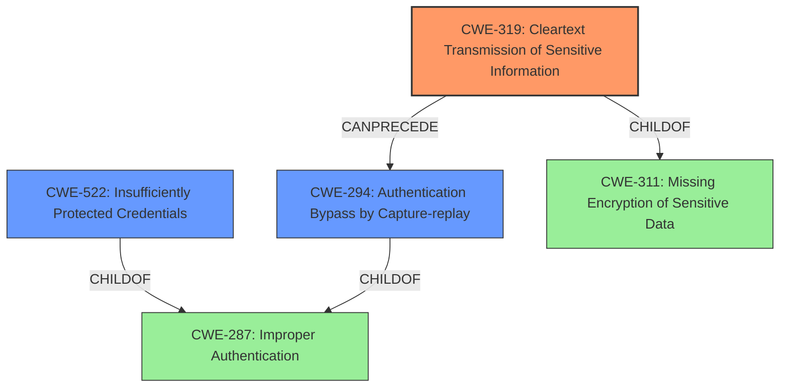

# Analysis Report for CVE-2020-23036

# Vulnerability Analysis Report: CVE-2020-23036

## Description


## Analysis (with Relationship Data)

# Summary
| CWE ID | CWE Name | Confidence | CWE Abstraction Level | CWE Vulnerability Mapping Label | CWE-Vulnerability Mapping Notes |
|---|---|---|---|---|---|
| CWE-319 | Cleartext Transmission of Sensitive Information | 1 | Base | Primary | Allowed |
| CWE-522 | Insufficiently Protected Credentials | 0.8 | Class | Secondary | Allowed-with-Review |
| CWE-294 | Authentication Bypass by Capture-replay | 0.7 | Base | Secondary | Allowed |

## Evidence and Confidence

*   **Confidence Score:** 0.9
*   **Evidence Strength:** HIGH

## Relationship Analysis
The primary CWE is CWE-319, which directly addresses the **cleartext transmission** of the password. CWE-522 is a broader classification related to **insufficiently protected credentials**, which is relevant since the credentials are being sent in the clear. CWE-294 becomes relevant because **cleartext transmission** allows for **capture-replay attacks**. CWE-319 is a child of CWE-311 (Missing Encryption of Sensitive Data), highlighting the lack of encryption as the root cause. CWE-522 is a class-level CWE and has more specific base-level children that could be considered.



## Vulnerability Chain
The vulnerability chain starts with the **insecure session validation** that leads to the transmission of the password in **cleartext**. This **cleartext transmission** makes it easy to intercept the credentials using a man-in-the-middle attack. The intercepted credentials can then be replayed to bypass authentication.
  - Insecure Session Validation -> **Cleartext Transmission** (CWE-319) -> Interception of Credentials -> Authentication Bypass by Capture-Replay (CWE-294)

## Summary of Analysis
The primary weakness is the **cleartext transmission of sensitive information** (CWE-319). The evidence from the vulnerability description and CVE reference links clearly indicates that the password parameter is being sent in plain text over HTTP.
> Vulnerability Description: "...**insecure session validation** vulnerability in the session handling of the `password` authentication parameter...This vulnerability allows attackers...to read the authentication credentials...via a man in the middle attack."
> CVE Reference Links Content Summary: "Plain-text transmission of authentication credentials (password) over HTTP."

This aligns with CWE-319's description: "The product transmits sensitive or security-critical data in cleartext in a communication channel that can be sniffed by unauthorized actors."

CWE-522 (Insufficiently Protected Credentials) is a relevant secondary consideration because the credentials are not adequately protected during transmission. However, CWE-319 is more specific to the **cleartext transmission** itself, making it a better primary choice.

CWE-294 (Authentication Bypass by Capture-replay) is also a relevant secondary consideration as **cleartext transmission** makes capture and replay possible.

The final CWE selection is based on direct evidence, supporting relationships, and adherence to mapping guidance, favoring the most specific and descriptive CWE.

Relevant CWE Information:

# Enhanced Context (25 CWEs)
The following CWEs were identified as potentially relevant to this vulnerability:

## CWE-312: Cleartext Storage of Sensitive Information
**Abstraction Level**: Base
**Similarity Score**: 0.78
**Source**: dense

**Description**:
The product stores sensitive information in cleartext within a resource that might be accessible to another control sphere.

**Mapping Guidance**:
- Usage: Allowed
- Rationale: This CWE entry is at the Base level of abstraction, which is a preferred level of abstraction for mapping to the root causes of vulnerabilities.

## CWE-538: Insertion of Sensitive Information into Externally-Accessible File or Directory
**Abstraction Level**: Base
**Similarity Score**: 0.77
**Source**: dense

**Description**:
The product places sensitive information into files or directories that are accessible to actors who are allowed to have access to the files, but not to the sensitive information.

**Mapping Guidance**:
- Usage: Allowed
- Rationale: This CWE entry is at the Base level of abstraction, which is a preferred level of abstraction for mapping to the root causes of vulnerabilities.

## CWE-798: Use of Hard-coded Credentials
**Abstraction Level**: Base
**Similarity Score**: 0.76
**Source**: dense

**Description**:
The product contains hard-coded credentials, such as a password or cryptographic key.

**Mapping Guidance**:
- Usage: Allowed
- Rationale: This CWE entry is at the Base level of abstraction, which is a preferred level of abstraction for mapping to the root causes of vulnerabilities.

## CWE-319: Cleartext Transmission of Sensitive Information
**Abstraction Level**: Base
**Similarity Score**: 0.76
**Source**: dense

**Description**:
The product transmits sensitive or security-critical data in cleartext in a communication channel that can be sniffed by unauthorized actors.

**Mapping Guidance**:
- Usage: Allowed
- Rationale: This CWE entry is at the Base level of abstraction, which is a preferred level of abstraction for mapping to the root causes of vulnerabilities.

## CWE-345: Insufficient Verification of Data Authenticity
**Abstraction Level**: Class
**Similarity Score**: 0.75
**Source**: dense

**Description**:
The product does not sufficiently verify the origin or authenticity of data, in a way that causes it to accept invalid data.

**Mapping Guidance**:
- Usage: Discouraged
- Rationale: This CWE entry is a level-1 Class (i.e., a child of a Pillar). It might have lower-level children that would be more appropriate

## CWE-807: Reliance on Untrusted Inputs in a Security Decision
**Abstraction Level**: Base
**Similarity Score**: 0.75
**Source**: dense

**Description**:
The product uses a protection mechanism that relies on the existence or values of an input, but the input can be modified by an untrusted actor in a way that bypasses the protection mechanism.

**Mapping Guidance**:
- Usage: Allowed
- Rationale: This CWE entry is at the Base level of abstraction, which is a preferred level of abstraction for mapping to the root causes of vulnerabilities.

## CWE-1391: Use of Weak Credentials
**Abstraction Level**: Class
**Similarity Score**: 0.75
**Source**: dense

**Description**:
The product uses weak credentials (such as a default key or hard-coded password) that can be calculated, derived, reused, or guessed by an attacker.

**Mapping Guidance**:
- Usage: Allowed-with-Review
- Rationale: This CWE entry is a Class and might have Base-level children that would be more appropriate

## CWE-311: Missing Encryption of Sensitive Data
**Abstraction Level**: Class
**Similarity Score**: 0.75
**Source**: dense

**Description**:
The product does not encrypt sensitive or critical information before storage or transmission.

**Mapping Guidance**:
- Usage: Discouraged
- Rationale: CWE-311 is high-level with more precise children available. It is a level-1 Class (i.e., a child of a Pillar).

## CWE-212: Improper Removal of Sensitive Information Before Storage or Transfer
**Abstraction Level**: Base
**Similarity Score**: 0.75
**Source**: dense

**Description**:
The product stores, transfers, or shares a resource that contains sensitive information, but it does not properly remove that information before the product makes the resource available to unauthorized actors.

**Mapping Guidance**:
- Usage: Allowed
- Rationale: This CWE entry is at the Base level of abstraction, which is a preferred level of abstraction for mapping to the root causes of vulnerabilities.

## CWE-522: Insufficiently Protected Credentials
**Abstraction Level**: Class
**Similarity Score**: 0.74
**Source**: dense

**Description**:
The product transmits or stores authentication credentials, but it uses an insecure method that is susceptible to unauthorized interception and/or retrieval.

**Mapping Guidance**:
- Usage: Allowed-with-Review
- Rationale: This CWE entry is a Class and


## CWE Relationship Analysis

Current CWEs represent these abstraction levels: .


### Vulnerability Chain Analysis

**Chain starting from CWE-294:**
- 294 (Authentication Bypass by Capture-replay) - ROOT


**Chain starting from CWE-312:**
- 312 (Cleartext Storage of Sensitive Information) - ROOT


### CWE Relationship Diagram

```mermaid
graph TD
    classDef primary fill:#f96,stroke:#333,stroke-width:2px
    classDef secondary fill:#69f,stroke:#333
    classDef tertiary fill:#9e9,stroke:#333
```


*Report generated on 2025-04-01 19:35:50*
