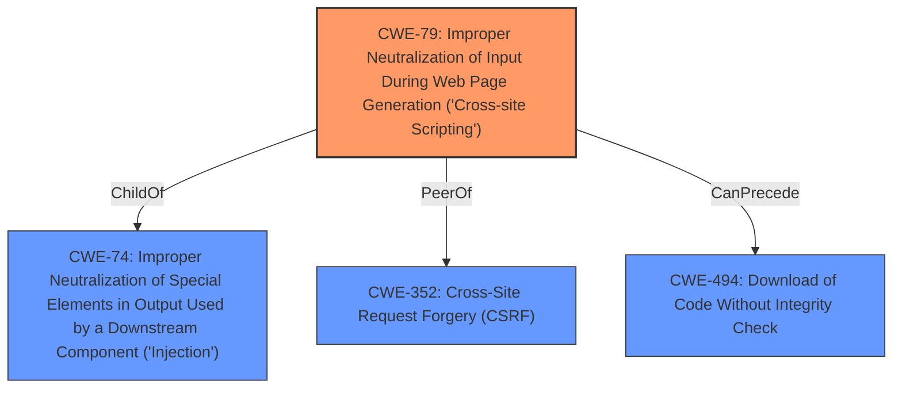

# Analysis for CVE-2020-23050

# Summary
| CWE ID | CWE Name | Confidence | CWE Abstraction Level | CWE Vulnerability Mapping Label | CWE-Vulnerability Mapping Notes |
|---|---|---|---|---|---|
| CWE-79 | Improper Neutralization of Input During Web Page Generation ('Cross-site Scripting') | 1.0 | Base | Allowed | Primary CWE |

## Evidence and Confidence

*   **Confidence Score:** 1.0
*   **Evidence Strength:** HIGH

## Relationship Analysis
The primary relationship influencing the choice of CWE-79 is its base-level abstraction, aligning with the goal of identifying specific weaknesses. While CWE-74 (Improper Neutralization of Special Elements in Output Used by a Downstream Component ('Injection')) is a parent, CWE-79 provides a more specific classification as the vulnerability involves the generation of a web page with unneutralized input. The tool also indicates that CWE-79 can precede CWE-494 (Download of Code Without Integrity Check) and is a peer of CWE-352, indicating the potential for related vulnerabilities, but these are not directly relevant to the given description.

## Vulnerability Chain
The vulnerability chain starts with **insufficient input sanitization** which directly leads to **HTML injection**, eventually allowing attackers to **execute phishing attacks, external redirects, and arbitrary code**.

## Summary of Analysis
The analysis is based on the provided vulnerability description and the associated CVE reference links content summary. The description explicitly states that there is an **HTML injection** vulnerability due to **insufficient input sanitization**. This is clear evidence for selecting CWE-79 (Improper Neutralization of Input During Web Page Generation ('Cross-site Scripting')).

The vulnerability description states: "TAO Open Source Assessment Platform v3.3.0 RC02 was discovered to contain a **HTML injection** vulnerability in the userFirstName parameter of the user account input field. This vulnerability allows attackers to execute phishing attacks, external redirects, and arbitrary code."

The CVE Reference Links Content Summary states: "Root cause: Insufficient input sanitization in user account input fields. Weaknesses/vulnerabilities: HTML injection vulnerability. Impact: Persistent phishing attacks. Persistent external redirects to malicious sources. Persistent manipulation of affected application modules. Vulnerable parameters: `userFirstName`, `userLastName`, `userMail`, `password2`, and `password3`."

CWE-79 is at the optimal level of specificity because it directly addresses the root cause of the vulnerability, which is the improper neutralization of input during web page generation, leading to cross-site scripting.

CWE-116 (Improper Encoding or Escaping of Output) was considered but not selected because the primary issue is the lack of neutralization rather than incorrect encoding or escaping.

CWE-78 (Improper Neutralization of Special Elements used in an OS Command ('OS Command Injection')) was considered but not selected because the injection occurs in the context of a web page, not an operating system command.

CWE-1336 (Improper Neutralization of Special Elements Used in a Template Engine) was considered, as template engines can be involved in web page generation, but the description doesn't specifically mention the use of a template engine.

CWE-472 (External Control of Assumed-Immutable Web Parameter) was considered because the vulnerable parameter is part of user account input, but the core issue is the lack of sanitization rather than the modification of assumed-immutable parameters.