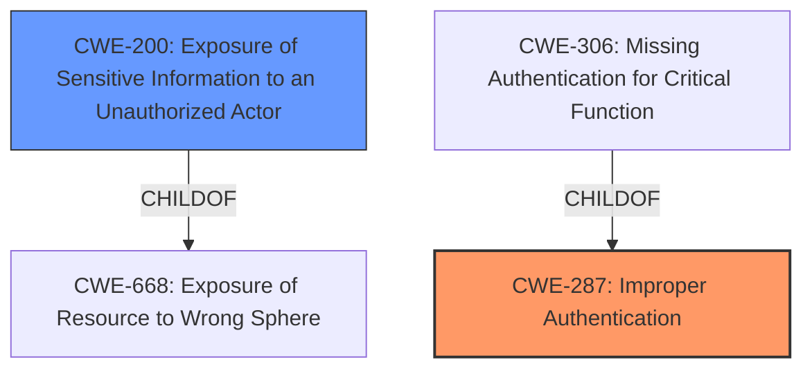

# Analysis Report for CVE-2020-23058

# Vulnerability Analysis Report: CVE-2020-23058

## Description


## Analysis (with Relationship Data)

# Summary
| CWE ID  | CWE Name                                                        | Confidence | CWE Abstraction Level | CWE Vulnerability Mapping Label | CWE-Vulnerability Mapping Notes |
| ------- | --------------------------------------------------------------- | ---------- | --------------------- | ------------------------------- | ------------------------------- |
| CWE-287 | Improper Authentication                                         | 0.80       | Class                 | Primary                         | Discouraged                   |
| CWE-200 | Exposure of Sensitive Information to an Unauthorized Actor | 0.70       | Class                 | Secondary                       | Discouraged                   |

## Evidence and Confidence

*   **Confidence Score:** 0.75
*   **Evidence Strength:** MEDIUM

## Relationship Analysis
The primary relationship that impacted my decision was the parent-child relationship between CWE-287 (Improper Authentication) and its potential children, especially CWE-306 (Missing Authentication for Critical Function). However, given the description, CWE-287 is more appropriate here since the authentication mechanism is present but flawed. Also the parent child relationship between CWE-200 (Exposure of Sensitive Information to an Unauthorized Actor) and CWE-668 (Exposure of Resource to Wrong Sphere) and its potential children.



## Vulnerability Chain
The vulnerability chain starts with a flawed authentication mechanism (CWE-287), leading to the exposure of sensitive data (CWE-200) due to the PIN protection mechanism running *after* the file system is loaded.

## Summary of Analysis
The initial assessment focused on the **improper authentication** and its direct consequence of **sensitive data exposure**.

The selection of CWE-287 is justified by the **vulnerability description** stating an issue in the authentication mechanism, allowing an unauthenticated user to access sensitive data. The **CVE Reference Links Content Summary** confirms a logic flaw in the PIN protection implementation. The **authentication mechanism** is present, but it's **improperly implemented**, leading to a bypass.
The selection of CWE-200 is justified by the **vulnerability description** stating that the vulnerability leads to access **sensitive data**.

The evidence provided directly supports these classifications, making them the most specific and accurate representations of the vulnerability.

Relevant CWE Information:

# Enhanced Context (25 CWEs)

## CWE-312: Cleartext Storage of Sensitive Information
**Abstraction Level**: Base
**Similarity Score**: 0.79

**Description**:
The product stores sensitive information in cleartext within a resource that might be accessible to another control sphere.

**Mapping Guidance**:
- Usage: Allowed
- Rationale: This CWE entry is at the Base level of abstraction, which is a preferred level of abstraction for mapping to the root causes of vulnerabilities.

*Not Used:* This CWE does not fit because the vulnerability is about accessing the files, not necessarily storing the file in cleartext.

## CWE-538: Insertion of Sensitive Information into Externally-Accessible File or Directory
**Abstraction Level**: Base
**Similarity Score**: 0.78

**Description**:
The product places sensitive information into files or directories that are accessible to actors who are allowed to have access to the files, but not to the sensitive information.

**Mapping Guidance**:
- Usage: Allowed
- Rationale: This CWE entry is at the Base level of abstraction, which is a preferred level of abstraction for mapping to the root causes of vulnerabilities.

*Not Used:* The vulnerability is about access control and not about placing sensitive data in the wrong directory.

## CWE-319: Cleartext Transmission of Sensitive Information
**Abstraction Level**: Base
**Similarity Score**: 0.78

**Description**:
The product transmits sensitive or security-critical data in cleartext in a communication channel that can be sniffed by unauthorized actors.

**Mapping Guidance**:
- Usage: Allowed
- Rationale: This CWE entry is at the Base level of abstraction, which is a preferred level of abstraction for mapping to the root causes of vulnerabilities.

*Not Used:* The vulnerability is not about transmission of data.

## CWE-311: Missing Encryption of Sensitive Data
**Abstraction Level**: Class
**Similarity Score**: 0.77

**Description**:
The product does not encrypt sensitive or critical information before storage or transmission.

**Mapping Guidance**:
- Usage: Discouraged
- Rationale: CWE-311 is high-level with more precise children available. It is a level-1 Class (i.e., a child of a Pillar).

*Not Used:* The vulnerability is about access control and not about encryption.

## CWE-497: Exposure of Sensitive System Information to an Unauthorized Control Sphere
**Abstraction Level**: Base
**Similarity Score**: 0.77

**Description**:
The product does not properly prevent sensitive system-level information from being accessed by unauthorized actors who do not have the same level of access to the underlying system as the product does.

**Mapping Guidance**:
- Usage: Allowed
- Rationale: This CWE entry is at the Base level of abstraction, which is a preferred level of abstraction for mapping to the root causes of vulnerabilities.

*Not Used:* The description does not include system-level information

## CWE-213: Exposure of Sensitive Information Due to Incompatible Policies
**Abstraction Level**: Base
**Similarity Score**: 0.76

**Description**:
The product's intended functionality exposes information to certain actors in accordance with the developer's security policy, but this information is regarded as sensitive according to the intended security policies of other stakeholders such as the product's administrator, users, or others whose information is being processed.

**Mapping Guidance**:
- Usage: Allowed
- Rationale: This CWE entry is at the Base level of abstraction, which is a preferred level of abstraction for mapping to the root causes of vulnerabilities.

*Not Used:* This CWE does not fit since the information is not meant to be exposed.

## CWE-200: Exposure of Sensitive Information to an Unauthorized Actor
**Abstraction Level**: Class
**Similarity Score**: 0.76

**Description**:
The product exposes sensitive information to an actor that is not explicitly authorized to have access to that information.

**Mapping Guidance**:
- Usage: Discouraged
- Rationale: CWE-200 is commonly misused to represent the loss of confidentiality in a vulnerability, but confidentiality loss is a technical impact - not a root cause error. As of CWE 4.9, over 400 CWE entries can lead to a loss of confidentiality. Other options are often available. [REF-1287].

*Used:* The vulnerability leads to the exposure of files.

## CWE-226: Sensitive Information in Resource Not Removed Before Reuse
**Abstraction Level**: Base
**Similarity Score**: 0.76

**Description**:
The product releases a resource such as memory or a file so that it can be made available for reuse, but it does not clear or "zeroize" the information contained in the resource before the product performs a critical state transition or makes the resource available for reuse by other entities.

**Mapping Guidance**:
- Usage: Allowed
- Rationale: This CWE entry is at the Base level of abstraction, which is a preferred level of abstraction for mapping to the root causes of vulnerabilities.

*Not Used:* This CWE does not fit because the vulnerability is not about reusing resources.

## CWE-212: Improper Removal of Sensitive Information Before Storage or Transfer
**Abstraction Level**: Base
**Similarity Score**: 0.76

**Description**:
The product stores, transfers, or shares a resource that contains sensitive information, but it does not properly remove that information before the product makes the resource available to unauthorized actors.

**Mapping Guidance**:
- Usage: Allowed
- Rationale: This CWE entry is at the Base level of abstraction, which is a preferred level of abstraction for mapping to the root causes of vulnerabilities.

*Not Used:* This CWE does not fit because the vulnerability is not about removing sensitive information.

## CWE-668: Exposure of Resource to Wrong Sphere
**Abstraction Level**: Class
**Similarity Score**: 0.76

**Description**:
The product exposes a resource to the wrong control sphere, providing unintended actors with inappropriate access to the resource.

**Mapping Guidance**:
- Usage: Discouraged
- Rationale: CWE-668 is high-level and is often misused as a catch-all when lower-level CWE IDs might be applicable. It is sometimes used for low-information vulnerability reports [REF-1287]. It is a level-1 Class (i.e., a child of a Pillar). It is not useful for


## CWE Relationship Analysis

Current CWEs represent these abstraction levels: .


### Vulnerability Chain Analysis

**Chain starting from CWE-306:**
- 306 (Missing Authentication for Critical Function) - ROOT


**Chain starting from CWE-497:**
- 497 (Exposure of Sensitive System Information to an Unauthorized Control Sphere) - ROOT


### CWE Relationship Diagram

```mermaid
graph TD
    classDef primary fill:#f96,stroke:#333,stroke-width:2px
    classDef secondary fill:#69f,stroke:#333
    classDef tertiary fill:#9e9,stroke:#333
```


*Report generated on 2025-04-02 01:18:42*
