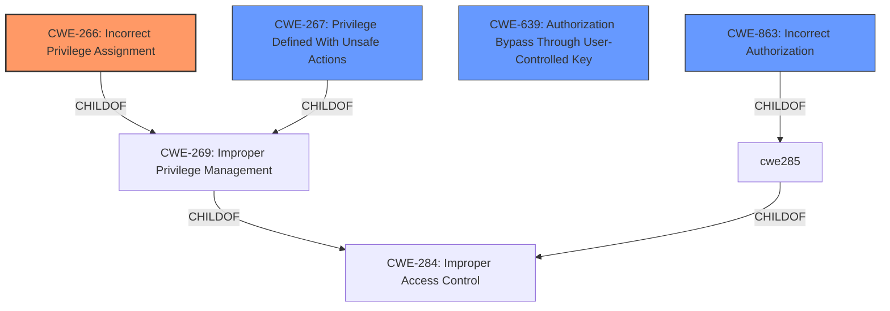

# Raw Analyzer Response for CVE-2020-23128

# Summary
| CWE ID  | CWE Name | Confidence | CWE Abstraction Level | CWE Vulnerability Mapping Label | CWE-Vulnerability Mapping Notes |
|-----------------|-----------------------------------------------------------------|------------|-------------------------|-----------------------------------|-----------------------------------------------------------------------------------|
| **CWE-266** | Incorrect Privilege Assignment | 0.9 | Base | Allowed | Primary CWE |
| CWE-267 | Privilege Defined With Unsafe Actions | 0.7 | Base | Allowed | Secondary Candidate |
| CWE-639 | Authorization Bypass Through User-Controlled Key | 0.6 | Base | Allowed | Secondary Candidate |
| CWE-863 | Incorrect Authorization | 0.5 | Class | Allowed-with-Review | Secondary Candidate |

## Evidence and Confidence

*   **Confidence Score:** 0.9
*   **Evidence Strength:** HIGH

## Relationship Analysis
The primary CWE is CWE-266, Incorrect Privilege Assignment, which is a Base level CWE and a child of CWE-269. This relationship indicates that the vulnerability is rooted in the incorrect assignment of privileges to an actor. CWE-267, Privilege Defined With Unsafe Actions, is also a child of CWE-269 and represents a related but distinct weakness where the privilege itself allows for unsafe actions. CWE-639 highlights how an attacker can exploit user-controlled keys to bypass authorization checks. The relationships show a hierarchy of privilege-related weaknesses, where the specific assignment error (CWE-266) is the most accurate description of the root cause.

## Vulnerability Chain
The vulnerability chain starts with the **improper privilege management** (CWE-269), specifically the **incorrect assignment** of administrative privileges (CWE-266). A user with "Sessions administrator" privilege is able to create a new user and then modify the user's profile to grant administrator privileges. This leads to a privilege escalation impact. The vulnerability chain can be described as follows:

1.  **Improper Privilege Management (CWE-269):** The Chamilo LMS does not properly manage privileges for users.
2.  **Incorrect Privilege Assignment (CWE-266):** A user with "Sessions administrator" privilege can assign administrator privileges to another user.
3.  **Privilege Escalation (Impact):** A user with limited privileges can gain full administrator access.

## Summary of Analysis
The initial analysis of the vulnerability description and the "CVE Reference Links Content Summary" section indicates that the root cause is an **improper privilege management** issue. Specifically, a user with "Sessions administrator" privileges can create a new user and then, through a manipulated request, grant that new user administrator privileges.

The "Vulnerability Description Key Phrases" section also highlights **improper privilege management** as the root cause.

The primary CWE selected is CWE-266 (Incorrect Privilege Assignment) with a confidence of 0.9. This is because the vulnerability involves a specific error in assigning privileges, where a user with "Sessions administrator" privilege can incorrectly assign administrator privileges to another user. This aligns with the definition of CWE-266, which states that a product incorrectly assigns a privilege to a particular actor, creating an unintended sphere of control for that actor.

The retriever results also support this selection, with CWE-266 being listed.

Other CWEs considered but not selected as primary:

*   CWE-267 (Privilege Defined With Unsafe Actions): While related, this CWE focuses on the privilege itself being unsafe, rather than the incorrect assignment of a privilege.
*   CWE-639 (Authorization Bypass Through User-Controlled Key): This CWE is related to authorization bypass, where a user can modify a key value to gain access to another user's data. While this is similar to the vulnerability, the root cause is still the incorrect assignment of privileges.
*   CWE-863 (Incorrect Authorization): This CWE is a Class-level CWE and is too general for this vulnerability. The vulnerability is more specific to the incorrect assignment of privileges.

The final selection of CWE-266 is at the optimal level of specificity, as it accurately represents the root cause of the vulnerability. It is also a Base-level CWE, which is a preferred level of abstraction for mapping to the root causes of vulnerabilities.