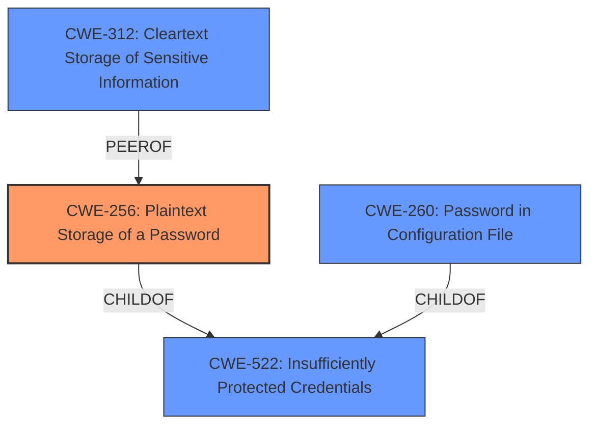

# Analysis for CVE-2020-2314

# Summary
| CWE ID | CWE Name | Confidence | CWE Abstraction Level | CWE Vulnerability Mapping Label | CWE-Vulnerability Mapping Notes |
|---|---|---|---|---|---|
| CWE-256 | Plaintext Storage of a Password | 1.0 | Base | Allowed | Primary CWE |
| CWE-260 | Password in Configuration File | 0.9 | Base | Allowed | Secondary Candidate |
| CWE-312 | Cleartext Storage of Sensitive Information | 0.8 | Base | Allowed | Secondary Candidate |
| CWE-522 | Insufficiently Protected Credentials | 0.7 | Class | Allowed-with-Review | Secondary Candidate |

## Evidence and Confidence

*   **Confidence Score:** 0.9
*   **Evidence Strength:** HIGH

## Relationship Analysis
The primary relationship influencing the CWE selection is the hierarchical structure. CWE-256, **Plaintext Storage of a Password**, and CWE-260, **Password in Configuration File**, are both children of CWE-522, **Insufficiently Protected Credentials**. We chose CWE-256 as the primary because it directly describes the vulnerability: a password stored in plaintext. CWE-260 is a good secondary candidate, because the password specifically resided in the configuration file.

## Vulnerability Chain
The vulnerability chain starts with the **unencrypted storage of the password** (CWE-256) in the configuration file, leading to the **exposure of the password** to users with access to the Jenkins controller file system.

## Summary of Analysis
The initial analysis focused on the **rootcause** identified in the "Vulnerability Description Key Phrases": "**unencrypted storage of sensitive information**". The "CVE Reference Links Content Summary" confirms that the plugin stores the password **unencrypted** in its global configuration file. This directly maps to CWE-256, **Plaintext Storage of a Password**. The "Retriever Results" also list CWE-256 as a top candidate.

CWE-522, **Insufficiently Protected Credentials**, was considered as a potential primary mapping due to its high ranking in the "Top CWEs" section. However, CWE-522 is a Class-level CWE, and the more specific Base-level CWE-256 is a better fit.

CWE-260, **Password in Configuration File**, is also a strong candidate because the password is in a configuration file, but CWE-256 is more specific. The fact that the password is in cleartext is the more important vulnerability.

CWE-312, **Cleartext Storage of Sensitive Information**, was considered, and it also fits, but it is less specific than CWE-256 because it doesn't explicitly mention passwords.

The final selection is based on the provided evidence, the hierarchical relationships between the CWEs, and the goal of selecting the most specific CWE that accurately represents the vulnerability.

Relevant CWE Information:

# Enhanced Context (25 CWEs)
The following CWEs were identified as potentially relevant to this vulnerability:

## CWE-312: Cleartext Storage of Sensitive Information
**Abstraction Level**: Base
**Similarity Score**: 0.79
**Source**: dense

**Description**:
The product stores sensitive information in cleartext within a resource that might be accessible to another control sphere.

**Mapping Guidance**:
- Usage: Allowed
- Rationale: This CWE entry is at the Base level of abstraction, which is a preferred level of abstraction for mapping to the root causes of vulnerabilities.

## CWE-319: Cleartext Transmission of Sensitive Information
**Abstraction Level**: Base
**Similarity Score**: 0.77
**Source**: dense

**Description**:
The product transmits sensitive or security-critical data in cleartext in a communication channel that can be sniffed by unauthorized actors.

**Mapping Guidance**:
- Usage: Allowed
- Rationale: This CWE entry is at the Base level of abstraction, which is a preferred level of abstraction for mapping to the root causes of vulnerabilities.

## CWE-522: Insufficiently Protected Credentials
**Abstraction Level**: Class
**Similarity Score**: 0.77
**Source**: dense

**Description**:
The product transmits or stores authentication credentials, but it uses an insecure method that is susceptible to unauthorized interception and/or retrieval.

**Mapping Guidance**:
- Usage: Allowed-with-Review
- Rationale: This CWE entry is a Class and might have Base-level children that would be more appropriate

## CWE-807: Reliance on Untrusted Inputs in a Security Decision
**Abstraction Level**: Base
**Similarity Score**: 0.76
**Source**: dense

**Description**:
The product uses a protection mechanism that relies on the existence or values of an input, but the input can be modified by an untrusted actor in a way that bypasses the protection mechanism.

**Mapping Guidance**:
- Usage: Allowed
- Rationale: This CWE entry is at the Base level of abstraction, which is a preferred level of abstraction for mapping to the root causes of vulnerabilities.

## CWE-1391: Use of Weak Credentials
**Abstraction Level**: Class
**Similarity Score**: 0.75
**Source**: dense

**Description**:
The product uses weak credentials (such as a default key or hard-coded password) that can be calculated, derived, reused, or guessed by an attacker.

**Mapping Guidance**:
- Usage: Allowed-with-Review
- Rationale: This CWE entry is a Class and might have Base-level children that would be more appropriate

## CWE-538: Insertion of Sensitive Information into Externally-Accessible File or Directory
**Abstraction Level**: Base
**Similarity Score**: 0.75
**Source**: dense

**Description**:
The product places sensitive information into files or directories that are accessible to actors who are allowed to have access to the files, but not to the sensitive information.

**Mapping Guidance**:
- Usage: Allowed
- Rationale: This CWE entry is at the Base level of abstraction, which is a preferred level of abstraction for mapping to the root causes of vulnerabilities.

## CWE-256: Plaintext Storage of a Password
**Abstraction Level**: Base
**Similarity Score**: 0.75
**Source**: dense

**Description**:
Storing a password in plaintext may result in a system compromise.

**Mapping Guidance**:
- Usage: Allowed
- Rationale: This CWE entry is at the Base level of abstraction, which is a preferred level of abstraction for mapping to the root causes of vulnerabilities.

## CWE-303: Incorrect Implementation of Authentication Algorithm
**Abstraction Level**: Base
**Similarity Score**: 0.75
**Source**: dense

**Description**:
The requirements for the product dictate the use of an established authentication algorithm, but the implementation of the algorithm is incorrect.

**Mapping Guidance**:
- Usage: Allowed
- Rationale: This CWE entry is at the Base level of abstraction, which is a preferred level of abstraction for mapping to the root causes of vulnerabilities.

## CWE-798: Use of Hard-coded Credentials
**Abstraction Level**: Base
**Similarity Score**: 0.75
**Source**: dense

**Description**:
The product contains hard-coded credentials, such as a password or cryptographic key.

**Mapping Guidance**:
- Usage: Allowed
- Rationale: This CWE entry is at the Base level of abstraction, which is a preferred level of abstraction for mapping to the root causes of vulnerabilities.

## CWE-639: Authorization Bypass Through User-Controlled Key
**Abstraction Level**: Base
**Similarity Score**: 0.75
**Source**: dense

**Description**:
The system's authorization functionality does not prevent one user from gaining access to another user's data or record by modifying the key value identifying the data.

**Mapping Guidance**:
- Usage: Allowed
- Rationale: This CWE entry is at the Base level of abstraction, which is a preferred level of abstraction for mapping to the root causes of vulnerabilities.

## CWE-312: Cleartext Storage of Sensitive Information
**Abstraction Level**: Base
**Similarity Score**: 4610.34
**Source**: sparse

**Description**:
The product stores sensitive information in cleartext within a resource that might be accessible to another control sphere.

**Mapping Guidance**:
- Usage: Allowed
- Rationale: This CWE entry is at the Base level of abstraction, which is a preferred level of abstraction

# Enhanced Query for CVE-2020-2314

## Vulnerability Description
Jenkins AppSpider Plugin 1.0.12 and earlier stores a password unencrypted in its global configuration file on the Jenkins controller where it can be viewed by users with access to the Jenkins controller file system.

### Vulnerability Description Key Phrases
- **rootcause:** **unencrypted storage of sensitive information**
- **impact:** view password
- **attacker:** users with access to Jenkins controller file system
- **product:** Jenkins AppSpider Plugin
- **version:** 1.0.12 and earlier
- **component:** global configuration file

### CWE for similar CVE Descriptions
### Primary CWE Match
CWE-522

#### Top CWEs
- CWE-522 (Count: 263)
- CWE-311 (Count: 63)
- CWE-312 (Count: 50)

## CVE Reference Links Content Summary
Based on the provided document, here's the information regarding CVE-2020-2314:

**CVE ID:** CVE-2020-2314
**Vulnerability:** Password stored in plain text
**Affected Plugin:** AppSpider Plugin
**Affected Versions:** 1.0.12 and earlier

**Root cause of vulnerability:**
The AppSpider Plugin stores a password unencrypted in its global configuration file `com.rapid7.jenkinspider.PostBuildScan.xml` on the Jenkins controller.

**Weaknesses/vulnerabilities present:**
- The password is not encrypted, exposing it in plaintext within the plugin's global configuration file.

**Impact of exploitation:**
-  An attacker with access to the Jenkins controller's file system can view the plaintext password.

**Attack vectors:**
-  An attacker gains access to the Jenkins controller's file system.

**Required attacker capabilities/position:**
- The attacker needs to have access to the Jenkins controller's file system.
- The attacker needs at least "Overall/Read" permission to access the configuration file.

**Additional Details:**
- The plugin stores the password in `com.rapid7.jenkinspider.PostBuildScan.xml` file.
-  Version 1.0.13 of the plugin encrypts the password once the configuration is saved.

## Retriever Results

### Top Combined Results

| Rank | CWE ID | Name | Abstraction | Usage  | Retrievers | Individual Scores |
|------|--------|------|-------------|-------|------------|-------------------|
| 1 | 256 | Plaintext Storage of a Password | Base | Allowed | sparse | 0.440 |
| 2 | 260 | Password in Configuration File | Base | Allowed | sparse | 0.427 |
| 3 | 522 | Insufficiently Protected Credentials | Class | Allowed-with-Review | sparse | 0.412 |
| 4 | 538 | Insertion of Sensitive Information into Externally-Accessible File or Directory | Base | Allowed | sparse | 0.312 |
| 5 | 862 | Missing Authorization | Class | Allowed-with-Review | sparse | 0.277 |
| 6 | 555 | J2EE Misconfiguration: Plaintext Password in Configuration File | Variant | Allowed | dense | 0.543 |
| 7 | 13 | ASP.NET Misconfiguration: Password in Configuration File | Variant | Allowed | graph | 0.002 |
| 8 | 312 | Cleartext Storage of Sensitive Information | Base | Allowed | sparse | 0.263 |
| 9 | 319 | Cleartext Transmission of Sensitive Information | Base | Allowed | sparse | 0.257 |
| 10 | 863 | Incorrect Authorization | Class | Allowed-with-Review | sparse | 0.257 |

# Complete CWE Specifications

## CWE-256: Plaintext Storage of a Password
**Abstraction:** Base
**Status:** Incomplete

### Description
Storing a password in plaintext may result in a system compromise.

### Extended Description
Password management issues occur when a password is stored in plaintext in an application's properties, configuration file, or memory. Storing a plaintext password in a configuration file allows anyone who can read the file access to the password-protected resource. In some contexts, even storage of a plaintext password in memory is considered a security risk if the password is not cleared immediately after it is used.

### Alternative Terms
None

### Relationships
ChildOf -> CWE-522

### Mapping Guidance
**Usage:** Allowed
**Rationale:** This CWE entry is at the Base level of abstraction, which is a preferred level of abstraction for mapping to the root causes of vulnerabilities.
**Comments:** Carefully read both the name and description to ensure that this mapping is an appropriate fit. Do not try to 'force' a mapping to a lower-level Base/Variant simply to comply with this preferred level of abstraction.
**Reasons:**
- Acceptable-Use

### Observed Examples
- **CVE-2022-30275:** Remote Terminal Unit (RTU) uses a driver that relies on a password stored in plaintext.

## CWE-260: Password in Configuration File
**Abstraction:** Base
**Status:** Incomplete

### Description
The product stores a password in a configuration file that might be accessible to actors who do not know the password.

### Extended Description
This can result in compromise of the system for which the password is used. An attacker could gain access to this file and learn the stored password or worse yet, change the password to one of their choosing.

### Alternative Terms
None

### Relationships
ChildOf -> CWE-522

### Mapping Guidance
**Usage:** Allowed
**Rationale:** This CWE entry is at the Base level of abstraction, which is a preferred level of abstraction for mapping to the root causes of vulnerabilities.
**Comments:** Carefully read both the name and description to ensure that this mapping is an appropriate fit. Do not try to 'force' a mapping to a lower-level Base/Variant simply to comply with this preferred level of abstraction.
**Reasons:**
- Acceptable-Use

### Observed Examples
- **CVE-2022-38665:** A continuous delivery pipeline management tool stores an unencypted password in a configuration file.

## CWE-522: Insufficiently Protected Credentials
**Abstraction:** Class
**Status:** Incomplete

### Description
The product transmits or stores authentication credentials, but it uses an insecure method that is susceptible to unauthorized interception and/or retrieval.

### Extended Description
Not provided

### Alternative Terms
None

### Relationships
ChildOf -> CWE-1390
ChildOf -> CWE-287
ChildOf -> CWE-668

### Mapping Guidance
**Usage:** Allowed-with-Review
**Rationale:** This CWE entry is a Class and might have Base-level children that would be more appropriate
**Comments:** Examine children of this entry to see if there is a better fit
**Reasons:**
- Abstraction

### Observed Examples
- **CVE-2022-30018:** A messaging platform serializes all elements of User/Group objects, making private information available to adversaries
- **CVE-2022-29959:** Initialization file contains credentials that can be decoded using a "simple string transformation"
- **CVE-2022-35411:** Python-based RPC framework enables pickle functionality by default, allowing clients to unpickle untrusted data.

## CWE-538: Insertion of Sensitive Information into Externally-Accessible File or Directory
**Abstraction:** Base
**Status:** Draft

### Description
The product places sensitive information into files or directories that are accessible to actors who are allowed to have access to the files, but not to the sensitive information.

### Extended Description
Not provided

### Alternative Terms
None

### Relationships
ChildOf -> CWE-200

### Mapping Guidance
**Usage:** Allowed
**Rationale:** This CWE entry is at the Base level of abstraction, which is a preferred level of abstraction for mapping to the root causes of vulnerabilities.
**Comments:** Carefully read both the name and description to ensure that this mapping is an appropriate fit. Do not try to 'force' a mapping to a lower-level Base/Variant simply to comply with this preferred level of abstraction.
**Reasons:**
- Acceptable-Use

### Additional Notes
**[Maintenance]** Depending on usage, this could be a weakness or a category. Further study of all its children is needed, and the entire sub-tree may need to be clarified. The current organization is based primarily on the exposure of sensitive information as a consequence, instead of as a primary weakness.

**[Maintenance]** There is a close relationship with CWE-552, which is more focused on weaknesses. As a result, it may be more appropriate to convert CWE-538 to a category.

### Observed Examples
- **CVE-2018-1999036:** SSH password for private key stored in build log

## CWE-862: Missing Authorization
**Abstraction:** Class
**Status:** Incomplete

### Description
The product does not perform an authorization check when an actor attempts to access a resource or perform an action.

### Extended Description
Not provided

### Alternative Terms
AuthZ: "AuthZ" is typically used as an abbreviation of "authorization" within the web application security community. It is distinct from "AuthN" (or, sometimes, "AuthC") which is an abbreviation of "authentication." The use of "Auth" as an abbreviation is discouraged, since it could be used for either authentication or authorization.

### Relationships
ChildOf -> CWE-285
ChildOf -> CWE-284

### Mapping Guidance
**Usage:** Allowed-with-Review
**Rationale:** This CWE entry is a Class and might have Base-level children that would be more appropriate
**Comments:** Examine children of this entry to see if there is a better fit
**Reasons:**
- Abstraction

### Additional Notes
**[Terminology]** Assuming a user with a given identity, authorization is the process of determining whether that user can access a given resource, based on the user's privileges and any permissions or other access-control specifications that apply to the resource.

### Observed Examples
- **CVE-2022-24730:** Go-based continuous deployment product does not check that a user has certain privileges to update or create an app, allowing adversaries to read sensitive repository information
- **CVE-2009-3168:** Web application does not restrict access to admin scripts, allowing authenticated users to reset administrative passwords.
- **CVE-2009-3597:** Web application stores database file under the web root with insufficient access control (CWE-219), allowing direct request.

## CWE-555: J2EE Misconfiguration: Plaintext Password in Configuration File
**Abstraction:** Variant
**Status:** Draft

### Description
The J2EE application stores a plaintext password in a configuration file.

### Extended Description
Storing a plaintext password in a configuration file allows anyone who can read the file to access the password-protected resource, making it an easy target for attackers.

### Alternative Terms
None

### Relationships
ChildOf -> CWE-260

### Mapping Guidance
**Usage:** Allowed
**Rationale:** This CWE entry is at the Variant level of abstraction, which is a preferred level of abstraction for mapping to the root causes of vulnerabilities.
**Comments:** Carefully read both the name and description to ensure that this mapping is an appropriate fit. Do not try to 'force' a mapping to a lower-level Base/Variant simply to comply with this preferred level of abstraction.
**Reasons:**
- Acceptable-Use

## CWE-13: ASP.NET Misconfiguration: Password in Configuration File
**Abstraction:** Variant
**Status:** Draft

### Description
Storing a plaintext password in a configuration file allows anyone who can read the file access to the password-protected resource making them an easy target for attackers.

### Extended Description
Not provided

### Alternative Terms
None

### Relationships
ChildOf -> CWE-260

### Mapping Guidance
**Usage:** Allowed
**Rationale:** This CWE entry is at the Variant level of abstraction, which is a preferred level of abstraction for mapping to the root causes of vulnerabilities.
**Comments:** Carefully read both the name and description to ensure that this mapping is an appropriate fit. Do not try to 'force' a mapping to a lower-level Base/Variant simply to comply with this preferred level of abstraction.
**Reasons:**
- Acceptable-Use

## CWE-312: Cleartext Storage of Sensitive Information
**Abstraction:** Base
**Status:** Draft

### Description
The product stores sensitive information in cleartext within a resource that might be accessible to another control sphere.

### Extended Description

Because the information is stored in cleartext (i.e., unencrypted), attackers could potentially read it. Even if the information is encoded in a way that is not human-readable, certain techniques could determine which encoding is being used, then decode the information.

When organizations adopt cloud services, it can be easier for attackers to access the data from anywhere on the Internet.

In some systems/environments such as cloud, the use of "double encryption" (at both the software and hardware layer) might be required, and the developer might be solely responsible for both layers, instead of shared responsibility with the administrator of the broader system/environment.

### Alternative Terms
None

### Relationships
ChildOf -> CWE-311
ChildOf -> CWE-311
ChildOf -> CWE-922

### Mapping Guidance
**Usage:** Allowed
**Rationale:** This CWE entry is at the Base level of abstraction, which is a preferred level of abstraction for mapping to the root causes of vulnerabilities.
**Comments:** Carefully read both the name and description to ensure that this mapping is an appropriate fit. Do not try to 'force' a mapping to a lower-level Base/Variant simply to comply with this preferred level of abstraction.
**Reasons:**
- Acceptable-Use

### Additional Notes
**[Terminology]** Different people use "cleartext" and "plaintext" to mean the same thing: the lack of encryption. However, within cryptography, these have more precise meanings. Plaintext is the information just before it is fed into a cryptographic algorithm, including already-encrypted text. Cleartext is any information that is unencrypted, although it might be in an encoded form that is not easily human-readable (such as base64 encoding).

### Observed Examples
- **CVE-2022-30275:** Remote Terminal Unit (RTU) uses a driver that relies on a password stored in plaintext.
- **CVE-2009-2272:** password and username stored in cleartext in a cookie
- **CVE-2009-1466:** password stored in cleartext in a file with insecure permissions

## CWE-319: Cleartext Transmission of Sensitive Information
**Abstraction:** Base
**Status:** Draft

### Description
The product transmits sensitive or security-critical data in cleartext in a communication channel that can be sniffed by unauthorized actors.

### Extended Description

Many communication channels can be "sniffed" (monitored) by adversaries during data transmission. For example, in networking, packets can traverse many intermediary nodes from the source to the destination, whether across the internet, an internal network, the cloud, etc. Some actors might have privileged access to a network interface or any link along the channel, such as a router, but they might not be authorized to collect the underlying data. As a result, network traffic could be sniffed by adversaries, spilling security-critical data.

Applicable communication channels are not limited to software products. Applicable channels include hardware-specific technologies such as internal hardware networks and external debug channels, supporting remote JTAG debugging. When mitigations are not applied to combat adversaries within the product's threat model, this weakness significantly lowers the difficulty of exploitation by such adversaries.

When full communications are recorded or logged, such as with a packet dump, an adversary could attempt to obtain the dump long after the transmission has occurred and try to "sniff" the cleartext from the recorded communications in the dump itself. Even if the information is encoded in a way that is not human-readable, certain techniques could determine which encoding is being used, then decode the information. 

### Alternative Terms
None

### Relationships
ChildOf -> CWE-311
ChildOf -> CWE-311

### Mapping Guidance
**Usage:** Allowed
**Rationale:** This CWE entry is at the Base level of abstraction, which is a preferred level of abstraction for mapping to the root causes of vulnerabilities.
**Comments:** Carefully read both the name and description to ensure that this mapping is an appropriate fit. Do not try to 'force' a mapping to a lower-level Base/Variant simply to comply with this preferred level of abstraction.
**Reasons:**
- Acceptable-Use

### Additional Notes
**[Maintenance]** The Taxonomy_Mappings to ISA/IEC 62443 were added in CWE 4.10, but they are still under review and might change in future CWE versions. These draft mappings were performed by members of the "Mapping CWE to 62443" subgroup of the CWE-CAPEC ICS/OT Special Interest Group (SIG), and their work is incomplete as of CWE 4.10. The mappings are included to facilitate discussion and review by the broader ICS/OT community, and they are likely to change in future CWE versions.

### Observed Examples
- **CVE-2022-29519:** Programmable Logic Controller (PLC) sends sensitive information in plaintext, including passwords and session tokens.
- **CVE-2022-30312:** Building Controller uses a protocol that transmits authentication credentials in plaintext.
- **CVE-2022-31204:** Programmable Logic Controller (PLC) sends password in plaintext.

## CWE-863: Incorrect Authorization
**Abstraction:** Class
**Status:** Incomplete

### Description
The product performs an authorization check when an actor attempts to access a resource or perform an action, but it does not correctly perform the check.

### Extended Description
Not provided

### Alternative Terms
AuthZ: "AuthZ" is typically used as an abbreviation of "authorization" within the web application security community. It is distinct from "AuthN" (or, sometimes, "AuthC") which is an abbreviation of "authentication." The use of "Auth" as an abbreviation is discouraged, since it could be used for either authentication or authorization.

### Relationships
ChildOf -> CWE-285
ChildOf -> CWE-284

### Mapping Guidance
**Usage:** Allowed-with-Review
**Rationale:** This CWE entry is a Class and might have Base-level children that would be more appropriate
**Comments:** Examine children of this entry to see if there is a better fit
**Reasons:**
- Abstraction

### Additional Notes
**[Terminology]** 

Assuming a user with a given identity, authorization is the process of determining whether that user can access a given resource, based on the user's privileges and any permissions or other access-control specifications that apply to the resource.

### Observed Examples
- **CVE-2021-39155:** Chain: A microservice integration and management platform compares the hostname in the HTTP Host header in a case-sensitive way (CWE-178, CWE-1289), allowing bypass of the authorization policy (CWE-863) using a hostname with mixed case or other variations.
- **CVE-2019-15900:** Chain: sscanf() call is used to check if a username and group exists, but the return value of sscanf() call is not checked (CWE-252), causing an uninitialized variable to be checked (CWE-457), returning success to allow authorization bypass for executing a privileged (CWE-863).
- **CVE-2009-2213:** Gateway uses default "Allow" configuration for its authorization settings.

