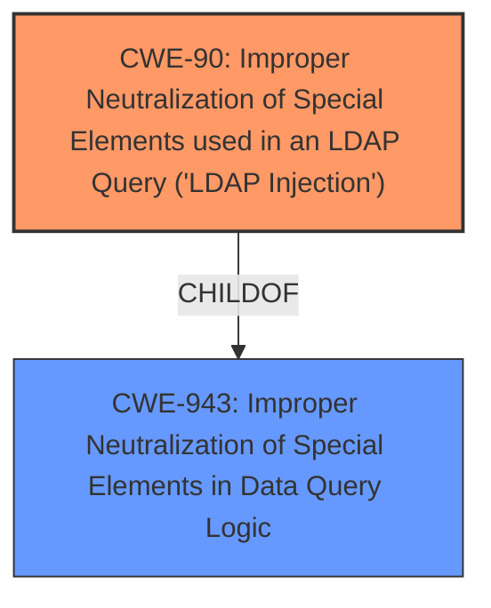

# Analysis for CVE-2020-23148

# Summary
| CWE ID | CWE Name | Confidence | CWE Abstraction Level | CWE Vulnerability Mapping Label | CWE-Vulnerability Mapping Notes |
|---|---|---|---|---|---|
| CWE-90 | Improper Neutralization of Special Elements used in an LDAP Query ('LDAP Injection') | 1 | Base | Allowed | Primary CWE |

## Evidence and Confidence

*   **Confidence Score:** 1
*   **Evidence Strength:** HIGH

## Relationship Analysis
The primary relationship that influenced the selection was the direct match of the vulnerability description to **CWE-90 (Improper Neutralization of Special Elements used in an LDAP Query ('LDAP Injection'))**. This CWE is a base level weakness and is a child of **CWE-943 (Improper Neutralization of Special Elements in Data Query Logic)**. The description explicitly mentions "LDAP injection", making CWE-90 the most appropriate choice.

## Vulnerability Chain
The vulnerability chain consists of the following:
  1.  The application fails to sanitize the `userLogin` parameter.
  2.  An attacker crafts a malicious POST request to inject LDAP special elements.
  3.  The injected elements modify the LDAP query, leading to sensitive information disclosure.
  - The root cause is the **unsanitized userLogin parameter**.
  - The weakness is the resulting **LDAP injection**.
  - The impact is obtaining sensitive information.

## Summary of Analysis
The initial analysis strongly pointed towards **CWE-90 (Improper Neutralization of Special Elements used in an LDAP Query ('LDAP Injection'))** due to the explicit mention of "LDAP injection" in the vulnerability description.

The vulnerability description states: "The userLogin parameter in ldap/login.php of rConfig 3.9.5 is **unsanitized**, allowing attackers to perform a **LDAP injection** and obtain sensitive information via a crafted POST request."

This statement provides direct evidence that the application does not properly neutralize special elements in the LDAP query, which aligns perfectly with the description of **CWE-90 (Improper Neutralization of Special Elements used in an LDAP Query ('LDAP Injection'))**.

The retriever results also listed **CWE-90 (Improper Neutralization of Special Elements used in an LDAP Query ('LDAP Injection'))** as the top combined result, further reinforcing this decision.

The other CWEs were considered but ultimately not chosen because they were either too general (e.g., **CWE-138 (Improper Neutralization of Special Elements)** or **CWE-790 (Improper Filtering of Special Elements)**, or they pertained to different types of injection (e.g., **CWE-89 (Improper Neutralization of Special Elements used in an SQL Command ('SQL Injection'))**, **CWE-78 (Improper Neutralization of Special Elements used in an OS Command ('OS Command Injection'))**, **CWE-917 (Improper Neutralization of Special Elements used in an Expression Language Statement ('Expression Language Injection'))**).

The selection of **CWE-90 (Improper Neutralization of Special Elements used in an LDAP Query ('LDAP Injection'))** is at the optimal level of specificity because it directly addresses the type of injection described in the vulnerability.