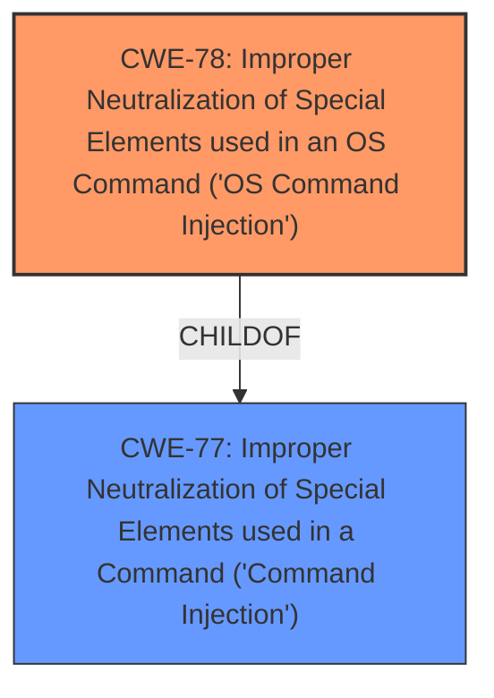

# Analysis Report for CVE-2020-23151

# Vulnerability Analysis Report: CVE-2020-23151

## Description


## Analysis (with Relationship Data)

# Summary
| CWE ID | CWE Name | Confidence | CWE Abstraction Level | CWE Vulnerability Mapping Label | CWE-Vulnerability Mapping Notes |
|---|---|---|---|---|---|
| CWE-78 | Improper Neutralization of Special Elements used in an OS Command ('OS Command Injection') | 1.0 | Base | Allowed | Primary CWE |
| CWE-77 | Improper Neutralization of Special Elements used in a Command ('Command Injection') | 0.7 | Class | Allowed-with-Review | Secondary Candidate |

## Evidence and Confidence

*   **Confidence Score:** 1.0
*   **Evidence Strength:** HIGH

## Relationship Analysis
The primary relationship that influenced the CWE selection was the parent-child relationship between CWE-77 (Improper Neutralization of Special Elements used in a Command) and CWE-78 (Improper Neutralization of Special Elements used in an OS Command). Since the vulnerability description explicitly mentions the use of the `exec` function, which is an OS command, CWE-78 was chosen as the more specific and appropriate classification. CWE-77 was considered as a more general case, but the evidence supports the OS-specific nature of the command injection.



## Vulnerability Chain
The vulnerability chain consists of the following steps:
1.  The application receives a crafted GET request containing a malicious `path` parameter.
2.  The application fails to neutralize special elements within the `path` parameter.
3.  The unsanitized `path` parameter is directly passed to the `exec` function, resulting in OS command injection.

## Summary of Analysis
The initial assessment strongly suggests **OS command injection** due to the usage of the `exec` function with an unsanitized `path` parameter. The vulnerability description explicitly states that the `path` parameter is passed directly to the `exec` function without being escaped, leading to **command injection**. This aligns perfectly with the definition of CWE-78.

The evidence from the vulnerability description is clear: "rConfig 3.9.5 allows **command injection** by sending a crafted GET request to lib/ajaxHandlers/ajaxArchiveFiles.php since the path parameter is passed directly to the exec function without being escaped."

The graph relationship between CWE-77 and CWE-78 reinforces the decision to select the more specific CWE-78, as the vulnerability involves an OS command.

The selected CWEs are at the optimal level of specificity, with CWE-78 accurately representing the root cause of the vulnerability.

Relevant CWE Information:

# Enhanced Context (25 CWEs)
The following CWEs were identified as potentially relevant to this vulnerability:

## CWE-74: Improper Neutralization of Special Elements in Output Used by a Downstream Component ('Injection')
**Abstraction Level**: Class
**Similarity Score**: 0.77
**Source**: dense

**Description**:
The product constructs all or part of a command, data structure, or record using externally-influenced input from an upstream component, but it does not neutralize or incorrectly neutralizes special elements that could modify how it is parsed or interpreted when it is sent to a downstream component.

**Mapping Guidance**:
- Usage: Discouraged
- Rationale: CWE-74 is high-level and often misused when lower-level weaknesses are more appropriate.

## CWE-78: Improper Neutralization of Special Elements used in an OS Command ('OS Command Injection')

**CWE-78**: Improper Neutralization of Special Elements used in an OS Command ('OS Command Injection') is the primary CWE because the vulnerability description explicitly states that the `path` parameter is passed directly to the `exec` function without being escaped. This leads to the execution of arbitrary OS commands. The security implication is that an attacker can execute arbitrary commands on the server, potentially leading to complete system compromise. The relationship to CWE-77 is that it is a child of CWE-77, making it a more specific case of command injection. The MITRE mapping guidance allows its usage at the Base level of abstraction.

## CWE-77: Improper Neutralization of Special Elements used in a Command ('Command Injection')
**Abstraction:** Class

CWE-77: Improper Neutralization of Special Elements used in a Command ('Command Injection') was considered as a broader category of command injection. It applies when the injected command is not necessarily an OS command, but rather a command in another language. While this could be a valid classification, the use of the `exec` function strongly suggests that an OS command is being injected, making CWE-78 a more accurate choice.

The other CWEs listed were not selected because they did not accurately represent the specific weakness described in the vulnerability description. For example, CWE-88 (Improper Neutralization of Argument Delimiters in a Command ('Argument Injection')) involves injecting arguments, options, or switches into a command, while this vulnerability involves injecting an entire OS command. Similarly, CWE-89 (Improper Neutralization of Special Elements used in an SQL Command ('SQL Injection')) is specific to SQL injection, which is not relevant to this vulnerability.


## CWE Relationship Analysis

Current CWEs represent these abstraction levels: .


### Vulnerability Chain Analysis

**Chain starting from CWE-88:**
- 88 (Improper Neutralization of Argument Delimiters in a Command ('Argument Injection')) - ROOT


**Chain starting from CWE-78:**
- 78 (Improper Neutralization of Special Elements used in an OS Command ('OS Command Injection')) - ROOT


### CWE Relationship Diagram

```mermaid
graph TD
    classDef primary fill:#f96,stroke:#333,stroke-width:2px
    classDef secondary fill:#69f,stroke:#333
    classDef tertiary fill:#9e9,stroke:#333
```


*Report generated on 2025-04-01 23:36:26*
