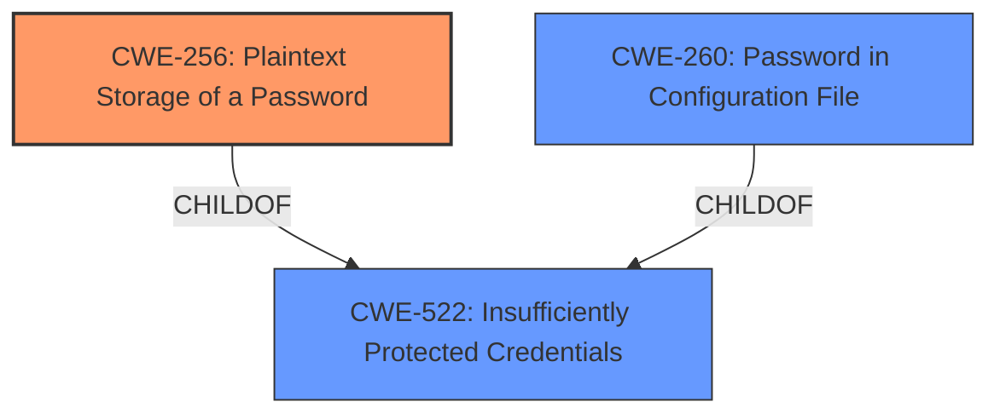

# Analysis Report for CVE-2020-2318

# Vulnerability Analysis Report: CVE-2020-2318

## Description


## Analysis (with Relationship Data)

# Summary
| CWE ID | CWE Name | Confidence | CWE Abstraction Level | CWE Vulnerability Mapping Label | CWE-Vulnerability Mapping Notes |
|---|---|---|---|---|---|
| CWE-256 | Plaintext Storage of a Password | 1 | Base | Allowed | Primary CWE |
| CWE-260 | Password in Configuration File | 0.8 | Base | Allowed | Secondary Candidate |
| CWE-522 | Insufficiently Protected Credentials | 0.7 | Class | Allowed-with-Review | Secondary Candidate |

## Evidence and Confidence

*   **Confidence Score:** 0.9
*   **Evidence Strength:** HIGH

## Relationship Analysis
The primary relationship that impacted the decision was the ChildOf relationship.
- CWE-256 **Plaintext Storage of a Password** is a ChildOf CWE-522 **Insufficiently Protected Credentials**, but CWE-256 is more specific to the vulnerability description.
- CWE-260 **Password in Configuration File** is a ChildOf CWE-522 **Insufficiently Protected Credentials**, but the vulnerability description indicates that the passwords are not encrypted.
- The abstraction levels influenced the selection, favoring the Base level CWEs (CWE-256 and CWE-260) over the Class level CWE (CWE-522).



## Vulnerability Chain
The chain of root cause and weaknesses for the vulnerability description:
1.  Root Cause: **Unencrypted storage of sensitive information** (CWE-256)
2.  Impact: Passwords can be viewed by users with Extended Read permission and users with access to the Jenkins controller file system.

## Summary of Analysis
The initial assessment focused on identifying the most specific CWE that accurately captures the **root cause** of the vulnerability: **unencrypted storage of sensitive information**.

The **Vulnerability Description Key Phrases** section identifies the **rootcause** as "**unencrypted storage of sensitive information**". The **CVE Reference Links Content Summary** section states that the **root cause of vulnerability** is "The plugin stores passwords in plain text in job `config.xml` files on the Jenkins controller." The **weakness** is further described as "**passwords stored unencrypted**".

The retriever results suggested CWE-256 **Plaintext Storage of a Password** as the top candidate. The description of CWE-256, "Storing a password in plaintext may result in a system compromise," aligns directly with the vulnerability description. The **Mapping Guidance** for CWE-256 indicates **Usage: Allowed** and **Rationale:** This CWE entry is at the Base level of abstraction, which is a preferred level of abstraction for mapping to the root causes of vulnerabilities.

CWE-260 **Password in Configuration File** was also considered because the passwords are stored in `config.xml` files. It also has **Usage: Allowed** and **Rationale:** This CWE entry is at the Base level of abstraction, which is a preferred level of abstraction for mapping to the root causes of vulnerabilities. However, the primary weakness is the **unencrypted storage**, not the location in a configuration file. Therefore, CWE-260 is a secondary concern.

CWE-522 **Insufficiently Protected Credentials** was considered because it is a parent of both CWE-256 and CWE-260. However, it is a Class-level CWE and less specific than CWE-256. The **Mapping Guidance** for CWE-522 indicates **Usage: Allowed-with-Review** and **Rationale:** This CWE entry is a Class and might have Base-level children that would be more appropriate. Therefore, CWE-522 is a secondary concern.

The hierarchical relationships between CWEs influenced the final selection. The desire for a specific, Base-level CWE led to choosing CWE-256 as the primary mapping.

CWE-312 Cleartext Storage of Sensitive Information, CWE-319 Cleartext Transmission of Sensitive Information, CWE-311 Missing Encryption of Sensitive Data, CWE-922 Insecure Storage of Sensitive Information, CWE-497 Exposure of Sensitive System Information to an Unauthorized Control Sphere, CWE-257 Storing Passwords in a Recoverable Format, CWE-538 Insertion of Sensitive Information into Externally-Accessible File or Directory, CWE-549 Missing Password Field Masking, CWE-555 J2EE Misconfiguration: Plaintext Password in Configuration File, CWE-862 Missing Authorization, CWE-863 Incorrect Authorization, CWE-639 Authorization Bypass Through User-Controlled Key, CWE-178 Improper Handling of Case Sensitivity, CWE-1289 Improper Validation of Unsafe Equivalence in Input, CWE-289 Authentication Bypass by Alternate Name, CWE-499 Serializable Class Containing Sensitive Data, CWE-498 Cloneable Class Containing Sensitive Information, CWE-942 Permissive Cross-domain Policy with Untrusted Domains, CWE-433 Unparsed Raw Web Content Delivery, CWE-532 Insertion of Sensitive Information into Log File were all considered but not selected because they are either too general, focus on related but distinct issues, or represent impacts rather than the root cause.

The final selection of CWE-256 is at the optimal level of specificity because it directly addresses the **root cause** of the vulnerability: **plaintext storage of passwords**. This is a Base-level CWE, which is preferred for root cause analysis.


## CWE Relationship Analysis

Current CWEs represent these abstraction levels: .


### Vulnerability Chain Analysis

**Chain starting from CWE-862:**
- 862 (Missing Authorization) - ROOT


**Chain starting from CWE-311:**
- 311 (Missing Encryption of Sensitive Data) - ROOT


### CWE Relationship Diagram

```mermaid
graph TD
    classDef primary fill:#f96,stroke:#333,stroke-width:2px
    classDef secondary fill:#69f,stroke:#333
    classDef tertiary fill:#9e9,stroke:#333
```


*Report generated on 2025-04-02 17:09:37*
