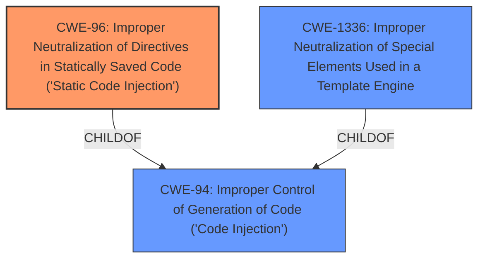

# Analysis for CVE-2020-23219

# Summary
| CWE ID | CWE Name | Confidence | CWE Abstraction Level | CWE Vulnerability Mapping Label | CWE-Vulnerability Mapping Notes |
|---|---|---|---|---|---|
| CWE-96 | Improper Neutralization of Directives in Statically Saved Code ('Static Code Injection') | 0.9 | Base | Allowed | Primary CWE |
| CWE-94 | Improper Control of Generation of Code ('Code Injection') | 0.7 | Base | Allowed-with-Review | Secondary CWE |
| CWE-1336 | Improper Neutralization of Special Elements Used in a Template Engine | 0.6 | Base | Allowed | Secondary CWE |

## Evidence and Confidence

*   **Confidence Score:** 0.8
*   **Evidence Strength:** HIGH

## Relationship Analysis
The primary CWE selected is CWE-96, which is a base-level CWE and a child of CWE-94. The vulnerability involves injecting code into a statically saved resource, making CWE-96 a more specific fit than CWE-94. CWE-1336 is related as template engines are often used for snippets, but it's less direct than injecting directly into static code.

## Vulnerability Chain
The vulnerability chain starts with the **lack of input validation** in the Snippet content field. This allows an attacker to inject a **crafted payload** containing malicious code into the Snippet. When the snippet is rendered, the injected code is executed, leading to **remote code execution**.
  - **Root Cause:** Lack of Input Validation
  - **Weakness:** Improper Neutralization of Directives in Statically Saved Code ('Static Code Injection') (CWE-96)
  - **Impact:** Remote Code Execution

## Summary of Analysis
The initial assessment identified several potential CWEs, including CWE-96, CWE-94, CWE-1336, and CWE-79. After further analysis and considering the MITRE mapping guidance, CWE-96 was selected as the primary CWE because the vulnerability specifically involves injecting code into a statically saved resource (the Snippet content field). The evidence for this is clearly stated in the "CVE Reference Links Content Summary": "The vulnerability stems from the ability to insert arbitrary PHP code via the Snippets module. This is due to **insufficient input validation** or sanitization when editing snippets, **allowing for the injection of malicious code**." CWE-94 is considered a secondary CWE as it represents a more general form of code injection. CWE-1336 is also considered since snippets may involve the use of template engines. These selections are made at the base level of abstraction for accuracy.

Relevant CWE Information:

# Enhanced Context (25 CWEs)
The following CWEs were identified as potentially relevant to this vulnerability:

## CWE-113: Improper Neutralization of CRLF Sequences in HTTP Headers ('HTTP Request/Response Splitting')
**Abstraction Level**: Variant
**Similarity Score**: 0.77
**Source**: dense

**Description**:
The product receives data from an HTTP agent/component (e.g., web server, proxy, browser, etc.), but it does not neutralize or incorrectly neutralizes CR and LF characters before the data is included in outgoing HTTP headers.

**Mapping Guidance**:
- Usage: Allowed
- Rationale: This CWE entry is at the Variant level of abstraction, which is a preferred level of abstraction for mapping to the root causes of vulnerabilities.

**Analysis:** Not relevant because the vulnerability doesn't involve HTTP headers or CRLF sequences.

## CWE-74: Improper Neutralization of Special Elements in Output Used by a Downstream Component ('Injection')
**Abstraction Level**: Class
**Similarity Score**: 0.74
**Source**: dense

**Description**:
The product constructs all or part of a command, data structure, or record using externally-influenced input from an upstream component, but it does not neutralize or incorrectly neutralizes special elements that could modify how it is parsed or interpreted when it is sent to a downstream component.

**Mapping Guidance**:
- Usage: Discouraged
- Rationale: CWE-74 is high-level and often misused when lower-level weaknesses are more appropriate.

**Analysis:** This is a high-level class and less specific than CWE-96 or CWE-94.

## CWE-93: Improper Neutralization of CRLF Sequences ('CRLF Injection')
**Abstraction Level**: Base
**Similarity Score**: 0.74
**Source**: dense

**Description**:
The product uses CRLF (carriage return line feeds) as a special element, e.g. to separate lines or records, but it does not neutralize or incorrectly neutralizes CRLF sequences from inputs.

**Mapping Guidance**:
- Usage: Allowed
- Rationale: This CWE entry is at the Base level of abstraction, which is a preferred level of abstraction for mapping to the root causes of vulnerabilities.

**Analysis:** Not relevant because the vulnerability doesn't involve CRLF sequences.

## CWE-80: Improper Neutralization of Script-Related HTML Tags in a Web Page (Basic XSS)
**Abstraction Level**: Variant
**Similarity Score**: 0.73
**Source**: dense

**Description**:
The product receives input from an upstream component, but it does not neutralize or incorrectly neutralizes special characters such as "<", ">", and "&" that could be interpreted as web-scripting elements when they are sent to a downstream component that processes web pages.

**Mapping Guidance**:
- Usage: Allowed
- Rationale: This CWE entry is at the Variant level of abstraction, which is a preferred level of abstraction for mapping to the root causes of vulnerabilities.

**Analysis:** Not directly relevant as the vulnerability leads to code execution, not just script injection in a web page.

## CWE-1289: Improper Validation of Unsafe Equivalence in Input
**Abstraction Level**: Base
**Similarity Score**: 0.72
**Source**: dense

**Description**:
The product receives an input value that is used as a resource identifier or other type of reference, but it does not validate or incorrectly validates that the input is equivalent to a potentially-unsafe value.

**Mapping Guidance**:
- Usage: Allowed
- Rationale: This CWE entry is at the Base level of abstraction, which is a preferred level of abstraction for mapping to the root causes of vulnerabilities.

**Analysis:** Not directly relevant as the vulnerability isn't specifically about unsafe equivalence in input.

## CWE-41: Improper Resolution of Path Equivalence
**Abstraction Level**: Base
**Similarity Score**: 0.72
**Source**: dense

**Description**:
The product is vulnerable to file system contents disclosure through path equivalence. Path equivalence involves the use of special characters in file and directory names. The associated manipulations are intended to generate multiple names for the same object.

**Mapping Guidance**:
- Usage: Allowed
- Rationale: This CWE entry is at the Base level of abstraction, which is a preferred level of abstraction for mapping to the root causes of vulnerabilities.

**Analysis:** Not relevant because the vulnerability doesn't involve path equivalence.

## CWE-184: Incomplete List of Disallowed Inputs
**Abstraction Level**: Base
**Similarity Score**: 0.72
**Source**: dense

**Description**:
The product implements a protection mechanism that relies on a list of inputs (or properties of inputs) that are not allowed by policy or otherwise require other action to neutralize before additional processing takes place, but the list is incomplete.

**Mapping Guidance**:
- Usage: Allowed
- Rationale: This CWE entry is at the Base level of abstraction, which is a preferred level of abstraction for mapping to the root causes of vulnerabilities.

**Analysis:** While there is an element of missing validation, it's not explicitly about an incomplete list of disallowed inputs, so this is not the best fit.

## CWE-138: Improper Neutralization of Special Elements
**Abstraction Level**: Class
**Similarity Score**: 0.71
**Source**: dense

**Description**:
The product receives input from an upstream component, but it does not neutralize or incorrectly neutralizes special elements that could be interpreted as control elements or syntactic markers when they are sent to a downstream component.

**Mapping Guidance**:
- Usage: Discouraged
- Rationale: This CWE entry is a level-1 Class (i.e., a child of a Pillar). It might have lower-level children that would be more appropriate

**Analysis:** This is a class-level CWE and less specific than CWE-96 or CWE-94.

## CWE-838: Inappropriate Encoding for Output Context
**Abstraction Level**: Base
**Similarity Score**: 0.71
**Source**: dense

**