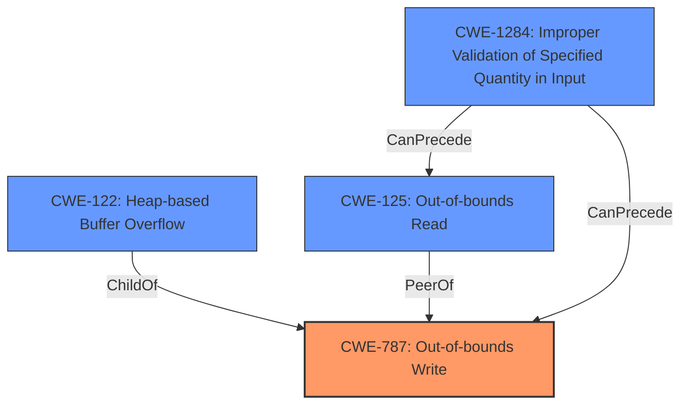

# Analysis for CVE-2020-23269

# Summary
| CWE ID  | CWE Name                                                                 | Confidence | CWE Abstraction Level | CWE Vulnerability Mapping Label | CWE-Vulnerability Mapping Notes |
| :-------- | :----------------------------------------------------------------------- | :---------- | :---------------------- | :------------------------------ | :------------------------------ |
| CWE-787   | Out-of-bounds Write                                                     | 0.95        | Base                    | Primary                         | Allowed                       |
| CWE-122   | Heap-based Buffer Overflow                                               | 0.85        | Variant                 | Secondary                       | Allowed                       |
| CWE-125   | Out-of-bounds Read                                                      | 0.70        | Base                    | Secondary                       | Allowed                       |
| CWE-1284  | Improper Validation of Specified Quantity in Input                       | 0.65        | Base                    | Secondary                       | Allowed                       |

## Evidence and Confidence

*   **Confidence Score:** 0.85
*   **Evidence Strength:** HIGH

## Relationship Analysis
The primary relationship is that CWE-787 **Out-of-bounds Write** can result from a **heap-based buffer overflow (CWE-122)** and is also related to **Out-of-bounds Read (CWE-125)** if the index is out of range of the allocated buffer. Additionally, the **Improper Validation of Specified Quantity in Input (CWE-1284)** can lead to either an out-of-bounds write or read, depending on whether the allocated buffer size is too small or the program attempts to read beyond the expected length.
The choice of CWE-787 as the primary CWE is because the description explicitly mentions a "heap-based buffer overflow" which results in a write outside the bounds of the buffer.

## Vulnerability Chain
The vulnerability chain starts with a missing or **improper validation of the input size (CWE-1284)**, which is then used to allocate a buffer. If the input size is crafted maliciously, it can lead to a **heap-based buffer overflow (CWE-122)**, resulting in an **out-of-bounds write (CWE-787)**. An **out-of-bounds read (CWE-125)** can also occur when the program tries to access data using the same malicious `SampleNumber`. The final impact is a denial of service or potentially arbitrary code execution.

## Summary of Analysis
The analysis is based on the provided vulnerability description, the CVE Reference Links Content Summary, and the Retriever Results.

The vulnerability description explicitly mentions a "**heap-based buffer overflow**" in the `stbl_GetSampleSize` function. The CVE Reference Links Content Summary confirms this by stating that the index `SampleNumber - 1` can potentially go out of bounds when accessing `stsz->sizes` in the code snippet.
The code shows that `SampleNumber` is validated against `stsz->sampleCount`, but there isn't a check on the size of the `sizes` array which leads to the vulnerability.

The Retriever Results list CWE-119, CWE-190, CWE-122, CWE-126 and CWE-193 as the top candidates. While CWE-119 is a broad category, the specific vulnerability involves writing beyond the allocated buffer on the heap, making CWE-787 a more appropriate primary classification. CWE-122 which is heap-based buffer overflow is closely related and listed as the second CWE.

CWE-787 is chosen as the primary CWE because it directly represents the **root cause**, which is writing data beyond the allocated buffer's boundaries. CWE-122 is a variant of CWE-787 which specifies that the overflow occurs on the heap.

The relationships between the CWEs further support this classification. CWE-122 (Heap-based Buffer Overflow) is a child of CWE-787 (Out-of-bounds Write), indicating a more specific type of out-of-bounds write.

The selected CWEs are at the optimal level of specificity, with CWE-787 being a base CWE and CWE-122 being a variant, both providing a detailed representation of the vulnerability.

Relevant CWE Information:

# Enhanced Context (25 CWEs)
The following CWEs were identified as potentially relevant to this vulnerability:

## CWE-787: Out-of-bounds Write
**Abstraction Level**: Base
**Similarity Score**: 3.30
**Source**: graph

**Description**:
CWE-787: Out-of-bounds Write

**Mapping Guidance**:
- Usage: Allowed
- Rationale: This CWE entry is at the Base level of abstraction, which is a preferred level of abstraction for mapping to the root causes of vulnerabilities.

**Relationships**:
- CANFOLLOW -> CWE-825
- CANFOLLOW -> CWE-824
- CANFOLLOW -> CWE-823
- CANFOLLOW -> CWE-822
- PARENTOF -> CWE-124

The vulnerability involves writing beyond the intended buffer boundary, aligning with the core description of CWE-787. The relationship analysis and retriever results further support this choice.