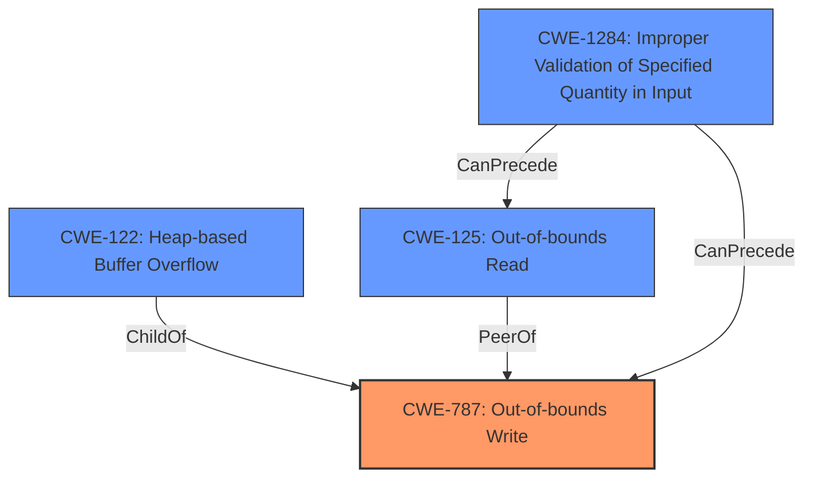

# Analysis for CVE-2020-23269

# Summary
| CWE ID  | CWE Name                                                                 | Confidence | CWE Abstraction Level | CWE Vulnerability Mapping Label | CWE-Vulnerability Mapping Notes |
| :-------- | :----------------------------------------------------------------------- | :---------- | :---------------------- | :------------------------------ | :------------------------------ |
| CWE-787   | Out-of-bounds Write                                                     | 0.95        | Base                    | Primary                         | Allowed                       |
| CWE-122   | Heap-based Buffer Overflow                                               | 0.85        | Variant                 | Secondary                       | Allowed                       |
| CWE-125   | Out-of-bounds Read                                                      | 0.70        | Base                    | Secondary                       | Allowed                       |
| CWE-1284  | Improper Validation of Specified Quantity in Input                       | 0.65        | Base                    | Secondary                       | Allowed                       |

## Evidence and Confidence

*   **Confidence Score:** 0.85
*   **Evidence Strength:** HIGH

## Relationship Analysis
The primary relationship is that CWE-787 **Out-of-bounds Write** can result from a **heap-based buffer overflow (CWE-122)** and is also related to **Out-of-bounds Read (CWE-125)** if the index is out of range of the allocated buffer. Additionally, the **Improper Validation of Specified Quantity in Input (CWE-1284)** can lead to either an out-of-bounds write or read, depending on whether the allocated buffer size is too small or the program attempts to read beyond the expected length.
The choice of CWE-787 as the primary CWE is because the description explicitly mentions a "heap-based buffer overflow" which results in a write outside the bounds of the buffer.



## Vulnerability Chain
The vulnerability chain starts with a missing or **improper validation of the input size (CWE-1284)**, which is then used to allocate a buffer. If the input size is crafted maliciously, it can lead to a **heap-based buffer overflow (CWE-122)**, resulting in an **out-of-bounds write (CWE-787)**. An **out-of-bounds read (CWE-125)** can also occur when the program tries to access data using the same malicious `SampleNumber`. The final impact is a denial of service or potentially arbitrary code execution.

## Summary of Analysis
The analysis is based on the provided vulnerability description, the CVE Reference Links Content Summary, and the Retriever Results.

The vulnerability description explicitly mentions a "**heap-based buffer overflow**" in the `stbl_GetSampleSize` function. The CVE Reference Links Content Summary confirms this by stating that the index `SampleNumber - 1` can potentially go out of bounds when accessing `stsz->sizes` in the code snippet.
The code shows that `SampleNumber` is validated against `stsz->sampleCount`, but there isn't a check on the size of the `sizes` array which leads to the vulnerability.

The Retriever Results list CWE-119, CWE-190, CWE-122, CWE-126 and CWE-193 as the top candidates. While CWE-119 is a broad category, the specific vulnerability involves writing beyond the allocated buffer on the heap, making CWE-787 a more appropriate primary classification. CWE-122 which is heap-based buffer overflow is closely related and listed as the second CWE.

CWE-787 is chosen as the primary CWE because it directly represents the **root cause**, which is writing data beyond the allocated buffer's boundaries. CWE-122 is a variant of CWE-787 which specifies that the overflow occurs on the heap.

The relationships between the CWEs further support this classification. CWE-122 (Heap-based Buffer Overflow) is a child of CWE-787 (Out-of-bounds Write), indicating a more specific type of out-of-bounds write.

The selected CWEs are at the optimal level of specificity, with CWE-787 being a base CWE and CWE-122 being a variant, both providing a detailed representation of the vulnerability.

Relevant CWE Information:

# Enhanced Context (25 CWEs)
The following CWEs were identified as potentially relevant to this vulnerability:

## CWE-787: Out-of-bounds Write
**Abstraction Level**: Base
**Similarity Score**: 3.30
**Source**: graph

**Description**:
CWE-787: Out-of-bounds Write

**Mapping Guidance**:
- Usage: Allowed
- Rationale: This CWE entry is at the Base level of abstraction, which is a preferred level of abstraction for mapping to the root causes of vulnerabilities.

**Relationships**:
- CANFOLLOW -> CWE-825
- CANFOLLOW -> CWE-824
- CANFOLLOW -> CWE-823
- CANFOLLOW -> CWE-822
- PARENTOF -> CWE-124

The vulnerability involves writing beyond the intended buffer boundary, aligning with the core description of CWE-787. The relationship analysis and retriever results further support this choice.

# Enhanced Query for CVE-2020-23269

## Vulnerability Description
An issue was discovered in gpac 0.8.0. The stbl_GetSampleSize function in isomedia/stbl_read.c has a **heap-based buffer overflow** which can lead to a denial of service (DOS) via a crafted media file.

### Vulnerability Description Key Phrases
- **weakness:** **heap-based buffer overflow**
- **impact:** denial of service
- **vector:** crafted media file
- **product:** gpac
- **version:** 0.8.0
- **component:** stbl_GetSampleSize function in isomedia/stbl_read.c

## CVE Reference Links Content Summary
Based on the provided information, here's an analysis of the vulnerability:

**Root Cause:**
- The root cause is a heap-based buffer overflow in the `stbl_GetSampleSize()` function located in `isomedia/stbl_read.c`.
- The vulnerability occurs when accessing the `sizes` member of the `GF_SampleSizeBox` structure. Specifically, when `stsz->sizes` is accessed with `stsz->sizes[SampleNumber - 1]`, the index `SampleNumber - 1` can potentially go out of bounds.

**Weaknesses/Vulnerabilities:**
- Heap-buffer-overflow: A heap-based buffer overflow occurs when the program writes data beyond the allocated memory boundary of the heap buffer. This can lead to memory corruption.
- The `sizes` array is not checked for bounds before access which allows for out-of-bounds read.

**Impact of Exploitation:**
- Denial of Service (DoS): The vulnerability can lead to a crash of the application due to memory corruption caused by the heap-based buffer overflow.
- Potential Information Exposure: The attacker can read from unintended memory locations on the heap, which might lead to the exposure of sensitive data.
- Arbitrary code execution:  While not explicitly mentioned, memory corruption can potentially be leveraged to overwrite other memory locations and achieve arbitrary code execution.

**Attack Vectors:**
- The vulnerability is triggered by processing a specially crafted media file (MP4) that contains a malicious 'stsz' (Sample Size Box) structure.

**Required Attacker Capabilities/Position:**
- The attacker needs to be able to provide a malicious media file to the vulnerable application to trigger the vulnerability.
- The attacker does not need any prior authentication or access to the system except the ability to provide the malicious media file to be processed by `MP4Box`.

**Additional Details:**
- The vulnerability is located within the GPAC library (specifically, in the isomedia module), a popular open-source multimedia framework.
- The provided ASAN report provides details on the location and context of the heap-buffer-overflow.

**Code Snippet:**

```c
GF_Err stbl_GetSampleSize(GF_SampleSizeBox *stsz, u32 SampleNumber, u32 *Size)
{
	if (!stsz || !SampleNumber || SampleNumber > stsz->sampleCount) return GF_BAD_PARAM;

	(*Size) = 0;

	if (stsz->sampleSize && (stsz->type != GF_ISOM_BOX_TYPE_STZ2)) {
		(*Size) = stsz->sampleSize;
	} else if (stsz->sizes) {
		(*Size) = stsz->sizes[SampleNumber - 1];
	}
	return GF_OK;
}
```
In the code the `SampleNumber` is validated to be in the range of 1 to `stsz->sampleCount`, however there is no check to ensure the `sizes` array is large enough to accommodate the `SampleNumber` before accessing `stsz->sizes[SampleNumber - 1]`.

This detailed analysis provides more insight than what the official CVE description might contain and includes code references which help understand the vulnerability.

## Retriever Results

### Top Combined Results

| Rank | CWE ID | Name | Abstraction | Usage  | Retrievers | Individual Scores |
|------|--------|------|-------------|-------|------------|-------------------|
| 1 | 119 | Improper Restriction of Operations within the Bounds of a Memory Buffer | Class | Discouraged | alternate_terms | 0.800 |
| 2 | 190 | Integer Overflow or Wraparound | Base | Allowed | alternate_terms | 0.800 |
| 3 | 122 | Heap-based Buffer Overflow | Variant | Allowed | sparse | 0.317 |
| 4 | 126 | Buffer Over-read | Variant | Allowed | sparse | 0.284 |
| 5 | 193 | Off-by-one Error | Base | Allowed | sparse | 0.265 |
| 6 | 121 | Stack-based Buffer Overflow | Variant | Allowed | dense | 0.544 |
| 7 | 128 | Wrap-around Error | Base | Allowed | graph | 0.003 |
| 8 | 125 | Out-of-bounds Read | Base | Allowed | sparse | 0.259 |
| 9 | 197 | Numeric Truncation Error | Base | Allowed | sparse | 0.256 |
| 10 | 1284 | Improper Validation of Specified Quantity in Input | Base | Allowed | sparse | 0.253 |


# Complete CWE Specifications


## CWE-119: Improper Restriction of Operations within the Bounds of a Memory Buffer
**Abstraction:** Class
**Status:** Stable

### Description
The product performs operations on a memory buffer, but it reads from or writes to a memory location outside the buffer's intended boundary. This may result in read or write operations on unexpected memory locations that could be linked to other variables, data structures, or internal program data.

### Extended Description
Not provided

### Alternative Terms
Buffer Overflow: This term has many different meanings to different audiences. From a CWE mapping perspective, this term should be avoided where possible. Some researchers, developers, and tools intend for it to mean "write past the end of a buffer," whereas others use the same term to mean "any read or write outside the boundaries of a buffer, whether before the beginning of the buffer or after the end of the buffer." Others could mean "any action after the end of a buffer, whether it is a read or write." Since the term is commonly used for exploitation and for vulnerabilities, it further confuses things.
buffer overrun: Some prominent vendors and researchers use the term "buffer overrun," but most people use "buffer overflow." See the alternate term for "buffer overflow" for context.
memory safety: Generally used for techniques that avoid weaknesses related to memory access, such as those identified by CWE-119 and its descendants. However, the term is not formal, and there is likely disagreement between practitioners as to which weaknesses are implicitly covered by the "memory safety" term.

### Relationships
ChildOf -> CWE-118
ChildOf -> CWE-20

### Mapping Guidance
**Usage:** Discouraged
**Rationale:** CWE-119 is commonly misused in low-information vulnerability reports when lower-level CWEs could be used instead, or when more details about the vulnerability are available.
**Comments:** Look at CWE-119's children and consider mapping to CWEs such as CWE-787: Out-of-bounds Write, CWE-125: Out-of-bounds Read, or others.
**Reasons:**
- Frequent Misuse


### Additional Notes
**[Applicable Platform]** 

It is possible in any programming languages without memory management support to attempt an operation outside of the bounds of a memory buffer, but the consequences will vary widely depending on the language, platform, and chip architecture.


### Observed Examples
- **CVE-2021-22991:** Incorrect URI normalization in application traffic product leads to buffer overflow, as exploited in the wild per CISA KEV.
- **CVE-2020-29557:** Buffer overflow in Wi-Fi router web interface, as exploited in the wild per CISA KEV.
- **CVE-2009-2550:** Classic stack-based buffer overflow in media player using a long entry in a playlist


## CWE-190: Integer Overflow or Wraparound
**Abstraction:** Base
**Status:** Stable

### Description
The product performs a calculation that can
         produce an integer overflow or wraparound when the logic
         assumes that the resulting value will always be larger than
         the original value. This occurs when an integer value is
         incremented to a value that is too large to store in the
         associated representation. When this occurs, the value may
         become a very small or negative number.

### Extended Description
Not provided

### Alternative Terms
Overflow: The terms "overflow" and "wraparound" are used interchangeably by some people, but they can have more precise distinctions by others. See Terminology Notes.
Wraparound: The terms "overflow" and "wraparound" are used interchangeably by some people, but they can have more precise distinctions by others. See Terminology Notes.
wrap, wrap-around, wrap around: Alternate spellings of "wraparound"

### Relationships
ChildOf -> CWE-682
ChildOf -> CWE-682
ChildOf -> CWE-20
CanPrecede -> CWE-119

### Mapping Guidance
**Usage:** Allowed
**Rationale:** This CWE entry is at the Base level of abstraction, which is a preferred level of abstraction for mapping to the root causes of vulnerabilities.
**Comments:** Be careful of terminology problems with "overflow," "underflow," and "wraparound" - see Terminology Notes. Carefully read both the name and description to ensure that this mapping is an appropriate fit. Do not try to 'force' a mapping to a lower-level Base/Variant simply to comply with this preferred level of abstraction.
**Reasons:**
- Acceptable-Use
**Suggested Alternatives:**
- CWE-191: Integer Underflow (Wrap or Wraparound). Consider CWE-191 when the result is less than the minimum value that can be represented (sometimes called "underflows").


### Additional Notes
**[Relationship]** Integer overflows can be primary to buffer overflows when they cause less memory to be allocated than expected.

**[Terminology]** 

"Integer overflow" is sometimes used to cover several types of errors, including signedness errors, or buffer overflows that involve manipulation of integer data types instead of characters. Part of the confusion results from the fact that 0xffffffff is -1 in a signed context. Other confusion also arises because of the role that integer overflows have in chains.


A "wraparound" is a well-defined, standard behavior that follows specific rules for how to handle situations when the intended numeric value is too large or too small to be represented, as specified in standards such as C11.


"Overflow" is sometimes conflated with "wraparound" but typically indicates a non-standard or undefined behavior.


The "overflow" term is sometimes used to indicate cases where either the maximum or the minimum is exceeded, but others might only use "overflow" to indicate exceeding the maximum while using "underflow" for exceeding the minimum.


Some people use "overflow" to mean any value outside the representable range - whether greater than the maximum, or less than the minimum - but CWE uses "underflow" for cases in which the intended result is less than the minimum.


See [REF-1440] for additional explanation of the ambiguity of terminology.


**[Other]** While there may be circumstances in which the logic intentionally relies on wrapping - such as with modular arithmetic in timers or counters - it can have security consequences if the wrap is unexpected. This is especially the case if the integer overflow can be triggered using user-supplied inputs.


### Observed Examples
- **CVE-2021-43537:** Chain: in a web browser, an unsigned 64-bit integer is forcibly cast to a 32-bit integer (CWE-681) and potentially leading to an integer overflow (CWE-190). If an integer overflow occurs, this can cause heap memory corruption (CWE-122)
- **CVE-2022-21668:** Chain: Python library does not limit the resources used to process images that specify a very large number of bands (CWE-1284), leading to excessive memory consumption (CWE-789) or an integer overflow (CWE-190).
- **CVE-2022-0545:** Chain: 3D renderer has an integer overflow (CWE-190) leading to write-what-where condition (CWE-123) using a crafted image.


## CWE-122: Heap-based Buffer Overflow
**Abstraction:** Variant
**Status:** Draft

### Description
A heap overflow condition is a buffer overflow, where the buffer that can be overwritten is allocated in the heap portion of memory, generally meaning that the buffer was allocated using a routine such as malloc().

### Extended Description
Not provided

### Alternative Terms
None

### Relationships
ChildOf -> CWE-788
ChildOf -> CWE-787

### Mapping Guidance
**Usage:** Allowed
**Rationale:** This CWE entry is at the Variant level of abstraction, which is a preferred level of abstraction for mapping to the root causes of vulnerabilities.
**Comments:** Carefully read both the name and description to ensure that this mapping is an appropriate fit. Do not try to 'force' a mapping to a lower-level Base/Variant simply to comply with this preferred level of abstraction.
**Reasons:**
- Acceptable-Use


### Additional Notes
**[Relationship]** Heap-based buffer overflows are usually just as dangerous as stack-based buffer overflows.


### Observed Examples
- **CVE-2021-43537:** Chain: in a web browser, an unsigned 64-bit integer is forcibly cast to a 32-bit integer (CWE-681) and potentially leading to an integer overflow (CWE-190). If an integer overflow occurs, this can cause heap memory corruption (CWE-122)
- **CVE-2007-4268:** Chain: integer signedness error (CWE-195) passes signed comparison, leading to heap overflow (CWE-122)
- **CVE-2009-2523:** Chain: product does not handle when an input string is not NULL terminated (CWE-170), leading to buffer over-read (CWE-125) or heap-based buffer overflow (CWE-122).


## CWE-126: Buffer Over-read
**Abstraction:** Variant
**Status:** Draft

### Description
The product reads from a buffer using buffer access mechanisms such as indexes or pointers that reference memory locations after the targeted buffer.

### Extended Description
This typically occurs when the pointer or its index is incremented to a position beyond the bounds of the buffer or when pointer arithmetic results in a position outside of the valid memory location to name a few. This may result in exposure of sensitive information or possibly a crash.

### Alternative Terms
None

### Relationships
ChildOf -> CWE-125
ChildOf -> CWE-788

### Mapping Guidance
**Usage:** Allowed
**Rationale:** This CWE entry is at the Variant level of abstraction, which is a preferred level of abstraction for mapping to the root causes of vulnerabilities.
**Comments:** Carefully read both the name and description to ensure that this mapping is an appropriate fit. Do not try to 'force' a mapping to a lower-level Base/Variant simply to comply with this preferred level of abstraction.
**Reasons:**
- Acceptable-Use


### Additional Notes
**[Relationship]** These problems may be resultant from missing sentinel values (CWE-463) or trusting a user-influenced input length variable.


### Observed Examples
- **CVE-2022-1733:** Text editor has out-of-bounds read past end of line while indenting C code
- **CVE-2014-0160:** Chain: "Heartbleed" bug receives an inconsistent length parameter (CWE-130) enabling an out-of-bounds read (CWE-126), returning memory that could include private cryptographic keys and other sensitive data.
- **CVE-2009-2523:** Chain: product does not handle when an input string is not NULL terminated, leading to buffer over-read or heap-based buffer overflow.


## CWE-193: Off-by-one Error
**Abstraction:** Base
**Status:** Draft

### Description
A product calculates or uses an incorrect maximum or minimum value that is 1 more, or 1 less, than the correct value.

### Extended Description
Not provided

### Alternative Terms
off-by-five: An "off-by-five" error was reported for sudo in 2002 (CVE-2002-0184), but that is more like a "length calculation" error.

### Relationships
ChildOf -> CWE-682
ChildOf -> CWE-682
CanPrecede -> CWE-617
CanPrecede -> CWE-170
CanPrecede -> CWE-119

### Mapping Guidance
**Usage:** Allowed
**Rationale:** This CWE entry is at the Base level of abstraction, which is a preferred level of abstraction for mapping to the root causes of vulnerabilities.
**Comments:** Carefully read both the name and description to ensure that this mapping is an appropriate fit. Do not try to 'force' a mapping to a lower-level Base/Variant simply to comply with this preferred level of abstraction.
**Reasons:**
- Acceptable-Use


### Additional Notes
**[Relationship]** This is not always a buffer overflow. For example, an off-by-one error could be a factor in a partial comparison, a read from the wrong memory location, an incorrect conditional, etc.


### Observed Examples
- **CVE-2003-0252:** Off-by-one error allows remote attackers to cause a denial of service and possibly execute arbitrary code via requests that do not contain newlines.
- **CVE-2001-1391:** Off-by-one vulnerability in driver allows users to modify kernel memory.
- **CVE-2002-0083:** Off-by-one error allows local users or remote malicious servers to gain privileges.


## CWE-121: Stack-based Buffer Overflow
**Abstraction:** Variant
**Status:** Draft

### Description
A stack-based buffer overflow condition is a condition where the buffer being overwritten is allocated on the stack (i.e., is a local variable or, rarely, a parameter to a function).

### Extended Description
Not provided

### Alternative Terms
Stack Overflow: "Stack Overflow" is often used to mean the same thing as stack-based buffer overflow, however it is also used on occasion to mean stack exhaustion, usually a result from an excessively recursive function call. Due to the ambiguity of the term, use of stack overflow to describe either circumstance is discouraged.

### Relationships
ChildOf -> CWE-788
ChildOf -> CWE-787

### Mapping Guidance
**Usage:** Allowed
**Rationale:** This CWE entry is at the Variant level of abstraction, which is a preferred level of abstraction for mapping to the root causes of vulnerabilities.
**Comments:** Carefully read both the name and description to ensure that this mapping is an appropriate fit. Do not try to 'force' a mapping to a lower-level Base/Variant simply to comply with this preferred level of abstraction.
**Reasons:**
- Acceptable-Use


### Additional Notes
**[Other]** Stack-based buffer overflows can instantiate in return address overwrites, stack pointer overwrites or frame pointer overwrites. They can also be considered function pointer overwrites, array indexer overwrites or write-what-where condition, etc.


### Observed Examples
- **CVE-2021-35395:** Stack-based buffer overflows in SFK for wifi chipset used for IoT/embedded devices, as exploited in the wild per CISA KEV.


## CWE-128: Wrap-around Error
**Abstraction:** Base
**Status:** Incomplete

### Description
Wrap around errors occur whenever a value is incremented past the maximum value for its type and therefore "wraps around" to a very small, negative, or undefined value.

### Extended Description
Not provided

### Alternative Terms
None

### Relationships
ChildOf -> CWE-682
CanPrecede -> CWE-119
PeerOf -> CWE-190

### Mapping Guidance
**Usage:** Allowed
**Rationale:** This CWE entry is at the Base level of abstraction, which is a preferred level of abstraction for mapping to the root causes of vulnerabilities.
**Comments:** Carefully read both the name and description to ensure that this mapping is an appropriate fit. Do not try to 'force' a mapping to a lower-level Base/Variant simply to comply with this preferred level of abstraction.
**Reasons:**
- Acceptable-Use


### Additional Notes
**[Relationship]** The relationship between overflow and wrap-around needs to be examined more closely, since several entries (including CWE-190) are closely related.


## CWE-125: Out-of-bounds Read
**Abstraction:** Base
**Status:** Draft

### Description
The product reads data past the end, or before the beginning, of the intended buffer.

### Extended Description
Not provided

### Alternative Terms
OOB read: Shorthand for "Out of bounds" read

### Relationships
ChildOf -> CWE-119
ChildOf -> CWE-119
ChildOf -> CWE-119
ChildOf -> CWE-119

### Mapping Guidance
**Usage:** Allowed
**Rationale:** This CWE entry is at the Base level of abstraction, which is a preferred level of abstraction for mapping to the root causes of vulnerabilities.
**Comments:** Carefully read both the name and description to ensure that this mapping is an appropriate fit. Do not try to 'force' a mapping to a lower-level Base/Variant simply to comply with this preferred level of abstraction.
**Reasons:**
- Acceptable-Use


### Observed Examples
- **CVE-2023-1018:** The reference implementation code for a Trusted Platform Module does not implement length checks on data, allowing for an attacker to read 2 bytes past the end of a buffer.
- **CVE-2020-11899:** Out-of-bounds read in IP stack used in embedded systems, as exploited in the wild per CISA KEV.
- **CVE-2014-0160:** Chain: "Heartbleed" bug receives an inconsistent length parameter (CWE-130) enabling an out-of-bounds read (CWE-126), returning memory that could include private cryptographic keys and other sensitive data.


## CWE-197: Numeric Truncation Error
**Abstraction:** Base
**Status:** Incomplete

### Description
Truncation errors occur when a primitive is cast to a primitive of a smaller size and data is lost in the conversion.

### Extended Description
When a primitive is cast to a smaller primitive, the high order bits of the large value are lost in the conversion, potentially resulting in an unexpected value that is not equal to the original value. This value may be required as an index into a buffer, a loop iterator, or simply necessary state data. In any case, the value cannot be trusted and the system will be in an undefined state. While this method may be employed viably to isolate the low bits of a value, this usage is rare, and truncation usually implies that an implementation error has occurred.

### Alternative Terms
None

### Relationships
ChildOf -> CWE-681
ChildOf -> CWE-681
ChildOf -> CWE-681
CanAlsoBe -> CWE-195
CanAlsoBe -> CWE-196
CanAlsoBe -> CWE-192
CanAlsoBe -> CWE-194

### Mapping Guidance
**Usage:** Allowed
**Rationale:** This CWE entry is at the Base level of abstraction, which is a preferred level of abstraction for mapping to the root causes of vulnerabilities.
**Comments:** Carefully read both the name and description to ensure that this mapping is an appropriate fit. Do not try to 'force' a mapping to a lower-level Base/Variant simply to comply with this preferred level of abstraction.
**Reasons:**
- Acceptable-Use


### Additional Notes
**[Research Gap]** This weakness has traditionally been under-studied and under-reported, although vulnerabilities in popular software have been published in 2008 and 2009.


### Observed Examples
- **CVE-2020-17087:** Chain: integer truncation (CWE-197) causes small buffer allocation (CWE-131) leading to out-of-bounds write (CWE-787) in kernel pool, as exploited in the wild per CISA KEV.
- **CVE-2009-0231:** Integer truncation of length value leads to heap-based buffer overflow.
- **CVE-2008-3282:** Size of a particular type changes for 64-bit platforms, leading to an integer truncation in document processor causes incorrect index to be generated.


## CWE-1284: Improper Validation of Specified Quantity in Input
**Abstraction:** Base
**Status:** Incomplete

### Description
The product receives input that is expected to specify a quantity (such as size or length), but it does not validate or incorrectly validates that the quantity has the required properties.

### Extended Description


Specified quantities include size, length, frequency, price, rate, number of operations, time, and others. Code may rely on specified quantities to allocate resources, perform calculations, control iteration, etc. When the quantity is not properly validated, then attackers can specify malicious quantities to cause excessive resource allocation, trigger unexpected failures, enable buffer overflows, etc.


### Alternative Terms
None

### Relationships
ChildOf -> CWE-20
ChildOf -> CWE-20
CanPrecede -> CWE-789

### Mapping Guidance
**Usage:** Allowed
**Rationale:** This CWE entry is at the Base level of abstraction, which is a preferred level of abstraction for mapping to the root causes of vulnerabilities.
**Comments:** Carefully read both the name and description to ensure that this mapping is an appropriate fit. Do not try to 'force' a mapping to a lower-level Base/Variant simply to comply with this preferred level of abstraction.
**Reasons:**
- Acceptable-Use


### Additional Notes
**[Maintenance]** This entry is still under development and will continue to see updates and content improvements.


### Observed Examples
- **CVE-2022-21668:** Chain: Python library does not limit the resources used to process images that specify a very large number of bands (CWE-1284), leading to excessive memory consumption (CWE-789) or an integer overflow (CWE-190).
- **CVE-2008-1440:** lack of validation of length field leads to infinite loop
- **CVE-2008-2374:** lack of validation of string length fields allows memory consumption or buffer over-read

