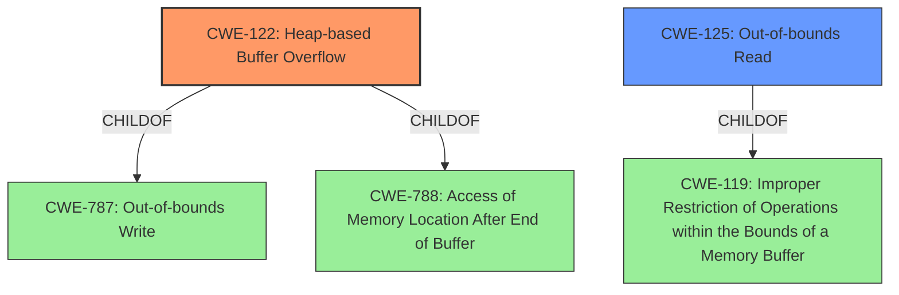

# Analysis Report for CVE-2020-23333

# Vulnerability Analysis Report: CVE-2020-23333

## Description


## Analysis (with Relationship Data)

# Summary
| CWE ID | CWE Name | Confidence | CWE Abstraction Level | CWE Vulnerability Mapping Label | CWE-Vulnerability Mapping Notes |
|---|---|---|---|---|---|
| CWE-122 | Heap-based Buffer Overflow | 1.0 | Variant | Allowed | Primary CWE |
| CWE-125 | Out-of-bounds Read | 0.7 | Base | Allowed | Secondary CWE |

## Evidence and Confidence

*   **Confidence Score:** 0.85
*   **Evidence Strength:** HIGH

## Relationship Analysis
The primary weakness identified is CWE-122 **Heap-based Buffer Overflow**, a variant of CWE-787 **Out-of-bounds Write** and CWE-788 **Access of Memory Location After End of Buffer**. The secondary weakness CWE-125 **Out-of-bounds Read** is a base level weakness and a child of CWE-119 **Improper Restriction of Operations within the Bounds of a Memory Buffer**. The vulnerability description indicates that an out-of-bounds read occurs when insufficient bounds checking is performed, leading to the heap-based buffer overflow. Therefore, both weaknesses are relevant to the vulnerability.



## Vulnerability Chain
The vulnerability chain starts with insufficient bounds checking during data processing from a crafted MP4 file. This leads to an out-of-bounds read (CWE-125) because the code reads a 32-bit unsigned integer without validating that sufficient bytes are available in the input stream. The out-of-bounds read then results in a **heap-based buffer overflow** (CWE-122) due to writing data beyond the allocated buffer's boundaries. The final impact is a crash of the application (denial of service) or potential for arbitrary code execution.

## Summary of Analysis
The initial assessment identified CWE-122 **Heap-based Buffer Overflow** as the primary weakness, supported by the vulnerability description stating a "**heap-based buffer overflow**" exists. The CVE Reference Links Content Summary further confirms this, indicating that the vulnerability is a **heap buffer overflow** in the `AP4_CttsAtom::AP4_CttsAtom` function, occurring due to insufficient bounds checking while reading data.

CWE-125 **Out-of-bounds Read** is considered as a secondary contributing factor, because the "**code reads a 32-bit unsigned integer using AP4_BytesToUInt32BE from an input byte stream without ensuring that sufficient bytes are available, causing an out-of-bounds read**."

The selection of CWE-122 and CWE-125 is based on direct evidence from the vulnerability description and the CVE reference summary. The hierarchical relationships, especially the child-parent relationship between CWE-122, CWE-787, and CWE-119, as well as CWE-125 and CWE-119, reinforce the classification. The selected CWEs are at the optimal level of specificity, with CWE-122 being a Variant and CWE-125 being a Base.

Relevant CWE Information:
*   **CWE-122: Heap-based Buffer Overflow**
    *   **Description**: A heap overflow condition is a buffer overflow, where the buffer that can be overwritten is allocated in the heap portion of memory, generally meaning that the buffer was allocated using a routine such as malloc().
    *   The provided description clearly matches the vulnerability. The vulnerability is explicitly described as a "**heap-based buffer overflow**"
    *   The impact is a crash of the application (mp42aac) or potential for arbitrary code execution.
*   **CWE-125: Out-of-bounds Read**
    *   **Description**: The product reads data past the end, or before the beginning, of the intended buffer.
    *   The CVE reference summary indicates that the "**code reads a 32-bit unsigned integer using `AP4_BytesToUInt32BE` from an input byte stream without ensuring that sufficient bytes are available, causing an out-of-bounds read**." This matches the description of CWE-125.
    *   The impact is contributing to the heap-based buffer overflow.


## CWE Relationship Analysis

Current CWEs represent these abstraction levels: .


### Vulnerability Chain Analysis

**Chain starting from CWE-787:**
- 787 (Out-of-bounds Write) - ROOT


**Chain starting from CWE-122:**
- 122 (Heap-based Buffer Overflow) - ROOT


### CWE Relationship Diagram

```mermaid
graph TD
    classDef primary fill:#f96,stroke:#333,stroke-width:2px
    classDef secondary fill:#69f,stroke:#333
    classDef tertiary fill:#9e9,stroke:#333
```


*Report generated on 2025-04-01 21:13:33*
