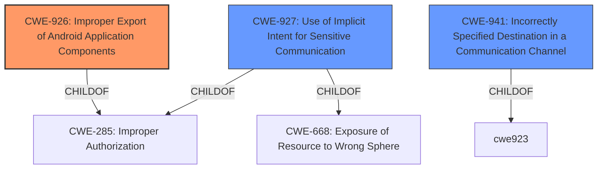

# Analysis Report for CVE-2020-23349

# Vulnerability Analysis Report: CVE-2020-23349

## Description


## Analysis (with Relationship Data)

# Summary
| CWE ID | CWE Name | Confidence | CWE Abstraction Level | CWE Vulnerability Mapping Label | CWE-Vulnerability Mapping Notes |
|---|---|---|---|---|---|
| CWE-926 | Improper Export of Android Application Components | 0.9 | Variant | Allowed | Primary CWE |
| CWE-927 | Use of Implicit Intent for Sensitive Communication | 0.7 | Variant | Allowed | Secondary Candidate |
| CWE-941 | Incorrectly Specified Destination in a Communication Channel | 0.6 | Base | Allowed | Secondary Candidate |

## Evidence and Confidence

*   **Confidence Score:** 0.8
*   **Evidence Strength:** HIGH

## Relationship Analysis
The primary CWE, CWE-926 [Improper Export of Android Application Components], is a variant of CWE-285 [Improper Authorization]. This hierarchical relationship indicates that the vulnerability is related to authorization issues specific to Android components. CWE-927 [Use of Implicit Intent for Sensitive Communication] is a child of CWE-285 and CWE-668 [Exposure of Resource to Wrong Sphere], suggesting a potential exposure of sensitive data due to improper intent handling. CWE-941 [Incorrectly Specified Destination in a Communication Channel] is related to specifying a communication channel. The relationships show a progression from a general authorization issue to a specific Android component exposure, potentially leading to sensitive information exposure via intents. The abstraction levels (Variant and Base) are appropriate for the detail available in the vulnerability description.



## Vulnerability Chain
The chain of weaknesses is as follows:
1.  **Root Cause:** **Improper export** of `WbShareTransActivity` Android component (CWE-926).
2.  **Mechanism:** **Intent redirection** vulnerability allows starting unexported activities.
3.  **Impact:** Potential for unauthorized access, data breaches, and privilege escalation.

## Summary of Analysis
The primary assessment is based on the vulnerability description indicating an **intent redirection** issue due to the improper export of an Android component (`WbShareTransActivity`). The GitHub issue report confirms this, stating that the component is exported without proper access control, leading to invocation of private components.

> Vulnerability Description:
> An **intent redirection** issue was doscovered in Sina Weibo Android SDK 4.2.7 (com.sina.weibo.sdk.share.WbShareTransActivity), any unexported Activities could be started by the com.sina.weibo.sdk.share.WbShareTransActivity.

CWE-926 [Improper Export of Android Application Components] is selected as the primary CWE because it directly addresses the root cause:

> CWE-926 Description:
> The Android application exports a component for use by other applications, but does not properly restrict which applications can launch the component or access the data it contains.

The relationship analysis further supports this by showing that CWE-926 is a variant of CWE-285 [Improper Authorization], indicating an authorization issue. The selection of CWE-926 is at the optimal level of specificity because it is a Variant that accurately represents the vulnerability. CWE-927 [Use of Implicit Intent for Sensitive Communication] and CWE-941 [Incorrectly Specified Destination in a Communication Channel] are considered as secondary CWEs because the exported activity can receive implicit intents and potentially redirect to unintended destinations, exacerbating the **intent redirection** issue.

CWEs considered but not used:
*   CWE-59 [Improper Link Resolution Before File Access ('Link Following')], CWE-41 [Improper Resolution of Path Equivalence], CWE-23 [Relative Path Traversal], CWE-61 [UNIX Symbolic Link (Symlink) Following]: These are related to file system vulnerabilities, which are not indicated in the vulnerability description.
*   CWE-451 [User Interface (UI) Misrepresentation of Critical Information], CWE-203 [Observable Discrepancy], CWE-668 [Exposure of Resource to Wrong Sphere], CWE-754 [Improper Check for Unusual or Exceptional Conditions], CWE-667 [Improper Locking], CWE-201 [Insertion of Sensitive Information Into Sent Data], CWE-226 [Sensitive Information in Resource Not Removed Before Reuse], CWE-202 [Exposure of Sensitive Information Through Data Queries], CWE-209 [Generation of Error Message Containing Sensitive Information], CWE-386 [Symbolic Name not Mapping to Correct Object], CWE-212 [Improper Removal of Sensitive Information Before Storage or Transfer], CWE-1272 [Sensitive Information Uncleared Before Debug/Power State Transition], CWE-363 [Race Condition Enabling Link Following], CWE-367 [Time-of-check Time-of-use (TOCTOU) Race Condition], CWE-863 [Incorrect Authorization]: These CWEs are not specific to Android component exposure and do not accurately reflect the root cause.
*   CWE-125 [Out-of-bounds Read]: There is no mention of out-of-bounds reads in the provided information.
*   CWE-377 [Insecure Temporary File], CWE-525 [Use of Web Browser Cache Containing Sensitive Information]: These are related to temporary files and web browser cache vulnerabilities, respectively, which are not relevant to the vulnerability description.


## CWE Relationship Analysis

Current CWEs represent these abstraction levels: .


### Vulnerability Chain Analysis

**Chain starting from CWE-754:**
- 754 (Improper Check for Unusual or Exceptional Conditions) - ROOT


**Chain starting from CWE-926:**
- 926 (Improper Export of Android Application Components) - ROOT


### CWE Relationship Diagram

```mermaid
graph TD
    classDef primary fill:#f96,stroke:#333,stroke-width:2px
    classDef secondary fill:#69f,stroke:#333
    classDef tertiary fill:#9e9,stroke:#333
```


*Report generated on 2025-04-02 07:46:08*
