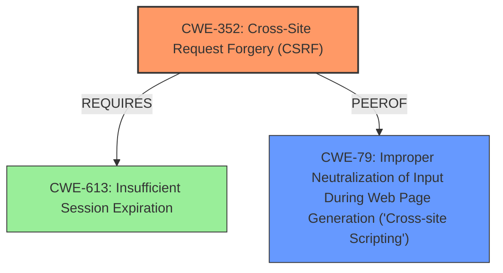

# Analysis Report for CVE-2020-23376

# Vulnerability Analysis Report: CVE-2020-23376

## Description


## Analysis (with Relationship Data)

# Summary

| CWE ID | CWE Name | Confidence | CWE Abstraction Level | CWE Vulnerability Mapping Label | CWE-Vulnerability Mapping Notes |
|---|---|---|---|---|---|
| CWE-352 | Cross-Site Request Forgery (CSRF) | 1.0 | Compound | Allowed | Primary CWE |
| CWE-79 | Improper Neutralization of Input During Web Page Generation ('Cross-site Scripting') | 1.0 | Base | Allowed | Secondary CWE |

## Evidence and Confidence

*   **Confidence Score:** 1.0
*   **Evidence Strength:** HIGH

## Relationship Analysis

The primary relationship influencing the selection is that CWE-352 [Cross-Site Request Forgery (CSRF)] **Requires** proper session management (e.g., CWE-613 [Insufficient Session Expiration]), and often **CanPrecede** other vulnerabilities like XSS. CWE-79 [Improper Neutralization of Input During Web Page Generation ('Cross-site Scripting')] is a separate vulnerability that exists because of **improper neutralization** of input. The graph shows that CWE-79 [Improper Neutralization of Input During Web Page Generation ('Cross-site Scripting')] is a peer of CWE-352 [Cross-Site Request Forgery (CSRF)].



## Vulnerability Chain

The vulnerability chain starts with a **lack of CSRF protection** (CWE-352). This allows an attacker to inject arbitrary web script or HTML. The injected script is then **improperly neutralized** (CWE-79) and stored, leading to a stored XSS vulnerability.

## Summary of Analysis

The initial analysis correctly identifies both CWE-352 [Cross-Site Request Forgery (CSRF)] and CWE-79 [Improper Neutralization of Input During Web Page Generation ('Cross-site Scripting')] as relevant. The root cause is the **lack of CSRF protection**, which allows the attacker to inject the XSS payload. The XSS vulnerability exists because the application does not properly neutralize the injected input.

The evidence from the vulnerability description and CVE Reference Links Content Summary strongly supports this conclusion:

*   "**rootcause:** **lack of CSRF protection**"
*   "**weakness:** **cross-site scripting**"
*   "The `public/index.php/admin/nav/add.html` endpoint in NoneCMS v1.3 **lacks CSRF protection**."
*   "The `name` parameter in the navigation item creation is **not sanitized**, which allows injection of arbitrary web script or HTML. This results in stored XSS."

The retriever results also support this, with CWE-352 [Cross-Site Request Forgery (CSRF)] and CWE-79 [Improper Neutralization of Input During Web Page Generation ('Cross-site Scripting')] being the top two combined results.

The selected CWEs are at the optimal level of specificity. CWE-352 [Cross-Site Request Forgery (CSRF)] is a compound weakness that accurately represents the **lack of CSRF protection**. CWE-79 [Improper Neutralization of Input During Web Page Generation ('Cross-site Scripting')] is a base weakness that accurately represents the **improper neutralization of input** leading to XSS.

The following CWEs were considered but not used:

*   CWE-116 [Improper Encoding or Escaping of Output]: While related to XSS, CWE-79 [Improper Neutralization of Input During Web Page Generation ('Cross-site Scripting')] is a more specific description of the vulnerability in this case.
*   CWE-434 [Unrestricted Upload of File with Dangerous Type]: Not relevant, as the vulnerability does not involve file uploads.
*   CWE-425 [Direct Request ('Forced Browsing')]: Not directly applicable, as the primary issue is the **lack of CSRF protection** rather than direct access to resources.
*   CWE-96 [Improper Neutralization of Directives in Statically Saved Code ('Static Code Injection')]: Not applicable, as the XSS is stored but not directly injected into static code files.

Relevant CWE Information:

# Enhanced Context (25 CWEs)

## CWE-80: Improper Neutralization of Script-Related HTML Tags in a Web Page (Basic XSS)
**Abstraction Level**: Variant
**Similarity Score**: 0.81
**Source**: dense

**Description**:
The product receives input from an upstream component, but it does not neutralize or incorrectly neutralizes special characters such as "<", ">", and "&" that could be interpreted as web-scripting elements when they are sent to a downstream component that processes web pages.

**Mapping Guidance**:
- Usage: Allowed
- Rationale: This CWE entry is at the Variant level of abstraction, which is a preferred level of abstraction for mapping to the root causes of vulnerabilities.

## CWE-74: Improper Neutralization of Special Elements in Output Used by a Downstream Component ('Injection')
**Abstraction Level**: Class
**Similarity Score**: 0.78
**Source**: dense

**Description**:
The product constructs all or part of a command, data structure, or record using externally-influenced input from an upstream component, but it does not neutralize or incorrectly neutralizes special elements that could modify how it is parsed or interpreted when it is sent to a downstream component.

**Mapping Guidance**:
- Usage: Discouraged
- Rationale: CWE-74 is high-level and often misused when lower-level weaknesses are more appropriate.

## CWE-184: Incomplete List of Disallowed Inputs
**Abstraction Level**: Base
**Similarity Score**: 0.77
**Source**: dense

**Description**:
The product implements a protection mechanism that relies on a list of inputs (or properties of inputs) that are not allowed by policy or otherwise require other action to neutralize before additional processing takes place, but the list is incomplete.

**Mapping Guidance**:
- Usage: Allowed
- Rationale: This CWE entry is at the Base level of abstraction, which is a preferred level of abstraction for mapping to the root causes of vulnerabilities.

## CWE-1289: Improper Validation of Unsafe Equivalence in Input
**Abstraction Level**: Base
**Similarity Score**: 0.76
**Source**: dense

**Description**:
The product receives an input value that is used as a resource identifier or other type of reference, but it does not validate or incorrectly validates that the input is equivalent to a potentially-unsafe value.

**Mapping Guidance**:
- Usage: Allowed
- Rationale: This CWE entry is at the Base level of abstraction, which is a preferred level of abstraction for mapping to the root causes of vulnerabilities.

## CWE-138: Improper Neutralization of Special Elements
**Abstraction Level**: Class
**Similarity Score**: 0.76
**Source**: dense

**Description**:
The product receives input from an upstream component, but it does not neutralize or incorrectly neutralizes special elements that could be interpreted as control elements or syntactic markers when they are sent to a downstream component.

**Mapping Guidance**:
- Usage: Discouraged
- Rationale: This CWE entry is a level-1 Class (i.e., a child of a Pillar). It might have lower-level children that would be more appropriate

## CWE-84: Improper Neutralization of Encoded URI Schemes in a Web Page
**Abstraction Level**: Variant
**Similarity Score**: 0.76
**Source**: dense

**Description**:
The web application improperly neutralizes user-controlled input for executable script disguised with URI encodings.

**Mapping Guidance**:
- Usage: Allowed
- Rationale: This CWE entry is at the Variant level of abstraction, which is a preferred level of abstraction for mapping to the root causes of vulnerabilities.

## CWE-116: Improper Encoding or Escaping of Output
**Abstraction Level**: Class
**Similarity Score**: 0.76
**Source**: dense

**Description**:
The product prepares a structured message for communication with another component, but encoding or escaping of the data is either missing or done incorrectly. As a result, the intended structure of the message is not preserved.

**Mapping Guidance**:
- Usage: Allowed-with-Review
- Rationale: This CWE entry is a Class and might have Base-level children that would be more appropriate

## CWE-113: Improper Neutralization of CRLF Sequences in HTTP Headers ('HTTP Request/Response Splitting')
**Abstraction Level**: Variant
**Similarity Score**: 0.76
**Source**: dense

**Description**:
The


## CWE Relationship Analysis

Current CWEs represent these abstraction levels: .


### Vulnerability Chain Analysis

**Chain starting from CWE-113:**
- 113 (Improper Neutralization of CRLF Sequences in HTTP Headers ('HTTP Request/Response Splitting')) - ROOT


**Chain starting from CWE-79:**
- 79 (Improper Neutralization of Input During Web Page Generation ('Cross-site Scripting')) - ROOT


### CWE Relationship Diagram

```mermaid
graph TD
    classDef primary fill:#f96,stroke:#333,stroke-width:2px
    classDef secondary fill:#69f,stroke:#333
    classDef tertiary fill:#9e9,stroke:#333
```


*Report generated on 2025-04-02 09:27:06*
