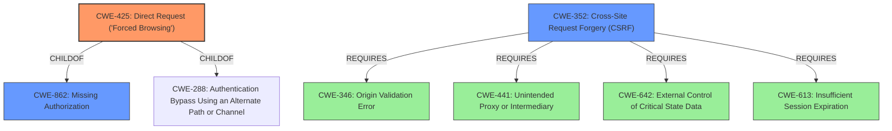

# Enhanced Analysis for CVE-2020-23426

# Summary
| CWE ID | CWE Name | Confidence | CWE Abstraction Level | CWE Vulnerability Mapping Label | CWE-Vulnerability Mapping Notes |
|---|---|---|---|---|---|
| CWE-425 | Direct Request ('Forced Browsing') | 0.8 | Base | Allowed | Primary CWE |
| CWE-352 | Cross-Site Request Forgery (CSRF) | 0.7 | Compound | Allowed | Secondary Candidate |
| CWE-862 | Missing Authorization | 0.6 | Class | Allowed-with-Review | Secondary Candidate |

## Evidence and Confidence

*   **Confidence Score:** 0.8
*   **Evidence Strength:** HIGH

## Relationship Analysis
The primary CWE is CWE-425 Direct Request ('Forced Browsing'), which is a base-level CWE. It has a ChildOf relationship to both CWE-862 Missing Authorization and CWE-288. The vulnerability allows direct access to `adv.php` because the authorization check is incomplete. CWE-352 Cross-Site Request Forgery (CSRF) is a compound CWE that requires several other weaknesses to be present, namely CWE-346, CWE-441, CWE-642, and CWE-613. However, in this particular case, the root cause is the direct request vulnerability that enables the CSRF attack.



## Vulnerability Chain
The vulnerability chain starts with an **insecure authentication check** in `check.php`, where only one of the `UserName` or `PassWord` cookies being present is sufficient for a partial authentication. This leads to **Missing Authorization** because `adv.php` proceeds to execute without proper authentication. Consequently, an attacker can directly request (`adv.php`) with a crafted `UserName` cookie. This creates an opportunity for a **CSRF** attack by modifying advertising settings. The final impact is **Privilege Escalation**, where an attacker modifies settings for users without proper authorization.

## Summary of Analysis
The initial assessment focused on **access control vulnerability** and the ability to modify data leading to CSRF. The key evidence is from the "CVE Reference Links Content Summary" section, stating that the `check.php` script **fails to properly validate user login**, allowing an attacker to bypass the authentication check with a partial cookie and the lack of sanitization of `$_COOKIE["UserName"]`. This led to considering CWE-352 (CSRF) and related authorization issues. However, the deeper analysis revealed that the primary issue is the **lack of adequate enforcement of authorization on the `adv.php` resource**, as the script continues execution even with an incomplete authentication. This corresponds to **CWE-425: Direct Request ('Forced Browsing')**.

The relationship graph highlights that CWE-425 is a more fundamental issue than CSRF, as CSRF is enabled by the ability to directly access the resource. While CWE-352 (CSRF) is a valid concern given the impact, it's a secondary effect of the **missing authorization** and **improper authentication check.**

Therefore, **CWE-425** is the optimal choice because it directly addresses the root cause of the vulnerability: the web application's failure to adequately enforce authorization on the `adv.php` resource, allowing direct requests.

CWE-862 Missing Authorization was also considered, but it's a Class-level CWE. CWE-425 is a more specific Base-level CWE.

CWE-639 Authorization Bypass Through User-Controlled Key was also considered given the manipulation of the UserName cookie. However, the core issue isn't modifying a key to access another user's data, but accessing the resource directly due to the flawed authentication check.

Relevant CWE Information:


## CWE Relationship Analysis

Current CWEs represent these abstraction levels: .


### Vulnerability Chain Analysis

**Chain starting from CWE-288:**
- 288 (Authentication Bypass Using an Alternate Path or Channel) - ROOT


**Chain starting from CWE-862:**
- 862 (Missing Authorization) - ROOT


### CWE Relationship Diagram

```mermaid
graph TD
    classDef primary fill:#f96,stroke:#333,stroke-width:2px
    classDef secondary fill:#69f,stroke:#333
    classDef tertiary fill:#9e9,stroke:#333
```