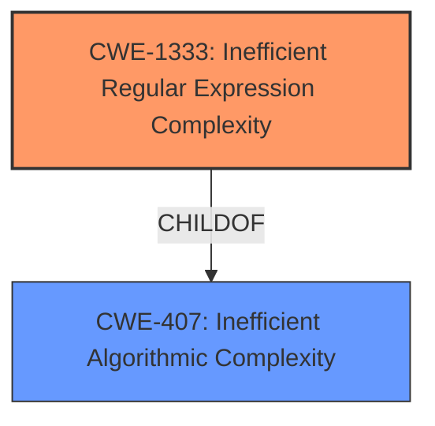

# Enhanced Analysis for CVE-2020-23469

# Summary
| CWE ID  | CWE Name                                      | Confidence | CWE Abstraction Level | CWE Vulnerability Mapping Label | CWE-Vulnerability Mapping Notes |
| :-------- | :-------------------------------------------- | :--------- | :---------------------- | :------------------------------ | :------------------------------ |
| CWE-1333 | Inefficient Regular Expression Complexity     | 0.95       | Base                    | Allowed                         | Primary CWE                     |
| CWE-407 | Inefficient Algorithmic Complexity | 0.75       | Class                    | Allowed-with-Review                         | Secondary Candidate                     |

## Evidence and Confidence

*   **Confidence Score:** 0.9
*   **Evidence Strength:** HIGH

## Relationship Analysis
The primary relationship impacting the decision is that CWE-1333 is a child of CWE-407. Therefore, if CWE-1333 is a good fit, it is preferable to the more general CWE-407.



## Vulnerability Chain
The vulnerability chain starts with the **inefficient regular expression complexity** (CWE-1333) leading to excessive CPU consumption, and ultimately a denial of service.

## Summary of Analysis
The initial assessment identified CWE-1333 as the primary candidate due to the **rootcause** being **"regular expression complexity"** that leads to a denial of service. The "CVE Reference Links Content Summary" section also confirms that the **root cause** is the use of inefficient regular expressions which leads to Regular Expression Denial of Service (ReDoS) attacks.
The retriever results also listed CWE-1333 as the top candidate.
The description of CWE-1333 matches the vulnerability well: "The product uses a regular expression with an inefficient, possibly exponential worst-case computational complexity that consumes excessive CPU cycles."
The selection of CWE-1333 is at the optimal level of specificity as it directly addresses the inefficient regular expression complexity, which is the **rootcause** of the denial-of-service vulnerability. CWE-407 is a parent, but is too high level.

Relevant CWE Information:

# Enhanced Context (25 CWEs)
The following CWEs were identified as potentially relevant to this vulnerability:

## CWE-625: Permissive Regular Expression
**Abstraction Level**: Base
**Similarity Score**: 0.79
**Source**: dense

**Description**:
The product uses a regular expression that does not sufficiently restrict the set of allowed values.

**Mapping Guidance**:
- Usage: Allowed
- Rationale: This CWE entry is at the Base level of abstraction, which is a preferred level of abstraction for mapping to the root causes of vulnerabilities.

## CWE-185: Incorrect Regular Expression
**Abstraction Level**: Class
**Similarity Score**: 0.77
**Source**: dense

**Description**:
The product specifies a regular expression in a way that causes data to be improperly matched or compared.

**Mapping Guidance**:
- Usage: Allowed-with-Review
- Rationale: This CWE entry is a Class and might have Base-level children that would be more appropriate

## CWE-186: Overly Restrictive Regular Expression
**Abstraction Level**: Base
**Similarity Score**: 0.76
**Source**: dense

**Description**:
A regular expression is overly restrictive, which prevents dangerous values from being detected.

**Mapping Guidance**:
- Usage: Allowed
- Rationale: This CWE entry is at the Base level of abstraction, which is a preferred level of abstraction for mapping to the root causes of vulnerabilities.

## CWE-777: Regular Expression without Anchors
**Abstraction Level**: Variant
**Similarity Score**: 0.75
**Source**: dense

**Description**:
The product uses a regular expression to perform neutralization, but the regular expression is not anchored and may allow malicious or malformed data to slip through.

**Mapping Guidance**:
- Usage: Allowed
- Rationale: This CWE entry is at the Variant level of abstraction, which is a preferred level of abstraction for mapping to the root causes of vulnerabilities.

## CWE-1333: Inefficient Regular Expression Complexity
**Abstraction Level**: Base
**Similarity Score**: 0.73
**Source**: dense

**Description**:
The product uses a regular expression with an inefficient, possibly exponential worst-case computational complexity that consumes excessive CPU cycles.

**Mapping Guidance**:
- Usage: Allowed
- Rationale: This CWE entry is at the Base level of abstraction, which is a preferred level of abstraction for mapping to the root causes of vulnerabilities.

## CWE-407: Inefficient Algorithmic Complexity
**Abstraction Level**: Class
**Similarity Score**: 0.72
**Source**: dense

**Description**:
An algorithm in a product has an inefficient worst-case computational complexity that may be detrimental to system performance and can be triggered by an attacker, typically using crafted manipulations that ensure that the worst case is being reached.

**Mapping Guidance**:
- Usage: Allowed-with-Review
- Rationale: This CWE entry is a Class and might have Base-level children that would be more appropriate

## CWE-1289: Improper Validation of Unsafe Equivalence in Input
**Abstraction Level**: Base
**Similarity Score**: 0.72
**Source**: dense

**Description**:
The product receives an input value that is used as a resource identifier or other type of reference, but it does not validate or incorrectly validates that the input is equivalent to a potentially-unsafe value.

**Mapping Guidance**:
- Usage: Allowed
- Rationale: This CWE entry is at the Base level of abstraction, which is a preferred level of abstraction for mapping to the root causes of vulnerabilities.

## CWE-184: Incomplete List of Disallowed Inputs
**Abstraction Level**: Base
**Similarity Score**: 0.71
**Source**: dense

**Description**:
The product implements a protection mechanism that relies on a list of inputs (or properties of inputs) that are not allowed by policy or otherwise require other action to neutralize before additional processing takes place, but the list is incomplete.

**Mapping Guidance**:
- Usage: Allowed
- Rationale: This CWE entry is at the Base level of abstraction, which is a preferred level of abstraction for mapping to the root causes of vulnerabilities.

## CWE-41: Improper Resolution of Path Equivalence
**Abstraction Level**: Base
**Similarity Score**: 0.70
**Source**: dense

**Description**:
The product is vulnerable to file system contents disclosure through path equivalence. Path equivalence involves the use of special characters in file and directory names. The associated manipulations are intended to generate multiple names for the same object.

**Mapping Guidance**:
- Usage: Allowed
- Rationale: This CWE entry is at the Base level of abstraction, which is a preferred level of abstraction for mapping to the root causes of vulnerabilities.

## CWE-129: Improper Validation of Array Index
**Abstraction Level**: Variant
**Similarity Score**: 0.70
**Source**: dense

**Description**:
The product uses untrusted input when calculating or using an array index, but the product does not validate or incorrectly validates the index to ensure the index references a valid position within the array.

**Mapping Guidance**:
- Usage: Allowed
- Rationale: This CWE entry is at the Variant level of abstraction, which is a preferred level of abstraction for mapping to the root causes of vulnerabilities.

## CWE-1333: Inefficient Regular Expression Complexity
**Abstraction Level**: Base
**Similarity Score**: 5540.21
**Source**: sparse

**Description**:
The product uses a regular expression with an inefficient, possibly exponential worst-case computational complexity that consumes excessive CPU cycles.

**Mapping Guidance**:
- Usage: Allowed
- Rationale: This CWE entry is at the Base level of abstraction, which is a preferred level of abstraction for mapping to the root causes of vulnerabilities.

## CWE-625: Permissive Regular Expression
**Abstraction Level**: Base
**Similarity Score**: 5209.17
**Source**: sparse

**Description**:
The product uses a regular expression that does not sufficiently restrict the set of allowed values.

**Mapping Guidance**:
- Usage: Allowed
- Rationale: This CWE entry is at the Base level of abstraction, which is a preferred level of abstraction for mapping to the root causes of vulnerabilities.

## CWE-617: Reachable Assertion
**Abstraction Level**: Base
**Similarity Score**: 5027.75
**Source**: sparse

**Description**:
The product contains an assert() or similar statement that can be triggered by an attacker, which leads to an application exit or other behavior that is more severe than necessary.

**Mapping Guidance**:
- Usage: Allowed
- Rationale: This CWE entry is at the Base level of abstraction, which is a preferred level of abstraction for mapping to the root causes of vulnerabilities.

## CWE-626


## CWE Relationship Analysis

Current CWEs represent these abstraction levels: .


### Vulnerability Chain Analysis

**Chain starting from CWE-186:**
- 186 (Overly Restrictive Regular Expression) - ROOT


**Chain starting from CWE-185:**
- 185 (Incorrect Regular Expression) - ROOT


### CWE Relationship Diagram

```mermaid
graph TD
    classDef primary fill:#f96,stroke:#333,stroke-width:2px
    classDef secondary fill:#69f,stroke:#333
    classDef tertiary fill:#9e9,stroke:#333
```