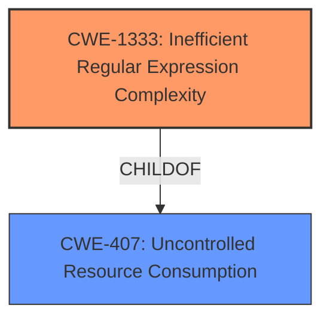

# Analysis for CVE-2020-23478

# Summary
| CWE ID    | CWE Name                                    | Confidence | CWE Abstraction Level | CWE Vulnerability Mapping Label | CWE-Vulnerability Mapping Notes |
| :-------- | :------------------------------------------ | :--------- | :-------------------- | :------------------------------ | :------------------------------ |
| CWE-1333  | Inefficient Regular Expression Complexity   | 1.0        | Base                  | Allowed                         | Allowed                         |

## Evidence and Confidence

*   **Confidence Score:** 1.0
*   **Evidence Strength:** HIGH

## Relationship Analysis
The primary relationship that influenced the decision was the direct match of the vulnerability description to CWE-1333, "Inefficient Regular Expression Complexity." This CWE falls under the broader category of resource management issues, specifically related to CPU consumption due to inefficient algorithms. The Retriever Results highlighted this CWE as the top match, reinforcing its relevance. No other parent-child or peer relationships significantly altered the mapping decision, as CWE-1333 provides the most specific and accurate classification for this vulnerability.

## Vulnerability Chain
The vulnerability chain starts with the **inefficient regular expression** (CWE-1333) in the `dart.py` plugin. This leads to excessive backtracking when processing specially crafted input strings. The excessive backtracking leads to high CPU consumption, resulting in a denial-of-service condition.

## Summary of Analysis
The initial analysis correctly identified the **regular expression denial of service** vulnerability in Leo Editor v6.2.1. The evidence provided in the CVE Reference Links Content Summary strongly supports this assessment. The **root cause** is the **inefficient regular expression** `^\s*([\w_]+\s*)+\(` which allows for excessive backtracking.

The Retriever Results confirmed CWE-1333 "Inefficient Regular Expression Complexity" as the most relevant CWE.

The final selection of CWE-1333 is based on the direct evidence of an **inefficient regular expression** leading to denial of service. This CWE provides the optimal level of specificity for this vulnerability.

Relevant CWE Information:

# Enhanced Context (25 CWEs)
The following CWEs were identified as potentially relevant to this vulnerability:

## CWE-674: Uncontrolled Recursion
**Abstraction Level**: Class
**Similarity Score**: 0.75
**Source**: dense
**Description**:
The product does not properly control the amount of recursion that takes place, consuming excessive resources, such as allocated memory or the program stack.

## CWE-625: Permissive Regular Expression
**Abstraction Level**: Base
**Similarity Score**: 0.75
**Source**: dense
**Description**:
The product uses a regular expression that does not sufficiently restrict the set of allowed values.

## CWE-129: Improper Validation of Array Index
**Abstraction Level**: Variant
**Similarity Score**: 0.75
**Source**: dense
**Description**:
The product uses untrusted input when calculating or using an array index, but the product does not validate or incorrectly validates the index to ensure the index references a valid position within the array.

## CWE-131: Incorrect Calculation of Buffer Size
**Abstraction Level**: Base
**Similarity Score**: 0.75
**Source**: dense
**Description**:
The product does not correctly calculate the size to be used when allocating a buffer, which could lead to a buffer overflow.

## CWE-125: Out-of-bounds Read
**Abstraction Level**: Base
**Similarity Score**: 0.74
**Source**: dense
**Description**:
The product reads data past the end, or before the beginning, of the intended buffer.

## CWE-788: Access of Memory Location After End of Buffer
**Abstraction Level**: Base
**Similarity Score**: 0.74
**Source**: dense
**Description**:
The product reads or writes to a buffer using an index or pointer that references a memory location after the end of the buffer.

## CWE-74: Improper Neutralization of Special Elements in Output Used by a Downstream Component ('Injection')
**Abstraction Level**: Class
**Similarity Score**: 0.73
**Source**: dense
**Description**:
The product constructs all or part of a command, data structure, or record using externally-influenced input from an upstream component, but it does not neutralize or incorrectly neutralizes special elements that could modify how it is parsed or interpreted when it is sent to a downstream component.

## CWE-617: Reachable Assertion
**Abstraction Level**: Base
**Similarity Score**: 0.73
**Source**: dense
**Description**:
The product contains an assert() or similar statement that can be triggered by an attacker, which leads to an application exit or other behavior that is more severe than necessary.

## CWE-191: Integer Underflow (Wrap or Wraparound)
**Abstraction Level**: Base
**Similarity Score**: 0.73
**Source**: dense
**Description**:
The product subtracts one value from another, such that the result is less than the minimum allowable integer value, which produces a value that is not equal to the correct result.

## CWE-252: Unchecked Return Value
**Abstraction Level**: Base
**Similarity Score**: 0.73
**Source**: dense
**Description**:
The product does not check the return value from a method or function, which can prevent it from detecting unexpected states and conditions.

## CWE-1333: Inefficient Regular Expression Complexity
**Abstraction Level**: Base
**Similarity Score**: 5135.89
**Source**: sparse
**Description**:
The product uses a regular expression with an inefficient, possibly exponential worst-case computational complexity that consumes excessive CPU cycles.

## CWE-625: Permissive Regular Expression
**Abstraction Level**: Base
**Similarity Score**: 4861.28
**Source**: sparse
**Description**:
The product uses a regular expression that does not sufficiently restrict the set of allowed values.

## CWE-617: Reachable Assertion
**Abstraction Level**: Base
**Similarity Score**: 4759.96
**Source**: sparse
**Description**:
The product contains an assert() or similar statement that can be triggered by an attacker, which leads to an application exit or other behavior that is more severe than necessary.

## CWE-626: Null Byte Interaction Error (Poison Null Byte)
**Abstraction Level**: Variant
**Similarity Score**: 4558.87
**Source**: sparse
**Description**:
The product does not properly handle null bytes or NUL characters when passing data between different representations or components.

## CWE-186: Overly Restrictive Regular Expression
**Abstraction Level**: Base
**Similarity Score**: 4474.57
**Source**: sparse
**Description**:
A regular expression is overly restrictive, which prevents dangerous values from being detected.

## CWE-183: Permissive List of Allowed Inputs
**Abstraction Level**: base
**Similarity Score**: 4.51
**Source**: graph
**Description**:
CWE-183: Permissive List of Allowed Inputs

## CWE-187: Partial String Comparison
**Abstraction Level**: variant
**Similarity Score**: 4.40
**Source**: graph
**Description**:
CWE-187: Partial String Comparison

## CWE-184: Incomplete List of Disallowed Inputs
**Abstraction Level**: base
**Similarity Score**: 4.39
**Source**: graph
**Description**:
CWE-184: Incomplete List of Disallowed Inputs

## CWE-182: Collapse of Data into Unsafe Value
**Abstraction Level**: base
**Similarity Score**: 4.33
**Source**: graph
**Description**:
CWE-182: Collapse of Data into Unsafe Value

## CWE-186: Overly Restrictive Regular Expression
**Abstraction Level**: base
**Similarity Score**: 3.64
**Source**: graph
**Description**:
CWE-186: Overly Restrictive Regular Expression

## CWE-787: Out-of-bounds Write
**Abstraction Level**: base
**Similarity Score**: 3.30
**Source**: graph
**Description**:
CWE-787: Out-of-bounds Write

## CWE-35: Path Traversal: '.../...//'
**Abstraction Level**: variant
**Similarity Score**: 3.24
**Source**: graph
**Description**:
CWE-35: Path Traversal: '.../...//'

## CWE-34: Path Traversal: '....//'
**Abstraction Level**: variant
**Similarity Score**: 3.24
**Source**: graph
**Description**:
CWE-34: Path Traversal: '....//'

## CWE-33: Path