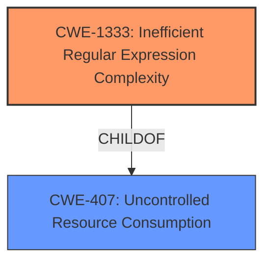

# Analysis for CVE-2020-23478

# Summary
| CWE ID    | CWE Name                                    | Confidence | CWE Abstraction Level | CWE Vulnerability Mapping Label | CWE-Vulnerability Mapping Notes |
| :-------- | :------------------------------------------ | :--------- | :-------------------- | :------------------------------ | :------------------------------ |
| CWE-1333  | Inefficient Regular Expression Complexity   | 1.0        | Base                  | Allowed                         | Allowed                         |

## Evidence and Confidence

*   **Confidence Score:** 1.0
*   **Evidence Strength:** HIGH

## Relationship Analysis
The primary relationship that influenced the decision was the direct match of the vulnerability description to CWE-1333, "Inefficient Regular Expression Complexity." This CWE falls under the broader category of resource management issues, specifically related to CPU consumption due to inefficient algorithms. The Retriever Results highlighted this CWE as the top match, reinforcing its relevance. No other parent-child or peer relationships significantly altered the mapping decision, as CWE-1333 provides the most specific and accurate classification for this vulnerability.

## Vulnerability Chain
The vulnerability chain starts with the **inefficient regular expression** (CWE-1333) in the `dart.py` plugin. This leads to excessive backtracking when processing specially crafted input strings. The excessive backtracking leads to high CPU consumption, resulting in a denial-of-service condition.

## Summary of Analysis
The initial analysis correctly identified the **regular expression denial of service** vulnerability in Leo Editor v6.2.1. The evidence provided in the CVE Reference Links Content Summary strongly supports this assessment. The **root cause** is the **inefficient regular expression** `^\s*([\w_]+\s*)+\(` which allows for excessive backtracking.

The Retriever Results confirmed CWE-1333 "Inefficient Regular Expression Complexity" as the most relevant CWE.

The final selection of CWE-1333 is based on the direct evidence of an **inefficient regular expression** leading to denial of service. This CWE provides the optimal level of specificity for this vulnerability.

Relevant CWE Information:

# Enhanced Context (25 CWEs)
The following CWEs were identified as potentially relevant to this vulnerability:

## CWE-674: Uncontrolled Recursion
**Abstraction Level**: Class
**Similarity Score**: 0.75
**Source**: dense
**Description**:
The product does not properly control the amount of recursion that takes place, consuming excessive resources, such as allocated memory or the program stack.

## CWE-625: Permissive Regular Expression
**Abstraction Level**: Base
**Similarity Score**: 0.75
**Source**: dense
**Description**:
The product uses a regular expression that does not sufficiently restrict the set of allowed values.

## CWE-129: Improper Validation of Array Index
**Abstraction Level**: Variant
**Similarity Score**: 0.75
**Source**: dense
**Description**:
The product uses untrusted input when calculating or using an array index, but the product does not validate or incorrectly validates the index to ensure the index references a valid position within the array.

## CWE-131: Incorrect Calculation of Buffer Size
**Abstraction Level**: Base
**Similarity Score**: 0.75
**Source**: dense
**Description**:
The product does not correctly calculate the size to be used when allocating a buffer, which could lead to a buffer overflow.

## CWE-125: Out-of-bounds Read
**Abstraction Level**: Base
**Similarity Score**: 0.74
**Source**: dense
**Description**:
The product reads data past the end, or before the beginning, of the intended buffer.

## CWE-788: Access of Memory Location After End of Buffer
**Abstraction Level**: Base
**Similarity Score**: 0.74
**Source**: dense
**Description**:
The product reads or writes to a buffer using an index or pointer that references a memory location after the end of the buffer.

## CWE-74: Improper Neutralization of Special Elements in Output Used by a Downstream Component ('Injection')
**Abstraction Level**: Class
**Similarity Score**: 0.73
**Source**: dense
**Description**:
The product constructs all or part of a command, data structure, or record using externally-influenced input from an upstream component, but it does not neutralize or incorrectly neutralizes special elements that could modify how it is parsed or interpreted when it is sent to a downstream component.

## CWE-617: Reachable Assertion
**Abstraction Level**: Base
**Similarity Score**: 0.73
**Source**: dense
**Description**:
The product contains an assert() or similar statement that can be triggered by an attacker, which leads to an application exit or other behavior that is more severe than necessary.

## CWE-191: Integer Underflow (Wrap or Wraparound)
**Abstraction Level**: Base
**Similarity Score**: 0.73
**Source**: dense
**Description**:
The product subtracts one value from another, such that the result is less than the minimum allowable integer value, which produces a value that is not equal to the correct result.

## CWE-252: Unchecked Return Value
**Abstraction Level**: Base
**Similarity Score**: 0.73
**Source**: dense
**Description**:
The product does not check the return value from a method or function, which can prevent it from detecting unexpected states and conditions.

## CWE-1333: Inefficient Regular Expression Complexity
**Abstraction Level**: Base
**Similarity Score**: 5135.89
**Source**: sparse
**Description**:
The product uses a regular expression with an inefficient, possibly exponential worst-case computational complexity that consumes excessive CPU cycles.

## CWE-625: Permissive Regular Expression
**Abstraction Level**: Base
**Similarity Score**: 4861.28
**Source**: sparse
**Description**:
The product uses a regular expression that does not sufficiently restrict the set of allowed values.

## CWE-617: Reachable Assertion
**Abstraction Level**: Base
**Similarity Score**: 4759.96
**Source**: sparse
**Description**:
The product contains an assert() or similar statement that can be triggered by an attacker, which leads to an application exit or other behavior that is more severe than necessary.

## CWE-626: Null Byte Interaction Error (Poison Null Byte)
**Abstraction Level**: Variant
**Similarity Score**: 4558.87
**Source**: sparse
**Description**:
The product does not properly handle null bytes or NUL characters when passing data between different representations or components.

## CWE-186: Overly Restrictive Regular Expression
**Abstraction Level**: Base
**Similarity Score**: 4474.57
**Source**: sparse
**Description**:
A regular expression is overly restrictive, which prevents dangerous values from being detected.

## CWE-183: Permissive List of Allowed Inputs
**Abstraction Level**: base
**Similarity Score**: 4.51
**Source**: graph
**Description**:
CWE-183: Permissive List of Allowed Inputs

## CWE-187: Partial String Comparison
**Abstraction Level**: variant
**Similarity Score**: 4.40
**Source**: graph
**Description**:
CWE-187: Partial String Comparison

## CWE-184: Incomplete List of Disallowed Inputs
**Abstraction Level**: base
**Similarity Score**: 4.39
**Source**: graph
**Description**:
CWE-184: Incomplete List of Disallowed Inputs

## CWE-182: Collapse of Data into Unsafe Value
**Abstraction Level**: base
**Similarity Score**: 4.33
**Source**: graph
**Description**:
CWE-182: Collapse of Data into Unsafe Value

## CWE-186: Overly Restrictive Regular Expression
**Abstraction Level**: base
**Similarity Score**: 3.64
**Source**: graph
**Description**:
CWE-186: Overly Restrictive Regular Expression

## CWE-787: Out-of-bounds Write
**Abstraction Level**: base
**Similarity Score**: 3.30
**Source**: graph
**Description**:
CWE-787: Out-of-bounds Write

## CWE-35: Path Traversal: '.../...//'
**Abstraction Level**: variant
**Similarity Score**: 3.24
**Source**: graph
**Description**:
CWE-35: Path Traversal: '.../...//'

## CWE-34: Path Traversal: '....//'
**Abstraction Level**: variant
**Similarity Score**: 3.24
**Source**: graph
**Description**:
CWE-34: Path Traversal: '....//'

## CWE-33: Path

# Enhanced Query for CVE-2020-23478

## Vulnerability Description
Leo Editor v6.2.1 was discovered to contain a **regular expression denial of service** (ReDoS) vulnerability in the component plugins/importers/dart.py.

### Vulnerability Description Key Phrases
- **weakness:** **regular expression denial of service**
- **product:** Leo Editor
- **version:** v6.2.1
- **component:** plugins/importers/dart.py

## CVE Reference Links Content Summary
Based on the provided content, here's an analysis of the vulnerability:

**Root Cause:** The vulnerability is a Regular Expression Denial of Service (ReDoS) issue. Specifically, the regular expression `^\s*([\w_]+\s*)+\(` used in the `dart.py` plugin is inefficient and can lead to excessive backtracking when processing specially crafted input strings.

**Weaknesses/Vulnerabilities:**
*   **Inefficient Regular Expression:** The use of the nested `([\w_]+\s*)+` pattern allows the regex engine to explore multiple matching possibilities when confronted with input strings that consist of many word characters and spaces. This leads to exponential time complexity for matching.
*   **Lack of Input Validation:** The code using the regex does not appear to have any protection against processing long, malicious strings, making it vulnerable to a denial-of-service attack.

**Impact of Exploitation:**
*   **Denial of Service:** A successful exploit can cause the affected service or application to become unresponsive due to the regex engine spending excessive time trying to match a crafted string, effectively making the application unavailable to legitimate users.

**Attack Vectors:**
*   **Malicious Input:** An attacker can provide a specially crafted input string, such as `"0000000000000000000000000000000000000000000000000000000000000000000000000000000000000000000000000000000000000000000000000000000\b"` (or similar string with many repetitions of `\w_` and whitespace), which triggers the ReDoS vulnerability.

**Required Attacker Capabilities/Position:**
*   **Ability to Provide Input:** The attacker needs to be able to provide input to the component or service that uses the vulnerable regex within `plugins/importers/dart.py`. The specific way this would occur would depend on how this plugin is utilized in the larger application.

**Proposed Solution (from the content):**
*   The suggested mitigation is to change the regex pattern from `([\w_]+\s*)+` to `[\w_][\w_\s]*`. This reduces the chances of excessive backtracking by avoiding the nested `+` quantifier.

**Additional Notes:**
* The content mentions that the developers are unsure if the specific ReDoS scenario can occur in their program, but acknowledge the vulnerability and suggest the fix.

This content provides more details than a standard CVE description, outlining the specific vulnerable regex, an example of malicious input, the attack vector, and a suggested fix.

## Retriever Results

### Top Combined Results

| Rank | CWE ID | Name | Abstraction | Usage  | Retrievers | Individual Scores |
|------|--------|------|-------------|-------|------------|-------------------|
| 1 | 1333 | Inefficient Regular Expression Complexity | Base | Allowed | alternate_terms | 1.000 |
| 2 | 674 | Uncontrolled Recursion | Class | Allowed-with-Review | sparse | 0.148 |
| 3 | 617 | Reachable Assertion | Base | Allowed | sparse | 0.144 |
| 4 | 185 | Incorrect Regular Expression | Class | Allowed-with-Review | sparse | 0.138 |
| 5 | 186 | Overly Restrictive Regular Expression | Base | Allowed | sparse | 0.136 |
| 6 | 777 | Regular Expression without Anchors | Variant | Allowed | dense | 0.467 |
| 7 | 182 | Collapse of Data into Unsafe Value | Base | Allowed | graph | 0.002 |
| 8 | 626 | Null Byte Interaction Error (Poison Null Byte) | Variant | Allowed | sparse | 0.135 |
| 9 | 625 | Permissive Regular Expression | Base | Allowed | sparse | 0.133 |
| 10 | 121 | Stack-based Buffer Overflow | Variant | Allowed | sparse | 0.129 |

# Complete CWE Specifications

## CWE-1333: Inefficient Regular Expression Complexity
**Abstraction:** Base
**Status:** Draft

### Description
The product uses a regular expression with an inefficient, possibly exponential worst-case computational complexity that consumes excessive CPU cycles.

### Extended Description
Some regular expression engines have a feature called "backtracking". If the token cannot match, the engine "backtracks" to a position that may result in a different token that can match.
 Backtracking becomes a weakness if all of these conditions are met:

  - The number of possible backtracking attempts are exponential relative to the length of the input.

  - The input can fail to match the regular expression.

  - The input can be long enough.

 Attackers can create crafted inputs that intentionally cause the regular expression to use excessive backtracking in a way that causes the CPU consumption to spike. 

### Alternative Terms
ReDoS: ReDoS is an abbreviation of "Regular expression Denial of Service".
Regular Expression Denial of Service: While this term is attack-focused, this is commonly used to describe the weakness.
Catastrophic backtracking: This term is used to describe the behavior of the regular expression as a negative technical impact.

### Relationships
ChildOf -> CWE-407
ChildOf -> CWE-407

### Mapping Guidance
**Usage:** Allowed
**Rationale:** This CWE entry is at the Base level of abstraction, which is a preferred level of abstraction for mapping to the root causes of vulnerabilities.
**Comments:** Carefully read both the name and description to ensure that this mapping is an appropriate fit. Do not try to 'force' a mapping to a lower-level Base/Variant simply to comply with this preferred level of abstraction.
**Reasons:**
- Acceptable-Use

### Observed Examples
- **CVE-2020-5243:** server allows ReDOS with crafted User-Agent strings, due to overlapping capture groups that cause excessive backtracking.
- **CVE-2021-21317:** npm package for user-agent parser prone to ReDoS due to overlapping capture groups
- **CVE-2019-16215:** Markdown parser uses inefficient regex when processing a message, allowing users to cause CPU consumption and delay preventing processing of other messages.

## CWE-674: Uncontrolled Recursion
**Abstraction:** Class
**Status:** Draft

### Description
The product does not properly control the amount of recursion that takes place,  consuming excessive resources, such as allocated memory or the program stack.

### Extended Description
Not provided

### Alternative Terms
Stack Exhaustion

### Relationships
ChildOf -> CWE-834

### Mapping Guidance
**Usage:** Allowed-with-Review
**Rationale:** This CWE entry is a Class and might have Base-level children that would be more appropriate
**Comments:** Examine children of this entry to see if there is a better fit
**Reasons:**
- Abstraction

### Observed Examples
- **CVE-2007-1285:** Deeply nested arrays trigger stack exhaustion.
- **CVE-2007-3409:** Self-referencing pointers create infinite loop and resultant stack exhaustion.
- **CVE-2016-10707:** Javascript application accidentally changes input in a way that prevents a recursive call from detecting an exit condition.

## CWE-617: Reachable Assertion
**Abstraction:** Base
**Status:** Draft

### Description
The product contains an assert() or similar statement that can be triggered by an attacker, which leads to an application exit or other behavior that is more severe than necessary.

### Extended Description

While assertion is good for catching logic errors and reducing the chances of reaching more serious vulnerability conditions, it can still lead to a denial of service.

For example, if a server handles multiple simultaneous connections, and an assert() occurs in one single connection that causes all other connections to be dropped, this is a reachable assertion that leads to a denial of service.

### Alternative Terms
assertion failure

### Relationships
ChildOf -> CWE-670
ChildOf -> CWE-670

### Mapping Guidance
**Usage:** Allowed
**Rationale:** This CWE entry is at the Base level of abstraction, which is a preferred level of abstraction for mapping to the root causes of vulnerabilities.
**Comments:** Carefully read both the name and description to ensure that this mapping is an appropriate fit. Do not try to 'force' a mapping to a lower-level Base/Variant simply to comply with this preferred level of abstraction.
**Reasons:**
- Acceptable-Use

### Observed Examples
- **CVE-2023-49286:** Chain: function in web caching proxy does not correctly check a return value (CWE-253) leading to a reachable assertion (CWE-617)
- **CVE-2006-6767:** FTP server allows remote attackers to cause a denial of service (daemon abort) via crafted commands which trigger an assertion failure.
- **CVE-2006-6811:** Chat client allows remote attackers to cause a denial of service (crash) via a long message string when connecting to a server, which causes an assertion failure.

## CWE-185: Incorrect Regular Expression
**Abstraction:** Class
**Status:** Draft

### Description
The product specifies a regular expression in a way that causes data to be improperly matched or compared.

### Extended Description
When the regular expression is used in protection mechanisms such as filtering or validation, this may allow an attacker to bypass the intended restrictions on the incoming data.

### Alternative Terms
None

### Relationships
ChildOf -> CWE-697
CanPrecede -> CWE-187
CanPrecede -> CWE-182

### Mapping Guidance
**Usage:** Allowed-with-Review
**Rationale:** This CWE entry is a Class and might have Base-level children that would be more appropriate
**Comments:** Examine children of this entry to see if there is a better fit
**Reasons:**
- Abstraction

### Additional Notes
**[Relationship]** While there is some overlap with allowlist/denylist problems, this entry is intended to deal with incorrectly written regular expressions, regardless of their intended use. Not every regular expression is intended for use as an allowlist or denylist. In addition, allowlists and denylists can be implemented using other mechanisms besides regular expressions.

**[Research Gap]** Regexp errors are likely a primary factor in many MFVs, especially those that require multiple manipulations to exploit. However, they are rarely diagnosed at this level of detail.

### Observed Examples
- **CVE-2002-2109:** Regexp isn't "anchored" to the beginning or end, which allows spoofed values that have trusted values as substrings.
- **CVE-2005-1949:** Regexp for IP address isn't anchored at the end, allowing appending of shell metacharacters.
- **CVE-2001-1072:** Bypass access restrictions via multiple leading slash, which causes a regular expression to fail.

## CWE-186: Overly Restrictive Regular Expression
**Abstraction:** Base
**Status:** Draft

### Description
A regular expression is overly restrictive, which prevents dangerous values from being detected.

### Extended Description
This weakness is not about regular expression complexity. Rather, it is about a regular expression that does not match all values that are intended. Consider the use of a regexp to identify acceptable values or to spot unwanted terms. An overly restrictive regexp misses some potentially security-relevant values leading to either false positives *or* false negatives, depending on how the regexp is being used within the code. Consider the expression /[0-8]/ where the intention was /[0-9]/. This expression is not "complex" but the value "9" is not matched when maybe the programmer planned to check for it.

### Alternative Terms
None

### Relationships
ChildOf -> CWE-185
CanAlsoBe -> CWE-184
CanAlsoBe -> CWE-183

### Mapping Guidance
**Usage:** Allowed
**Rationale:** This CWE entry is at the Base level of abstraction, which is a preferred level of abstraction for mapping to the root causes of vulnerabilities.
**Comments:** Carefully read both the name and description to ensure that this mapping is an appropriate fit. Do not try to 'force' a mapping to a lower-level Base/Variant simply to comply with this preferred level of abstraction.
**Reasons:**
- Acceptable-Use

### Additional Notes
**[Relationship]** Can overlap allowlist/denylist errors (CWE-183/CWE-184)

### Observed Examples
- **CVE-2005-1604:** MIE. ".php.ns" bypasses ".php$" regexp but is still parsed as PHP by Apache. (manipulates an equivalence property under Apache)

## CWE-777: Regular Expression without Anchors
**Abstraction:** Variant
**Status:** Incomplete

### Description
The product uses a regular expression to perform neutralization, but the regular expression is not anchored and may allow malicious or malformed data to slip through.

### Extended Description
When performing tasks such as validating against a set of allowed inputs (allowlist), data is examined and possibly modified to ensure that it is well-formed and adheres to a list of safe values. If the regular expression is not anchored, malicious or malformed data may be included before or after any string matching the regular expression. The type of malicious data that is allowed will depend on the context of the application and which anchors are omitted from the regular expression.

### Alternative Terms
None

### Relationships
ChildOf -> CWE-625

### Mapping Guidance
**Usage:** Allowed
**Rationale:** This CWE entry is at the Variant level of abstraction, which is a preferred level of abstraction for mapping to the root causes of vulnerabilities.
**Comments:** Carefully read both the name and description to ensure that this mapping is an appropriate fit. Do not try to 'force' a mapping to a lower-level Base/Variant simply to comply with this preferred level of abstraction.
**Reasons:**
- Acceptable-Use

### Observed Examples
- **CVE-2022-30034:** Chain: Web UI for a Python RPC framework does not use regex anchors to validate user login emails (CWE-777), potentially allowing bypass of OAuth (CWE-1390).

## CWE-182: Collapse of Data into Unsafe Value
**Abstraction:** Base
**Status:** Draft

### Description
The product filters data in a way that causes it to be reduced or "collapsed" into an unsafe value that violates an expected security property.

### Extended Description
Not provided

### Alternative Terms
None

### Relationships
ChildOf -> CWE-693
CanPrecede -> CWE-33
CanPrecede -> CWE-34
CanPrecede -> CWE-35

### Mapping Guidance
**Usage:** Allowed
**Rationale:** This CWE entry is at the Base level of abstraction, which is a preferred level of abstraction for mapping to the root causes of vulnerabilities.
**Comments:** Carefully read both the name and description to ensure that this mapping is an appropriate fit. Do not try to 'force' a mapping to a lower-level Base/Variant simply to comply with this preferred level of abstraction.
**Reasons:**
- Acceptable-Use

### Additional Notes
**[Relationship]** Overlaps regular expressions, although an implementation might not necessarily use regexp's.

### Observed Examples
- **CVE-2004-0815:** "/.////" in pathname collapses to absolute path.
- **CVE-2005-3123:** "/.//..//////././" is collapsed into "/.././" after ".." and "//" sequences are removed.
- **CVE-2002-0325:** ".../...//" collapsed to "..." due to removal of "./" in web server.

## CWE-626: Null Byte Interaction Error (Poison Null Byte)
**Abstraction:** Variant
**Status:** Draft

### Description
The product does not properly handle null bytes or NUL characters when passing data between different representations or components.

### Extended Description

A null byte (NUL character) can have different meanings across representations or languages. For example, it is a string terminator in standard C libraries, but Perl and PHP strings do not treat it as a terminator. When two representations are crossed - such as when Perl or PHP invokes underlying C functionality - this can produce an interaction error with unexpected results. Similar issues have been reported for ASP. Other interpreters written in C might also be affected.

The poison null byte is frequently useful in path traversal attacks by terminating hard-coded extensions that are added to a filename. It can play a role in regular expression processing in PHP.

### Alternative Terms
None

### Relationships
ChildOf -> CWE-147
ChildOf -> CWE-436

### Mapping Guidance
**Usage:** Allowed
**Rationale:** This CWE entry is at the Variant level of abstraction, which is a preferred level of abstraction for mapping to the root causes of vulnerabilities.
**Comments:** Carefully read both the name and description to ensure that this mapping is an appropriate fit. Do not try to 'force' a mapping to a lower-level Base/Variant simply to comply with this preferred level of abstraction.
**Reasons:**
- Acceptable-Use

### Additional Notes
**[Terminology]** Current usage of "poison null byte" is typically related to this C/Perl/PHP interaction error, but the original term in 1998 was applied to an off-by-one buffer overflow involving a null byte.

**[Research Gap]** There are not many CVE examples, because the poison NULL byte is a design limitation, which typically is not included in CVE by itself. It is typically used as a facilitator manipulation to widen the scope of potential attacks against other vulnerabilities.

### Observed Examples
- **CVE-2005-4155:** NUL byte bypasses PHP regular expression check
- **CVE-2005-3153:** inserting SQL after a NUL byte bypasses allowlist regexp, enabling SQL injection

## CWE-625: Permissive Regular Expression
**Abstraction:** Base
**Status:** Draft

### Description
The product uses a regular expression that does not sufficiently restrict the set of allowed values.

### Extended Description

This effectively causes the regexp to accept substrings that match the pattern, which produces a partial comparison to the target. In some cases, this can lead to other weaknesses. Common errors include:

  - not identifying the beginning and end of the target string

  - using wildcards instead of acceptable character ranges

  - others

### Alternative Terms
None

### Relationships
ChildOf -> CWE-185
PeerOf -> CWE-187
PeerOf -> CWE-184
PeerOf -> CWE-183

### Mapping Guidance
**Usage:** Allowed
**Rationale:** This CWE entry is at the Base level of abstraction, which is a preferred level of abstraction for mapping to the root causes of vulnerabilities.
**Comments:** Carefully read both the name and description to ensure that this mapping is an appropriate fit. Do not try to 'force' a mapping to a lower-level Base/Variant simply to comply with this preferred level of abstraction.
**Reasons:**
- Acceptable-Use

### Observed Examples
- **CVE-2021-22204:** Chain: regex in EXIF processor code does not correctly determine where a string ends (CWE-625), enabling eval injection (CWE-95), as exploited in the wild per CISA KEV.
- **CVE-2006-1895:** ".*" regexp leads to static code injection
- **CVE-2002-2175:** insertion of username into regexp results in partial comparison, causing wrong database entry to be updated when one username is a substring of another.

## CWE-121: Stack-based Buffer Overflow
**Abstraction:** Variant
**Status:** Draft

### Description
A stack-based buffer overflow condition is a condition where the buffer being overwritten is allocated on the stack (i.e., is a local variable or, rarely, a parameter to a function).

### Extended Description
Not provided

### Alternative Terms
Stack Overflow: "Stack Overflow" is often used to mean the same thing as stack-based buffer overflow, however it is also used on occasion to mean stack exhaustion, usually a result from an excessively recursive function call. Due to the ambiguity of the term, use of stack overflow to describe either circumstance is discouraged.

### Relationships
ChildOf -> CWE-788
ChildOf -> CWE-787

### Mapping Guidance
**Usage:** Allowed
**Rationale:** This CWE entry is at the Variant level of abstraction, which is a preferred level of abstraction for mapping to the root causes of vulnerabilities.
**Comments:** Carefully read both the name and description to ensure that this mapping is an appropriate fit. Do not try to 'force' a mapping to a lower-level Base/Variant simply to comply with this preferred level of abstraction.
**Reasons:**
- Acceptable-Use

### Additional Notes
**[Other]** Stack-based buffer overflows can instantiate in return address overwrites, stack pointer overwrites or frame pointer overwrites. They can also be considered function pointer overwrites, array indexer overwrites or write-what-where condition, etc.

### Observed Examples
- **CVE-2021-35395:** Stack-based buffer overflows in SFK for wifi chipset used for IoT/embedded devices, as exploited in the wild per CISA KEV.

