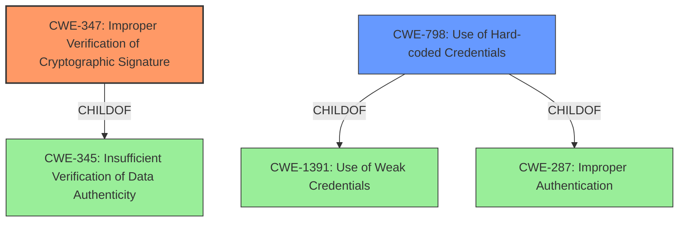

# Analysis for CVE-2020-23533

# Summary
| CWE ID | CWE Name | Confidence | CWE Abstraction Level | CWE Vulnerability Mapping Label | CWE-Vulnerability Mapping Notes |
|---|---|---|---|---|---|
| CWE-347 | Improper Verification of Cryptographic Signature | 1.0 | Base | Allowed | Primary CWE |
| CWE-798 | Use of Hard-coded Credentials | 0.7 | Base | Allowed | Secondary Candidate |

## Evidence and Confidence

*   **Confidence Score:** 0.85
*   **Evidence Strength:** HIGH

## Relationship Analysis
The primary CWE is CWE-347, which is a Base level CWE. It is a child of CWE-345, Insufficient Verification of Data Authenticity, indicating a more general category of weakness. While CWE-345 is a Class, CWE-347 provides a more specific description of the vulnerability.
CWE-798 is also considered because the authentication code is generated based on a secret key which is NULL; this means the secret key can be considered hardcoded. CWE-798 is a peer of CWE-257 Storing Passwords in Recoverable Format. It is a child of CWE-1391 Use of Weak Credentials and CWE-287 Improper Authentication.

## Vulnerability Chain
The vulnerability chain starts with the **Improper Verification of Cryptographic Signature (CWE-347)**, specifically because the secret key is NULL, possibly leading to a **Use of Hard-coded Credentials (CWE-798)**. This allows attackers to craft authentication codes and shop for free.
Root Cause: **Improper Verification of Cryptographic Signature (CWE-347)**
Impact: Attackers can shop for free.

## Summary of Analysis
The initial analysis correctly identified CWE-347 as the primary weakness, supported by the vulnerability description which explicitly states "**Improper Verification of Cryptographic Signature**". The crafted authentication code (MAC) also aligns with the characteristics of CWE-347, further solidifying this mapping.

The retriever results also ranked CWE-347 as the top match, reinforcing the initial assessment.

The relationship analysis, particularly the parent-child relationship between CWE-347 and CWE-345, was crucial in confirming the specificity of the chosen CWE.

The final decision is based on the direct evidence from the vulnerability description, the retriever results, and the relationship analysis. CWE-347 is at the optimal level of specificity, as it directly addresses the improper verification of the cryptographic signature. CWE-798 is added as a secondary candidate because the authentication code is generated based on a secret key which is NULL; this means the secret key can be considered hardcoded.

Relevant CWE Information:

# Enhanced Context (25 CWEs)
The following CWEs were identified as potentially relevant to this vulnerability:

## CWE-330: Use of Insufficiently Random Values
**Abstraction Level**: Class
**Similarity Score**: 0.78
**Source**: dense

**Description**:
The product uses insufficiently random numbers or values in a security context that depends on unpredictable numbers.

**Mapping Guidance**:
- Usage: Discouraged
- Rationale: This CWE entry is a level-1 Class (i.e., a child of a Pillar). It might have lower-level children that would be more appropriate

## CWE-208: Observable Timing Discrepancy
**Abstraction Level**: Base
**Similarity Score**: 0.77
**Source**: dense

**Description**:
Two separate operations in a product require different amounts of time to complete, in a way that is observable to an actor and reveals security-relevant information about the state of the product, such as whether a particular operation was successful or not.

**Mapping Guidance**:
- Usage: Allowed
- Rationale: This CWE entry is at the Base level of abstraction, which is a preferred level of abstraction for mapping to the root causes of vulnerabilities.

## CWE-1391: Use of Weak Credentials
**Abstraction Level**: Class
**Similarity Score**: 0.77
**Source**: dense

**Description**:
The product uses weak credentials (such as a default key or hard-coded password) that can be calculated, derived, reused, or guessed by an attacker.

**Mapping Guidance**:
- Usage: Allowed-with-Review
- Rationale: This CWE entry is a Class and might have Base-level children that would be more appropriate

## CWE-345: Insufficient Verification of Data Authenticity
**Abstraction Level**: Class
**Similarity Score**: 0.77
**Source**: dense

**Description**:
The product does not sufficiently verify the origin or authenticity of data, in a way that causes it to accept invalid data.

**Mapping Guidance**:
- Usage: Discouraged
- Rationale: This CWE entry is a level-1 Class (i.e., a child of a Pillar). It might have lower-level children that would be more appropriate

## CWE-331: Insufficient Entropy
**Abstraction Level**: Base
**Similarity Score**: 0.76
**Source**: dense

**Description**:
The product uses an algorithm or scheme that produces insufficient entropy, leaving patterns or clusters of values that are more likely to occur than others.

**Mapping Guidance**:
- Usage: Allowed
- Rationale: This CWE entry is at the Base level of abstraction, which is a preferred level of abstraction for mapping to the root causes of vulnerabilities.

## CWE-341: Predictable from Observable State
**Abstraction Level**: Base
**Similarity Score**: 0.76
**Source**: dense

**Description**:
A number or object is predictable based on observations that the attacker can make about the state of the system or network, such as time, process ID, etc.

**Mapping Guidance**:
- Usage: Allowed
- Rationale: This CWE entry is at the Base level of abstraction, which is a preferred level of abstraction for mapping to the root causes of vulnerabilities.

## CWE-203: Observable Discrepancy
**Abstraction Level**: Base
**Similarity Score**: 0.76
**Source**: dense

**Description**:
The product behaves differently or sends different responses under different circumstances in a way that is observable to an unauthorized actor, which exposes security-relevant information about the state of the product, such as whether a particular operation was successful or not.

**Mapping Guidance**:
- Usage: Allowed
- Rationale: This CWE entry is at the Base level of abstraction, which is a preferred level of abstraction for mapping to the root causes of vulnerabilities.

## CWE-340: Generation of Predictable Numbers or Identifiers
**Abstraction Level**: Class
**Similarity Score**: 0.75
**Source**: dense

**Description**:
The product uses a scheme that generates numbers or identifiers that are more predictable than required.

**Mapping Guidance**:
- Usage: Allowed-with-Review
- Rationale: This CWE entry is a Class and might have Base-level children that would be more appropriate

## CWE-656: Reliance on Security Through Obscurity
**Abstraction Level**: Class
**Similarity Score**: 0.75
**Source**: dense

**Description**:
The product uses a protection mechanism whose strength depends heavily on its obscurity, such that knowledge of its algorithms or key data is sufficient to defeat the mechanism.

**Mapping Guidance**:
- Usage: Allowed-with-Review
- Rationale: This CWE entry is a Class and might have Base-level children that would be more appropriate

## CWE-807: Reliance on Untrusted Inputs in a Security Decision
**Abstraction Level**: Base
**Similarity Score**: 0.75
**Source**: dense

**Description**:
The product uses a protection mechanism that relies on the existence or values of an input, but the input can be modified by an untrusted actor in a way that bypasses the protection mechanism.

**Mapping Guidance**:
- Usage: Allowed
- Rationale: This CWE entry is at the Base level of abstraction, which is a preferred level of abstraction for mapping to the root causes of vulnerabilities.

## CWE-203: Observable Discrepancy
**Abstraction Level**: Base
**Similarity Score**: 5245.85
**Source**: sparse

**Description

# Enhanced Query for CVE-2020-23533

## Vulnerability Description
Union Pay up to 1.2.0, for web based versions contains a CWE-347 **Improper Verification of Cryptographic Signature** vulnerability, allows attackers to shop for free in merchants websites and mobile apps, via a crafted authentication code (MAC) which is generated based on a secret key which is NULL.

### Vulnerability Description Key Phrases
- **rootcause:** **Improper Verification of Cryptographic Signature**
- **impact:** shop for free
- **vector:** crafted authentication code (MAC)
- **attacker:** attackers
- **product:** Union Pay
- **version:** up to 1.2.0

### CWE for similar CVE Descriptions
### Primary CWE Match
CWE-347

#### Top CWEs
- CWE-347 (Count: 12)

## Retriever Results

### Top Combined Results

| Rank | CWE ID | Name | Abstraction | Usage  | Retrievers | Individual Scores |
|------|--------|------|-------------|-------|------------|-------------------|
| 1 | 347 | Improper Verification of Cryptographic Signature | Base | Allowed | sparse | 0.527 |
| 2 | 208 | Observable Timing Discrepancy | Base | Allowed | sparse | 0.297 |
| 3 | 203 | Observable Discrepancy | Base | Allowed | sparse | 0.296 |
| 4 | 321 | Use of Hard-coded Cryptographic Key | Variant | Allowed | sparse | 0.282 |
| 5 | 345 | Insufficient Verification of Data Authenticity | Class | Discouraged | sparse | 0.274 |
| 6 | 297 | Improper Validation of Certificate with Host Mismatch | Variant | Allowed | dense | 0.580 |
| 7 | 385 | Covert Timing Channel | Base | Allowed | graph | 0.002 |
| 8 | 287 | Improper Authentication | Class | Discouraged | sparse | 0.269 |
| 9 | 798 | Use of Hard-coded Credentials | Base | Allowed | sparse | 0.267 |
| 10 | 341 | Predictable from Observable State | Base | Allowed | sparse | 0.264 |

# Complete CWE Specifications

## CWE-347: Improper Verification of Cryptographic Signature
**Abstraction:** Base
**Status:** Draft

### Description
The product does not verify, or incorrectly verifies, the cryptographic signature for data.

### Extended Description
Not provided

### Alternative Terms
None

### Relationships
ChildOf -> CWE-345
ChildOf -> CWE-345

### Mapping Guidance
**Usage:** Allowed
**Rationale:** This CWE entry is at the Base level of abstraction, which is a preferred level of abstraction for mapping to the root causes of vulnerabilities.
**Comments:** Carefully read both the name and description to ensure that this mapping is an appropriate fit. Do not try to 'force' a mapping to a lower-level Base/Variant simply to comply with this preferred level of abstraction.
**Reasons:**
- Acceptable-Use

### Observed Examples
- **CVE-2002-1796:** Does not properly verify signatures for "trusted" entities.
- **CVE-2005-2181:** Insufficient verification allows spoofing.
- **CVE-2005-2182:** Insufficient verification allows spoofing.

## CWE-208: Observable Timing Discrepancy
**Abstraction:** Base
**Status:** Incomplete

### Description
Two separate operations in a product require different amounts of time to complete, in a way that is observable to an actor and reveals security-relevant information about the state of the product, such as whether a particular operation was successful or not.

### Extended Description
In security-relevant contexts, even small variations in timing can be exploited by attackers to indirectly infer certain details about the product's internal operations. For example, in some cryptographic algorithms, attackers can use timing differences to infer certain properties about a private key, making the key easier to guess. Timing discrepancies effectively form a timing side channel.

### Alternative Terms
None

### Relationships
ChildOf -> CWE-203
CanPrecede -> CWE-385
CanPrecede -> CWE-327

### Mapping Guidance
**Usage:** Allowed
**Rationale:** This CWE entry is at the Base level of abstraction, which is a preferred level of abstraction for mapping to the root causes of vulnerabilities.
**Comments:** Carefully read both the name and description to ensure that this mapping is an appropriate fit. Do not try to 'force' a mapping to a lower-level Base/Variant simply to comply with this preferred level of abstraction.
**Reasons:**
- Acceptable-Use

### Additional Notes
**[Relationship]** Often primary in cryptographic applications and algorithms.

**[Maintenance]** CWE 4.16 removed a demonstrative example for a hardware module because it was inaccurate and unable to be adapted. The CWE team is developing an alternative.

### Observed Examples
- **CVE-2019-10071:** Java-oriented framework compares HMAC signatures using String.equals() instead of a constant-time algorithm, causing timing discrepancies
- **CVE-2019-10482:** Smartphone OS uses comparison functions that are not in constant time, allowing side channels
- **CVE-2014-0984:** Password-checking function in router terminates validation of a password entry when it encounters the first incorrect character, which allows remote attackers to obtain passwords via a brute-force attack that relies on timing differences in responses to incorrect password guesses, aka a timing side-channel attack.

## CWE-203: Observable Discrepancy
**Abstraction:** Base
**Status:** Incomplete

### Description
The product behaves differently or sends different responses under different circumstances in a way that is observable to an unauthorized actor, which exposes security-relevant information about the state of the product, such as whether a particular operation was successful or not.

### Extended Description
Discrepancies can take many forms, and variations may be detectable in timing, control flow, communications such as replies or requests, or general behavior. These discrepancies can reveal information about the product's operation or internal state to an unauthorized actor. In some cases, discrepancies can be used by attackers to form a side channel.

### Alternative Terms
Side Channel Attack: Observable Discrepancies are at the root of side channel attacks.

### Relationships
ChildOf -> CWE-200
ChildOf -> CWE-200

### Mapping Guidance
**Usage:** Allowed
**Rationale:** This CWE entry is at the Base level of abstraction, which is a preferred level of abstraction for mapping to the root causes of vulnerabilities.
**Comments:** Carefully read both the name and description to ensure that this mapping is an appropriate fit. Do not try to 'force' a mapping to a lower-level Base/Variant simply to comply with this preferred level of abstraction.
**Reasons:**
- Acceptable-Use

### Observed Examples
- **CVE-2020-8695:** Observable discrepancy in the RAPL interface for some Intel processors allows information disclosure.
- **CVE-2019-14353:** Crypto hardware wallet's power consumption relates to total number of pixels illuminated, creating a side channel in the USB connection that allows attackers to determine secrets displayed such as PIN numbers and passwords
- **CVE-2019-10071:** Java-oriented framework compares HMAC signatures using String.equals() instead of a constant-time algorithm, causing timing discrepancies

## CWE-321: Use of Hard-coded Cryptographic Key
**Abstraction:** Variant
**Status:** Draft

### Description
The use of a hard-coded cryptographic key significantly increases the possibility that encrypted data may be recovered.

### Extended Description
Not provided

### Alternative Terms
None

### Relationships
ChildOf -> CWE-798
ChildOf -> CWE-798
ChildOf -> CWE-798

### Mapping Guidance
**Usage:** Allowed
**Rationale:** This CWE entry is at the Variant level of abstraction, which is a preferred level of abstraction for mapping to the root causes of vulnerabilities.
**Comments:** Carefully read both the name and description to ensure that this mapping is an appropriate fit. Do not try to 'force' a mapping to a lower-level Base/Variant simply to comply with this preferred level of abstraction.
**Reasons:**
- Acceptable-Use

### Additional Notes
**[Other]** The main difference between the use of hard-coded passwords and the use of hard-coded cryptographic keys is the false sense of security that the former conveys. Many people believe that simply hashing a hard-coded password before storage will protect the information from malicious users. However, many hashes are reversible (or at least vulnerable to brute force attacks) -- and further, many authentication protocols simply request the hash itself, making it no better than a password.

**[Maintenance]** The Taxonomy_Mappings to ISA/IEC 62443 were added in CWE 4.10, but they are still under review and might change in future CWE versions. These draft mappings were performed by members of the "Mapping CWE to 62443" subgroup of the CWE-CAPEC ICS/OT Special Interest Group (SIG), and their work is incomplete as of CWE 4.10. The mappings are included to facilitate discussion and review by the broader ICS/OT community, and they are likely to change in future CWE versions.

### Observed Examples
- **CVE-2022-29960:** Engineering Workstation uses hard-coded cryptographic keys that could allow for unathorized filesystem access and privilege escalation
- **CVE-2022-30271:** Remote Terminal Unit (RTU) uses a hard-coded SSH private key that is likely to be used by default.
- **CVE-2020-10884:** WiFi router service has a hard-coded encryption key, allowing root access

## CWE-345: Insufficient Verification of Data Authenticity
**Abstraction:** Class
**Status:** Draft

### Description
The product does not sufficiently verify the origin or authenticity of data, in a way that causes it to accept invalid data.

### Extended Description
Not provided

### Alternative Terms
None

### Relationships
ChildOf -> CWE-693

### Mapping Guidance
**Usage:** Discouraged
**Rationale:** This CWE entry is a level-1 Class (i.e., a child of a Pillar). It might have lower-level children that would be more appropriate
**Comments:** Examine children of this entry to see if there is a better fit
**Reasons:**
- Abstraction

### Additional Notes
**[Relationship]** "origin validation" could fall under this.

**[Maintenance]** The specific ways in which the origin is not properly identified should be laid out as separate weaknesses. In some sense, this is more like a category.

### Observed Examples
- **CVE-2022-30260:** Distributed Control System (DCS) does not sign firmware images and only relies on insecure checksums for integrity checks
- **CVE-2022-30267:** Distributed Control System (DCS) does not sign firmware images and only relies on insecure checksums for integrity checks
- **CVE-2022-30272:** Remote Terminal Unit (RTU) does not use signatures for firmware images and relies on insecure checksums

## CWE-297: Improper Validation of Certificate with Host Mismatch
**Abstraction:** Variant
**Status:** Incomplete

### Description
The product communicates with a host that provides a certificate, but the product does not properly ensure that the certificate is actually associated with that host.

### Extended Description

Even if a certificate is well-formed, signed, and follows the chain of trust, it may simply be a valid certificate for a different site than the site that the product is interacting with. If the certificate's host-specific data is not properly checked - such as the Common Name (CN) in the Subject or the Subject Alternative Name (SAN) extension of an X.509 certificate - it may be possible for a redirection or spoofing attack to allow a malicious host with a valid certificate to provide data, impersonating a trusted host. In order to ensure data integrity, the certificate must be valid and it must pertain to the site that is being accessed.

Even if the product attempts to check the hostname, it is still possible to incorrectly check the hostname. For example, attackers could create a certificate with a name that begins with a trusted name followed by a NUL byte, which could cause some string-based comparisons to only examine the portion that contains the trusted name.

This weakness can occur even when the product uses Certificate Pinning, if the product does not verify the hostname at the time a certificate is pinned.

### Alternative Terms
None

### Relationships
ChildOf -> CWE-923
ChildOf -> CWE-295

### Mapping Guidance
**Usage:** Allowed
**Rationale:** This CWE entry is at the Variant level of abstraction, which is a preferred level of abstraction for mapping to the root causes of vulnerabilities.
**Comments:** Carefully read both the name and description to ensure that this mapping is an appropriate fit. Do not try to 'force' a mapping to a lower-level Base/Variant simply to comply with this preferred level of abstraction.
**Reasons:**
- Acceptable-Use

### Observed Examples
- **CVE-2012-5810:** Mobile banking application does not verify hostname, leading to financial loss.
- **CVE-2012-5811:** Mobile application for printing documents does not verify hostname, allowing attackers to read sensitive documents.
- **CVE-2012-5807:** Software for electronic checking does not verify hostname, leading to financial loss.

## CWE-385: Covert Timing Channel
**Abstraction:** Base
**Status:** Incomplete

### Description
Covert timing channels convey information by modulating some aspect of system behavior over time, so that the program receiving the information can observe system behavior and infer protected information.

### Extended Description

In some instances, knowing when data is transmitted between parties can provide a malicious user with privileged information. Also, externally monitoring the timing of operations can potentially reveal sensitive data. For example, a cryptographic operation can expose its internal state if the time it takes to perform the operation varies, based on the state.

Covert channels are frequently classified as either storage or timing channels. Some examples of covert timing channels are the system's paging rate, the time a certain transaction requires to execute, and the time it takes to gain access to a shared bus.

### Alternative Terms
None

### Relationships
ChildOf -> CWE-514

### Mapping Guidance
**Usage:** Allowed
**Rationale:** This CWE entry is at the Base level of abstraction, which is a preferred level of abstraction for mapping to the root causes of vulnerabilities.
**Comments:** Carefully read both the name and description to ensure that this mapping is an appropriate fit. Do not try to 'force' a mapping to a lower-level Base/Variant simply to comply with this preferred level of abstraction.
**Reasons:**
- Acceptable-Use

### Additional Notes
**[Maintenance]** As of CWE 4.9, members of the CWE Hardware SIG are working to improve CWE's coverage of transient execution weaknesses, which include issues related to Spectre, Meltdown, and other attacks that create or exploit covert channels. As a result of that work, this entry might change in CWE 4.10.

## CWE-287: Improper Authentication
**Abstraction:** Class
**Status:** Draft

### Description
When an actor claims to have a given identity, the product does not prove or insufficiently proves that the claim is correct.

### Extended Description
Not provided

### Alternative Terms
authentification: An alternate term is "authentification", which appears to be most commonly used by people from non-English-speaking countries.
AuthN: "AuthN" is typically used as an abbreviation of "authentication" within the web application security community. It is also distinct from "AuthZ," which is an abbreviation of "authorization." The use of "Auth" as an abbreviation is discouraged, since it could be used for either authentication or authorization.
AuthC: "AuthC" is used as an abbreviation of "authentication," but it appears to used less frequently than "AuthN."

### Relationships
ChildOf -> CWE-284
ChildOf -> CWE-284

### Mapping Guidance
**Usage:** Discouraged
**Rationale:** This CWE entry might be misused when lower-level CWE entries are likely to be applicable. It is a level-1 Class (i.e., a child of a Pillar).
**Comments:** Consider children or descendants, beginning with CWE-1390: Weak Authentication or CWE-306: Missing Authentication for Critical Function.
**Reasons:**
- Frequent Misuse
**Suggested Alternatives:**
- CWE-1390: Weak Authentication
- CWE-306: Missing Authentication for Critical Function

### Additional Notes
**[Relationship]** This can be resultant from SQL injection vulnerabilities and other issues.

**[Maintenance]** The Taxonomy_Mappings to ISA/IEC 62443 were added in CWE 4.10, but they are still under review and might change in future CWE versions. These draft mappings were performed by members of the "Mapping CWE to 62443" subgroup of the CWE-CAPEC ICS/OT Special Interest Group (SIG), and their work is incomplete as of CWE 4.10. The mappings are included to facilitate discussion and review by the broader ICS/OT community, and they are likely to change in future CWE versions.

### Observed Examples
- **CVE-2022-35248:** Chat application skips validation when Central Authentication Service (CAS) is enabled, effectively removing the second factor from two-factor authentication
- **CVE-2022-36436:** Python-based authentication proxy does not enforce password authentication during the initial handshake, allowing the client to bypass authentication by specifying a 'None' authentication type.
- **CVE-2022-30034:** Chain: Web UI for a Python RPC framework does not use regex anchors to validate user login emails (CWE-777), potentially allowing bypass of OAuth (CWE-1390).

## CWE-798: Use of Hard-coded Credentials
**Abstraction:** Base
**Status:** Draft

### Description
The product contains hard-coded credentials, such as a password or cryptographic key.

### Extended Description

There are two main variations:

  - Inbound: the product contains an authentication mechanism that checks the input credentials against a hard-coded set of credentials. In this variant, a default administration account is created, and a simple password is hard-coded into the product and associated with that account. This hard-coded password is the same for each installation of the product, and it usually cannot be changed or disabled by system administrators without manually modifying the program, or otherwise patching the product. It can also be difficult for the administrator to detect.

  - Outbound: the product connects to another system or component, and it contains hard-coded credentials for connecting to that component. This variant applies to front-end systems that authenticate with a back-end service. The back-end service may require a fixed password that can be easily discovered. The programmer may simply hard-code those back-end credentials into the front-end product.

### Alternative Terms
None

### Relationships
ChildOf -> CWE-1391
ChildOf -> CWE-287
ChildOf -> CWE-344
ChildOf -> CWE-671
PeerOf -> CWE-257

### Mapping Guidance
**Usage:** Allowed
**Rationale:** This CWE entry is at the Base level of abstraction, which is a preferred level of abstraction for mapping to the root causes of vulnerabilities.
**Comments:** Carefully read both the name and description to ensure that this mapping is an appropriate fit. Do not try to 'force' a mapping to a lower-level Base/Variant simply to comply with this preferred level of abstraction.
**Reasons:**
- Acceptable-Use

### Additional Notes
**[Maintenance]** The Taxonomy_Mappings to ISA/IEC 62443 were added in CWE 4.10, but they are still under review and might change in future CWE versions. These draft mappings were performed by members of the "Mapping CWE to 62443" subgroup of the CWE-CAPEC ICS/OT Special Interest Group (SIG), and their work is incomplete as of CWE 4.10. The mappings are included to facilitate discussion and review by the broader ICS/OT community, and they are likely to change in future CWE versions.

### Observed Examples
- **CVE-2022-29953:** Condition Monitor firmware has a maintenance interface with hard-coded credentials
- **CVE-2022-29960:** Engineering Workstation uses hard-coded cryptographic keys that could allow for unathorized filesystem access and privilege escalation
- **CVE-2022-29964:** Distributed Control System (DCS) has hard-coded passwords for local shell access

## CWE-341: Predictable from Observable State
**Abstraction:** Base
**Status:** Draft

### Description
A number or object is predictable based on observations that the attacker can make about the state of the system or network, such as time, process ID, etc.

### Extended Description
Not provided

### Alternative Terms
None

### Relationships
ChildOf -> CWE-340

### Mapping Guidance
**Usage:** Allowed
**Rationale:** This CWE entry is at the Base level of abstraction, which is a preferred level of abstraction for mapping to the root causes of vulnerabilities.
**Comments:** Carefully read both the name and description to ensure that this mapping is an appropriate fit. Do not try to 'force' a mapping to a lower-level Base/Variant simply to comply with this preferred level of abstraction.
**Reasons:**
- Acceptable-Use

### Additional Notes
**[Maintenance]** As of CWE 4.5, terminology related to randomness, entropy, and predictability can vary widely. Within the developer and other communities, "randomness" is used heavily. However, within cryptography, "entropy" is distinct, typically implied as a measurement. There are no commonly-used definitions, even within standards documents and cryptography papers. Future versions of CWE will attempt to define these terms and, if necessary, distinguish between them in ways that are appropriate for different communities but do not reduce the usability of CWE for mapping, understanding, or other scenarios.

### Observed Examples
- **CVE-2002-0389:** Mail server stores private mail messages with predictable filenames in a world-executable directory, which allows local users to read private mailing list archives.
- **CVE-2001-1141:** PRNG allows attackers to use the output of small PRNG requests to determine the internal state information, which could be used by attackers to predict future pseudo-random numbers.
- **CVE-2000-0335:** DNS resolver library uses predictable IDs, which allows a local attacker to spoof DNS query results.

